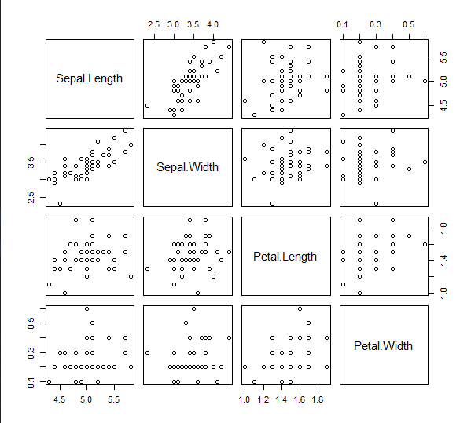
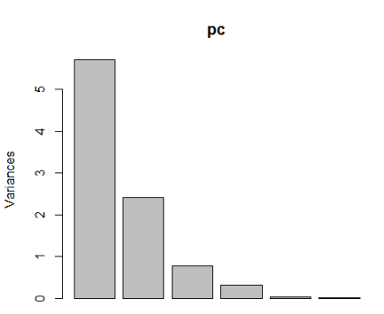

R

- 데이터 분석을 위한 통계및 시각화를 지원하는 자유 소프트웨어 환경
- R은 컴퓨터 언어이자 다양한 패키지 집합
- **객체지향 프로그래밍 언어**
- data의 시각화를 위한 다양한 그래픽 도구 제공
- 모든 객체는 메모리로 로딩되어 고속으로 처리

R의 DataType -> numeric, character,logical, complex(복소수),


## 설치

[다운로드](http://cran.seoul.go.kr/) 후 설치하면 완료!

```r
#백터는 r에서 배열과 같은데 이를 생성하는 위해서 C를 사용
x <- c(1,2,3,4,5)
y <- c(10,20,30,40,50)
x+y
#결과
[1] 11 22 33 44 55
```

편하게 사용하기 위해 [r studio다운로드](https://www.rstudio.com/products/rstudio/download/#download)한다. 실행한후

```r
a <- 10
b <- 3
print(a*b)
#ctrl +enter해서 실행!
```

- 인터페이스가 마음에 안든다면 Tools -> global options--> pane layout 에서 바꾸고
- global Code에서 saving에서 utf-8로 저장
- General에서 Default directory 또한 지정해 놓자.

### 패키지

##### 패키지 개수 확인

```r
#패키지 개수 확인
dim(available.packages())
available.packages()
```

##### 설치 정보 확인

- R session은 사용자가 R 프로그램을 시작 한 후 R 콘솔 시작~ 종료까지의 수행된 정보

```r
sessioninfo()
#os, 설치 정보 , 다국어 정보, 등등 알수 있다.
R version 3.6.1 (2019-07-05)
Platform: x86_64-w64-mingw32/x64 (64-bit)
Running under: Windows 7 x64 (build 7601) Service Pack 1

# 등등
#패키지 다운되는 경로 확인
> .libPaths()
[1] "C:/Program Files/R/R-3.6.1/library"

```

##### 설치된 R패키지 목록 확인

- 설치된 R패키지 목록 확인

```r
> installed.packages()
             Package       
askpass      "askpass"     
assertthat   "assertthat"  
backports    "backports"   
base         "base"        
BH           "BH"          

#등등 무진장 많다.
```

##### 패키지 설치

```ㄱ
install.packages("stringr")
//update.packages("stringr")
remove.packages("stringr")
```

##### 설치된 패키지 사용하기 위해서 메모리에 로드

```r
library(stringr) #또는
require(stringr)

```

##### 메모리에 로드된 패키지 검색

```r
search()

```


### 처음

##### 기본 데이터 셋 보기

```r
data()
```

##### 빈도수 히스토그램

```r
hist(Nile)
```

##### 밀도 기준 히스토그램

```r
hist(Nile,freq=F)
```


##### 분포 곡선 그리기

```r
lines(density(Nile))
```

##### plots영역에 표시할 그래프 개수 설정

```r
par(mfrow=c(1,1))
```

##### 파일 출력 경로

```r
pdf("c:workspaceR/sample.pdf")
```

##### 정규분포 따르는 난수 20개 생성해서 히스토그램 생성

```r
hist(rnorm(20))# 정규분포를 따르는 난수 20개 새엇ㅇ해서 히스토그램 생성
```


##### 출력 파일 닫기

```r
dev.off()
```


## 계산

##### 변수 선언

1. 첫문자는 영문자로 시작과 첫글자가 .로 시작하면 뒤에 숫자 못온다.
2. 두번쨰 문자부터 숫자, _, . 사용가능
3. 대소문자 구분
4. 예약어 사용 불가
5. 카멜표기법
6. 변수에 저장된 값은 불변

```r
x<-3
tracemem(x)
x<- 'a'
tracemem(x) 

> x<-3
> tracemem(x)
[1] "<000000001594FAB8>"
> x<- 'a'
> tracemem(X) 
Error: object 'X' not found
> tracemem(x) 
[1] "<0000000015913450>"

> mean(x<-c(1,2,3))
[1] 2
> x
[1] 1 2 3
> mean(x=c(1,2,3,))
Error in c(1, 2, 3, ) : argument 4 is empty
> x
[1] 1 2 3

```

- **R은 변수를 선언할 때 자료형(type)을 선언하지 않는다.**

  

###### 데이터 타입

Scalar 변수-하나의 값을 저장하는 변수(scala 변수) - numeric,character,logical

```r
age <- 30
#age변수는 하나의 값을 저장한고 있는 벡터 타입
#하나 이상의 자료를 저장할 수 있는 1차원의 선형 자료 구조
class (age)
[1] "numeric"

age<-"29"
class(age)
[1] "character"

age <-  TURE #상수 객체(true,false)
class(Age)
[1] "logical"

age <- F # false
class(age)
[1] "logical"

> age <- NA #결측치(Not Available)
> class(age+10)
[1] "numeric"
> age+10
[1] NA

> age <- null
Error: object 'null' not found
> class(age+10)
[1] "numeric"
```

##### ##### ?

```r
> sum(10,20,30)
[1] 60
> sum(10,20,30,NA)
[1] NA
> sum(10,20,30,NA,na.rm=T)
[1] 60
```

##### R  Session 에서 생성한 변수 목록 확인

```r
> ls()
 [1] "a"          "age"        "b"          "dongdaemun"
 [5] "gangnam"    "p"          "police"     "seoul"     
 [9] "total"      "x"  
```

##### 자료형 확인

```r
is.numeric(변수)
is.logical(변수)
is.character(변수)
is.na(변수)
is.list(객체)
is.data.frame(객체)
is.array(객체)
is.matrix(객체)
           
```

##### 자료형 형변환

```r
as.numeric(변수)
as.logical(변수)
as.character(변수)
as.na(변수)
as.list(객체)
as.data.frame(객체)
as.array(객체)
as.matrix(객체)
as.integer(변수)
as.double(변수)
as.complex(변수)#복소수 형변환
as.factor(객체) #범주 자료형
as.Date(객체)

```

##### 형변환 확인

```r
> x <- c("1","2","3")
> result<-x*3
Error in x * 3 : non-numeric argument to binary operator
> print(result)
[1]  3 12 27
> result<-as.numeric(x)*3
> print(result)
[1] 3 6 9
> result<-as.integer(x)*#
+   print(result)
[1] 3 6 9
#복소수
> z<-5.3-3i
> class(z)
[1] "complex"
> Re(z)
[1] 5.3
> Im(z)
[1] -3
> is.complex(z)
[1] TRUE
> as.complex(5.3)
[1] 5.3+0i
```

##### class(변수)는 자료구조의 Type 반환

```r
> age <-29.5
> mode(age)
[1] "numeric"
> age<-TRUE
> age<-F
> mode(age)
[1] "logical"


> age <-29.5
> mode(age)
[1] "numeric"
> age<-TRUE
> mode(age)
[1] "logical"
> age<-F
> mode(age)
[1] "logical"
```


##### mode(변수)는 자료의 Type 반환

```r

```


##### 작업디렉토리 설정

```r
> getwd()
[1] "C:/Users/student/Documents/map"
> setwd("c:/workspace")
> getwd()
[1] "c:/workspace"
```

### 연산자

- print() 함수는 1번에 1가지만 출력, cat() 함수는 숫자와 문자 여러 개를 한번에 출력
- 여러 개의 명령을 연속적으로 실행하고 싶을 경우에 세미콜론(;)을 사용

```r
> print(3,4)
[1] 3
> cat(1,'a',2,'b')
1 a 2 b> 1+2;3*2;4/2
[1] 3
[1] 6
[1] 2
```

##### 산술연산자

- / 나누기 (실수 가능)
-  %/% 정수 나누기
-  %% 나머지 구하기
-  ^, ** 승수 구하기

##### 데이터 타입 확인시 class 함수 사용

```r
> class('1')
[1] "character"
> class(1)
[1] "numeric"
```

##### Null

- is.null은 변수에 null이 있는지 확인

```r
> x<-null
Error: object 'null' not found
> is.null(x)
[1] FALSE
> is.null(1)
[1] FALSE
> is.null(NA)
[1] FALSE
> is.na(NULL)
logical(0)


is_even <- NULL
if (a 가 짝수면) {
is_even <- TRUE
} else {
is_even <- FALSE
}
```

##### 진리값(논리값)

```r
> TRUE & TRUE
[1] TRUE
>  TRUE & FALSE
[1] FALSE
>  TRUE | TRUE
[1] TRUE
>  TRUE | FALSE
[1] TRUE
>  !TRUE
[1] FALSE
>  !FALSE
[1] TRUE
>  T <- FALSE
>  TRUE <- FALSE
Error in TRUE <- FALSE : invalid (do_set) left-hand side to assignment
>  c(TRUE, TRUE) & c(TRUE, FALSE)
[1]  TRUE FALSE
>  c(TRUE, TRUE) && c(TRUE, FALSE)
[1] TRUE #앞에것만 비교하기때문에 TRUE)

> x<-TRUE; y<-FALSE
> xor(x,y)
[1] TRUE
```

##### 날짜와 시간

- %d 일자를 숫자로 인식
-  %m 월 을 숫자로 인식
-  %b 월을 영어 약어로 인식
-  %B 월을 전체 이릉으로 인식
-  %y 년도를 숫자 두 자리로 인식
-  %Y 년도를 숫자 네 자리로 인식

```r
> Sys.Date() # 날짜만 보여주는 함수
[1] "2019-09-05"
>  Sys.time() # 날짜와 시간을 보여주는 함수
[1] "2019-09-05 16:36:13 KST"
>  date() # 미국식 날짜와 시간을 출력하는 함수
[1] "Thu Sep 05 16:36:13 2019"
>  as.Date("2017-12-01") # 문자형태의 날짜를 날짜타입으로 변환해주는 함수
[1] "2017-12-01"
>  as.Date("2017/07/04")
[1] "2017-07-04"
>  as.Date("04-07-2017") #오류
[1] "0004-07-20"
>  as.Date("01-12-2017" , format='%d-%m-%Y')
[1] "2017-12-01"
>  as.Date(10, origin="2017-12-01") #주어진 날짜 기준으로 10일후의 날짜
[1] "2017-12-11"
>  as.Date(-10, origin="2017-12-01") #주어진 날짜 기준으로 10일 이전 날짜
[1] "2017-11-21"
```

##### 날짜 산술 연산

```r
>  as.Date("2017-07-04 20:00:00")-as.Date("2017-07-04 18:30")
Time difference of 0 days
> as.POSIXct("2017-07-04 20:00:00")-as.POSIXct("2017-07-04 18:30")
Time difference of 1.5 hours

```

##### lubridate 패키지로 날짜 시간 제어

```r
> install.packages("lubridate")
Error in install.packages : Updating loaded packages
> library(lubridate)
> date<-now() #현재 날짜와 시간 넣기
> date
[1] "2019-09-05 16:41:19 KST"
> year(date) #년도만 출력
[1] 2019
> month(date,label=T) #월을 영문으로 출력
[1] 9
> month(date,label=F) #월을 숫자로 출력
[1] 9
> day(date)
[1] 5
> library(lubridate)
> date<-now() #현재 날짜와 시간 넣기


wday(date, label=T) # 요일을 영문으로 출력
wday(date, label=F) # 요일을 가중치 숫자로 출력 , 일요일 1 시작
date<-date-days(2) #2일전 날짜 출력
date
month(date)<-2 #2개월 더한 날짜 출력
date
date+years(1) #1년 추가
date+months(1) #1개월 추가
date+hours(1) #1시간 추가
date+minutes(1) #1분 추가
date+seconds(1) #1초 추가
date<-hm("22:30") ; date #시간 분 지정
date<-hms("22:30:15") ; date #시간 분 초 지정
```

##### 변수 확인 & 삭제

```r
> objects( ) # 생성한 모든 변수 확인
> rm(list=ls()) # 모든 변수들을 삭제
> rm(var3) # 변수 삭제
```


##### 현재 로케일 정보 전체 확인

```r
>   Sys.setlocale(category="LC_ALL",locale="")
[1] "LC_COLLATE=Korean_Korea.949;LC_CTYPE=Korean_Korea.949;LC_MONETARY=Korean_Korea.949;LC_NUMERIC=C;LC_TIME=Korean_Korea.949"
> Sys.getlocale()
[1] "LC_COLLATE=Korean_Korea.949;LC_CTYPE=Korean_Korea.949;LC_MONETARY=Korean_Korea.949;LC_NUMERIC=C;LC_TIME=Korean_Korea.949"
> Sys.setlocale(category = "LC_ALL",locale="English_US")
[1] "LC_COLLATE=English_United States.1252;LC_CTYPE=English_United States.1252;LC_MONETARY=English_United States.1252;LC_NUMERIC=C;LC_TIME=English_United States.1252"
> Sys.getlocale()
[1] "LC_COLLATE=English_United States.1252;LC_CTYPE=English_United States.1252;LC_MONETARY=English_United States.1252;LC_NUMERIC=C;LC_TIME=English_United States.1252"
> Sys.setlocale(category = "LC_ALL",locale = "Japanese_Japan")
[1] "LC_COLLATE=Japanese_Japan.932;LC_CTYPE=Japanese_Japan.932;LC_MONETARY=Japanese_Japan.932;LC_NUMERIC=C;LC_TIME=Japanese_Japan.932"
> Sys.getlocale()
[1] "LC_COLLATE=Japanese_Japan.932;LC_CTYPE=Japanese_Japan.932;LC_MONETARY=Japanese_Japan.932;LC_NUMERIC=C;LC_TIME=Japanese_Japan.932"
```


##### R에서 제공하는 기본 함수 사용 예제 보기

```r
> example(seq)

seq> seq(0, 1, length.out = 11)
 [1] 0.0 0.1 0.2 0.3 0.4 0.5 0.6 0.7 0.8 0.9 1.0

seq> seq(stats::rnorm(20)) # effectively 'along'
 [1]  1  2  3  4  5  6  7  8  9 10 11 12 13 14 15 16 17 18 19 20

seq> seq(1, 9, by = 2)     # matches 'end'
[1] 1 3 5 7 9

seq> seq(1, 9, by = pi)    # stays below 'end'
[1] 1.000000 4.141593 7.283185

seq> seq(1, 6, by = 3)
[1] 1 4

seq> seq(1.575, 5.125, by = 0.05)
 [1] 1.575 1.625 1.675 1.725 1.775 1.825 1.875 1.925 1.975 2.025
[11] 2.075 2.125 2.175 2.225 2.275 2.325 2.375 2.425 2.475 2.525
[21] 2.575 2.625 2.675 2.725 2.775 2.825 2.875 2.925 2.975 3.025
[31] 3.075 3.125 3.175 3.225 3.275 3.325 3.375 3.425 3.475 3.525
[41] 3.575 3.625 3.675 3.725 3.775 3.825 3.875 3.925 3.975 4.025
[51] 4.075 4.125 4.175 4.225 4.275 4.325 4.375 4.425 4.475 4.525
[61] 4.575 4.625 4.675 4.725 4.775 4.825 4.875 4.925 4.975 5.025
[71] 5.075 5.125

seq> seq(17) # same as 1:17, or even better seq_len(17)
 [1]  1  2  3  4  5  6  7  8  9 10 11 12 13 14 15 16 17
```

##### R에서 제공하는 함수의 파라미터 형식 보기

```r
> args(max)
function (..., na.rm = FALSE) 
NULL
```

##### help(mean)

```r
help(mean)
?sum 
??mean #각각의 설명을 help탭에서 확인 가능
```


##### Factor 형

- 여러 번 중복으로 나오는 데이터들을 각 값으로 모아서 대표 값을 출력해 주는 형태
-  stringsAsFactors=FALSE 옵션은 대표값으로 정리하지 않고 중복되는 상태 그대로 사용하게 해 줍
  니다.
-  범주형Categorical 데이터(자료)를 표현하기 위한 데이터 타입
-  범주형 데이터 - 데이터가 사전에 정해진 특정 유형으로만 분류되는 경우
-  범주형 데이터는 또 다시 명목형Nominal과 순서형Ordinal으로 구분
-  ***명목형 데이터***는 값들 간에 **크기 비교가 불가능**한 경우
- * **순서형 데이터***는 대, 중, 소와 같이 값에 **순서**를 둘 수 있는 경우

1. `nlevels(x #팩터 값)` 반환 값은 팩터 값의 레벨 개수
2. `ordered(x # 팩터로 표현하고자 하는 값(주로 문자열 벡터로 지정))` 순서형 팩터 생성
3. `levels(x # 팩터 값)`반환 값은 팩터에서 레벨의 목록
4. `is.ordered(x #R 객체)` 반환 값은 x가 순서형 팩터면 TURE,아니면 FALSE

```r
> gender <- c("man","woman","woman","man","man")
> plot(gender)#차트는 수치 데이터만 가능하므로 오류발생 
Error in plot.window(...) : need finite 'ylim' values
In addition: Warning messages:
1: In xy.coords(x, y, xlabel, ylabel, log) : NAs introduced by coercion
2: In min(x) : no non-missing arguments to min; returning Inf
3: In max(x) : no non-missing arguments to max; returning -Inf

> class(gender)
[1] "character"
> mode(gender)
[1] "character"
> ngender<-as.factor(gender)
> class(ngender)
[1] "factor"
> mode(ngender)
[1] "numeric"
> table(gender) #빈도수 반환
gender
  man woman 
    3     2 
plot(ngender)
#아래 그림 확인
> is.factor(ngender)
[1] TRUE
> ngender # Levels속성에서 범주를 확인(알파벳 순서?인지 보자)
[1] man   woman woman man   man  
Levels: man woman
```


```r
> args(factor) #factor()함수의 매개 변수 확인
function (x = character(), levels, labels = levels, exclude = NA, 
    ordered = is.ordered(x), nmax = NA) 
NULL
> ogender<-factor(gender,levels=c("woman","man"),ordered=T)
> ogender #범주의 순서 확인
[1] man   woman woman man   man  
Levels: woman < man
> par(mfrow=c(1,2))
> plot(ngender)
> plot(ogender)
```


## Vector

- R에서 가장 기본이 되는 자료 구조로, 1차원, 선형 구조로 배열과 비슷하다.
- 요소의 접근 변수[index첨자]로 접근, 프로그램에서는 첨자가 0부터 시작하는데, 여기서는 첨자 index가 1부터 시작한다. 
- 동일한 데이터타입만 저장 가능하다.
- 벡터 생성 함수 : c(),seq(),rep()
- 벡터 자료 처리 함수: union(),setdiff(),intersect()......

```r
> c(1:20)
 [1]  1  2  3  4  5  6  7  8  9 10 11 12 13 14 15 16 17 18 19 20
> 1:20
 [1]  1  2  3  4  5  6  7  8  9 10 11 12 13 14 15 16 17 18 19 20
> c(1,1,2,3,3,3,4,5,5,5,5)
 [1] 1 1 2 3 3 3 4 5 5 5 5
> seq(1, 20)
 [1]  1  2  3  4  5  6  7  8  9 10 11 12 13 14 15 16 17 18 19 20
> seq(1, 20, 2)  #순차적으로 값을 증감시켜서 벡터 자료 구조 생성
 [1]  1  3  5  7  9 11 13 15 17 19
> rep(1:3,3) #반복
[1] 1 2 3 1 2 3 1 2 3
> rep(1:3,each=3)#각각 반복
[1] 1 1 1 2 2 2 3 3 3

```

```r
> a<-c(1:5)
> b<-a+1
> c<-a*2
> d<-rep(1:3,3)
> union(a,d)
[1] 1 2 3 4 5
> setdiff(a,d)
[1] 4 5
> intersect(a,d)
[1] 1 2 3
> f <- c(33, -5, "4", 5:9 ) #벡터 중간에 문자가 있어도 오류가 없다
> class(f)# 형변환 확인해보자
[1] "character"
> mode(f)#자체적으로 형변환 발생
[1] "character"
```


```r
> a<-c(1:20)
> a[3:10]   #벡터의 요소에 접근
[1]  3  4  5  6  7  8  9 10
> a[c(3, 10)]  #벡터의 요소에 접근
[1]  3 10
> a[-c(2:18)]# 제외하고! 현재 a 는 (1:20)까지 이다.
[1]  1 19 20
> a[-c(2:18)]
[1]  1 19 20
> a[-c(1:20)]
integer(0)
> a[-c(5:20)]
[1] 1 2 3 4
> a[-c(6:20)]
[1] 1 2 3 4 5
> a[-c(2:20)]
[1] 1
> a[-c(2:18)]
[1]  1 19 20
```


##### 복습 (벡터의 다양한 처리)

```r
[1] "Sum"
> print(t[7])
[1] NA
> u<-t(c[2,3,6])
Error in c[2, 3, 6] : object of type 'builtin' is not subsettable
> u<-t[c(2,3,6)]
> print(u)
[1] "Mon" "Wed" "Sat"
> v<-t[c(TRUE,FALSE,TRUE,FALSE,FALSE,TRUE)]
> print(v)
[1] "Sum" "Wed" "Sat"
> v<t[c(-2,-5)]
[1] FALSE FALSE  TRUE FALSE
Warning message:
In v < t[c(-2, -5)] :
  longer object length is not a multiple of shorter object length
> v<-t[c(-2,-5)]

> print(v)
[1] "Sum"   "Wed"   "Thurs" "Sat"  
> y<-t[c(0,0,0,0,0,1)]
> print(y)
[1] "Sum"
> y<-t[c(0,0,1,0,0,1)]
> print(y)
[1] "Sum" "Sum"
```

##### 덧셈길이 다를때의 결과는?

```r
> v1<-c(5,7,5,1,20)
> v2<-c(3,4,6)
> v3<-c(1,2,3,4,5,6)
> v4<-c(1,2,3)
> 
> print(v1+v2)
[1]  8 11 11  4 24
Warning message:
In v1 + v2 :
  longer object length is not a multiple of shorter object length
> print(v3+v4)
[1] 2 4 6 5 7 9
```

#####  배열에서 일부 값만 출력

```r
> nums<-c(3/2,3%/%2,5%%3,2^10,2**10)
> print(nums)
[1]    1.5    1.0    2.0 1024.0 1024.0
> print((0%in%nums))
[1] FALSE
> 
> print((1024%in%nums))
[1] TRUE
> 
> print(nums[nums>10])
[1] 1024 1024
> 
> print(nums[nums%%2==0])
[1]    2 1024 1024
```

##### 배열 각각의 값에 이름을 추가, sort

```r
> loc<-c("02","031","032","052")
> str(loc)
 chr [1:4] "02" "031" "032" "052"
> names(loc)<-c("서울","경기","광주","부산")
> str(loc)
 Named chr [1:4] "02" "031" "032" "052"
 - attr(*, "names")= chr [1:4] "서울" "경기" "광주" "부산"
> 
> v<-c(3,8,4,5,0,11,-9,304)
> sort.result<-sort(v)
> print(sort.result)
[1]  -9   0   3   4   5   8  11 304
> 
> revsort.result<-sort(v,decreasing=TRUE)
> print(revsort.result)
[1] 304  11   8   5   4   3   0  -9
> v<-c("RED","BLUE","YELLOW","VIOLET")
> sort.result<-sort(v)
> print(sort.result)
[1] "BLUE"   "RED"    "VIOLET" "YELLOW"
```

##### 집합연산함수(교집합,합집합,차집합,부분집합..)

```r
##집합연산함수(교집합, 합집합, 차집합, 부분집합, ..)
#identical( 객체1, 객체2) 두객체의 데이터 갯수, 순서도 일치 하는지  반환값 FALSE,TRUE
#union( 객체1, 객체2) 중복을 뺀 모든 값
#intersect(객체1, 객체2) 교집합
#setdiff(객체1, 객체2) 객체 1와 2를 비교해 객체 1에만 있는 값을 반환
#setequal(객체1, 객체2) 값이 일치한 것을 찾는다 반환값은 False, TRUE

> vec1 <- c(1, 2, 3, 4, 5)
> vec2 <- c(10, 9, 8, 4, 5)
> vec3 <- c(1, 2, 3, 4, 5)
> print(identical(vec1,vec3))
[1] TRUE
> print(identical(vec1,vec2))
[1] FALSE
> vec4 <- c(5,3,4,1,2)
> print(setequal(vec1,vec4))  #순서는 일치하지 않아도 요소들만 일치하면 true리턴
[1] TRUE
> print(setequal(vec1,vec3))
[1] TRUE
> print(union(vec1,vec2))
[1]  1  2  3  4  5 10  9  8
> print(intersect(vec1,vec2))
[1] 4 5
> print(setdiff(vec1,vec2))
[1] 1 2 3
> print(setdiff(vec3,vec4))
numeric(0)
> print(intersect(vec3,vec4))
[1] 1 2 3 4 5
```

##### Matrix(벡터를 여러개 합친 것!  2차원)

1. 동일한 데이터 유형만 저장
2. **rbind()**로 행을 추가 가능
3. **cbind()**로 컬럼 추가 가능
4. 컬럼 이름을 지정, 조회하려면 **colnames()**사용
5. 행이름 지정, 조회하려면 **rownames()**사용

```r
matrix(
data,
nrow=1,
ncol=1, #nrow와 ncol은 default가 1
byrow=FALSE, #default가 FALSE임으로 열기준으로 데이터 저장,TRUE는 행기준
dimnames=NULL #행렬의 각 차원에 부여할 이름
)
#반환값을 행렬!
```

##### 생성실습

```r
> M <- matrix(c(3:14)) # 열 기준 2차원 데이터 구조
> print(M)
      [,1]
 [1,]    3
 [2,]    4
 [3,]    5
 [4,]    6
 [5,]    7
 [6,]    8
 [7,]    9
 [8,]   10
 [9,]   11
[10,]   12
[11,]   13
[12,]   14
> str(M)
 int [1:12, 1] 3 4 5 6 7 8 9 10 11 12 ...
> 
> M1 <- matrix(c(3:14), nrow=3) # 열 기준 2차원 데이터 구조
> print(M1)
     [,1] [,2] [,3] [,4]
[1,]    3    6    9   12
[2,]    4    7   10   13
[3,]    5    8   11   14
> str(M1)
 int [1:3, 1:4] 3 4 5 6 7 8 9 10 11 12 ...
> 
> M2 <- matrix(c(3:14), nrow = 4, byrow = TRUE) #행기준 2차원 데이터 구조
> print(M2)
     [,1] [,2] [,3]
[1,]    3    4    5
[2,]    6    7    8
[3,]    9   10   11
[4,]   12   13   14
> str(M2)
 int [1:4, 1:3] 3 6 9 12 4 7 10 13 5 8 ...
> 
> x1 <- c(5, 40, 50:52)
> x2 <-c(30, 5, 6:8)
> M3 <- rbind(x1, x2)
> print(M3)
   [,1] [,2] [,3] [,4] [,5]
x1    5   40   50   51   52
x2   30    5    6    7    8
> str(M3)
 num [1:2, 1:5] 5 30 40 5 50 6 51 7 52 8
 - attr(*, "dimnames")=List of 2
  ..$ : chr [1:2] "x1" "x2"
  ..$ : NULL
> 
> M4 <- cbind(x1, x2)
> print(M4)
     x1 x2
[1,]  5 30
[2,] 40  5
[3,] 50  6
[4,] 51  7
[5,] 52  8
> str(M4)
 num [1:5, 1:2] 5 40 50 51 52 30 5 6 7 8
 - attr(*, "dimnames")=List of 2
  ..$ : NULL
  ..$ : chr [1:2] "x1" "x2"
> 
> M <- matrix(10:19, 2)  
> print(M)
     [,1] [,2] [,3] [,4] [,5]
[1,]   10   12   14   16   18
[2,]   11   13   15   17   19
> str(M)
 int [1:2, 1:5] 10 11 12 13 14 15 16 17 18 19
#배열 개수가 맞지 않는 경우 적은 쪽이 반복되면서 채워진다.
> M<-matrix(10:20,2)
Warning message:
In matrix(10:20, 2) :
  data length [11] is not a sub-multiple or multiple of the number of rows [2]
> print(M)
     [,1] [,2] [,3] [,4] [,5] [,6]
[1,]   10   12   14   16   18   20
[2,]   11   13   15   17   19   10
```

##### 행렬 객체 생성시 데이터의 길이는 행과 열의 행렬 수에 일치 되어야 한다.

```r
> rownames <- c("row1", "row2", "row3", "row4")
> colnames <- c("col1", "col2", "col3")
> 
> M5 <- matrix(c(3:14), nrow = 4, byrow = TRUE, dimnames = list(rownames, colnames))
> print(M5)
     col1 col2 col3
row1    3    4    5
row2    6    7    8
row3    9   10   11
row4   12   13   14
> 
> 
> P1<-cbind(M5,c(13,14,15,16))
> print(P1)
     col1 col2 col3   
row1    3    4    5 13
row2    6    7    8 14
row3    9   10   11 15
row4   12   13   14 16
> P2<-rbind(M5,c(13,14,15))
> print(P2)
     col1 col2 col3
row1    3    4    5
row2    6    7    8
row3    9   10   11
row4   12   13   14
       13   14   15
> print(M5+P1)
Error in M5 + P1 : non-conformable arrays
> print(M5+P2)
Error in M5 + P2 : non-conformable arrays

```

##### Matrix요소에 접근-변수[첨자,첨자]

```r
> print(M5[1,3])
[1] 5
> print(M5[2,]) #열만 나열
col1 col2 col3 
   6    7    8 
> print(M5[,3]) #행만 나열
row1 row2 row3 row4 
   5    8   11   14 
> print(M5["row1",])  #1행 전체 요소에 접근
col1 col2 col3 
   3    4    5 
> print(M5[,"col3"])   #3열 전체 요소에 접근
row1 row2 row3 row4 
   5    8   11   14 

```

##### Matrix 연산&함수적 언어의 특징

```r
> matrix1 <- matrix(c(3, 9, -1, 4, 2, 6), nrow = 2)
> matrix2 <- matrix(c(5, 2, 0, 9, 3, 4), nrow = 2)
> result <- matrix1 + matrix2
> cat("Result of addition","\n")
Result of addition 
> print(result)
     [,1] [,2] [,3]
[1,]    8   -1    5
[2,]   11   13   10
> result <- matrix1 + 10
> print(result)
     [,1] [,2] [,3]
[1,]   13    9   12
[2,]   19   14   16
> print(length(result))  #전체 원소 개수 반환
[1] 6
> print(nrow(result))  #행 수 반환
[1] 2
> print(ncol(result))  #열 수 반환
[1] 3
#apply apply(X, MARGIN, FUN, ...) (행렬객체, margin(1:행,2:열),function...)
> f<-function(x){x*c(1,2,3)} #사용자정의 함수
> result<-apply(matrix1,1,f)
> print(result)
     [,1] [,2]
[1,]    3    9
[2,]   -2    8
[3,]    6   18
> result<-apply(matrix(1:9,ncol=3),2,f)
> print(result)
     [,1] [,2] [,3]
[1,]    1    4    7
[2,]    4   10   16
[3,]    9   18   27
> print(dim(M5))   #matrix의 차원을 리턴
[1] 4 3
> 
> 
> m1 <- matrix(c(1:9), ncol=3, byrow=TRUE)
> print(m1)
     [,1] [,2] [,3]
[1,]    1    2    3
[2,]    4    5    6
[3,]    7    8    9
> print(t(m1))  #전치행렬 리턴 함수
     [,1] [,2] [,3]
[1,]    1    4    7
[2,]    2    5    8
[3,]    3    6    9
> 
> m2 <- matrix(rep(1:3, times=3), nrow=3)
> print(m2)
     [,1] [,2] [,3]
[1,]    1    1    1
[2,]    2    2    2
[3,]    3    3    3
> print(m1 %*% m2)   ##행렬의 곱 
     [,1] [,2] [,3]
[1,]   14   14   14
[2,]   32   32   32
[3,]   50   50   50


#문> P2 matrix객체에서 2행과 4행을 제외하고 출력
 
> print(P2[-c(2,4),])
     col1 col2 col3
row1    3    4    5
row3    9   10   11
       13   14   15

#문> P2 matrix객체에서 1열과 3열을 제외하고 출력
> print(P2[,-c(1,3)])
row1 row2 row3 row4      
   4    7   10   13   14 

> m3<-m1[, -c(1,3)] # matrix에서 하나의 열만 남겨놓고 모든 열 제거
> print(m3)
[1] 2 5 8
> str(m3)
 int [1:3] 2 5 8
> m3<-m1[, -c(1,3),drop=FALSE] #벡터로 변환되지 않도록 matrix의 drop요소 false로 지정
> print(m3)
     [,1]
[1,]    2
[2,]    5
[3,]    8
> str(m3)
 int [1:3, 1] 2 5 8
> rownames(M5)
[1] "row1" "row2" "row3" "row4"
> colnames(M5)
[1] "col1" "col2" "col3"


```

##### 역행렬

- 행렬과 역행렬을 곱하면 대각선이 1이고 나머지가 0인 행렬이 된다.

```r
#역행렬
> m4<-matrix(c(1,2,3,4,5,4,3,2,1),ncol=3)
> result<-solve(m4)
> print(m4 %*% result)
              [,1]          [,2]          [,3]
[1,]  1.000000e+00 -4.440892e-16  0.000000e+00
[2,]  2.220446e-16  1.000000e+00 -1.110223e-16
[3,] -1.110223e-16 -4.440892e-16  1.000000e+00
```

### Array 

- 동일한 자료형을 갖는 다차원 배열 구조 (3차원!)

- array()-행, 열, 면의 3차원 배열 형태의 객체를 생성, 첨자로 접근, 다른 자료 구조에 비해 상대적으로 활용도가 낮다.

```r
> vector1<-c(5,9,3)
> vector2<-c(10,11,12,13,14,15)
> result<-array(c(vector1, vector2),dim=c(3,3,2))
> print(result)
, , 1

     [,1] [,2] [,3]
[1,]    5   10   13
[2,]    9   11   14
[3,]    3   12   15

, , 2

     [,1] [,2] [,3]
[1,]    5   10   13
[2,]    9   11   14
[3,]    3   12   15

> str(result)
 num [1:3, 1:3, 1:2] 5 9 3 10 11 12 13 14 15 5 ...


```

##### 3차원 행렬에 이름 붙여주기(각행 각 열, 각 층 마다)

```r
#행열에 이름 붙여주기
> column.names<-c("COL1","COL2","COL3")
> row.names<-c("ROW1","ROW2","ROW3")
> matrix.names<-c("Matrix1","Matrix2")
> result<-array(c(vector1,vector2),dim=c(3,3,2),dimnames = list(column.names,row.names,matrix.names))
> print(result)
, , Matrix1

     ROW1 ROW2 ROW3
COL1    5   10   13
COL2    9   11   14
COL3    3   12   15

, , Matrix2

     ROW1 ROW2 ROW3
COL1    5   10   13
COL2    9   11   14
COL3    3   12   15
```


##### Array요소 접근

```r
> print(result[3, ,2])
ROW1 ROW2 ROW3 
   3   12   15 
> print(result[1,3,1])
[1] 13
> print(result[ , ,2])
     ROW1 ROW2 ROW3
COL1    5   10   13
COL2    9   11   14
COL3    3   12   15
> vector3<-c(9,1,0)
> vector4<-c(6,0,11,3,14,1,2,6,9)
> array2<-array(c(vector3,vector4),dim=c(3,3,2))
> print(array2)
, , 1

     [,1] [,2] [,3]
[1,]    9    6    3
[2,]    1    0   14
[3,]    0   11    1

, , 2

     [,1] [,2] [,3]
[1,]    2    9    6
[2,]    6    1    0
[3,]    9    0   11

> matrix1<-result[,,2]
> matrix2<-array2[,,2]
> print(matrix1+matrix2)
     ROW1 ROW2 ROW3
COL1    7   19   19
COL2   15   12   14
COL3   12   12   26
#apply(data 객체, margin,function)
> rs1<-apply(array2,c(1),sum) #c(1)각 행을 margin 1은 행이므로 이를 배열 로 하여 더했다는 뜻 
> print(rs1)
[1] 35 22 32
> rs1<-apply(array2,c(2),sum)#c(2)는 margin 2가 열이므로 이를 배열로 더했다는 뜻
> print(rs1)
[1] 27 27 35

```

### List

1. 서로 다른 자료구조(벡터, 행렬, 리스트, 데이터 프레임 등)을 객체로 구성 하며 key와 value의 한쌍으로 저장
2. c 언어의 구조체,python의 dict 자료구조, java의 map컬렉션과 비슷하며 value에 저장되는 자료 구조는 벡터, 행렬, 리스트, 데이터프레임 등 대부분의 R객체 저장 가능
3. 함수 내에서 여러 값을 하나의 키로 묶어서 반환시 유용
4. `list(key1=value1,key2=value2....)

```r
#키가 생략되고 값만 저장된 상태
#한개의 값이 vaetor형식으로 저장
> list1<-list("lee","이순신",95)
> print(list1)
[[1]]
[1] "lee"

[[2]]
[1] "이순신"

[[3]]
[1] 95

> str(list1)
List of 3
 $ : chr "lee"
 $ : chr "이순신"
 $ : num 95
> #키가 생략되고 값만 저장된 상태
> #한개의 값이 vaetor형식으로 저장장
> emp1<-list(name='kim',address='seoul',age=30,hiredate=as.Date)
> print(emp1)
$name
[1] "kim"

$address
[1] "seoul"

$age
[1] 30

$hiredate
function (x, ...) 
UseMethod("as.Date")
<bytecode: 0x000000000edad868>
<environment: namespace:base>

> str(emp1)
List of 4
 $ name    : chr "kim"
 $ address : chr "seoul"
 $ age     : num 30
 $ hiredate:function (x, ...)  
> 
> list_data<-list(k1="Red",k2="Green",k3=c(21,32,11),k4=TRUE,k5=51.23,k6=119.1)
> print(list_data)
$k1
[1] "Red"

$k2
[1] "Green"

$k3
[1] 21 32 11

$k4
[1] TRUE

$k5
[1] 51.23

$k6
[1] 119.1

> str(list_data)
List of 6
 $ k1: chr "Red"
 $ k2: chr "Green"
 $ k3: num [1:3] 21 32 11
 $ k4: logi TRUE
 $ k5: num 51.2
 $ k6: num 119
> print(emp1[1:2])
$name
[1] "kim"

$address
[1] "seoul"

> print(emp1$age)
[1] 30

#문)list_data리스트의 요소중에서 k3에 저장된 세번째 요소만 출력!
> print(list_data$k3)
[1] 21 32 11 #k3의 요소들을 보여주는 것
> print(list_data$k3[3]) #k3의 3번째 요소만!
[1] 11
```

##### 리스트 내에 값의 타입을 리스트 저장 가능

```r
> nums<-c(1,2,3,4,5)
> tracemem(nums)
[1] "<000000000FD17A60>"
> str(nums)
 num [1:5] 1 2 3 4 5
> nums[6]<-10
tracemem[0x000000000fd17a60 -> 0x00000000104b30b0]: 
> str(nums)
 num [1:6] 1 2 3 4 5 10
> tracemem(nums)
[1] "<00000000104B3040>"
> newValue<-append(nums,99,after=3)
> print(nums)
[1]  1  2  3  4  5 10
> print(newValue)
[1]  1  2  3 99  4  5 10
> emp1$age
[1] 30
> str(emp1)
List of 4
 $ name    : chr "kim"
 $ address : chr "seoul"
 $ age     : num 30
 $ hiredate:function (x, ...)  
> emp1$age<-Null
Error: object 'Null' not found
> emp1$age<-NULL
> str(emp1)
List of 3
 $ name    : chr "kim"
 $ address : chr "seoul"
 $ hiredate:function (x, ...) 


> lst2<-list(cost=list(val=c(100,150,200)),price=list(val=c(200,250,300)))
> str(lst2)
List of 2
 $ cost :List of 1
  ..$ val: num [1:3] 100 150 200
 $ price:List of 1
  ..$ val: num [1:3] 200 250 300
> print(lst2)
$cost
$cost$val
[1] 100 150 200


$price
$price$val
[1] 200 250 300


> print(lst2$cost$val[2])
[1] 150
> print(lst2$price$val[3])
[1] 300
> lis<-list()
> str(lst)
Error in str(lst) : object 'lst' not found
> lst[[1]]<-0.5
Error in lst[[1]] <- 0.5 : object 'lst' not found
> lst[[2]]<-c("a","c","f")
Error in lst[[2]] <- c("a", "c", "f") : object 'lst' not found
> lst<-list()
> str(lst)
 list()
> lst[[1]]<-0.5
> lst[[2]]<-c("a","c","f")
> str(lst)
List of 2
 $ : num 0.5
 $ : chr [1:3] "a" "c" "f"
> lst[["price"]]<-c(100,200,300)
> str(lst)
List of 3
 $      : num 0.5
 $      : chr [1:3] "a" "c" "f"
 $ price: num [1:3] 100 200 300
```

##### unlist 함수

1. 기본적인 통계 함수들은 벡터에서는 동작하지만  리스트에는 동작하지 않는 경우,
    리스트 구조를 제거하고, 벡터로 만들어주는 함수

   ```r
   > vec_emp1<-unlist(emp1)  #서로 다른 데이터 타입의 값들이 chracter로 변환되어 named 벡터로 생성됨
   > str(vec_emp1)
   List of 3
    $ name    : chr "kim"
    $ address : chr "seoul"
    $ hiredate:function (x, ...)  
        
   #문  exam1<- list(1,0, 2,0, -3, 4, -5, 6, 7, -8, 9, 10)
   #exam1로부터 음수를 제거한 리스트 출력
   > print(exam1[exam1>0])# 또는 exam1(exam1[exam1<0]<-NULL print(exam1)
   [[1]]
   [1] 1
   
   [[2]]
   [1] 2
   
   [[3]]
   [1] 4
   
   [[4]]
   [1] 6
   
   [[5]]
   [1] 7
   
   [[6]]
   [1] 9
   
   [[7]]
   [1] 10
   #exam1로부터 0를 제거한 리스트 출력
   > print(exam1[exam1!=0]) #또는 exam1[exam1==0]<-NULL print(exam1)
   [[1]]
   [1] 1
   
   [[2]]
   [1] 2
   
   [[3]]
   [1] -3
   
   [[4]]
   [1] 4
   
   [[5]]
   [1] -5
   
   [[6]]
   [1] 6
   
   [[7]]
   [1] 7
   
   [[8]]
   [1] -8
   
   [[9]]
   [1] 9
   
   [[10]]
   [1] 10
   ```

##### lapply함수는 데이터 객체에 함수를 적용한 결과를 list형태로 반환

```r
> a<-list(c(1:5))
> b<-list(6:10)
> result<-lapply(c(a,b),max)
> print(result)
[[1]]
[1] 5

[[2]]
[1] 10

> str(result)
List of 2
 $ : int 5
 $ : int 10
```

##### sapply 함수는 데이터 객체에 함수를 적용한 결과를 벡터 형식으로

```r
> result<-sapply(c(a,b),max)
> print(result)
[1]  5 10
> str(result)
 int [1:2] 5 10
```

##### 다차원(중첩) 리스트

- 리스트 자료구조에 다른 리스트가 중첩된 자료구조

```r
> multi_list<-list(c1=list(1,2,3),
+                  c2=list(10,20,30),
+                  c3=list(100,200,300))
> print(multi_list)
$c1
$c1[[1]]
[1] 1

$c1[[2]]
[1] 2

$c1[[3]]
[1] 3


$c2
$c2[[1]]
[1] 10

$c2[[2]]
[1] 20

$c2[[3]]
[1] 30


$c3
$c3[[1]]
[1] 100

$c3[[2]]
[1] 200

$c3[[3]]
[1] 300
```

##### 다차원 리스트를 열단위로 바인딩

```r
> do.call(cbind,multi_list)
     c1 c2 c3 
[1,] 1  10 100
[2,] 2  20 200
[3,] 3  30 300
```

## DataFrame

1. 데이터베이스의 테이블 구조와 비슷
2. R에서 가장 많이 사용하는 자료구조
3. 칼럼 단위로 서로 다른 데이터로 저장 가능
4. 리스트와 벡터의 혼합형으로 컬럼은 리스트, 컬럼 내의 데이터는 백터 자료
5. DataFrame 생성 함수-data.frame(),read.table(),read.csv(),txt,excel,csv 파일로부터 DataFrame생성
6. data.Frame(컬럼1=자료, 컬럼2=자료,.....,컬럼n=자료)
7. 즉 리스트와 컬럼의 혼합형!
8. 여러개의 백터 객체를 이용하여 데이터프레임 생성 가능
9. 이떄 모든 컬럼은 길이가 같아야 하며, 컬럼의 길이가 다르면 오류가 생길 수 있다.

```r
> d1<-data.frame(no=c(1,2,3,4,5),
+                name=c('kim','park','lee','song','hong'),
+                gender=c('F','W','M','W','M'))
> str(d1)               
'data.frame':	5 obs. of  3 variables:
 $ no    : num  1 2 3 4 5
 $ name  : Factor w/ 5 levels "hong","kim","lee",..: 2 4 3 5 1 #알파벳순
 $ gender: Factor w/ 3 levels "F","M","W": 1 3 2 3 2 #알파벳순
> print(d1)               
  no name gender
1  1  kim      F
2  2 park      W
3  3  lee      M
4  4 song      W
5  5 hong      M
> no<-c(1,2,3)
> name<-c("hong","lee","kim")
> pay<-c(150,250,300)
> vemp<-data.frame(NO=no,Name=name,Pay=pay)
> str(vemp)
'data.frame':	3 obs. of  3 variables:
 $ NO  : num  1 2 3
 $ Name: Factor w/ 3 levels "hong","kim","lee": 1 3 2
 $ Pay : num  150 250 300
> print(vemp)
  NO Name Pay
1  1 hong 150
2  2  lee 250
3  3  kim 300
> 
> sales1<-matrix(c(1,'Apple',500,5,
+                  2,'Peach',200,2,
+                  3,'Grape',50,7,
+                  4,'Banana',100,4),nrow=4,byrow=T)
> str(sales1)
 chr [1:4, 1:4] "1" "2" "3" "4" "Apple" "Peach" "Grape" ...
> df1<-data.frame(sales1)
> str(df1)
'data.frame':	4 obs. of  4 variables:
 $ X1: Factor w/ 4 levels "1","2","3","4": 1 2 3 4
 $ X2: Factor w/ 4 levels "Apple","Banana",..: 1 4 3 2
 $ X3: Factor w/ 4 levels "100","200","50",..: 4 2 3 1
 $ X4: Factor w/ 4 levels "2","4","5","7": 3 1 4 2


```

##### as.numeric()함수는 numeric변환

- matrix로 만드는 경우 모든 컬럼이 factor로 만들어 지므로 이를 방지하기 위해서 stringAsFactors라 한다.

```r
> df1<-data.frame(sales1,stringsAsFactors = FALSE)
> str(df1)
'data.frame':	4 obs. of  4 variables:
 $ X1: chr  "1" "2" "3" "4"
 $ X2: chr  "Apple" "Peach" "Grape" "Banana"
 $ X3: chr  "500" "200" "50" "100"
 $ X4: chr  "5" "2" "7" "4"
> names(df1)<-c('No','Fruit','Price','Qty')
> str(df1)
'data.frame':	4 obs. of  4 variables:
 $ No   : chr  "1" "2" "3" "4"
 $ Fruit: chr  "Apple" "Peach" "Grape" "Banana"
 $ Price: chr  "500" "200" "50" "100"
 $ Qty  : chr  "5" "2" "7" "4"

> df1$Qty <-as.numeric(df1$Qty)
> df1$Price <-as.numeric(df1$Price)
> str(df1)
'data.frame':	4 obs. of  4 variables:
 $ No   : chr  "1" "2" "3" "4"
 $ Fruit: chr  "Apple" "Peach" "Grape" "Banana"
 $ Price: num  500 200 50 100
 $ Qty  : num  5 2 7 4
```

##### data.frame 요소에 접근 

- 변수명$컬럼명 형식으로 접근, 결과는 벡터

```r
> print(d1$name) #컬럼이름으로 data.frame의 특정 칼럼 데이터 모두 access
[1] kim  park lee  song hong
Levels: hong kim lee park song
```

##### 데이터 프레임에 새로운 열 추가

```r
> d1$age<-c(30,31,32,33,34)
> str(d1)
'data.frame':	5 obs. of  4 variables:
 $ no    : num  1 2 3 4 5
 $ name  : Factor w/ 5 levels "hong","kim","lee",..: 2 4 3 5 1
 $ gender: Factor w/ 3 levels "F","M","W": 1 3 2 3 2
 $ age   : num  30 31 32 33 34
```

##### 조건에 맞는 데이터만 추출 subset(데이터프레임 객체, 조건)

- 조건에 만족하는 행을 추출하여 독립된 객체를 생성

```r
> # df1 데이터 프레임에서 수량이 5보다 큰 추출 출력
> subset.df1 <- subset(df1, Qty>5) 
> print(subset.df1)
  No Fruit Price Qty
3  3 Grape    50   7
> str(subset.df1)
'data.frame':	1 obs. of  4 variables:
 $ No   : chr "3"
 $ Fruit: chr "Grape"
 $ Price: num 50
 $ Qty  : num 7

# 문)df1 데이터 프레임에서 가격이 150보다 작은 데이터들 출력
 > subset.df1<-subset(df1,Price<150)
> print(subset.df1)
  No  Fruit Price Qty
3  3  Grape    50   7
4  4 Banana   100   4

# 문)df1 데이터 프레임에서 과일명이 바나나인것만  data.frame 구조로  출력
> subset.df1<-subset(df1,Fruit=="Banana")
> print(subset.df1)
  No  Fruit Price Qty
4  4 Banana   100   4
> str(subset.df1)
'data.frame':	1 obs. of  4 variables:
 $ No   : chr "4"
 $ Fruit: chr "Banana"
 $ Price: num 100
 $ Qty  : num 4

df2<-data.frame(x=c(1:5), 
                y=seq(2, 10, 2), 
                z=c('a', 'b', 'c', 'd', 'e'))
#문) df2 데이터프레임객체의 x컬럼의 값이 2이상이고  y컬럼은 6이하인 데이터들로 구성된 데이터프레임 부분집합 생성
> subset.df2<-subset(df2,x>=2 & y<=6)
> print(subset.df2)
  x y z
2 2 4 b
3 3 6 c

#문> df2 데이터프레임객체의 x컬럼의 값이 2이상 또는  y컬럼은 6이하인 데이터들로 구성된 데이터프레임 부분집합 생성
> subset.df2<-subset(df2,x>=2 | y<=6)
> print(subset.df2)
  x  y z
1 1  2 a
2 2  4 b
3 3  6 c
4 4  8 d
5 5 10 e

```

#####  데이터 프레임에서 특정 컬럼만 추출해서 새로운 형태의 데이터 프레임 생성

```r
> df5<-subset(df1,select=c(Fruit,Price,Qty))
> str(df5)
'data.frame':	4 obs. of  3 variables:
 $ Fruit: chr  "Apple" "Peach" "Grape" "Banana"
 $ Price: num  500 200 50 100
 $ Qty  : num  5 2 7 4
> print(df5)
   Fruit Price Qty
1  Apple   500   5
2  Peach   200   2
3  Grape    50   7
4 Banana   100   4
#----------------------------------------------------------------------
> df6<-subset(df1,select=-No)
> str(df6)
'data.frame':	4 obs. of  3 variables:
 $ Fruit: chr  "Apple" "Peach" "Grape" "Banana"
 $ Price: num  500 200 50 100
 $ Qty  : num  5 2 7 4
> print(df6)
   Fruit Price Qty
1  Apple   500   5
2  Peach   200   2
3  Grape    50   7
4 Banana   100   4

##----------------------------------------------------------------------
> emp.data <- data.frame(
+   emp_id = c (1:5), 
+   emp_name = c("Rick","Dan","Michelle","Ryan","Gary"),
+   salary = c(623.3,515.2,611.0,729.0,843.25), 
+   
+   start_date = as.Date(c("2012-01-01", "2013-09-23", "2014-11-15", "2014-05-11",
+                          "2015-03-27")),
+   stringsAsFactors = FALSE
+ )
> print(emp.data) 
  emp_id emp_name salary start_date
1      1     Rick 623.30 2012-01-01
2      2      Dan 515.20 2013-09-23
3      3 Michelle 611.00 2014-11-15
4      4     Ryan 729.00 2014-05-11
5      5     Gary 843.25 2015-03-27
> str(emp.data)
'data.frame':	5 obs. of  4 variables:
 $ emp_id    : int  1 2 3 4 5
 $ emp_name  : chr  "Rick" "Dan" "Michelle" "Ryan" ...
 $ salary    : num  623 515 611 729 843
 $ start_date: Date, format: "2012-01-01" ...

#문> emp.data객체에서  3행, 5행의 2열과 4열의 데이터만 추출해서 출력
> result<-emp.data[c(3,5),c(2,4)]
> print(result)      
  emp_name start_date
3 Michelle 2014-11-15
5     Gary 2015-03-27
```

#####  summary()

- 데이터 프레임 객체의 데이터를 대상으로 최소값, 최대값, 중위수,값 등을 확인 가능

```r
> summary(df2)
       x           y      z    
 Min.   :1   Min.   : 2   a:1  
 1st Qu.:2   1st Qu.: 4   b:1  
 Median :3   Median : 6   c:1  
 Mean   :3   Mean   : 6   d:1  
 3rd Qu.:4   3rd Qu.: 8   e:1  
 Max.   :5   Max.   :10        
> apply(df2[, c(1,2)],2,sum)
 x  y 
15 30 
> 
> df4<-data.frame(name=c('apple','banana','cherry'),
+                 price=c(300,200,100))          
> df5<-data.frame(name=c('apple','cherry','berry'),
+                 qty=c(10,20,30))          

```

##### 두 데이터 프레인 객체의 요소를 병합

- merge = 첫번째 열 기준으로 병합
- join = ?

```r
> print(df4)
    name price
1  apple   300
2 banana   200
3 cherry   100
> print(df5)
    name qty
1  apple  10
2 cherry  20
3  berry  30
#첫번쨰 열 데이터 기준으로 일치하는 데이터의 열 결합

> result<-merge(df4,df5)
> print(result)
    name price qty
1  apple   300  10
2 cherry   100  20
> 
> 
> str(result)
'data.frame':	2 obs. of  3 variables:
 $ name : Factor w/ 3 levels "apple","banana",..: 1 3
 $ price: num  300 100
 $ qty  : num  10 20
> 

#첫번 쨰 열 데이터 기준로 모든 데이터의 열 결합, Data가 없으면 NA
> result2<-merge(df4,df5,all=T)
> print(result2)
    name price qty
1  apple   300  10
2 banana   200  NA
3 cherry   100  20
4  berry    NA  30
> str(result2)
'data.frame':	4 obs. of  3 variables:
 $ name : Factor w/ 4 levels "apple","banana",..: 1 2 3 4
 $ price: num  300 200 100 NA
 $ qty  : num  10 NA 20 30
```

##### R에서 제공해주는 데이터 셋

```r
str(mtcars)
head(mtcars) #1~6행만
head(mtcars,20) 
tail(mtcars) #last에서 -5까지
data(mtcars)
View(mtcars)#테이블 탭이 열리며 테이블이 보인다.
summary(mtcars) #컬럼단위로 최소갑, 1/4분위값, 중앙값, 평균, 3/4분위
summary(emp.data)
```

## 문자열 처리와 관련된 패키지 stringr

- 텍스트 자료나 sns에서 가고 처리된 빅데이터를 처리하기 위해서 필요한 문자열을 적절하게 자르고, 교체하고 추출하는 작업을 수행

```r
install.packages("stringr")
library(stringr)
#str_length()
#str_c(),str_join()
#str_sub(),str_split()
#str_replace()
#str_extract()
#str_extract()_all() 정규표현식을 사용하여 문자열 추출
#str_locate()특정 문자열 패턴의 첫번쨰 위치 찾기
#str_locate_all()
#.... 등 다양함


```

##### 패턴을 포함한 요소에서 패턴 출현회수 리턴

```r

> fruits<-c('apple','banana','pineapple','berry','APPLE')
> print(str_count(fruits,"a"))
[1] 1 3 1 0 0
```

##### 문자열 결합 기본 R 함수 검색

```r
> rs1<-paste('hello','~R')
> print(rs1)
[1] "hello ~R"

> print(str_c(fruits,"name is",fruits))
[1] "applename isapple"         "banananame isbanana"      
[3] "pineapplename ispineapple" "berryname isberry"        
[5] "APPLEname isAPPLE"        
> print(str_c(fruits,collapse=" "))
[1] "apple banana pineapple berry APPLE"
> print(str_c(fruits,collapse = "-"))
[1] "apple-banana-pineapple-berry-APPLE"
> 
> print(str_detect(fruits,'A')) # dataset객체의 요소별로 'A'포함여부를
[1] FALSE FALSE FALSE FALSE  TRUE
> print(str_detect(fruits,'^a'))# 정규표현식의 형식문자^는 시작을 의미
[1]  TRUE FALSE FALSE FALSE FALSE
> print(str_detect(fruits,'a$'))# a로 끝나는것!
[1] FALSE  TRUE FALSE FALSE FALSE
> print(str_detect(fruits,'^[aA]'))# []의 ^은 not의 의미
[1]  TRUE FALSE FALSE FALSE  TRUE
> print(str_detect(fruits,'[^a]'))#여기서도 not
[1] TRUE TRUE TRUE TRUE TRUE
```

#####  부분추출

```R
> print(str_sub(fruits,start=1,end=3))
[1] "app" "ban" "pin" "ber" "APP"
> print(str_sub(fruits,start=6,end=9))
[1] ""     "a"    "pple" ""     ""    
> print(str_sub(fruits,start=-5))
[1] "apple" "anana" "apple" "berry" "APPLE"
```

##### 공백 제거

```r
> str_length(("    apple    banana    "))
[1] 23
> str_length(str_trim("    apple    banana    ")) #앞뒤 공백 제거 trim()
[1] 15
```

##### dataset객체의 요소 문자열을 길이를 벡터로 리턴

```r
> print(str_length(fruits))
[1] 5 6 9 5 5
> print(str_dup(fruits,3))
[1] "appleappleapple"             "bananabananabanana"         
[3] "pineapplepineapplepineapple" "berryberryberry"            
[5] "APPLEAPPLEAPPLE" 

> print(str_replace(fruits,'p','**'))
[1] "a**ple"     "banana"     "**ineapple" "berry"     
[5] "APPLE"     
> print(str_replace_all(fruits,'p','**')) #대소문자 신경 x
[1] "a****le"      "banana"       "**inea****le" "berry"       
[5] "APPLE"  

#----------------------------------------------------------------------
> fruits2<- str_c(fruits,collapse = "/")
> print(fruits2)
[1] "apple/banana/pineapple/berry/APPLE"
> str(fruits2)
 chr "apple/banana/pineapple/berry/APPLE"
> 
> result2<-str_split(fruits2,"/")
> print(result2)
[[1]]
[1] "apple"     "banana"    "pineapple" "berry"     "APPLE"    

> str(result2)
List of 1
 $ : chr [1:5] "apple" "banana" "pineapple" "berry" ...

> str_extract("홍길동35이순신45유관순25","[1-9]{2}")
[1] "35"
> str_extract_all("홍길동35이순신45유관순25","[1-9]{2}")
[[1]]
[1] "35" "45" "25"

> str_extract("honggil305koreaseoul1004you25jeju-hanlasan2005","[1-9]{2}")
[1] "25"
> str_extract("honggil305koreaseoul1004you25jeju-hanlasan2005","[1-9]{2}")
[1] "25"
#----------------------------------------------------------------------
#문str1객체에 저장된 문자열로부터 주민번호만 추출
> str1<-"korea123456-123456seoul"
> print(str1)
[1] "korea123456-123456seoul"
> str_extract(str1,"[1-9]{6}-[1-9]{6}")
[1] "123456-123456"

#문 str2객체에 저장된 문자열로부터 7글자 이상의 단어만 추출

> str2<-"홍길동1357,이순신,유관순1012"
> str_extract_all(str2,"\\w{7,}")
[[1]]
[1] "홍길동1357" "유관순1012"
```

##### 대문자 소문자

```r
> str_to_lower(str1)
[1] "korea123456-123456seoul"
> str_to_upper(str1)
[1] "KOREA123456-123456SEOUL"
```


## 데이터 입출력

##### scan() 

- 키보드로부터 데이터 입력 받기 위해 사용 입력할 데이터가 없으면 엔터키만 누르면 종료! 문자열로 입력받으려면 what=character()옵션 사용

##### 키보드로 숫자 입력

```r
> num<-scan()
1: 1
2: 2
3: 3
4: 4
5: 5
6: 6
7: 7
8: 8
9: 9
10: 10
11: 
Read 10 items
> sum(num)
[1] 55
```

##### edit() 

- 데이터 입력을 돕기 위해 표 형식의 데이터 편집기 제공

```r
> df=data.frame()

> df=edit(df)
#하면 팝업으로 데이터 편집기가 뜨며 아래의 표대로 입력 후 닫기를 누른다.
> print(df)
   학번   이름 국어 영어 수학
1     1 홍길동   80   80   80
2     2 이순신   95   90   95
3     3 강감찬   95   95  100
4     4 유관순   85   85   85
5     5 김유신   95   90   95
```

#####  라인 단위로 입력

```r
> input1<-scan(what="")
1: korea seoul chongreo-gu
4: 
Read 3 items
> print(input1)
[1] "korea"       "seoul"       "chongreo-gu"
> str(input1)
 chr [1:3] "korea" "seoul" "chongreo-gu"
> address<-readline() 
korea seoul chongreo-gu
> print(address)
[1] "korea seoul chongreo-gu"
> str(a)
List of 1
 $ : int [1:5] 1 2 3 4 5
> address<-readline("input your address=>")
input your address=>korea is my house
> print(address)
[1] "korea is my house"
> str(address)
 chr "korea is my house"
```


## 파일 입출력

##### 파일 유형

- text,csv,xml,html,json,db,excel,bigdata저장소(hd)

```r
getwd()
setwd("c:/workspaceR")
print(list.files())
> print(list.files())
[1] "sent.R"
```

c:workspaceR 디렉토리 아래 data디렉토리 생성 후 샘플 파일 다운로드 받아서 압출 풀어 파일 저장 후  

```r

> print(list.files(recursive=T))
 [1] "emp.csv"           "emp.txt"           "emp2.csv"         
 [4] "excel.csv"         "finviz.csv"        "sent.R"           
 [7] "stdf.csv"          "stock.csv"         "student.txt"      
[10] "student1.txt"      "student2.txt"      "student3.txt"     
[13] "student4.txt"      "studentexcel.xlsx" "studentx.xlsx"    
[16] "test.csv"         
> print(list.files(all.files=T))
 [1] "."                 ".."                "emp.csv"          
 [4] "emp.txt"           "emp2.csv"          "excel.csv"        
 [7] "finviz.csv"        "sent.R"            "stdf.csv"         
[10] "stock.csv"         "student.txt"       "student1.txt"     
[13] "student2.txt"      "student3.txt"      "student4.txt"     
[16] "studentexcel.xlsx" "studentx.xlsx"     "test.csv"  
```

##### csv 형식의 data가 저장된 파일로부터 ㅇata를 읽어서 R실행환경으로 로딩

```r
> data1<-read.csv("./emp.csv")
#또는 data1<-read.csv("c:/workspaceR/emp.csv")
> print(data1)
   no   name pay
1 101 홍길동 150
2 102 이순신 450
3 103 강감찬 500
4 104 유관순 350
5 105 김유신 400
> str(data1)
'data.frame':	5 obs. of  3 variables:
 $ no  : int  101 102 103 104 105
 $ name: Factor w/ 5 levels "강감찬","김유신",..: 5 4 1 3 2
 $ pay : int  150 450 500 350 400
```

##### 사원 데이터에서 최대 급여를 출력

```r
> max_sal<-max(data1$pay)
> print(max_sal)
[1] 500
```

##### 최대 급여를 받는 레코드(행)만 추출

```r
> person1<-subset(data1,pay==max(pay))
> print(person1)
   no   name pay
3 103 강감찬 500
> persion2<-subset(data1,pay>300)
> print(persion2)
   no   name pay
2 102 이순신 450
3 103 강감찬 500
4 104 유관순 350
5 105 김유신 400

#문) emp3.csv파일의 데이터를 data.frame객체에 저장한 후에
#IT부서에서 급여가 600이상인 사원 추출
 > p1<-subset(data.frame,salary>600)
> print(p1)
  id     name salary  startdate    dept
1  1     Rick 623.30 2012-01-01      IT
3  3 Michelle 611.00 2014-11-15      IT
4  4     Ryan 729.00 2014-11-05      HR
5  5     Gary 843.25 2015-03-27 Finance

##문) emp3.csv파일의 데이터를 data.frame객체에 저장한 후에
#입사날자가 2014년 7월 01일 이후인 사원추출
> p2<-subset(data.frame,as.Date(startdate)>as.Date("2014-07-01"))
> print(p2)      
  id     name salary  startdate    dept
3  3 Michelle 611.00 2014-11-15      IT
4  4     Ryan 729.00 2014-11-05      HR
5  5     Gary 843.25 2015-03-27 Finance
#또는! 
> data.frame$startdate<-as.Date(data.frame$startdate)
> str(data.frame)
'data.frame':	6 obs. of  5 variables:
 $ id       : int  1 2 3 4 5 6
 $ name     : Factor w/ 6 levels "Dan","Gary","Michelle",..: 5 1 3 6 2 4
 $ salary   : num  623 515 611 729 843 ...
 $ startdate: Date, format: "2012-01-01" ...
 $ dept     : Factor w/ 4 levels "Finance","HR",..: 3 4 3 2 1 3
> print(subset(data.frame,startdate>"2014-07-01"))
  id     name salary  startdate    dept
3  3 Michelle 611.00 2014-11-15      IT
4  4     Ryan 729.00 2014-11-05      HR
5  5     Gary 843.25 2015-03-27 Finance
```

##### it부서 사원만 추출해서 csv파일에 저장

- 먼저 파일 output폴더를 생성하자

```r
> itperson<-subset(data.frame,dept=="IT")
> print(itperson)
  id     name salary  startdate dept
1  1     Rick  623.3 2012-01-01   IT
3  3 Michelle  611.0 2014-11-15   IT
6  6     Nina  578.0       <NA>   IT
> write.csv(itperson,"./output/itperson.csv",row.names=FALSE)
> list.files("./output/")
[1] "itperson.csv"
> newdata<-read.csv("./output/itperson.csv")
> print(newdata)
  id     name salary  startdate dept
1  1     Rick  623.3 2012-01-01   IT
2  3 Michelle  611.0 2014-11-15   IT
3  6     Nina  578.0       <NA>   IT
```

#####  엑셀 파일로부터 데이터 읽기

- read.xlsz로 데이터를 일기 위해서는 xlsx패키지가 필요하며 설치해야 한다
- sheetIndex=1 은 선택한 엑셀 파일에서 첫 번째 시트 탭을 지정한다.

```r
install.packages("rJava")
install.packages("xlsx")
Sys.setenv(JAVA_HOME='C:\\Program Files\\JAVA\\jre1.8.0_151')
#위에것 다운로드!

> library(rJava)
> library(xlsx)
> Sys.setenv(JAVA_HOME='C:\\Program Files\\JAVA\\jre1.8.0_151')
> studentex<- read.xlsx(file.choose(),sheetIndex=1, encoding="UTF-8")
> studentex
  NA. 학번   이름 성적 평가
1   1  101 홍길동   80    B
2   2  102 이순신   95   A+
3   3  103 강감찬   78   C+
4   4  104 유관순   85   B+
5   5  105 김유신   65   D+
> itperson<-subset(data.frame,dept=="IT")
> print(itperson)
  id     name salary  startdate dept
1  1     Rick  623.3 2012-01-01   IT
3  3 Michelle  611.0 2014-11-15   IT
6  6     Nina  578.0       <NA>   IT
> write.xlsx(itperson,"./output/itperson.xlsx",sheetName="IT",row.names=FALSE)
#컬럼이름과 로우이름을 지정하지 않은 것 
> list.files("./output/")
[1] "itperson.csv"  "itperson.xlsx"
> newdata<-read.xlsx("./output/itperson.xlsx",sheetIndex=1,header=TRUE)
> print(newdata)
  id     name salary  startdate dept
1  1     Rick  623.3 2012-01-01   IT
2  3 Michelle  611.0 2014-11-15   IT
3  6     Nina  578.0       <NA>   IT
```

##### 텍스트 파일 읽기 readLines(),read.table()

```r
> file1 <- readLines("./fruits.txt")  
Warning message:
In readLines("./fruits.txt") :
  incomplete final line found on './fruits.txt'
> print(file1)
[1] "no  name  price   qty  " "1   apple   500     5  "
[3] "2   banana  200     2  " "3   peach   200     7  "
[5] "4   berry    50     9  "
> str(file1)
 chr [1:5] "no  name  price   qty  " ...


```

##### 텍스트 파일 내용 읽어서 data.frame객체로 생성

- 먼저 fruits.txt 파일 저장

```
no  name  price   qty  
1   apple   500     5  
2   banana  200     2  
3   peach   200     7  
4   berry    50     9 
```


```r
> fruits1 <- read.table("./fruits.txt" ) 
Warning message:
In read.table("./fruits.txt") :
  './fruits.txt'에서 readTableHeader에 의하여 발견된 완성되지 않은 마지막 라인입니다
> print(fruits1)
  V1     V2    V3  V4
1 no   name price qty
2  1  apple   500   5
3  2 banana   200   2
4  3  peach   200   7
5  4  berry    50   9
> str(fruits1)
'data.frame':	5 obs. of  4 variables:
 $ V1: Factor w/ 5 levels "1","2","3","4",..: 5 1 2 3 4
 $ V2: Factor w/ 5 levels "apple","banana",..: 4 1 2 5 3
 $ V3: Factor w/ 4 levels "200","50","500",..: 4 3 1 1 2
 $ V4: Factor w/ 5 levels "2","5","7","9",..: 5 2 1 3 4
> 
> fruits1 <- read.table("./fruits.txt", header=T)
Warning message:
In read.table("./fruits.txt", header = T) :
  './fruits.txt'에서 readTableHeader에 의하여 발견된 완성되지 않은 마지막 라인입니다
> print(fruits1)
  no   name price qty
1  1  apple   500   5
2  2 banana   200   2
3  3  peach   200   7
4  4  berry    50   9
> str(fruits1) 
'data.frame':	4 obs. of  4 variables:
 $ no   : int  1 2 3 4
 $ name : Factor w/ 4 levels "apple","banana",..: 1 2 4 3
 $ price: int  500 200 200 50
 $ qty  : int  5 2 7 9
> 
> fruits1 <- read.table("./fruits.txt", header=T, stringsAsFactor=FALSE)
Warning message:
In read.table("./fruits.txt", header = T, stringsAsFactor = FALSE) :
  './fruits.txt'에서 readTableHeader에 의하여 발견된 완성되지 않은 마지막 라인입니다
> print(fruits1)
  no   name price qty
1  1  apple   500   5
2  2 banana   200   2
3  3  peach   200   7
4  4  berry    50   9
> str(fruits1)
'data.frame':	4 obs. of  4 variables:
 $ no   : int  1 2 3 4
 $ name : chr  "apple" "banana" "peach" "berry"
 $ price: int  500 200 200 50
 $ qty  : int  5 2 7 9
```


##### 저장 & 삭제

- fruits.txt는 미리 아패의 표를 참고해 만들어 놓는다.

```r
> fruits <- read.table("./fruits.txt" ) 
Warning message:
In read.table("./fruits.txt") :
  './fruits.txt'에서 readTableHeader에 의하여 발견된 완성되지 않은 마지막 라인입니다
> print(fruits1)
Error in print(fruits1) : object 'fruits1' not found
> str(fruits)
'data.frame':	5 obs. of  4 variables:
 $ V1: Factor w/ 5 levels "1","2","3","4",..: 5 1 2 3 4
 $ V2: Factor w/ 5 levels "apple","banana",..: 4 1 2 5 3
 $ V3: Factor w/ 4 levels "200","50","500",..: 4 3 1 1 2
 $ V4: Factor w/ 5 levels "2","5","7","9",..: 5 2 1 3 4
> save(fruits,file="./output/fruits.RData")
> rm(list=ls())
```

##### XML구조의 파일을 Read/Write

- 먼저 emp.xml파일을 저장하고! xml 패키지를 설치해야한다.
- **xmlParse()** 로 xml파일 저장!

```r
install.packages("XML")
library(XML)
> data2<-xmlParse(file="./emp.xml")
> rootnode<-xmlRoot(data2)
> print(rootnode)
<RECORDS>
  <EMPLOYEE>
    <ID>1</ID>
    <NAME>Rick</NAME>
    <SALARY>623.3</SALARY>
    <STARTDATE>1/1/2012</STARTDATE>
    <DEPT>IT</DEPT>
  </EMPLOYEE>
  <EMPLOYEE>
    <ID>2</ID>
    <NAME>Dan</NAME>
    <SALARY>515.2</SALARY>
    <STARTDATE>9/23/2013</STARTDATE>
    <DEPT>Operations</DEPT>
  </EMPLOYEE>
  <EMPLOYEE>
    <ID>3</ID>
    <NAME>Michelle</NAME>
    <SALARY>611</SALARY>
    <STARTDATE>11/15/2014</STARTDATE>
    <DEPT>IT</DEPT>
  </EMPLOYEE>
  <EMPLOYEE>
    <ID>4</ID>
    <NAME>Ryan</NAME>
    <SALARY>729</SALARY>
    <STARTDATE>5/11/2014</STARTDATE>
    <DEPT>HR</DEPT>
  </EMPLOYEE>
  <EMPLOYEE>
    <ID>5</ID>
    <NAME>Gary</NAME>
    <SALARY>843.25</SALARY>
    <STARTDATE>3/27/2015</STARTDATE>
    <DEPT>Finance</DEPT>
  </EMPLOYEE>
  <EMPLOYEE>
    <ID>6</ID>
    <NAME>Nina</NAME>
    <SALARY>578</SALARY>
    <STARTDATE>5/21/2013</STARTDATE>
    <DEPT>IT</DEPT>
  </EMPLOYEE>
  <EMPLOYEE>
    <ID>7</ID>
    <NAME>Simon</NAME>
    <SALARY>632.8</SALARY>
    <STARTDATE>7/30/2013</STARTDATE>
    <DEPT>Operations</DEPT>
  </EMPLOYEE>
  <EMPLOYEE>
    <ID>8</ID>
    <NAME>Guru</NAME>
    <SALARY>722.5</SALARY>
    <STARTDATE>6/17/2014</STARTDATE>
    <DEPT>Finance</DEPT>
  </EMPLOYEE>
</RECORDS> 
> class(rootnode)
[1] "XMLInternalElementNode" "XMLInternalNode"       
[3] "XMLAbstractNode"       
> str(rootnode)
Classes 'XMLInternalElementNode', 'XMLInternalNode', 'XMLAbstractNode' <externalptr> 
> 
> rootsize<-xmlSize(rootnode)
> print(rootsize)
[1] 8
> print(rootnode[1])
$EMPLOYEE
<EMPLOYEE>
  <ID>1</ID>
  <NAME>Rick</NAME>
  <SALARY>623.3</SALARY>
  <STARTDATE>1/1/2012</STARTDATE>
  <DEPT>IT</DEPT>
</EMPLOYEE> 

attr(,"class")
[1] "XMLInternalNodeList" "XMLNodeList"        
> print(rootnode[[1]][[2]]);
<NAME>Rick</NAME> 
> print(rootnode[[1]][[3]]);
<SALARY>623.3</SALARY> 
> print(rootnode[[1]][[5]]);
<DEPT>IT</DEPT> 
> 
> xmldataframe<-xmlToDataFrame("./emp.xml")
> print(xmldataframe)
  ID     NAME SALARY  STARTDATE       DEPT
1  1     Rick  623.3   1/1/2012         IT
2  2      Dan  515.2  9/23/2013 Operations
3  3 Michelle    611 11/15/2014         IT
4  4     Ryan    729  5/11/2014         HR
5  5     Gary 843.25  3/27/2015    Finance
6  6     Nina    578  5/21/2013         IT
7  7    Simon  632.8  7/30/2013 Operations
8  8     Guru  722.5  6/17/2014    Finance
> str(xmldataframe)
'data.frame':	8 obs. of  5 variables:
 $ ID       : Factor w/ 8 levels "1","2","3","4",..: 1 2 3 4 5 6 7 8
 $ NAME     : Factor w/ 8 levels "Dan","Gary","Guru",..: 6 1 4 7 2 5 8 3
 $ SALARY   : Factor w/ 8 levels "515.2","578",..: 4 1 3 7 8 2 5 6
 $ STARTDATE: Factor w/ 8 levels "1/1/2012","11/15/2014",..: 1 8 2 4 3 5 7 6
 $ DEPT     : Factor w/ 4 levels "Finance","HR",..: 3 4 3 2 1 3 4 1
> class(xmldataframe)
[1] "data.frame"
```


##### JSON 데이터 Read/Write

```json
{ 
   "ID": ["1","2","3","4","5","6","7","8" ],
   "Name":["Rick","Dan","Michelle","Ryan","Gary","Nina","Simon","Guru" ],
   "Salary":["623.3","515.2","611","729","843.25","578","632.8","722.5" ],
   
   "StartDate":[ "1/1/2012","9/23/2013","11/15/2014","5/11/2014","3/27/2015","5/21/2013",
      "7/30/2013","6/17/2014"],
   "Dept":[ "IT","Operations","IT","HR","Finance","IT","Operations","Finance"]
}
```

- 를 emp.json으로 저장
- rjoin패키지를 저장한다.

```r
install.packages("rjson")
library()
> rm(list=ls())
> data1<-fromJSON(file="./emp.json")
> print(data1)
$ID
[1] "1" "2" "3" "4" "5" "6" "7" "8"

$Name
[1] "Rick"     "Dan"      "Michelle" "Ryan"     "Gary"    
[6] "Nina"     "Simon"    "Guru"    

$Salary
[1] "623.3"  "515.2"  "611"    "729"    "843.25" "578"    "632.8" 
[8] "722.5" 

$StartDate
[1] "1/1/2012"   "9/23/2013"  "11/15/2014" "5/11/2014" 
[5] "3/27/2015"  "5/21/2013"  "7/30/2013"  "6/17/2014" 

$Dept
[1] "IT"         "Operations" "IT"         "HR"        
[5] "Finance"    "IT"         "Operations" "Finance"   

> str(data1)
List of 5
 $ ID       : chr [1:8] "1" "2" "3" "4" ...
 $ Name     : chr [1:8] "Rick" "Dan" "Michelle" "Ryan" ...
 $ Salary   : chr [1:8] "623.3" "515.2" "611" "729" ...
 $ StartDate: chr [1:8] "1/1/2012" "9/23/2013" "11/15/2014" "5/11/2014" ...
 $ Dept     : chr [1:8] "IT" "Operations" "IT" "HR" ...
> emp.dataframe<-as.data.frame(data1)
> print(emp.dataframe)
  ID     Name Salary  StartDate       Dept
1  1     Rick  623.3   1/1/2012         IT
2  2      Dan  515.2  9/23/2013 Operations
3  3 Michelle    611 11/15/2014         IT
4  4     Ryan    729  5/11/2014         HR
5  5     Gary 843.25  3/27/2015    Finance
6  6     Nina    578  5/21/2013         IT
7  7    Simon  632.8  7/30/2013 Operations
8  8     Guru  722.5  6/17/2014    Finance
> str(emp.dataframe)
'data.frame':	8 obs. of  5 variables:
 $ ID       : Factor w/ 8 levels "1","2","3","4",..: 1 2 3 4 5 6 7 8
 $ Name     : Factor w/ 8 levels "Dan","Gary","Guru",..: 6 1 4 7 2 5 8 3
 $ Salary   : Factor w/ 8 levels "515.2","578",..: 4 1 3 7 8 2 5 6
 $ StartDate: Factor w/ 8 levels "1/1/2012","11/15/2014",..: 1 8 2 4 3 5 7 6
 $ Dept     : Factor w/ 4 levels "Finance","HR",..: 3 4 3 2 1 3 4 1

#txt파일 json으로 저장하기~

> fruits1<-read.table("./fruits.txt",header=T,stringsAsFactor=FALSE)
Warning message:
In read.table("./fruits.txt", header = T, stringsAsFactor = FALSE) :
  './fruits.txt'에서 readTableHeader에 의하여 발견된 완성되지 않은 마지막 라인입니다
> print(fruits1)
  no   name price qty
1  1  apple   500   5
2  2 banana   200   2
3  3  peach   200   7
4  4  berry    50   9
> str(fruits1)
'data.frame':	4 obs. of  4 variables:
 $ no   : int  1 2 3 4
 $ name : chr  "apple" "banana" "peach" "berry"
 $ price: int  500 200 200 50
 $ qty  : int  5 2 7 9
> class(fruits1)
[1] "data.frame"
> result<-toJSON(fruits1)
> print(fruits1)
  no   name price qty
1  1  apple   500   5
2  2 banana   200   2
3  3  peach   200   7
4  4  berry    50   9
> str(fruits1)
'data.frame':	4 obs. of  4 variables:
 $ no   : int  1 2 3 4
 $ name : chr  "apple" "banana" "peach" "berry"
 $ price: int  500 200 200 50
 $ qty  : int  5 2 7 9
> write(result,"./output/fruits.json")
> list.files("./output/")
[1] "fruits.json"   "fruits.RData"  "itperson.csv" 
[4] "itperson.xlsx"
```

##### HTML

- httr패키지는 지정한 url의 HTMl의 소스를 가져오는 GET() 함수를 제공
- < table>태그의 내용을 읽어올 수 있는 readHTMLTable()함수 제공
- readHTMLTable()에 사용되는 속성 
  - get_url$content  : GET(url)함수에 의해서 가져온 HTML소스의 내용
  - rawToChar() : 바이너리(binary) 소스를 HTML 태그로 변환
  - stringsAsFactors = F : 문자열을 요인으로 처리하지 않고 순수한 문자열로 가져오기

```r
install.packages("httr")
library("httr")
> url<-"https://ssti.org/blog/useful-stats-capita-personal-income-state-2010-2015"
> get_url<-GET(url)
> html_cont<-readHTMLTable(rawToChar(get_url$content),stringsAsFactor=F)
> str(html_cont)
List of 1
 $ NULL:'data.frame':	52 obs. of  7 variables:
  ..$ State: Factor w/ 52 levels "Alabama","Alaska",..: 45 1 2 3 4 5 6 7 8 9 ...
  ..$ 2010 : Factor w/ 52 levels "$30,783","$31,991",..: 32 9 46 10 2 38 35 51 34 52 ...
  ..$ 2011 : Factor w/ 52 levels "$31,976","$33,544",..: 29 9 46 10 3 40 38 51 32 52 ...
  ..$ 2012 : Factor w/ 52 levels "$33,127","$34,846",..: 29 8 45 10 9 41 38 51 32 52 ...
  ..$ 2013 : Factor w/ 52 levels "$33,629","$35,163",..: 30 7 44 10 8 41 38 51 32 52 ...
  ..$ 2014 : Factor w/ 52 levels "$34,431","$36,132",..: 31 7 44 10 9 41 38 51 32 52 ...
  ..$ 2015 : Factor w/ 52 levels "$35,444","$37,047",..: 31 6 46 9 10 42 38 51 30 52 ...
> class(html_cont)
[1] "list"


> html_cont<-as.data.frame(html_cont)
> head(html_cont)
     NULL.State NULL.2010 NULL.2011 NULL.2012 NULL.2013 NULL.2014
1 United States   $40,277   $42,453   $44,266   $44,438   $46,049
2       Alabama   $34,073   $35,202   $36,036   $36,176   $37,512
3        Alaska   $47,773   $50,552   $52,269   $51,259   $54,012
4       Arizona   $34,185   $35,675   $36,788   $36,723   $37,895
5      Arkansas   $31,991   $33,961   $36,291   $36,529   $37,782
6    California   $42,411   $44,852   $47,614   $48,125   $49,985
  NULL.2015
1   $47,669
2   $38,965
3   $55,940
4   $39,060
5   $39,107
6   $52,651
> str(html_cont)
'data.frame':	52 obs. of  7 variables:
 $ NULL.State: Factor w/ 52 levels "Alabama","Alaska",..: 45 1 2 3 4 5 6 7 8 9 ...
 $ NULL.2010 : Factor w/ 52 levels "$30,783","$31,991",..: 32 9 46 10 2 38 35 51 34 52 ...
 $ NULL.2011 : Factor w/ 52 levels "$31,976","$33,544",..: 29 9 46 10 3 40 38 51 32 52 ...
 $ NULL.2012 : Factor w/ 52 levels "$33,127","$34,846",..: 29 8 45 10 9 41 38 51 32 52 ...
 $ NULL.2013 : Factor w/ 52 levels "$33,629","$35,163",..: 30 7 44 10 8 41 38 51 32 52 ...
 $ NULL.2014 : Factor w/ 52 levels "$34,431","$36,132",..: 31 7 44 10 9 41 38 51 32 52 ...
 $ NULL.2015 : Factor w/ 52 levels "$35,444","$37,047",..: 31 6 46 9 10 42 38 51 30 52 ...
> class(html_cont)
[1] "data.frame"

> names(html_cont)<-c("State","y2010","y2011","y2012","y2013","y2014","y2015")
> tail(html_cont)
           State   y2010   y2011   y2012   y2013   y2014   y2015
47       Vermont $40,066 $42,735 $44,287 $44,839 $46,428 $47,864
48      Virginia $45,412 $47,689 $49,320 $48,956 $50,345 $52,136
49    Washington $42,821 $44,800 $47,344 $47,468 $49,610 $51,146
50 West Virginia $32,104 $34,211 $35,374 $35,163 $36,132 $37,047
51     Wisconsin $38,815 $40,837 $42,463 $42,737 $44,186 $45,617
52       Wyoming $44,846 $49,140 $52,154 $51,791 $54,584 $55,303


```

##### sink() 

- 작업한 모든 내용 파일에 저장

```r
sink("./output/process1.txt")#시작! 파일 저장 위치 지정한다.!
url<-"https://ssti.org/blog/useful-stats-capita-personal-income-state-2010-2015"
get_url<-GET(url)
html_cont<-readHTMLTable(rawToChar(get_url$content),stringsAsFactor=F)
str(html_cont)
class(html_cont)
html_cont<-as.data.frame(html_cont)
head(html_cont)
str(html_cont)
class(html_cont)
sink()#close! 
#결과값이 console에 뜨지않고 파일에 저장된다. 

```

#####  저장시 행번호 따옴표 제거!(row.names, quote)

```r
library(xlsx) #없으면 설치후 실행
> studentx<-read.xlsx(file.choose(),sheetIndex = 1, encoding="UTF-8")
> print(studentx)
  학번   이름 성적 평가
1  101 홍길동   80    B
2  102 이순신   95   A+
3  103 강감찬   78   C+
4  104 유관순   85   B+
5  105 김유신   65   D+
> str(studentx)
'data.frame':	5 obs. of  4 variables:
 $ 학번: num  101 102 103 104 105
 $ 이름: Factor w/ 5 levels "강감찬","김유신",..: 5 4 1 3 2
 $ 성적: num  80 95 78 85 65
 $ 평가: Factor w/ 5 levels "A+","B","B+",..: 2 1 4 3 5
> class(studentx)
[1] "data.frame"
> write.table(studentx,'./output/std.txt') # 행번호, 따옴표 출력?
> write.table(studentx,"./output/st2.txt",row.names = FALSE,quote=FALSE)
```


std

```
"?й?" "?̸?" "????" "????"
"1" 101 "ȫ?浿" 80 "B"
"2" 102 "?̼???" 95 "A+"
"3" 103 "??????" 78 "C+"
"4" 104 "��????" 85 "B+"
"5" 105 "??��??" 65 "D+"

```

st2.txt

- 위의 파일과는 다르게 아래의 결과는 따옴표와 행번호가 사라진 것을 알 수 있다.

```
?й? ?̸? ???? ????
101 ȫ?浿 80 B
102 ?̼??? 95 A+
103 ?????? 78 C+
104 ��???? 85 B+
105 ??��?? 65 D+

```

## 조건문

##### if(조건식){참인경우 처리문} else{거짓인 경우 처리문}

```r
> x<-3
> y<-5
> if(x*y>=30){
+   cat("x*y의 결과는 30이상입니다.\n")
+ }else{
+   cat("x*y의 결과는 30미만입니다.\n")
+ }
x*y의 결과는 30미만입니다.

#사용자로부터 표준입력으로 점수를 입력받아서 학점을 출력
#if(조건){실행문} else if(조건){실행문장}...else{실행문장}
> score<-scan()
1: 60
2: 
Read 1 item
> if(score>=90){
+   cat("A")
+ }else if(score>=80){
+   cat("B")
+ }else if(score>=70){
+   cat("C")
+ }else if(score>=60){
+   cat("D")
+ }else {
+   cat("F")
+ }
D
```


##### ifelse(조건식, 참인 경우 처리문, 거짓인 경우 처리문)

```r
#사용자로부터 표준입력으로 점수를 입력 받아 짝수 인지, 홀수인지!
> score1<-scan()
1: 3
2: 
Read 1 item
> ifelse(score1%%2==0,"짝수","홀수")
[1] "홀수"
```


##### switch (비교문, 실행문1, 실행문2, 실행문3) : 비교 문장의 내용에 따라서 여러 개의 실행 문장 중 하나를 선택

```r
#switch(비교문, 실행문1, 실행문 2, 실행문 3....)
# 비교문의 변수의 값이 실행문에 있는 변수와 일치할때, 해당 변수에 할당된 값이 출력

> ename<-scan(what="")
1: park
2: 
Read 1 item
> switch(ename,hong=250,lee=300,park=350,kim=200)
[1] 350

```


##### which(조건)  : 벡터 객체를 대상으로 특정 데이터를 검색하는데 사용되는 함수

- which() 함수의 인수로 사용되는 조건식에 만족하는 경우 벡터 원소의 위치(인덱스)가 출력되며, 조건식이 거짓이면 0이 출력된다.

```r
> names<-c("kim","lee","choi","park")
> which(names=="choi")
[1] 3
> no<-c(1:5)
> name<-c("홍길동","이순신","강감찬","유관순","김유신")
> score<-c(85,90,78,74,80)
> exam<-data.frame(학번=no,이름=name,성적=score)
> ?which
> print(exam[which(exam$이름=="유관순"),])
  학번   이름 성적
4    4 유관순   74
```


##### for(변수 in 변수) {실행문} : 지정한 횟수만큼 실행문을 반복 수행

```r
> i<-c(1:10)
> for(n in i){
+   if(n%%2==0) print(n)
+ }
[1] 2
[1] 4
[1] 6
[1] 8
[1] 10


> for( n in i) {
+   if(n%%2==1) {
+     next
+   }else{
+     print(n) 
+   }
+ }
[1] 2
[1] 4
[1] 6
[1] 8
[1] 10
#데이터 프레임에서 컬럼명 추출, 출력
> name<-c(names(exam))
> for(n in name)
+   print(n)
[1] "학번"
[1] "이름"
[1] "성적"
```


##### while(조건) { 실행문 }

```r
#while문으로 짝수 출력
> l<-0
> while(l<10){
+   l<-l+1
+   if(l%%2==0) print(l)
+ }
[1] 2
[1] 4
[1] 6
[1] 8
[1] 10
```

## 함수: 코드의 집합

- `함수명 <- function(매개변수){실행문}`

##### 매개변수 없는 함수

```r
> f1<-function(){
+   cat("매개변수 없는 함수")
+ }
> f1()
매개변수 없는 함수
```

##### 매개변수가 있는 함수

```r
> f2<- function(x){
+   if(x%%2==0){
+     print(x)
+ }}
> f2(4)
[1] 4

> f3<-function(a,b){
+   add<-a+b
+   return(add)
+ }
> result<-f3(11,4)
> print(result)
[1] 15
```

##### repeat{반복 수행문장:반복문 탈출할 조건문 ;증감식}

```r
i<-0
> repeat{
+   
+   if(i==10){
+     break
+   } 
+   i<-i+1
+   if(i%%2==0){
+     print(i)
+   } 
+ }
[1] 2
[1] 4
[1] 6
[1] 8
[1] 10
```

##### 결과 반환 함수

- return

```r
#함수 정의하시오 (매개변수는 정수1개, 매개변수가 0이면 0을 반환
#0이 아니면 매개변수의 2배의 값 반환)
> f4<-function(x){
+   if(x==0){
+     return(0)
+   }else{
+     return(2%*%x)
+   }
+ }
> print(f4(0))
[1] 0
> print(f4(3))
     [,1]
[1,]    6
> print(f4(-3))      
     [,1]
[1,]   -6


#함수를 정의하시오!(첫번째 매개변수는 벡터객체, 두번째 매개변수는 함수 타입-mean,sum,median을 문자열로 입력 받아 mean인경우 벡터의 평균 반환, sum은 벡터 요소의 합계 반환)
> f5<-function(x,y){
+   if(y=="sum"){
+     return(sum(x))
+   }else if(y=="mean"){
+     return(mean(x))
+   }else if(y=="median"){
+     return(median(x))
+   }
+ }
> nums<-(1:5)
> f5(nums,"sum")
[1] 15
> f5(nums,"mean")
[1] 3
> f5(nums,"median")
[1] 3
#또다른 방법!
> f5<-function(v,type){
+   switch(type,mean=mean(v),sum=sum(v),median=median(v))
+ }
> print(f5(nums,"mean"))
[1] 5.5
> print(f5(nums,"sum"))
[1] 55
> print(f5(nums,"median"))
[1] 5.5
```

##### 함수 내부에 함수 정의(내부 함수는 외부에서 호출 불가!)

```r
> outer<-function(x,y){
+   print(x)
+   inner<-function(y){
+     print(y*2)
+   }
+   inner(y)
+ }
> print(outer(3,7))
[1] 3
[1] 14
[1] 14
> print(inner(7))
Error in inner(7) : could not find function "inner"
> str(outer)
function (x, y)  
 - attr(*, "srcref")= 'srcref' int [1:8] 1 8 7 1 8 1 1 7
  ..- attr(*, "srcfile")=Classes 'srcfilecopy', 'srcfile' <environment: 0x000000001a417ae0> 

#내부함수는 외부에서 호출시 오류 뜨는 것을 확인한다!


> callee<-function(x){
+   print(x*2)
+ }
> caller<-function(v,call){
+   for(i in v){
+     call(i)
+   }
+ }
> print(caller(1:5,callee))
[1] 2
[1] 4
[1] 6
[1] 8
[1] 10
NULL
```

#####  전역변수, 글로벌 변수, 로컬 변수

```r
> g<-"global" # 전역 변수, 글로벌 변수
> f6<-function(){
+   loc<-"local" # 로컬 변수
+   print(loc)
+   print(g)
+ }
> f6()
[1] "local"
[1] "global"
> print(g)
[1] "global"
> print(loc)
Error in print(loc) : object 'loc' not found
# 즉 로컬 변수는 부르는 것 에러! 왜냐 로컬 변수이기 때문!
```

##### R에서 변수 검색 Scope 순서

- 함수 내부에서 검색=> 전역 메모리에서 검색 => 에러 발생

```r
> g1<-1000 # 전역 변수
> f7<-function(){
+   g1<-100  # 로컬 변수 (로컬 변수 새로 만드는 것)
+   print(g1)
+ }
> f7()
[1] 100  # 로컬 변수!
> print(g1)
[1] 1000 # 전역 변수가 결과로!


> f7<-function(){
+   g1<<-200 # <<- 하면 전역 변수 참조 ! 그렇기에 외부 호출 가능!
+   print(g1)
+ }
> f7()
[1] 200
> print(g1)
[1] 200


```

##### 클로저!

```r

> f8<-function(num1){
+   loc<-num1
+   return(function(num2){
+     return (loc+num2)# 클로저
+   })
+ }
> result.function<-f8(100)  #함수 리턴
> str(result.function)
function (num2)  # 원래는 가비지 컬렉터에 삭제되어야 하는데 return으로 인하여 삭제가 안된다 이것이 바로 클로저!
 - attr(*, "srcref")= 'srcref' int [1:8] 3 10 5 3 10 3 3 5
  ..- attr(*, "srcfile")=Classes 'srcfilecopy', 'srcfile' <environment: 0x0000000011721ec8> 
> result.function(200)
[1] 300


```

##### 위치기반, 이름 기반 파라미터 전달 방식

```r

> f9<-function(a,b,c){
+   result<-max(c(a,b,c))
+   print(result)
+ }
> 
> f9(5,3,11) #위치기반 파라미터 전달
[1] 11
> f9(c=5,a=3,b=11)
[1] 11 #이름기반으로 파라미터 전달

> f10<-function(a=3,b=6){
+   result<-a*b
+   print(result)
+ }
> f10()
[1] 18
> f10(9,5)
[1] 45
> f10(5) #a값이 바뀐다!
[1] 30
```

## 결측치가 포함된 데이터를 대상으로 평균 구하기

##### 결측치를 무조건 제거한 후 평균 구하기=>데이터 손실 발생

```r
> data<-c(10,20,5,4,40,7,NA,6,3,NA,2,NA)
> print(data)
 [1] 10 20  5  4 40  7 NA  6  3 NA  2 NA
> mean(data,na.rm=T)
[1] 10.77778

```

##### 결측치 0으로 대체후 평균 구하기

```r
> data1=ifelse(is.na(data),0,data)
> print(data1)
 [1] 10 20  5  4 40  7  0  6  3  0  2  0
> print(mean(data1))
[1] 8.083333
```

##### 결측치를 전체 변량의 평균으로 대체하여 구하기

```r
> data2=ifelse(is.na(data),round(mean(data,na.rm=T),2),data)
> print(data2)
 [1] 10.00 20.00  5.00  4.00 40.00  7.00 10.78  6.00  3.00 10.78
[11]  2.00 10.78
> print(mean(data2))
[1] 10.77833
```

## 몬테카를로 시뮬레이션

- 몬테 카를로 시뮬레이션은 현실적으로 불가능한 문제의 해답을 얻기 위해서 난수의 확률 분포를 이용하여  모의시험으로 근사적 해를 구하는 기법

* 동전 앞면과 뒷면의 난수 확률분포의 기대확률 모의시험 - 일정한 시행 횟수 이하이면 기대확률이 나타나지 않지만, 시행 횟수를 무수히 반복하면 동전 앞면과 뒷면의 기대확률은 0.5에 가까워진다.

```r
> coin<-function(n){
+   r<-runif(n,min=0,max=1)
+   result<-numeric()
+   for(i in 1:n){
+     if(r[i]<=0.5 )
+       result[i]<-0 #앞면이라 하든 뒤면이라 하든?
+     else
+       result[i]<-1# 뒷면
+   }
+   return(result)
+ }
> coin(10)
 [1] 1 0 1 0 1 0 1 0 1 0
> coin(10)
 [1] 1 1 1 1 0 0 0 1 0 0
> coin(10)
 [1] 0 1 1 1 1 0 0 1 1 0


# 몬테카를로 시뮬레이션
> monteCoin<-function(n){
+   cnt<-0
+   for(i in 1:n){
+     cnt<-cnt+coin(1)
+     
+   }
+   result<-cnt /n #동전 앞면과 뒷변의 누적 결과를 시행횟수(n)으로
+   return (result)
+ }
> monteCoin(10)
[1] 0.5
> monteCoin(30)
[1] 0.4
> monteCoin(100)
[1] 0.47
> monteCoin(1000)
[1] 0.521
> monteCoin(100000)
[1] 0.5009
```


## 기술 통계량 처리 관련 내장함수

- min(vec) 
- max(vec)
- range(vec) : 대상 벡터 범위값 반환(최소값~최대값)
- mean(vec) :평균
- median(vec) : 중앙값
- sum(vec)
- sort(x)
- order(x) : 벡터의 정렬된 값의 색인(index)을 보여주는 함수
- rank(x): 순위
- sd(x): 표준편차
- summary(x) : 기초 통계량(최소값, 등등 다양한것을 한방에)
- table(x): 빈도수
- sample(x, y) : x 범위에서 y만큼 sample 데이터를 생성하는 함수

```r
> t1<-rep(1:5,3)
> min(t1)
[1] 1
> max(t1)
[1] 5
> range(t1)
[1] 1 5
> mean(t1)
[1] 3
> median(t1)
[1] 3
> sum(t1)
[1] 45
> sort(t1, decreasing=T) # 내림차순 정렬
 [1] 5 5 5 4 4 4 3 3 3 2 2 2 1 1 1
> order(t1) # 벡터의 정렬된 값의 색인(index)를 보여주는 함수
#order는 첫 번째 인수를 오름차순 또는 내림차순으로 재정렬하여 추가 인수로 연결을 끊는 순열을 반환합니다. sort.list는 하나의 인수 만 사용하여 동일합니다. 가 번역 결과.....???? 1의 위치는 1, 6, 11에 있따는 뜻! 2의 위치는 2, 7, 12에 있다.
 [1]  1  6 11  2  7 12  3  8 13  4  9 14  5 10 15
> rank(t1) # 랭킹으로 동률의 경우 111 이므로 1,3 사이 2 등으로
 [1]  2  5  8 11 14  2  5  8 11 14  2  5  8 11 14
> t2<-rep(1:5,4)
> rank(t2) # 랭킹으로 1111 임으로 2,3등 사이의 값 2.5등으로 순위 매김
 [1]  2.5  6.5 10.5 14.5 18.5  2.5  6.5 10.5 14.5 18.5  2.5  6.5
[13] 10.5 14.5 18.5  2.5  6.5 10.5 14.5 18.5
> sd(t1)
[1] 1.46385
> summary(t1)
   Min. 1st Qu.  Median    Mean 3rd Qu.    Max. 
      1       2       3       3       4       5 
> table(t1) # 빈도수
t1
1 2 3 4 5 
3 3 3 3 3 
> sample(t1) # 조건 범위 없으면 길이만큼 생성
 [1] 4 5 4 2 4 5 2 5 1 1 3 3 1 3 2
> sample(t1,3) # 조건 있을때 조건까지!
[1] 2 5 2
> sample(t1,6)
[1] 5 4 3 4 1 1
```

## 정규분포 난수 생성

##### 정규분포(연속형)의 난수 형성 rnorm()

- rnorm(생성할 난수 개수, mean, sd)

```r
> n<-1000
> result<-rnorm(n,mean=0,sd=1)
> head(result,20)
 [1] -0.518659626  0.938813507  0.007800052  1.808197167
 [5] -2.649674144 -2.019918350 -0.835722937 -0.228234248
 [9]  0.608099010 -0.316254947  1.609989420 -0.963842402
[13]  0.341010981 -0.449625764  0.356989934  0.177982723
[17] -0.087677888  0.481810570 -0.248678607  0.951131529
> hist(result) # 정규분포 모양이 나와야 한다.
```


```r
> rnorm(5,mean=0,sd=1)
[1]  1.7150650  0.4609162 -1.2650612 -0.6868529 -0.4456620
> rnorm(5,mean=0,sd=1)
[1]  1.2240818  0.3598138  0.4007715  0.1106827 -0.5558411
> set.seed(123)
> rnorm(5,mean=0,sd=1)
[1] -0.56047565 -0.23017749  1.55870831  0.07050839  0.12928774
> set.seed(123)
> rnorm(5,mean=0,sd=1)
[1] -0.56047565 -0.23017749  1.55870831  0.07050839  0.12928774

# 종자값(seed값이 같으면 난수 값도 같다!)
```


##### runif() 균등분포(연속형)의 난수 생성

- runif(생성할 난수 개수, min, max)
- seed값을 지정하면 동일한 난수 생성 가능

```r
> n<-1000
> result<-runif(n)
> head(result,20)
 [1] 0.04453188 0.34214735 0.92420083 0.33026058 0.01750387
 [6] 0.19461313 0.21369865 0.91756156 0.22675083 0.74739860
[11] 0.89994065 0.57883024 0.27558441 0.50661237 0.88952514
[16] 0.75827029 0.34839508 0.55427779 0.86370888 0.29365959
> hist(result)
```


#####  rbinom() 이산변량(정수형)을 갖는 정규분포의 난수 생성

- seed값을 지정하면 동일한 난수 생성 가능
- rbinom()은 독립적인 반복 횟수와 변량의 크기, 확률을 적용

```r
> n<-20
> rbinom(n,1,prob=1/2) #0,1의 이산변량을 0.5확률로 20개 난수 생성
 [1] 0 1 1 1 1 0 0 1 0 1 0 1 0 1 1 1 0 1 1 1 #난수 20 개 생성 확인
> rbinom(n,2,prob=1/2) #0,1,2의 이산변량을 0.5확률로 20개 난수 생성
 [1] 1 2 0 2 2 2 0 1 1 1 0 0 1 1 1 1 1 1 2 1
> rbinom(n,10,prob=1/2)#1~10의 이산변량을 0.5확률로 20개 난수 생성
 [1] 4 7 3 5 2 4 3 5 7 2 6 5 5 4 6 2 4 4 7 5
> n<-1000
> result<-rbinom(n,5,prob=1/6)
> head(result,20)
 [1] 2 1 1 0 0 0 0 3 1 0 2 0 1 1 0 0 1 0 1 2
> hist(result)
```


## 수학관련 내장 함수

- abs(x)
- sqrt(x)
- ceiling(x), floor(x), round()
- factorial(x)
- which.min(x) / which.max(x) : 벡터 내 최소값과 최대값의 인덱스를 구하는 함수
- pmin(x) /pmax(x) : 여러 벡터에서의 원소 단위 최소값과 최대값
- prod() : 벡터의 원소들의 곱을 구하는 함수
- cumsum() / cumprod() : 벡터의 원소들의 누적합과 누적곱을 구하는 함수
- cos(x), sin(x), tan(x)  : 삼각함수
- log(x) : 자연로그
- log10(x) : 10을 밑으로 하는 일반로그 함수
- exp(x) : 지수함수

```r
> x<-rep(1:5,3)
> abs(x)
 [1] 1 2 3 4 5 1 2 3 4 5 1 2 3 4 5
> sqrt(x)
 [1] 1.000000 1.414214 1.732051 2.000000 2.236068 1.000000
 [7] 1.414214 1.732051 2.000000 2.236068 1.000000 1.414214
[13] 1.732051 2.000000 2.236068
> ceiling(x)
 [1] 1 2 3 4 5 1 2 3 4 5 1 2 3 4 5
> floor(x)
 [1] 1 2 3 4 5 1 2 3 4 5 1 2 3 4 5
> round(x)
 [1] 1 2 3 4 5 1 2 3 4 5 1 2 3 4 5
> factorial(x)
 [1]   1   2   6  24 120   1   2   6  24 120   1   2   6  24 120
> which.min(x) 
[1] 1
> which.max(x) 
[1] 5
> pmin(x) /pmax(x) 
 [1] 1 1 1 1 1 1 1 1 1 1 1 1 1 1 1
> prod(x) 
[1] 1728000
> cumsum(x) 
 [1]  1  3  6 10 15 16 18 21 25 30 31 33 36 40 45
>  cumprod(x) 
 [1]       1       2       6      24     120     120     240
 [8]     720    2880   14400   14400   28800   86400  345600
[15] 1728000
> cos(x)
 [1]  0.5403023 -0.4161468 -0.9899925 -0.6536436  0.2836622
 [6]  0.5403023 -0.4161468 -0.9899925 -0.6536436  0.2836622
[11]  0.5403023 -0.4161468 -0.9899925 -0.6536436  0.2836622
> sin(x)
 [1]  0.8414710  0.9092974  0.1411200 -0.7568025 -0.9589243
 [6]  0.8414710  0.9092974  0.1411200 -0.7568025 -0.9589243
[11]  0.8414710  0.9092974  0.1411200 -0.7568025 -0.9589243
> tan(x)  
 [1]  1.5574077 -2.1850399 -0.1425465  1.1578213 -3.3805150
 [6]  1.5574077 -2.1850399 -0.1425465  1.1578213 -3.3805150
[11]  1.5574077 -2.1850399 -0.1425465  1.1578213 -3.3805150
> log(x) 
 [1] 0.0000000 0.6931472 1.0986123 1.3862944 1.6094379 0.0000000
 [7] 0.6931472 1.0986123 1.3862944 1.6094379 0.0000000 0.6931472
[13] 1.0986123 1.3862944 1.6094379
> log10(x) 
 [1] 0.0000000 0.3010300 0.4771213 0.6020600 0.6989700 0.0000000
 [7] 0.3010300 0.4771213 0.6020600 0.6989700 0.0000000 0.3010300
[13] 0.4771213 0.6020600 0.6989700
> exp(x) 
 [1]   2.718282   7.389056  20.085537  54.598150 148.413159
 [6]   2.718282   7.389056  20.085537  54.598150 148.413159
[11]   2.718282   7.389056  20.085537  54.598150 148.413159
```

## 행렬 연산 관련 내장 함수

- ncol(x) : x의 열(컬럼) 수를 구하는 함수
- nrow(x) : x의 행 수를 구하는 함수
- t(x) : x 대상의 전치행렬을 구하는 함수
- cbind(...) : 열을 추가할 때 이용되는 함수
- rbind(...) : 행을 추가할 때 이용되는 함수
- diag(x) : x의 대각행렬을 구하는 함수
- det(x) : x의 행렬식을 구하는 함수
- apply(x, m, fun) :  행 또는 열에 지정된 함수를 적용하는 함수
- solve(x) : x의 역행렬을 구하는 함수
- eigen(x) : 정방행렬을 대상으로 고유값을 분해하는 함수
- svd(x) : m x n 행렬을 대상으로 특이값을 분해하는 함수
- x %*% y : 두 행렬의 곱을 구하는 수식

## 데이터구조 분석 (그래프)

- 데이터 분석의 도입부 : 전체적인 데이터의 구조를 분석하거나 분석 방향을 제시

- 데이터 분석의 중반부 : 잘못된 처리 결과를 확인

- 데이터 분석의 후반부 : 분석결과를 도식화하여 의사결정에 반영하기 위해서 데이터를 시각화

- 이산변수로 구성된 데이터 셋을 이용하여 막대, 점, 원형 차트를 그릴 수 있다.

- 연속변수로 구성된 데이터프레임을 대상으로 히스토그램과 산점도를 그릴 수 있다.

- 데이터 분석의 도입부에서 전체적인 데이터의 구조를 살펴보기 위해서 시각화 도구를 사용한다.

  > 숫자형 컬럼 1개 시각화 도구 - hist, plot, barplot
  >
  > 범주형 컬럼 1개 시각화 도구 - pie, barplot (여자, 남자, 대중소 등)
  >
  > 숫자형 컬럼 2개 시각화 도구 - plot, abline, boxplot(x,y축을 나뉘는 것)
  >
  > 숫자형 컬럼 3개 시각화 도구 - scatterplot3d(3차원 산점도)
  >
  > n개의 컬럼 시각화 도구 - pairs(산점도 매트릭스)

- 이산변수(discrete  quantitative data)- 정수 단위로 나뉘어 측정할 수 있다.
  - barplot()-기본적으로 세로 막대 차트 제공
  - ylim(y축 범위), col(막대 색상) , main(제목)

## 그래프 그리기 barplot()

```r
> chart_data<-c(305,450,320,400,330,480,380,520)
> names(chart_data)<-c("2014 1분기",  "2015 1분기"
+                     , "2014 2분기","2015 2분기"
+                     , "2014 3분기","2015 3분기"
+                     , "2014 4분기","2015 4분기")
> str(chart_data)
 Named num [1:8] 305 450 320 400 330 480 380 520
 - attr(*, "names")= chr [1:8] "2014 1분기" "2015 1분기" "2014 2분기" "2015 2분기" ...
> print(chart_data)
2014 1분기 2015 1분기 2014 2분기 2015 2분기 2014 3분기 2015 3분기 
       305        450        320        400        330        480 
2014 4분기 2015 4분기 
       380        520 
> barplot(chart_data,ylim=c(0,600),col=rainbow(8),
+         main="2014년도 VS 2015년도 분기별 매출현황 비교",
+         ylab="매출액(단위:만원)",xlab="년도별 분기현환")
```


##### 가로막대 차트( horiz=TRUE)


```r
barplot(chart_data, ylim=c(0, 10), horiz=TRUE,  col=rainbow(8), ## 혹은 ylim삭제
        main="2014년도 VS 2015년도 분기별 매출현황 비교",
        ylab="매출액(단위:만원)", xlab="년도별 분기현황")
```


##### 막대의 굵기와 간격 설정 : space

- space(값이 클수록 막대의 굵기는 작아진다.)
- 축 이름 크기 설정 : cex.names

```r
barplot(chart_data, ylim=c(0, 600), horiz=TRUE, ## 혹은 ylim삭제
       main="2014년도 VS 2015년도 분기별 매출현황 비교",
        ylab="매출액(단위:만원)", xlab="년도별 분기현황"
        , space=2, cex.names=0.8, col=rep(c(2, 4), 4))
```


##### 색상 index값 : 검은색(1), 빨간색(2), 초록색(3), 파란색(4), 하늘색(5), 자주색(6), 노란색(7)

```r
barplot(chart_data, ylim=c(0, 600), horiz=TRUE,  ## 혹은 ylim삭제
       main="2014년도 VS 2015년도 분기별 매출현황 비교",
        ylab="매출액(단위:만원)", xlab="년도별 분기현황"
        , space=5, cex.names=0.5, col=rep(c(1, 7), 4))

```


##### VAdeaths 데이터셋

- VADeaths 데이터셋은 1940년 미국 버지니아주의 하위계층 사망비율을 기록한 데이터셋

```r
> data(VADeaths) 
> str(VADeaths) # 5행4열인지 확인
 num [1:5, 1:4] 11.7 18.1 26.9 41 66 8.7 11.7 20.3 30.9 54.3 ...
 - attr(*, "dimnames")=List of 2
  ..$ : chr [1:5] "50-54" "55-59" "60-64" "65-69" ...
  ..$ : chr [1:4] "Rural Male" "Rural Female" "Urban Male" "Urban Female"
> class(VADeaths) 
[1] "matrix"
> mode(VADeaths)
[1] "numeric"
> head(VADeaths, 10)
      Rural Male Rural Female Urban Male Urban Female
50-54       11.7          8.7       15.4          8.4
55-59       18.1         11.7       24.3         13.6
60-64       26.9         20.3       37.0         19.3
65-69       41.0         30.9       54.6         35.1
70-74       66.0         54.3       71.1         50.0
```

##### 범례 출력

- `legend(좌표 위치, 범위, cex=크기, fil=색 채우기)`

```r
par(mfrow=c(1,2))
barplot(VADeaths,beside=T,col=rainbow(5),
        main="미국 버지니아주의 사망비율")
legend(19,71, c("50-54","55-59","60-64","65-69","70-74"),
       cex=0.5,fil=rainbow(5))
```


##### 누적막대 차트 

- `beside=F`

```r
barplot(VADeaths,beside=F,col=rainbow(5))
title(main="미국 버지니아주의 사망비율",font.main=4)
legend(3.8,180, c("50-54","55-59","60-64","65-69","70-74"),
       cex=0.5,fil=rainbow(5))

```


##### 그래프 관련  다양한 요소 지정 

```r
#beside=T/F : X축 값이 측면으로 배열, F이면 하나의 막대에 누적
#font.main : 제목 글꼴 지정
#legend() : 범례 위치, 이름, 글자 크기, 색상 지정
#title() : 차트 제목, 차트 글꼴 지정
```

##### 점의 모양, 색상 설정, 선 색상등

```r
?plot # 점의 모양, 색상 설정 가능
"p" for points,
"l" for lines,
"b" for both,
"c" for the lines part alone of "b",
"o" for both ‘overplotted’,
"h" for ‘histogram’ like (or ‘high-density’) vertical lines,
"s" for stair steps,
"S" for other steps, see ‘Details’ below,
"n" for no plotting.
```

```r
#rables 점에 대한 설명문
#cex : 점의 확대
#pch: 점 모양 원(1), 삼각형(2),...
#color: 점 색상
# lcolor: 선 색상
```


```r
par(mfrow=c(1,1))
dotchart(chart_data,color=c("blue","red"),lcolor="black",
         pch=1:2,labels=names(chart_data),xlab = "매출액",
         main="2014년도 VS 2015년도 분기별 매출현황 비교",
         cex=1.2)
```


## pie 차트(분포도 확인시 good)

```r
pie(x, labels = names(x), edges = 200, radius = 0.8,
    clockwise = FALSE, init.angle = if(clockwise) 90 else 0,
    density = NULL, angle = 45, col = NULL, border = NULL,
    lty = NULL, main = NULL, ...)
```

```r
par(mfrow=c(1,1))
pie(chart_data,col=rainbow(8),
         pch=1:2,labels=names(chart_data),
         main="2014년도 VS 2015년도 분기별 매출현황 비교",
         cex=1.2)
```


## 연속변수(boxplot)

- 연속변수(Continuous quantitative data)는 시간, 길이 등과 같이 연속성을 가진 변수
- boxplot은 요약 정보를 시각화하는데 효과적
- 데이터의 분포 정도와 이상치 발견을 목적으로 하는 경우 유용하게 사용
- boxplot(VADeaths, range=0) #컬럼의 최대값과 최속밧을 점선으로 연결

```r
boxplot(VADeaths,range=0)
```


##### notch=T (허리선 비교)

- 중위수(허리선 비교)

```r
boxplot(VADeaths, range=0, notch=T )
```


##### abline() : 기준선 추가(선 스타일, 선 색상)

```r
abline(h=37, lty=3, col="red")
```


## 히스토그램

- 측정값의 범위(구간)를 그래프의 x축으로 놓고, 범위에 속하는 측정값의 출현 빈도수를 y축으로 나타낸 그래프 형태
- 도수의 값을 선으로 연결, 분포곡선을 얻는다.

```r
> data(iris)
> names(iris)
[1] "Sepal.Length" "Sepal.Width"  "Petal.Length" "Petal.Width" 
[5] "Species"     
> str(iris)     #
'data.frame':	150 obs. of  5 variables:
 $ Sepal.Length: num  5.1 4.9 4.7 4.6 5 5.4 4.6 5 4.4 4.9 ...
 $ Sepal.Width : num  3.5 3 3.2 3.1 3.6 3.9 3.4 3.4 2.9 3.1 ...
 $ Petal.Length: num  1.4 1.4 1.3 1.5 1.4 1.7 1.4 1.5 1.4 1.5 ...
 $ Petal.Width : num  0.2 0.2 0.2 0.2 0.2 0.4 0.3 0.2 0.2 0.1 ...
 $ Species     : Factor w/ 3 levels "setosa","versicolor",..: 1 1 1 1 1 1 1 1 1 1 ...
> head(iris)
  Sepal.Length Sepal.Width Petal.Length Petal.Width Species
1          5.1         3.5          1.4         0.2  setosa
2          4.9         3.0          1.4         0.2  setosa
3          4.7         3.2          1.3         0.2  setosa
4          4.6         3.1          1.5         0.2  setosa
5          5.0         3.6          1.4         0.2  setosa
6          5.4         3.9          1.7         0.4  setosa
```

##### 붓꽃 3종류의 관측 데이터 

- Sepal.length, Sepal.Width(꽃받침)
- Petal.length,Petal.Width(꽃잎)

```r
> summary(iris$Sepal.Length)
   Min. 1st Qu.  Median    Mean 3rd Qu.    Max. 
  4.300   5.100   5.800   5.843   6.400   7.900 
> summary(iris$Sepal.Width)
   Min. 1st Qu.  Median    Mean 3rd Qu.    Max. 
  2.000   2.800   3.000   3.057   3.300   4.400 
> hist(iris$Sepal.Length,xlab="iris$Sepal.Length",
+      col="magenta",main="꽃받침 길이histogram",xlim=c(4.3,7.9))
```


##### 빈도수로 히스토그램 그리기

```r
par(mfrow=c(1,2))
hist(iris$Sepal.Width,xlab = "iris$Sepal.Width",
     col="green",main="꽃받침 넓이 histogram",xlim=c(2.0,4.5))
```


##### 확률 밀도로 히스토그램 그리기

```r
hist(iris$Sepal.Width,xlab = "iris$Sepal.Width",
     col="mistyrose",freq=F,
     main="꽃받침 넓이 histogram", xlim=c(2.0,4.5))
```


##### 밀도를 기준으로 분포 곡선 추가

```r
lines(density(iris$Sepal.Width), col="red") # col="red"를 추가하면 색이 바뀐다.
```


##### 정규분포 곡선 추가

```r
x<-seq(20,4.5,0.1) #by 값이 잘못 됐다 뜨므로 0.1제거하면 오류는 생기지 않는다.
curve(dnorm(x,mean=mean(iris$Sepal.Width),sd=sd(iris$Sepal.Width)),
      col="blue",add=T)
```


## 산점도(scatter plot)

- 두 개 이상의 변수들 사이의 분포를 점으로 표시
- 두 변수의  관계를 시각적으로 분석할 때 유용

```R
price<- runif(10,min=1,max=100)
print(price)
 [1] 89.06439 69.58754 64.41017 99.43271 65.91487 71.14452 54.86254
 [8] 59.82006 29.62681 15.56425

plot(price,col="red")
par(new=T)#  차트 추가
line_chart=1:100 #대각선은 1~100까지 그리기 위해서 범위 지정
# x축은 생성된 난수의 순서, y 축은
plot(line_chart,type="l",col="red",axes=F, ann=F)#axes 축은 F홀수 란 의미 # 대각선 그리기
```


##### 좌표평면상의 점 등을 선으로 연결

```r
par(mfrow=c(2,2))
plot(price,type="l")
plot(price,type="o")
plot(price,type="h")
plot(price,type="s")
#"p" for points,
#"l" for lines, 실선
#"b" for both,
#"c" for the lines part alone of "b",
#"o" for both ‘overplotted’, 원형과 실선
#"h" for ‘histogram’ like (or ‘high-density’) vertical lines, 직선!
#"s" for stair steps,
#"S" for other steps, see ‘Details’ below, 꺽은선!
#"n" for no plotting.
```


##### 중복된 데이터의 수만큼 plot점 크기 다르게

```r
> x<-c(1,2,3,4,2,4)
> y<-rep(2,6)
> table(x,y)#빈도수 리턴
   y
x   2
  1 1
  2 2
  3 1
  4 2


> par(mfrow=c(1,1))
> plot(x,y)
```


```r
> xy.df<-as.data.frame(table(x,y))
> xy.df
  x y Freq
1 1 2    1
2 2 2    2
3 3 2    1
4 4 2    2
> plot(x,y,pch='@',col="blue",cex=0.5*xy.df$Freq ,xlab="x벡터 원소 ",ylab="y 벡터 원소소")# 두개이면 1, 하나면 0.5로
```


##### child컬럼, parent컬럼을 대상으로 교차테이블을 생성 결과를 데이터프레임으로 생성

```r
> galtondf<-as.data.frame(table(galton$parent,galton$child))
> head(galtondf)
  Var1 Var2 Freq
1   64 61.7    1
2 64.5 61.7    1
3 65.5 61.7    1
4 66.5 61.7    0
5 67.5 61.7    0
6 68.5 61.7    1

> str(galtondf)
'data.frame':	154 obs. of  3 variables:
 $ Var1: Factor w/ 11 levels "64","64.5","65.5",..: 1 2 3 4 5 6 7 8 9 10 ...
 $ Var2: Factor w/ 14 levels "61.7","62.2",..: 1 1 1 1 1 1 1 1 1 1 ...
 $ Freq: int  1 1 1 0 0 1 0 1 0 0 ...
> names(galtondf)<-c("child","parent","freq")
> head(galtondf)
  child parent freq
1    64   61.7    1
2  64.5   61.7    1
3  65.5   61.7    1
4  66.5   61.7    0
5  67.5   61.7    0
6  68.5   61.7    1
> parent<-as.numeric(galtondf$parent)
> child<-as.numeric(galtondf$child)

> #축을 parent y축을 child
> #bg= 배경색
> plot(parent,child,pch=21,col="cyan",bg="orange",
+      cex=0.2*galtondf$freq,xlab="parent",ylab="child")

```


#####  pairs() : 변수 간의 관계를 차트로 그릴 수 있다

- graphics 패키지에서 제공하는 paris()는 matrix또는 data.frame의 numeric칼럼을 대상으로 변수들 사이의 비교 결과를 행렬구조의 분산된 그래프로 제공

```r
> attributes(iris) 
$names
[1] "Sepal.Length" "Sepal.Width"  "Petal.Length" "Petal.Width" 
[5] "Species"     

$class
[1] "data.frame"

$row.names
  [1]   1   2   3   4   5   6   7   8   9  10  11  12  13  14  15  16  17
 [18]  18  19  20  21  22  23  24  25  26  27  28  29  30  31  32  33  34
 [35]  35  36  37  38  39  40  41  42  43  44  45  46  47  48  49  50  51
 [52]  52  53  54  55  56  57  58  59  60  61  62  63  64  65  66  67  68
 [69]  69  70  71  72  73  74  75  76  77  78  79  80  81  82  83  84  85
 [86]  86  87  88  89  90  91  92  93  94  95  96  97  98  99 100 101 102
[103] 103 104 105 106 107 108 109 110 111 112 113 114 115 116 117 118 119
[120] 120 121 122 123 124 125 126 127 128 129 130 131 132 133 134 135 136
[137] 137 138 139 140 141 142 143 144 145 146 147 148 149 150

> #모든 데이터에 대해서 마지막?
> pairs(iris[,1:4])
```


```r
> pairs(iris[iris$Species=="setosa", 1:4])
#일부 종의 값만 나타낸것
```



## 3차원 산점도

```r
install.packages("scatterplot3d")
library(scatterplot3d)
levels(iris$Species)
iris_setosa=iris[iris$Species=='setosa',]
iris_versicolor=iris[iris$Species=='versicolor',]
iris_virginica=iris[iris$Species=='virginica',]
d3<-scatterplot3d(iris$Petal.Length,iris$Sepal.Length,iris$Sepal.Width,type='n')
#type=n은 기본 산점도를 표시시


d3$points3d(iris_setosa$Petal.Length, iris_setosa$Sepal.Length ,
            iris_setosa$Sepal.Width, bg="orange", pch=21)

d3$points3d(iris_versicolor$Petal.Length, iris_versicolor$Sepal.Length ,
            iris_versicolor$Sepal.Width, bg="blue", pch=23)

d3$points3d(iris_virginica$Petal.Length, iris_virginica$Sepal.Length ,
            iris_virginica$Sepal.Width, bg="green", pch=25)

```


## 데이터 전처리에 사용되는 패키지

- plyr,dplyr,reshape,reshape2 패키지 
- 데이터 분석 프로젝트에서는 70%이상을 데이터 변환과 조작, 필터링 등 전처리 작업에 소요

##### plyr

- 두개  이상의 데이터프레임을 대상으로 key값을 이용하여 merge,함수 적용, merge,요약 집계등의 기능 제공
- **join()**두 데이터프레임을 merge 하는 것과 차이점을 확인해보자!

##### left join

```r
install.packages("plyr")
library(plyr)
> x<-data.frame(id=c(1,2,3,4,5),height=c(160,171,173,162,165))
> y<-data.frame(id=c(5,1,4,2,3),wight=c(55,73,60,57,65))
> leftjoin<-join(x,y,by="id")
> leftjoin # id 값이 같은 애들을 조인! 왼쪽 데이터 프레임의 키값을 기준으로 merge
#키에 조인할 데이터가 없으면 NA로 출력
  id height wight
1  1    160    73
2  2    171    57
3  3    173    65
4  4    162    60
5  5    165    55
```

##### inner join

```r
  #innerjoin은 두 데이터프레임에서 키값이 있는 경우에만 조인을 수행
> innerjoin<-join(x,y,by="id",type="inner")
> innerjoin
  id height wight
1  1    160    73
2  2    171    57
3  3    173    65
4  4    162    60
5  5    165    55
```

##### full join

```r
#키 값이 존재하는 전체 관측치를 대상으로 조인 수행, 키에 join할 데이터가 없으면 NA로 출력
> fulljoin<-join(x,y,by="id",type="full")
> fulljoin
  id height wight
1  1    160    73
2  2    171    57
3  3    173    65
4  4    162    60
5  5    165    55
```

##### ?

```r
> x<-data.frame(key1=c(1,1,2,2,3),
+              key2=c('a','b','c','d','e'),
+              val1=c(10,20,30,40,50))
> y<-data.frame(key1=c(3,2,2,1,1),
+              key2=c('e','d','c','b','a'),
+              val1=c(1500,300,400,100,200))
> xyjoin<-join(x,y,by=c("key1","key2"))
> xyjoin
  key1 key2 val1 val1
1    1    a   10  200
2    1    b   20  100
3    2    c   30  400
4    2    d   40  300
5    3    e   50 1500
```

##### apply(vec,func)- 결과는 벡터, 배열, 리스트 로 리턴

```r

```

##### lapply(vec|list,func)- 결과는 리스트로 리턴

```r

```

##### sapply(vec, func) - 결과는 벡터, 배열, 행렬 반환

```r

```

##### tapply()- 데이터 셋에 집단 변수

- 이산형 범주를 대상으로 그룹별 함수
- tapply(dataset,집단변수, 함수)

```r
> names(iris)
[1] "Sepal.Length" "Sepal.Width"  "Petal.Length" "Petal.Width"  "Species"     
> unique(iris$Species)
[1] setosa     versicolor virginica 
Levels: setosa versicolor virginica
> tapply(iris$Sepal.Length,iris$Species,mean)
    setosa versicolor  virginica 
     5.006      5.936      6.588 
> tapply(iris$Sepal.Width,iris$Species,sd)
    setosa versicolor  virginica 
 0.3790644  0.3137983  0.3224966 
> tapply(iris$Petal.Length,iris$Species,max)
    setosa versicolor  virginica 
       1.9        5.1        6.9 
```

##### ddply()

- 데이터 셋에 집단 변수(이산형 번수)를 대상으로 그룹별 함수
- ddply(데이터 셋, 집단변수, 요약집계,컬럼명=함수(변수))

```r
> avg_df<-ddply(iris,.(Species),summarise,avg=mean(Sepal.Length))
> avg_df
     Species   avg
1     setosa 5.006
2 versicolor 5.936
3  virginica 6.588
> str(avg_df)
'data.frame':	3 obs. of  2 variables:
 $ Species: Factor w/ 3 levels "setosa","versicolor",..: 1 2 3
 $ avg    : num  5.01 5.94 6.59
#여러가지 그룹도 가능!
> result<-ddply(iris,.(Species),summarise,avg=mean(Sepal.Length)
+               ,std=sd(Sepal.Length),max=max(Sepal.Length),
+               min=min(Sepal.Length))
> result
     Species   avg       std max min
1     setosa 5.006 0.3524897 5.8 4.3
2 versicolor 5.936 0.5161711 7.0 4.9
3  virginica 6.588 0.6358796 7.9 4.9
```

## dplyr 패키지

- 데이터 전처리(조건 필터, 그룹핑, 함수 적용, 변환, 집계연산, 정렬,.....)
- 먼저 exam.csv 로 저장

```csv
id,class,math,english,science
1,1,50,98,50
2,1,60,97,60
3,1,45,86,78
4,1,30,98,58
5,2,25,80,65
6,2,50,89,98
7,2,80,90,45
8,2,90,78,25
9,3,20,98,15
10,3,50,98,45
11,3,65,65,65
12,3,45,85,32
13,4,46,98,65
14,4,48,87,12
15,4,75,56,78
16,4,58,98,65
17,5,65,68,98
18,5,80,78,90
19,5,89,68,87
20,5,78,83,58
```


```r
install.packages("dplyr")
library(dplyr)

>    exam<-read.csv("./exam.csv")
> print(exam)   
   id class math english science
1   1     1   50      98      50
2   2     1   60      97      60
3   3     1   45      86      78
4   4     1   30      98      58
5   5     2   25      80      65
6   6     2   50      89      98
7   7     2   80      90      45
8   8     2   90      78      25
9   9     3   20      98      15
10 10     3   50      98      45
11 11     3   65      65      65
12 12     3   45      85      32
13 13     4   46      98      65
14 14     4   48      87      12
15 15     4   75      56      78
16 16     4   58      98      65
17 17     5   65      68      98
18 18     5   80      78      90
19 19     5   89      68      87
20 20     5   78      83      58
> str(exam)
'data.frame':	20 obs. of  5 variables:
 $ id     : int  1 2 3 4 5 6 7 8 9 10 ...
 $ class  : int  1 1 1 1 2 2 2 2 3 3 ...
 $ math   : int  50 60 45 30 25 50 80 90 20 50 ...
 $ english: int  98 97 86 98 80 89 90 78 98 98 ...
 $ science: int  50 60 78 58 65 98 45 25 15 45 ...
```


##### filter() 조건에 맞는 데이터셋 추출, 행추출

```r
#%>%파이프 연산자(다음 함수의 입력값으로 전달)
#class가 1인 record(행) 추출
> class1<-exam %>% filter(class==1)
> print(class1)
  id class math english science
1  1     1   50      98      50
2  2     1   60      97      60
3  3     1   45      86      78
4  4     1   30      98      58

#class가 1을 제외한 record(행 )추출
> other_class<-exam %>% filter(class!=1)
> print(other_class)
   id class math english science
1   5     2   25      80      65
2   6     2   50      89      98
3   7     2   80      90      45
4   8     2   90      78      25
5   9     3   20      98      15
6  10     3   50      98      45
7  11     3   65      65      65
8  12     3   45      85      32
9  13     4   46      98      65
10 14     4   48      87      12
11 15     4   75      56      78
12 16     4   58      98      65
13 17     5   65      68      98
14 18     5   80      78      90
15 19     5   89      68      87
16 20     5   78      83      58

#class가 1이면서 수학점수는 50이상인 행을 추출
> class1_math50<-exam %>% filter(class==1 & math>50)
> print(class1_math50)
  id class math english science
1  2     1   60      97      60

#class가 1,3,5 인 행만 추출
 class1_3_5<-exam %>% filter(class== 1 | class==3 | class==5)
#혹은 exam %>% filter(class %in% c(1,3,5))
> print(class1_3_5)
   id class math english science
1   1     1   50      98      50
2   2     1   60      97      60
3   3     1   45      86      78
4   4     1   30      98      58
5   9     3   20      98      15
6  10     3   50      98      45
7  11     3   65      65      65
8  12     3   45      85      32
9  17     5   65      68      98
10 18     5   80      78      90
11 19     5   89      68      87
12 20     5   78      83      58

```


##### select() 데이터 셋을 대상으로 컬럼을 선택하는 기능

```r
> #영어 점수 컬럼값만 추출
> e_jumsu<-exam %>% select(english)
> print(e_jumsu)
   english
1       98
2       97
3       86
4       98
5       80
6       89
7       90
8       78
9       98
10      98
11      65
12      85
13      98
14      87
15      56
16      98
17      68
18      78
19      68
20      83

> #수학점수 제외하고 모든 컬럼 추출
> all_column<-exam %>% select(-math)
> print(all_column)
   id class english science
1   1     1      98      50
2   2     1      97      60
3   3     1      86      78
4   4     1      98      58
5   5     2      80      65
6   6     2      89      98
7   7     2      90      45
8   8     2      78      25
9   9     3      98      15
10 10     3      98      45
11 11     3      65      65
12 12     3      85      32
13 13     4      98      65
14 14     4      87      12
15 15     4      56      78
16 16     4      98      65
17 17     5      68      98
18 18     5      78      90
19 19     5      68      87
20 20     5      83      58

> #class 가 1이면서 영어점수 컬럼값만 1행에서 ~3행까지 출력
> print(exam %>% filter(class==1) %>% select(english) %>% head(3))
  english
1      98
2      97
3      86

> # pass 이름의 컬럼을 추가(평균이 60점 이상이면 "pass", 아니면 " false)
> new_pass<-new_avg %>% mutate(pass=(ifelse(avg>=60,"pass","fail")))
> print(new_pass)                             
   id class math english science      avg pass
1   1     1   50      98      50 66.00000 pass
2   2     1   60      97      60 72.33333 pass
3   3     1   45      86      78 69.66667 pass
4   4     1   30      98      58 62.00000 pass
5   5     2   25      80      65 56.66667 fail
6   6     2   50      89      98 79.00000 pass
7   7     2   80      90      45 71.66667 pass
8   8     2   90      78      25 64.33333 pass
9   9     3   20      98      15 44.33333 fail
10 10     3   50      98      45 64.33333 pass
11 11     3   65      65      65 65.00000 pass
12 12     3   45      85      32 54.00000 fail
13 13     4   46      98      65 69.66667 pass
14 14     4   48      87      12 49.00000 fail
15 15     4   75      56      78 69.66667 pass
16 16     4   58      98      65 73.66667 pass
17 17     5   65      68      98 77.00000 pass
18 18     5   80      78      90 82.66667 pass
19 19     5   89      68      87 81.33333 pass
20 20     5   78      83      58 73.00000 pass

```


##### mutate() 데이터 넷의 새로운 컬럼을 추가하는 기능

```r
> # 총점(수학+영어+과학)열을 추가
> new_exam <-exam %>% mutate(total=math+english+science)
> print(new_exam)
   id class math english science total
1   1     1   50      98      50   198
2   2     1   60      97      60   217
3   3     1   45      86      78   209
4   4     1   30      98      58   186
5   5     2   25      80      65   170
6   6     2   50      89      98   237
7   7     2   80      90      45   215
8   8     2   90      78      25   193
9   9     3   20      98      15   133
10 10     3   50      98      45   193
11 11     3   65      65      65   195
12 12     3   45      85      32   162
13 13     4   46      98      65   209
14 14     4   48      87      12   147
15 15     4   75      56      78   209
16 16     4   58      98      65   221
17 17     5   65      68      98   231
18 18     5   80      78      90   248
19 19     5   89      68      87   244
20 20     5   78      83      58   219

> #평균 열 추가
> new_avg<-exam %>% mutate(avg=((math+english+science)/3))
> print(new_avg)
   id class math english science      avg
1   1     1   50      98      50 66.00000
2   2     1   60      97      60 72.33333
3   3     1   45      86      78 69.66667
4   4     1   30      98      58 62.00000
5   5     2   25      80      65 56.66667
6   6     2   50      89      98 79.00000
7   7     2   80      90      45 71.66667
8   8     2   90      78      25 64.33333
9   9     3   20      98      15 44.33333
10 10     3   50      98      45 64.33333
11 11     3   65      65      65 65.00000
12 12     3   45      85      32 54.00000
13 13     4   46      98      65 69.66667
14 14     4   48      87      12 49.00000
15 15     4   75      56      78 69.66667
16 16     4   58      98      65 73.66667
17 17     5   65      68      98 77.00000
18 18     5   80      78      90 82.66667
19 19     5   89      68      87 81.33333
20 20     5   78      83      58 73.00000
```


##### arrange() 데이터 셋의 특정 컬럼으로 정렬하는 기능

```r
> #수학점수를 기준으로 오름차순 정렬된 결과를 변수에 저장&출력
> asc_math<-exam %>% arrange(math)
> print(asc_math)   
   id class math english science
1   9     3   20      98      15
2   5     2   25      80      65
3   4     1   30      98      58
4   3     1   45      86      78
5  12     3   45      85      32
6  13     4   46      98      65
7  14     4   48      87      12
8   1     1   50      98      50
9   6     2   50      89      98
10 10     3   50      98      45
11 16     4   58      98      65
12  2     1   60      97      60
13 11     3   65      65      65
14 17     5   65      68      98
15 15     4   75      56      78
16 20     5   78      83      58
17  7     2   80      90      45
18 18     5   80      78      90
19 19     5   89      68      87
20  8     2   90      78      25
> #수학점수를 기준으로 내림차순 정렬된 결과를 변수에 저장하고 출력
> desc_math<-exam %>% arrange(desc(math))
> print(desc_math)
   id class math english science
1   8     2   90      78      25
2  19     5   89      68      87
3   7     2   80      90      45
4  18     5   80      78      90
5  20     5   78      83      58
6  15     4   75      56      78
7  11     3   65      65      65
8  17     5   65      68      98
9   2     1   60      97      60
10 16     4   58      98      65
11  1     1   50      98      50
12  6     2   50      89      98
13 10     3   50      98      45
14 14     4   48      87      12
15 13     4   46      98      65
16  3     1   45      86      78
17 12     3   45      85      32
18  4     1   30      98      58
19  5     2   25      80      65
20  9     3   20      98      15

> #1차 정렬은 class의 오름차순, 2차 정렬은 수학점수의 내림차순으로
> order_math<-exam %>% arrange(class,desc(math))
> print(order_math)
   id class math english science
1   2     1   60      97      60
2   1     1   50      98      50
3   3     1   45      86      78
4   4     1   30      98      58
5   8     2   90      78      25
6   7     2   80      90      45
7   6     2   50      89      98
8   5     2   25      80      65
9  11     3   65      65      65
10 10     3   50      98      45
11 12     3   45      85      32
12  9     3   20      98      15
13 15     4   75      56      78
14 16     4   58      98      65
15 14     4   48      87      12
16 13     4   46      98      65
17 19     5   89      68      87
18 18     5   80      78      90
19 20     5   78      83      58
20 17     5   65      68      98

> #추가된 평균 컬럼으로 내림차순 정렬
> new_desc<-new_pass %>% arrange(desc(avg))
> print(new_desc)
   id class math english science      avg pass
1  18     5   80      78      90 82.66667 pass
2  19     5   89      68      87 81.33333 pass
3   6     2   50      89      98 79.00000 pass
4  17     5   65      68      98 77.00000 pass
5  16     4   58      98      65 73.66667 pass
6  20     5   78      83      58 73.00000 pass
7   2     1   60      97      60 72.33333 pass
8   7     2   80      90      45 71.66667 pass
9   3     1   45      86      78 69.66667 pass
10 13     4   46      98      65 69.66667 pass
11 15     4   75      56      78 69.66667 pass
12  1     1   50      98      50 66.00000 pass
13 11     3   65      65      65 65.00000 pass
14  8     2   90      78      25 64.33333 pass
15 10     3   50      98      45 64.33333 pass
16  4     1   30      98      58 62.00000 pass
17  5     2   25      80      65 56.66667 fail
18 12     3   45      85      32 54.00000 fail
19 14     4   48      87      12 49.00000 fail
20  9     3   20      98      15 44.33333 fail
```


##### summarise() 데이터 셋의 특정 컬럼으로 요약집계 기능 (아래 hflights 패키지 이용)

```r
> exam <-read.csv("./exam.csv")
> print(exam)
   id class math english science
1   1     1   50      98      50
2   2     1   60      97      60
3   3     1   45      86      78
4   4     1   30      98      58
5   5     2   25      80      65
6   6     2   50      89      98
7   7     2   80      90      45
8   8     2   90      78      25
9   9     3   20      98      15
10 10     3   50      98      45
11 11     3   65      65      65
12 12     3   45      85      32
13 13     4   46      98      65
14 14     4   48      87      12
15 15     4   75      56      78
16 16     4   58      98      65
17 17     5   65      68      98
18 18     5   80      78      90
19 19     5   89      68      87
20 20     5   78      83      58
> summary_exam <- exam %>% summarise(mean_math=mean(math), 
+                                    sum_math=sum(math),
+                                    median_math =median(math),
+                                    sd_math=sd(math),
+                                    min_math=min(math),
+                                    max_math=max(math),
+                                    n=n()) 
> print(summary_exam)
  mean_math sum_math median_math  sd_math min_math max_math  n
1     57.45     1149          54 20.29901       20       90 20
```

##### tbl_df() 데이터셋에서 콘솔 창의 크기만큼 데이터 셋 추출 기능

```r
# 아래에서 이용! 참고하자
```

##### group_by(dataframe, 집단변수), 아래 hflights 패키지 이용

```r
> group_summary  <- exam %>% group_by(class) %>% summarise(mean_math=mean(math), 
+                                                          sum_math=sum(math),
+                                                          median_math =median(math),
+                                                          sd_math=sd(math),
+                                                          min_math=min(math),
+                                                          max_math=max(math),
+                                                          n=n())
> print(group_summary)
# A tibble: 5 x 8
  class mean_math sum_math median_math sd_math min_math max_math
  <int>     <dbl>    <int>       <dbl>   <dbl>    <int>    <int>
1     1      46.2      185        47.5   12.5        30       60
2     2      61.2      245        65     29.5        25       90
3     3      45        180        47.5   18.7        20       65
4     4      56.8      227        53     13.3        46       75
5     5      78        312        79      9.90       65       89
# ... with 1 more variable: n <int>
```


## hflights 패키지

- 2011년도 미국 휴스턴 출발 모든 비행기의 이착륙 정보

```r
install.packages("hflights")
library(hflights)

> flights_df <-tbl_df(hflights) # 현재 콘솔창의 크기만큼 데이터셋 추출
> flights_df
# A tibble: 227,496 x 21
    Year Month DayofMonth DayOfWeek DepTime ArrTime UniqueCarrier FlightNum
   <int> <int>      <int>     <int>   <int>   <int> <chr>             <int>
 1  2011     1          1         6    1400    1500 AA                  428
 2  2011     1          2         7    1401    1501 AA                  428
 3  2011     1          3         1    1352    1502 AA                  428
 4  2011     1          4         2    1403    1513 AA                  428
 5  2011     1          5         3    1405    1507 AA                  428
 6  2011     1          6         4    1359    1503 AA                  428
 7  2011     1          7         5    1359    1509 AA                  428
 8  2011     1          8         6    1355    1454 AA                  428
 9  2011     1          9         7    1443    1554 AA                  428
10  2011     1         10         1    1443    1553 AA                  428
# ... with 227,486 more rows, and 13 more variables: TailNum <chr>,
#   ActualElapsedTime <int>, AirTime <int>, ArrDelay <int>, DepDelay <int>,
#   Origin <chr>, Dest <chr>, Distance <int>, TaxiIn <int>, TaxiOut <int>,
#   Cancelled <int>, CancellationCode <chr>, Diverted <int>
```

##### hflights데이터셋으로부터 1월의 2일 모든 비행기의 이착률 정보 추출


```r
> #hflights데이터셋으로부터 1월의 2일 모든 비행기의 이착률 정보 추출
> f_1_2<-flights_df %>% filter(Month %in% c(1,2))
> print(f_1_2)
# A tibble: 36,038 x 21
    Year Month DayofMonth DayOfWeek DepTime ArrTime UniqueCarrier FlightNum
   <int> <int>      <int>     <int>   <int>   <int> <chr>             <int>
 1  2011     1          1         6    1400    1500 AA                  428
 2  2011     1          2         7    1401    1501 AA                  428
 3  2011     1          3         1    1352    1502 AA                  428
 4  2011     1          4         2    1403    1513 AA                  428
 5  2011     1          5         3    1405    1507 AA                  428
 6  2011     1          6         4    1359    1503 AA                  428
 7  2011     1          7         5    1359    1509 AA                  428
 8  2011     1          8         6    1355    1454 AA                  428
 9  2011     1          9         7    1443    1554 AA                  428
10  2011     1         10         1    1443    1553 AA                  428
# ... with 36,028 more rows, and 13 more variables: TailNum <chr>,
#   ActualElapsedTime <int>, AirTime <int>, ArrDelay <int>, DepDelay <int>,
#   Origin <chr>, Dest <chr>, Distance <int>, TaxiIn <int>, TaxiOut <int>,
#   Cancelled <int>, CancellationCode <chr>, Diverted <int>
```

##### hflights데이터셋을 년, 월, 출발시간, 도착시간순으로 오름차순 정렬

```r
> #hflights데이터셋을 년, 월, 출발시간, 도착시간순으로 오름차순 정렬
> f_asc<-flights_df %>% arrange(Year,Month,DepTime,ArrTime)
> print(f_asc)
# A tibble: 227,496 x 21
    Year Month DayofMonth DayOfWeek DepTime ArrTime UniqueCarrier FlightNum
   <int> <int>      <int>     <int>   <int>   <int> <chr>             <int>
 1  2011     1          1         6       1     621 CO                 1542
 2  2011     1         21         5       4      46 XE                 2956
 3  2011     1          4         2       5      59 OO                 1118
 4  2011     1         27         4      11     216 CO                  209
 5  2011     1         27         4      17     240 XE                 2771
 6  2011     1          9         7      22     117 WN                   55
 7  2011     1         28         5     226     310 XE                 2956
 8  2011     1         18         2     537     829 DL                 1248
 9  2011     1         25         2     538     824 DL                 1248
10  2011     1          7         5     538     832 DL                 1248
# ... with 227,486 more rows, and 13 more variables: TailNum <chr>,
#   ActualElapsedTime <int>, AirTime <int>, ArrDelay <int>, DepDelay <int>,
#   Origin <chr>, Dest <chr>, Distance <int>, TaxiIn <int>, TaxiOut <int>,
#   Cancelled <int>, CancellationCode <chr>, Diverted <int>
```


##### hflights데이터셋을 년(오름차순), 월(오름차순), 출발시간(내림차순), 도착시간(오름차순) 정렬

```r
> #hflights데이터셋을 년, 월, 출발시간, 도착시간순으로 오름차순 정렬
> f_asc<-flights_df %>% arrange(Year,Month,desc(DepTime),ArrTime)
> print(f_asc)
# A tibble: 227,496 x 21
    Year Month DayofMonth DayOfWeek DepTime ArrTime UniqueCarrier FlightNum
   <int> <int>      <int>     <int>   <int>   <int> <chr>             <int>
 1  2011     1          2         7    2335      32 WN                  117
 2  2011     1          2         7    2334     121 CO                  595
 3  2011     1         27         4    2329      14 WN                 3665
 4  2011     1          6         4    2325      10 XE                 2956
 5  2011     1         20         4    2325      17 XE                 2450
 6  2011     1          3         1    2321     110 CO                  595
 7  2011     1         17         1    2315       8 XE                 2450
 8  2011     1         14         5    2315      20 XE                 2450
 9  2011     1         27         4    2315    2355 XE                 2956
10  2011     1         27         4    2313       3 XE                 2450
# ... with 227,486 more rows, and 13 more variables: TailNum <chr>,
#   ActualElapsedTime <int>, AirTime <int>, ArrDelay <int>, DepDelay <int>,
#   Origin <chr>, Dest <chr>, Distance <int>, TaxiIn <int>, TaxiOut <int>,
#   Cancelled <int>, CancellationCode <chr>, Diverted <int>
```


##### hflights데이터셋으로부터 년, 월, 출발시간, 도착시간 컬럼만 검색

```r
> f_select<-flights_df %>% select(Year,Month,DepTime,ArrTime)
> print(f_select)
# A tibble: 227,496 x 4
    Year Month DepTime ArrTime
   <int> <int>   <int>   <int>
 1  2011     1    1400    1500
 2  2011     1    1401    1501
 3  2011     1    1352    1502
 4  2011     1    1403    1513
 5  2011     1    1405    1507
 6  2011     1    1359    1503
 7  2011     1    1359    1509
 8  2011     1    1355    1454
 9  2011     1    1443    1554
10  2011     1    1443    1553
# ... with 227,486 more rows
```


##### hflights데이터셋으로부터 출발지연시간과 도착지연시간과의 차리를 계산한 컬럼 추가

```r
f_def<-flights_df %>% mutate(def=(ArrDelay-DepDelay))
> f_def1<-f_def %>% select(Year,Month,def)
> print(f_def1)
# A tibble: 227,496 x 3
    Year Month   def
   <int> <int> <int>
 1  2011     1   -10
 2  2011     1   -10
 3  2011     1     0
 4  2011     1     0
 5  2011     1    -8
 6  2011     1    -6
 7  2011     1     0
 8  2011     1   -11
 9  2011     1     1
10  2011     1     0
# ... with 227,486 more rows
```


##### hflights데이터셋으로부터 도착 시간에 대한 평균, 표준편차 계산

```r

```

#### 답!

```r
install.packages("hflights")
library(hflights)
#2011년도 미국 휴스턴 출발 모든 비행기의 이착률 정보 기록
#대략 22만건, 21개의 변수(컬럼)로 구성된 데이터셋
str(hflights)
flights_df <- tbl_df(flights) #현재 R콘솔 창크기에서 볼수 있는 만큼 10개행? 8개 컬럼?
flights_df

#hflights데이터셋으로부터 1월의 2일 모든 비행기의 이착률 정보 추출
filter(hflights, Month==1 & DayofMonth==2)

#hflights데이터셋을 년, 월, 출발시간, 도착시간순으로 오름차순 정렬
arrange(hflights, Year, Month, DepTime, ArrTime)

#hflights데이터셋을 년(오름차순), 월(오름차순), 출발시간(내림차순), 도착시간(오름차순) 정렬
arrange(hflights, Year, Month, desc(DepTime), ArrTime)

#hflights데이터셋으로부터 년, 월, 출발시간, 도착시간 컬럼만 검색
select(hflights,Year, Month, DepTime, ArrTime)

#hflights데이터셋으로부터 출발지연시간과 도착지연시간과의 차이를 계산한 컬럼 추가
select(mutate(hflights, gain=ArrDelay-DepDelay,
                 gain_per_hour = gain(AirTime/60)), 
       Year, Month, ArrDelay, DepDelay, gain, gain_per_hour)


#hflights데이터셋으로부터 도착 시간에 대한 평균, 표준편차 계산
summarise(hflights, cnt=n(), delay=mean(AirTime, na.rm=T))
summarise(hflights, arrTimeSd = sd(AirTime, na.rm=T),
          arrTimeVar = var(AirTime, na.rm=T))
```


## ggplot2 패키지

##### 자동차 배기량에 따라 고속도록 연비 

```r
#displ 배기량

#manufaturer 제조사

#cty 도시연비

#hwy 고속도로 연비

#class차종
```


```r
install.packages("ggplot2")
library(ggplot2)
> mpg <- as.data.frame(ggplot2::mpg)
> print(mpg)
   manufacturer               model displ year cyl      trans drv
1          audi                  a4   1.8 1999   4   auto(l5)   f
2          audi                  a4   1.8 1999   4 manual(m5)   f
3          audi                  a4   2.0 2008   4 manual(m6)   f
4          audi                  a4   2.0 2008   4   auto(av)   f
5          audi                  a4   2.8 1999   6   auto(l5)   f
6          audi                  a4   2.8 1999   6 manual(m5)   f
7          audi                  a4   3.1 2008   6   auto(av)   f
8          audi          a4 quattro   1.8 1999   4 manual(m5)   4
9          audi          a4 quattro   1.8 1999   4   auto(l5)   4
10         audi          a4 quattro   2.0 2008   4 manual(m6)   4
11         audi          a4 quattro   2.0 2008   4   auto(s6)   4
12         audi          a4 quattro   2.8 1999   6   auto(l5)   4
13         audi          a4 quattro   2.8 1999   6 manual(m5)   4
14         audi          a4 quattro   3.1 2008   6   auto(s6)   4
15         audi          a4 quattro   3.1 2008   6 manual(m6)   4
16         audi          a6 quattro   2.8 1999   6   auto(l5)   4
17         audi          a6 quattro   3.1 2008   6   auto(s6)   4
18         audi          a6 quattro   4.2 2008   8   auto(s6)   4
19    chevrolet  c1500 suburban 2wd   5.3 2008   8   auto(l4)   r
20    chevrolet  c1500 suburban 2wd   5.3 2008   8   auto(l4)   r
21    chevrolet  c1500 suburban 2wd   5.3 2008   8   auto(l4)   r
22    chevrolet  c1500 suburban 2wd   5.7 1999   8   auto(l4)   r
23    chevrolet  c1500 suburban 2wd   6.0 2008   8   auto(l4)   r
24    chevrolet            corvette   5.7 1999   8 manual(m6)   r
25    chevrolet            corvette   5.7 1999   8   auto(l4)   r
26    chevrolet            corvette   6.2 2008   8 manual(m6)   r
27    chevrolet            corvette   6.2 2008   8   auto(s6)   r
28    chevrolet            corvette   7.0 2008   8 manual(m6)   r
29    chevrolet     k1500 tahoe 4wd   5.3 2008   8   auto(l4)   4
30    chevrolet     k1500 tahoe 4wd   5.3 2008   8   auto(l4)   4
31    chevrolet     k1500 tahoe 4wd   5.7 1999   8   auto(l4)   4
32    chevrolet     k1500 tahoe 4wd   6.5 1999   8   auto(l4)   4
33    chevrolet              malibu   2.4 1999   4   auto(l4)   f
34    chevrolet              malibu   2.4 2008   4   auto(l4)   f
35    chevrolet              malibu   3.1 1999   6   auto(l4)   f
36    chevrolet              malibu   3.5 2008   6   auto(l4)   f
37    chevrolet              malibu   3.6 2008   6   auto(s6)   f
38        dodge         caravan 2wd   2.4 1999   4   auto(l3)   f
39        dodge         caravan 2wd   3.0 1999   6   auto(l4)   f
40        dodge         caravan 2wd   3.3 1999   6   auto(l4)   f
41        dodge         caravan 2wd   3.3 1999   6   auto(l4)   f
42        dodge         caravan 2wd   3.3 2008   6   auto(l4)   f
43        dodge         caravan 2wd   3.3 2008   6   auto(l4)   f
44        dodge         caravan 2wd   3.3 2008   6   auto(l4)   f
45        dodge         caravan 2wd   3.8 1999   6   auto(l4)   f
46        dodge         caravan 2wd   3.8 1999   6   auto(l4)   f
47        dodge         caravan 2wd   3.8 2008   6   auto(l6)   f
48        dodge         caravan 2wd   4.0 2008   6   auto(l6)   f
49        dodge   dakota pickup 4wd   3.7 2008   6 manual(m6)   4
50        dodge   dakota pickup 4wd   3.7 2008   6   auto(l4)   4
51        dodge   dakota pickup 4wd   3.9 1999   6   auto(l4)   4
52        dodge   dakota pickup 4wd   3.9 1999   6 manual(m5)   4
53        dodge   dakota pickup 4wd   4.7 2008   8   auto(l5)   4
54        dodge   dakota pickup 4wd   4.7 2008   8   auto(l5)   4
55        dodge   dakota pickup 4wd   4.7 2008   8   auto(l5)   4
56        dodge   dakota pickup 4wd   5.2 1999   8 manual(m5)   4
57        dodge   dakota pickup 4wd   5.2 1999   8   auto(l4)   4
58        dodge         durango 4wd   3.9 1999   6   auto(l4)   4
59        dodge         durango 4wd   4.7 2008   8   auto(l5)   4
60        dodge         durango 4wd   4.7 2008   8   auto(l5)   4
61        dodge         durango 4wd   4.7 2008   8   auto(l5)   4
62        dodge         durango 4wd   5.2 1999   8   auto(l4)   4
63        dodge         durango 4wd   5.7 2008   8   auto(l5)   4
64        dodge         durango 4wd   5.9 1999   8   auto(l4)   4
65        dodge ram 1500 pickup 4wd   4.7 2008   8 manual(m6)   4
66        dodge ram 1500 pickup 4wd   4.7 2008   8   auto(l5)   4
67        dodge ram 1500 pickup 4wd   4.7 2008   8   auto(l5)   4
68        dodge ram 1500 pickup 4wd   4.7 2008   8   auto(l5)   4
69        dodge ram 1500 pickup 4wd   4.7 2008   8 manual(m6)   4
70        dodge ram 1500 pickup 4wd   4.7 2008   8 manual(m6)   4
71        dodge ram 1500 pickup 4wd   5.2 1999   8   auto(l4)   4
72        dodge ram 1500 pickup 4wd   5.2 1999   8 manual(m5)   4
73        dodge ram 1500 pickup 4wd   5.7 2008   8   auto(l5)   4
74        dodge ram 1500 pickup 4wd   5.9 1999   8   auto(l4)   4
75         ford      expedition 2wd   4.6 1999   8   auto(l4)   r
76         ford      expedition 2wd   5.4 1999   8   auto(l4)   r
77         ford      expedition 2wd   5.4 2008   8   auto(l6)   r
78         ford        explorer 4wd   4.0 1999   6   auto(l5)   4
79         ford        explorer 4wd   4.0 1999   6 manual(m5)   4
80         ford        explorer 4wd   4.0 1999   6   auto(l5)   4
81         ford        explorer 4wd   4.0 2008   6   auto(l5)   4
82         ford        explorer 4wd   4.6 2008   8   auto(l6)   4
83         ford        explorer 4wd   5.0 1999   8   auto(l4)   4
84         ford     f150 pickup 4wd   4.2 1999   6   auto(l4)   4
85         ford     f150 pickup 4wd   4.2 1999   6 manual(m5)   4
86         ford     f150 pickup 4wd   4.6 1999   8 manual(m5)   4
87         ford     f150 pickup 4wd   4.6 1999   8   auto(l4)   4
88         ford     f150 pickup 4wd   4.6 2008   8   auto(l4)   4
89         ford     f150 pickup 4wd   5.4 1999   8   auto(l4)   4
90         ford     f150 pickup 4wd   5.4 2008   8   auto(l4)   4
   cty hwy fl   class
1   18  29  p compact
2   21  29  p compact
3   20  31  p compact
4   21  30  p compact
5   16  26  p compact
6   18  26  p compact
7   18  27  p compact
8   18  26  p compact
9   16  25  p compact
10  20  28  p compact
11  19  27  p compact
12  15  25  p compact
13  17  25  p compact
14  17  25  p compact
15  15  25  p compact
16  15  24  p midsize
17  17  25  p midsize
18  16  23  p midsize
19  14  20  r     suv
20  11  15  e     suv
21  14  20  r     suv
22  13  17  r     suv
23  12  17  r     suv
24  16  26  p 2seater
25  15  23  p 2seater
26  16  26  p 2seater
27  15  25  p 2seater
28  15  24  p 2seater
29  14  19  r     suv
30  11  14  e     suv
31  11  15  r     suv
32  14  17  d     suv
33  19  27  r midsize
34  22  30  r midsize
35  18  26  r midsize
36  18  29  r midsize
37  17  26  r midsize
38  18  24  r minivan
39  17  24  r minivan
40  16  22  r minivan
41  16  22  r minivan
42  17  24  r minivan
43  17  24  r minivan
44  11  17  e minivan
45  15  22  r minivan
46  15  21  r minivan
47  16  23  r minivan
48  16  23  r minivan
49  15  19  r  pickup
50  14  18  r  pickup
51  13  17  r  pickup
52  14  17  r  pickup
53  14  19  r  pickup
54  14  19  r  pickup
55   9  12  e  pickup
56  11  17  r  pickup
57  11  15  r  pickup
58  13  17  r     suv
59  13  17  r     suv
60   9  12  e     suv
61  13  17  r     suv
62  11  16  r     suv
63  13  18  r     suv
64  11  15  r     suv
65  12  16  r  pickup
66   9  12  e  pickup
67  13  17  r  pickup
68  13  17  r  pickup
69  12  16  r  pickup
70   9  12  e  pickup
71  11  15  r  pickup
72  11  16  r  pickup
73  13  17  r  pickup
74  11  15  r  pickup
75  11  17  r     suv
76  11  17  r     suv
77  12  18  r     suv
78  14  17  r     suv
79  15  19  r     suv
80  14  17  r     suv
81  13  19  r     suv
82  13  19  r     suv
83  13  17  r     suv
84  14  17  r  pickup
85  14  17  r  pickup
86  13  16  r  pickup
87  13  16  r  pickup
88  13  17  r  pickup
89  11  15  r  pickup
90  13  17  r  pickup
 [ reached 'max' / getOption("max.print") -- omitted 144 rows ]
> str(mpg)
'data.frame':	234 obs. of  11 variables:
 $ manufacturer: chr  "audi" "audi" "audi" "audi" ...
 $ model       : chr  "a4" "a4" "a4" "a4" ...
 $ displ       : num  1.8 1.8 2 2 2.8 2.8 3.1 1.8 1.8 2 ...
 $ year        : int  1999 1999 2008 2008 1999 1999 2008 1999 1999 2008 ...
 $ cyl         : int  4 4 4 4 6 6 6 4 4 4 ...
 $ trans       : chr  "auto(l5)" "manual(m5)" "manual(m6)" "auto(av)" ...
 $ drv         : chr  "f" "f" "f" "f" ...
 $ cty         : int  18 21 20 21 16 18 18 18 16 20 ...
 $ hwy         : int  29 29 31 30 26 26 27 26 25 28 ...
 $ fl          : chr  "p" "p" "p" "p" ...
 $ class       : chr  "compact" "compact" "compact" "compact" ...
```

##### 연습

```r
#Quiz> 회사별로 분리, suv 추출, 통합 연비(도시연비+고속도로 연비) 변수 생성, 
통합 연비 평균 산출, 내림차순 정렬, 1~5위까지 출력

> mpg %>% group_by(manufacturer)  %>% filter(class=="suv") %>% mutate(tot=(cty+hwy)/2)  %>% summarise(mean_tot=mean(tot)) %>% arrange(desc(mean_tot))%>% head(5)
# A tibble: 5 x 2
  manufacturer mean_tot
  <chr>           <dbl>
1 subaru           21.9
2 toyota           16.3
3 nissan           15.9
4 mercury          15.6
5 jeep             15.6


#Quiz> 어떤 회사에서 "compact"(경차) 차종을 가장 많이 생산하는지 알아보려고 합니다. 
각 회사별로 "compact" 차종을 내림차순으로 정렬해 출력하세요
> result <- mpg %>% filter(class=="compact") %>% group_by(manufacturer)%>% summarise(count=n())  
> result %>% arrange(desc(count)) 
# A tibble: 5 x 2
  manufacturer count
  <chr>        <int>
1 audi            15
2 volkswagen      14
3 toyota          12
4 subaru           4
5 nissan           2
```


## OracleDB 로부터 R실행환경(메모리)로 데이터 가져오기

- RJDBC::JDBC("driver이름","driver가 존재하는 클래스경로","DB에서 문")
- dbConnect(Driver객체, DB_Url,user,password)
- dbGetQuery(connection 객체, select sql문장)

```r
install.packages("RJDBC")
library(RJDBC)
```

````r
> drv<-JDBC("oracle.jdbc.OracleDriver",
+           classPath = "C:/app/student/product/11.2.0/dbhome_1/jdbc/lib/ojdbc6.jar",
+           identifier.quote="`")
> con<-dbConnect(drv,"jdbc:oracle:thin:@localhost:1521:orcl","hr","oracle")
> rs<-dbGetQuery(con,"select tname from tab")
> print(rs)
                            TNAME
1                     BBS_PRODUCT
2  BIN$7bNpNNCuT0Kxmq1vwb/chQ==$0
3                       COUNTRIES
4                     DEPARTMENTS
5                       EMPLOYEES
6                EMP_DETAILS_VIEW
7                            JOBS
8                     JOB_HISTORY
9                       LOCATIONS
10                       PRODUCTS
11                        REGIONS
12                       USERINFO
> View(rs)
#cmd 창에서 sqlplus hr/oracle 로 접속하여
#elect tname from tab 하면 확인 가능!(이걸 불러와야하는 것!
````

## 관계도  igraph()

```r
> g1<-graph(c(1,2,2,3,2,4,1,4,5,5,3,6))
> print(g1)
IGRAPH 821a4d2 D--- 6 6 -- 
+ edges from 821a4d2:
[1] 1->2 2->3 2->4 1->4 5->5 3->6
> plot(g1)
> str(g1)
List of 10
 $ :List of 1
  ..$ : 'igraph.vs' int [1:2] 2 4
  .. ..- attr(*, "env")=<weakref> 
  .. ..- attr(*, "graph")= chr "821a4d2e-d38d-11e9-ace2-21c0e55faa18"
 $ :List of 1
  ..$ : 'igraph.vs' int [1:2] 3 4
  .. ..- attr(*, "env")=<weakref> 
  .. ..- attr(*, "graph")= chr "821a4d2e-d38d-11e9-ace2-21c0e55faa18"
 $ :List of 1
  ..$ : 'igraph.vs' int 6
  .. ..- attr(*, "env")=<weakref> 
  .. ..- attr(*, "graph")= chr "821a4d2e-d38d-11e9-ace2-21c0e55faa18"
 $ :List of 1
  ..$ : 'igraph.vs' int(0) 
  .. ..- attr(*, "env")=<weakref> 
  .. ..- attr(*, "graph")= chr "821a4d2e-d38d-11e9-ace2-21c0e55faa18"
 $ :List of 1
  ..$ : 'igraph.vs' int 5
  .. ..- attr(*, "env")=<weakref> 
  .. ..- attr(*, "graph")= chr "821a4d2e-d38d-11e9-ace2-21c0e55faa18"
 $ :List of 1
  ..$ : 'igraph.vs' int(0) 
  .. ..- attr(*, "env")=<weakref> 
  .. ..- attr(*, "graph")= chr "821a4d2e-d38d-11e9-ace2-21c0e55faa18"
 $ :Error in adjacent_vertices(x, i, mode = if (directed) "out" else "all") : 
  At iterators.c:759 : Cannot create iterator, invalid vertex id, Invalid vertex id
```


```r
> name<-c("세종대왕", "일지매 부장", "김유신 과장", "손흥민 대리", "류현진 대리",
+         "이순신 부장", "유관순 차장", "신사임당 대리", "강감찬 부장"
+         , "광개토 과장", "정몽주 대리")
> pemp <- c("세종대왕", "세종대왕", "일지매 부장" , "김유신 과장", "김유신 과장"
+           ,"세종대왕",  "이순신 부장", "유관순 차장",  "세종대왕" , "강감찬 부장"
+           , "광개토 과장")
> emp<-data.frame(이름=name,상사이름=pemp)    
> print(emp)   
            이름    상사이름
1       세종대왕    세종대왕
2    일지매 부장    세종대왕
3    김유신 과장 일지매 부장
4    손흥민 대리 김유신 과장
5    류현진 대리 김유신 과장
6    이순신 부장    세종대왕
7    유관순 차장 이순신 부장
8  신사임당 대리 유관순 차장
9    강감찬 부장    세종대왕
10   광개토 과장 강감찬 부장
11   정몽주 대리 광개토 과장
> g <- graph.data.frame(emp, direct=T) 
> plot(g, layout=layout.fruchterman.reingold, vertex.size=8, edge.arrow.size=0.5)

```


## reshape 패키지


- 데이터 셋의 구성이 구분변수(identifier variable)에 의해서 특정 변수가 분류된 경우 
- 데이터 셋의 모댱을 변경하는 패키지
- 구분변수(identifier variable) : 데이터 셋에 1개 이상으로 분류되는 집단변수
- 측정변수(measured variable): 구분변수에 의해서 구분되는 변수

```r
install.packages("reshape")
library(reshape)
```


##### rename()

- 데이터 파일을 가져오는 경우 컬럼명이 없으면 기본적으로 V1, V2, V3...
  형식으로 기본 컬럼명이 적용되므로 데이터 셋의 컬럼명을 변경하려면
  rename() 함수를 사용


```r
> result<-read.csv("./reshape.csv",header=FALSE)
> head(result)
   V1  V2  V3  V4
1 5.1 1.4 0.2 3.5
2 4.9 1.4 0.2 3.0
3 4.7 1.3 0.2 3.2
4 4.6 1.5 0.2 3.1
5 5.0 1.4 0.2 3.6
6 5.4 1.7 0.4 3.9
> result<-rename(result,c(v1='total',v2="num1",v3="num2",v4="num3"))


```

##### Indometh- 항염증제에 대한 약물동태학 데이터 셋

- 기준변수 : timevar="time", idvar="Subject"
- 관측변수 : v.names="conc"
- 실험대상1을 기준으로 약물투여시간 0.25에서 8까지의 ...농도를 

```r
> data('Indometh')  #항염증제에 대한 약물동태학에 관한 데이터 셋
> str(Indometh)  #생체내에서 약물의 흡수, 분포, 비축, 대사, 배설의 과정을 연구
 #Subject(실험대상), time(약물 투여시간:hr), conc(농도:ml/mcg)
Classes ‘nfnGroupedData’, ‘nfGroupedData’, ‘groupedData’ and 'data.frame':	66 obs. of  3 variables:
 $ Subject: Ord.factor w/ 6 levels "1"<"4"<"2"<"5"<..: 1 1 1 1 1 1 1 1 1 1 ...
 $ time   : num  0.25 0.5 0.75 1 1.25 2 3 4 5 6 ...
 $ conc   : num  1.5 0.94 0.78 0.48 0.37 0.19 0.12 0.11 0.08 0.07 ...
 - attr(*, "formula")=Class 'formula'  language conc ~ time | Subject
  .. ..- attr(*, ".Environment")=<environment: R_EmptyEnv> 
 - attr(*, "labels")=List of 2
  ..$ x: chr "Time since drug administration"
  ..$ y: chr "Indomethacin concentration"
 - attr(*, "units")=List of 2
  ..$ x: chr "(hr)"
  ..$ y: chr "(mcg/ml)"
```


##### reshape(), melt() 

- 구분변수를 기분으로 측정변수를 분류하여 새로운 컬럼을 생성

##### wide

- 기준변수와 관련변수가 1:n 의 관계로 관측치가 구성
- Indometh 는 long형식으로 이를 wide로 바꿔 보았다.

```r
> wide <- reshape(Indometh, v.names="conc", timevar="time", idvar="Subject", direction="wide")
> wide
   Subject conc.0.25 conc.0.5 conc.0.75 conc.1 conc.1.25 conc.2 conc.3
1        1      1.50     0.94      0.78   0.48      0.37   0.19   0.12
12       2      2.03     1.63      0.71   0.70      0.64   0.36   0.32
23       3      2.72     1.49      1.16   0.80      0.80   0.39   0.22
34       4      1.85     1.39      1.02   0.89      0.59   0.40   0.16
45       5      2.05     1.04      0.81   0.39      0.30   0.23   0.13
56       6      2.31     1.44      1.03   0.84      0.64   0.42   0.24
   conc.4 conc.5 conc.6 conc.8
1    0.11   0.08   0.07   0.05
12   0.20   0.25   0.12   0.08
23   0.12   0.11   0.08   0.08
34   0.11   0.10   0.07   0.07
45   0.11   0.08   0.10   0.06
56   0.17   0.13   0.10   0.09
```


##### long

- 기준변수와 관련변수가 1:1관계로 관측치가 구성

```r
> reshape(wide,direction="long")
       Subject time conc
1.0.25       1 0.25 1.50
2.0.25       2 0.25 2.03
3.0.25       3 0.25 2.72
4.0.25       4 0.25 1.85
5.0.25       5 0.25 2.05
6.0.25       6 0.25 2.31
1.0.5        1 0.50 0.94
2.0.5        2 0.50 1.63
3.0.5        3 0.50 1.49
4.0.5        4 0.50 1.39
5.0.5        5 0.50 1.04
6.0.5        6 0.50 1.44
1.0.75       1 0.75 0.78
2.0.75       2 0.75 0.71
3.0.75       3 0.75 1.16
4.0.75       4 0.75 1.02
5.0.75       5 0.75 0.81
6.0.75       6 0.75 1.03
1.1          1 1.00 0.48
2.1          2 1.00 0.70
3.1          3 1.00 0.80
4.1          4 1.00 0.89
5.1          5 1.00 0.39
6.1          6 1.00 0.84
1.1.25       1 1.25 0.37
2.1.25       2 1.25 0.64
3.1.25       3 1.25 0.80
4.1.25       4 1.25 0.59
5.1.25       5 1.25 0.30
6.1.25       6 1.25 0.64
1.2          1 2.00 0.19
2.2          2 2.00 0.36
3.2          3 2.00 0.39
4.2          4 2.00 0.40
5.2          5 2.00 0.23
6.2          6 2.00 0.42
1.3          1 3.00 0.12
2.3          2 3.00 0.32
3.3          3 3.00 0.22
4.3          4 3.00 0.16
5.3          5 3.00 0.13
6.3          6 3.00 0.24
1.4          1 4.00 0.11
2.4          2 4.00 0.20
3.4          3 4.00 0.12
4.4          4 4.00 0.11
5.4          5 4.00 0.11
6.4          6 4.00 0.17
1.5          1 5.00 0.08
2.5          2 5.00 0.25
3.5          3 5.00 0.11
4.5          4 5.00 0.10
5.5          5 5.00 0.08
6.5          6 5.00 0.13
1.6          1 6.00 0.07
2.6          2 6.00 0.12
3.6          3 6.00 0.08
4.6          4 6.00 0.07
5.6          5 6.00 0.10
6.6          6 6.00 0.10
1.8          1 8.00 0.05
2.8          2 8.00 0.08
3.8          3 8.00 0.08
4.8          4 8.00 0.07
5.8          5 8.00 0.06
6.8          6 8.00 0.09
```

## varying=반복되는 색인

```r
> long <- reshape(wide, idvar ="Subject", varying=2:12,
+                 v.names="conc",  direction="long" )
> str(long)
Classes ‘nfnGroupedData’, ‘nfGroupedData’, ‘groupedData’ and 'data.frame':	66 obs. of  3 variables:
 $ Subject: Ord.factor w/ 6 levels "1"<"4"<"2"<"5"<..: 1 3 6 2 4 5 1 3 6 2 ...
 $ time   : int  1 1 1 1 1 1 2 2 2 2 ...
 $ conc   : num  1.5 2.03 2.72 1.85 2.05 2.31 0.94 1.63 1.49 1.39 ...
 - attr(*, "reshapeLong")=List of 4
  ..$ varying:List of 1
  .. ..$ conc: chr  "conc.0.25" "conc.0.5" "conc.0.75" "conc.1" ...
  .. ..- attr(*, "v.names")= chr "conc"
  .. ..- attr(*, "times")= int  1 2 3 4 5 6 7 8 9 10 ...
  ..$ v.names: chr "conc"
  ..$ idvar  : chr "Subject"
  ..$ timevar: chr "time"
```

##### melt(data,id="기준변수",measured="측정변수")

```r
> smiths
     subject time age weight height
1 John Smith    1  33     90   1.87
2 Mary Smith    1  NA     NA   1.54
```

##### 기준변수("subject","time")을 이용하여  측정변수 분류

```r
> melt(smiths, id=c("subject", "time")) 
     subject time variable value
1 John Smith    1      age 33.00
2 Mary Smith    1      age    NA
3 John Smith    1   weight 90.00
4 Mary Smith    1   weight    NA
5 John Smith    1   height  1.87
6 Mary Smith    1   height  1.54
> 
> melt(smiths, id=c("subject", "time"), measured=c("age"))
     subject time variable value
1 John Smith    1      age 33.00
2 Mary Smith    1      age    NA
3 John Smith    1   weight 90.00
4 Mary Smith    1   weight    NA
5 John Smith    1   height  1.87
6 Mary Smith    1   height  1.54
> 
> melt(smiths, id=c("subject", "time"), measured=c("age", "weight", "height"))
     subject time variable value
1 John Smith    1      age 33.00
2 Mary Smith    1      age    NA
3 John Smith    1   weight 90.00
4 Mary Smith    1   weight    NA
5 John Smith    1   height  1.87
6 Mary Smith    1   height  1.54
> 
> melt(smiths, id=c(1:2), na.rm=T)
     subject time variable value
1 John Smith    1      age 33.00
2 John Smith    1   weight 90.00
3 John Smith    1   height  1.87
4 Mary Smith    1   height  1.54
```

##### cast() 측정변수에 집합함수를 적용

- cast(data,포뮬러 식, ~측정변수, 집합함수)

```r
> smithsm<-melt(smiths,id=c(1:2))
> smithsm
     subject time variable value
1 John Smith    1      age 33.00
2 Mary Smith    1      age    NA
3 John Smith    1   weight 90.00
4 Mary Smith    1   weight    NA
5 John Smith    1   height  1.87
6 Mary Smith    1   height  1.54

> cast(smithsm,subject=~variable) #subject와 time 변수를 이용
#측정변수(age, weight, height)를 분류
     subject time age weight height
1 John Smith    1  33     90   1.87
2 Mary Smith    1  NA     NA   1.54
```


## 영문서 형태소 분석 & 워드클라우드

```r
# Install
install.packages("tm")  # 텍스트 마이닝을 위한 패키지
install.packages("SnowballC") # 어간추출을 위한 패키지
#install.packages("wordcloud") # word-cloud generator 
install.packages("RColorBrewer") # color palettes
# Load
library("tm")
library("SnowballC")
#library("wordcloud")
library("RColorBrewer")

filePath <- "http://www.sthda.com/sthda/RDoc/example-files/martin-luther-king-i-have-a-dream-speech.txt"
text <- readLines(filePath)
str(text)

# VectorSource () 함수는 문자형 벡터을 만듭니다.
docs <- Corpus(VectorSource(text))
head(docs)

# 텍스트의 특수 문자 등을 대체하기 위해 tm_map () 함수를 사용하여 변환이 수행됩니다.
# “/”,“@”및“|”을 공백으로 바꿉니다.
toSpace <- content_transformer(function (x , pattern ) gsub(pattern, " ", x))
docs <- tm_map(docs, toSpace, "/")
docs <- tm_map(docs, toSpace, "@")
docs <- tm_map(docs, toSpace, "\\|")
head(docs)

# 소문자로 변환
docs <- tm_map(docs, content_transformer(tolower))
# 수치 데이터 제거
docs <- tm_map(docs, removeNumbers)
# 영어 불용어 제거
docs <- tm_map(docs, removeWords, stopwords("english"))

# 벡터 구조로 사용자가 직접 불용어  설정 , 제거
docs <- tm_map(docs, removeWords, c("blabla1", "blabla2")) 

# 문장 부호 punctuations
docs <- tm_map(docs, removePunctuation)

# 공백 제거
docs <- tm_map(docs, stripWhitespace)

# 텍스트 형태소 분석
# docs <- tm_map(docs, stemDocument)


# 문서 매트릭스는 단어의 빈도를 포함하는 테이블입니다. 
# 열 이름은 단어이고 행 이름은 문서입니다. 
# text mining 패키지에서 문서 매트릭스를 생성하는 함수 사용
dtm <- TermDocumentMatrix(docs)
m <- as.matrix(dtm)
v <- sort(rowSums(m),decreasing=TRUE)
d <- data.frame(word = names(v),freq=v)
head(d, 10)


set.seed(1234)
wordcloud(words = d$word, freq = d$freq, min.freq = 1,
          max.words=200, random.order=FALSE, rot.per=0.35, 
          colors=brewer.pal(8, "Dark2"))
```


## ggplot 패키지를 이용한 시각화

```r
install.packages("ggplot2")
library(ggplot2)
str(airquality)
ggplot(airquality,aes(x=Day,y=Temp))+geom_point(size=3,color="red")
```


```r
ggplot(airquality,aes(x=Day,y=Temp))+geom_line()
```


##### 그래프 겹쳐 그리기

```r
ggplot(airquality,aes(x=Day,y=Temp))+geom_line()+geom_point()
```


##### 막대그래프, geom_bar()함수

```r
ggplot(mtcars,aes(x=cyl))+geom_bar(width = 0.5)
```


##### 빈 범주 제외하고 cyl 종류별 빈도수 확인

```r
ggplot(mtcars,aes(x=factor(cyl)))+geom_bar(width=0.5)
```


##### 누적막대그리기

- 누적한 gear는 비어있는 값이 있으면 안되므로 반드시 factor()사용!

```r
ggplot(mtcars,aes(x=factor(cyl)))+
  geom_bar(aes(fill=factor(gear)))
# +coord_polar() 이것을 추가하면 선버스트 차트로  변환!
# + coord_polar(theta="y") 원그래프로 변환
```


##### geom_boxplot() 함수

```r
ggplot(airquality,aes(x=Day,y=Temp,group=Day))+
  geom_boxplot() # Day 열을 그룹, 날짜별 온도 그림
```


##### geom_histogram() 

```r
ggplot(airquality,aes(Temp))+
  geom_histogram()
# 그래프의 폭이 넓어 기본값의 30%로 자동 조정된다.
# 폭 직접 지정은 binwidth=비율 로 한다.
```


## ggplot2 패키지의 다양한 객체 그리는 함수

##### 직선 그리기

```r
str(economics)
ggplot(economics,aes(x=date,y=psavert))+
  geom_line()+geom_abline(intercept=12.18671,slope=-0.0005444)
```


##### 꺽은선그래프에 평행선 그리기

```r
ggplot(economics,aes(x=date,y=psavert))+
  geom_line()+
  geom_hline(yintercept = mean(economics$psavert))
```


##### 꺽은선에 수직선 그리기

```r
library(dplyr)
x_inter<-filter(economics,psavert == min(economics$psavert))$date

ggplot(economics,aes(x=date,y=psavert))+
  geom_line()+
  geom_vline(xintercept = x_inter)

```


## ggplot2, 텍스트 입력 및 도형 그리기

##### 산점도, 각점에 데이터 입력

```r
ggplot(airquality,aes(x=Day,y=Temp))+
  geom_point()+
  geom_text(aes(label=Temp,vjust=0,hjust=0))
```


## 크룰링하기

##### 웹사이트에서 데이터 전처리

```r
install.packages('rvest')
 
library(rvest)

#스크래핑할 웹 사이트 URL을 변수에 저장
url <- 'http://www.imdb.com/search/title?count=100&release_date=2016,2016&title_type=feature'

#웹 사이트로부터  HTML code 읽기
webpage <- read_html(url)   
webpage

# 스크래핑할 데이터 - rank, title, description, runtime, genre, rating, metascore, votes, gross_earning_in_Mil, director, actor

#랭킹이 포함된 CSS selector를 찾아서 R 코드로 가져오기
rank_data_html <- html_nodes(webpage,'.text-primary')

#랭킹 데이터를 텍스트로 가져오기
rank_data <- html_text(rank_data_html)
head(rank_data)

#랭킹 데이터를 수치형 데이터로 변환
rank_data<-as.numeric(rank_data) 
head(rank_data)
#str(rank_data)
#length(rank_data)

```


```r
# 제목 영역의 CSS SELECTOR 스크래핑 
title_data_html<-html_nodes(webpage,'.lister-item-header a')

#제목 데이터 텍스트로 가져오기 
> title_data<-html_text(title_data_html)
> head(title_data_html)
{xml_nodeset (6)}
[1] <a href="/title/tt1386697/?ref_=adv_li_tt">Suicide Squad</a>
[2] <a href="/title/tt3300542/?ref_=adv_li_tt">London Has Fallen</a>
[3] <a href="/title/tt3385516/?ref_=adv_li_tt">X-Men: Apocalypse</a>
[4] <a href="/title/tt1431045/?ref_=adv_li_tt">Deadpool</a>
[5] <a href="/title/tt4972582/?ref_=adv_li_tt">Split</a>
[6] <a href="/title/tt3748528/?ref_=adv_li_tt">Rogue One</a>


#description 데이터 텍스트로 가져오기 
> description_data<-html_nodes(webpage,'.ratings-bar+ .text-muted')
> head(description_data)
{xml_nodeset (6)}
[1] <p class="text-muted">\n    A secret government agency recruits some o ...
[2] <p class="text-muted">\n    In London for the Prime Minister's funeral ...
[3] <p class="text-muted">\n    In the 1980s the X-Men must defeat an anci ...
[4] <p class="text-muted">\n    A wisecracking mercenary gets experimented ...
[5] <p class="text-muted">\n    Three girls are kidnapped by a man with a  ...
[6] <p class="text-muted">\n    The daughter of an Imperial scientist join ...


> #데이터 처리하ㅏ기
> description_data<-gsub("\n","",description_data)
> head(description_data)
[1] "<p class=\"text-muted\">    A secret government agency recruits some of the most dangerous incarcerated super-villains to form a defensive task force. Their first mission: save the world from the apocalypse.</p>"
[2] "<p class=\"text-muted\">    In London for the Prime Minister's funeral, Mike Banning is caught up in a plot to assassinate all the attending world leaders.</p>"                                                    
[3] "<p class=\"text-muted\">    In the 1980s the X-Men must defeat an ancient all-powerful mutant, En Sabah Nur, who intends to thrive through bringing destruction to the world.</p>"                                  
[4] "<p class=\"text-muted\">    A wisecracking mercenary gets experimented on and becomes immortal but ugly, and sets out to track down the man who ruined his looks.</p>"                                              
[5] "<p class=\"text-muted\">    Three girls are kidnapped by a man with a diagnosed 23 distinct personalities. They must try to escape before the apparent emergence of a frightful new 24th.</p>"                      
[6] "<p class=\"text-muted\">    The daughter of an Imperial scientist joins the Rebel Alliance in a risky move to steal the Death Star plans.</p>"                                                                      

> library(stringr)
> description_data<-str_trim(description_data)
> head(description_data)
[1] "<p class=\"text-muted\">    A secret government agency recruits some of the most dangerous incarcerated super-villains to form a defensive task force. Their first mission: save the world from the apocalypse.</p>"
[2] "<p class=\"text-muted\">    In London for the Prime Minister's funeral, Mike Banning is caught up in a plot to assassinate all the attending world leaders.</p>"                                                    
[3] "<p class=\"text-muted\">    In the 1980s the X-Men must defeat an ancient all-powerful mutant, En Sabah Nur, who intends to thrive through bringing destruction to the world.</p>"                                  
[4] "<p class=\"text-muted\">    A wisecracking mercenary gets experimented on and becomes immortal but ugly, and sets out to track down the man who ruined his looks.</p>"                                              
[5] "<p class=\"text-muted\">    Three girls are kidnapped by a man with a diagnosed 23 distinct personalities. They must try to escape before the apparent emergence of a frightful new 24th.</p>"                      
[6] "<p class=\"text-muted\">    The daughter of an Imperial scientist joins the Rebel Alliance in a risky move to steal the Death Star plans.</p>"   
```

##### 영화 상영시간 CSS selectors  스프래핑

```r
#mins(분) 문자열 제거 후 수치형 데이터로 변환 데이터 처림
runtime_data_heml<-html_nodes(webpage,'.text-muted .runtime')

runtime_data<-html_text(runtime_data_heml)

runtime_data<-gsub("min","",runtime_data)

runtime_data<-as.numeric(runtime_data)
```

##### 영화장르 영역 CSS selectors 스크래핑

```r
#영화 장르 데이터
movietype_data_html<-html_nodes(webpage,'.text-muted .genre')

movietype_data<-html_text(movietype_data_html)

movietype_data<-gsub("\n","",movietype_data)
#\n제거
movietype_data<-str_trim(movietype_data)
#공백 제거 또는 gsub(" ","",movietype_data)
# , 제거
movietype_data<-gsub(",","",movietype_data)


# , . 뒤에 * 이 오면 다 지우는 것! 밑에것만 하면 하나만 남는다.
movietype_data<-gsub(",.*","",movietype_data)

movietype_data<-as.factor(movietype_data)
head(movietype_data)
[1] Action Adventure Fantasy Action Thriller         
[3] Action Adventure Sci-Fi  Action Adventure Comedy 
[5] Horror Thriller          Action Adventure Sci-Fi 
52 Levels: Action Adventure Comedy ... Horror Thriller
```

##### IMDB rating 영역의 CSS selectors 를 이용한 스크래핑

```r
> #IMDB rating 영역의 CSS selectors를 이용한 스크래핑
> rating_data_html <- html_nodes(webpage,'.ratings-imdb-rating strong')
> #IMDB rating 데이터 text로 가져오기
> rating_data <- html_text(rating_data_html)
> head(rating_data) 
[1] "6.0" "5.9" "6.9" "8.0" "7.3" "7.8"
> ##IMDB rating 데이터를 numerical으로 변환 데이터 처리
> rating_data<-as.numeric(rating_data)
> head(rating_data)
[1] 6.0 5.9 6.9 8.0 7.3 7.8
```

##### votes 영역의  CSS selectors 를 이용한 스크래핑

```r
> #votes 영역의 CSS selectors를 이용한 스크래핑 
> votes_data_html<-html_nodes(webpage,'.sort-num_votes-visible span:nth-child(2)')
Error in fetch(key) : 
  lazy-load database 'C:/Program Files/R/R-3.6.1/library/rvest/help/rvest.rdb' is corrupt
> #votes 데이터 text로 가져오기
> votes_data<-html_text(votes_data_html)
> #콤마(,) 제거 데이터 처리
> votes_data<-gsub(",","",votes_data)


> #votes 데이터를 numerical으로 변환 데이터 처리
> votes_data<-as.numeric(votes_data )
> head(votes_data)
[1] 544063 128895 365202 836193 371465 487692
```

##### 감독

```r
> #감독 영역의 CSS selectors를 이용한 스크래핑
> directors_data_html <- html_nodes(webpage,
+                                   '.text-muted+ p a:nth-child(1)')
> #감독 데이터 text로 가져오기
> directors_data <- html_text(directors_data_html)
> head(directors_data)
[1] "David Ayer"         "Babak Najafi"       "Bryan Singer"      
[4] "Tim Miller"         "M. Night Shyamalan" "Gareth Edwards"    
> #감독 데이터 문자열을  범주형 데이터로 변환 처리
> directors_data<-as.factor(directors_data)
> head(direct_data)
[1] Desmond T. Doss      Mahavir Singh Phogat Chesley Sullenberger
[4] Ray Kroc            
4 Levels: Chesley Sullenberger Desmond T. Doss ... Ray Kroc
> head(directors_data)
[1] David Ayer         Babak Najafi       Bryan Singer      
[4] Tim Miller         M. Night Shyamalan Gareth Edwards    
99 Levels: Adam Wingard Alex Proyas Ana Lily Amirpour ... Zack Snyder
```


##### 배우

```r
> # 배우 영역의 CSS selectors를 이용한 스크래핑 
> actor_data_html<-html_nodes(webpage,'.lister-item-content  .ghost+ a')
> # 배우 데이터 text로 가져오기
> actor_data<-html_text(actor_data_html)
> # 배우 데이터 문자열을  범주형 데이터로 변환 처리
> actor_data<-as.factor(actor_data)
> head(actor_data)
[1] Will Smith     Gerard Butler  James McAvoy   Ryan Reynolds 
[5] James McAvoy   Felicity Jones
90 Levels: Aamir Khan Adam Driver Adam Sandler ... Zac Efron
```

##### metascore 의 개수가 없어 누락 순위에 NA채우기

```r
# metascore 영역의 CSS selectors를 이용한 스크래핑
metascore_data_html <- html_nodes(webpage,'.metascore')

# metascore 데이터 text로 가져오기
metascore_data <- html_text(metascore_data_html)
head(metascore_data)
 

#1개 이상의 공백 제거
metascore_data<-gsub(" ","",metascore_data)
length(metascore_data)
metascore_data

#metascore 누락된 데이터  NA처리하기  - 29,58, 73, 96
for (i in c(29,58, 73, 96)){
  a<-metascore_data[1:(i-1)]    #리스트로 확인
  b<-metascore_data[i:length(metascore_data)]
  metascore_data<-append(a,list("NA"))
  metascore_data<-append(metascore_data,b)
}


# metascore  데이터를 numerical으로 변환 데이터 처리
metascore_data<-as.numeric(metascore_data)

# metascore  데이터 개수 확인
length(metascore_data) 


#metascore 요약 통계 확인
summary(metascore_data)
```

##### 총수익 데이터 & 빈자리 NA 채우기

```r
#gross revenue(총수익)  영역의 CSS selectors를 이용한 스크래핑 
revenue_data_html<-html_nodes(webpage,'.sort-num_votes-visible span:nth-child(5)')

#gross revenue(총수익) 데이터 text로 가져오기
revenue_data<-html_text(revenue_data_html)
head(revenue_data)
# '$' 와 'M' 기호 제거 데이터 처리
revenue_data<-gsub("[$,M]","",revenue_data)
head(revenue_data)
#gross revenue(총수익) 데이터 개수 확인
length(revenue_data)
#누락된 데이터  NA로 채우기
for(i in c(29,45,57,62,73,93,98)){
  a<-revenue_data[1:(i-1)]
  b<-revenue_data[i:length(revenue_data)]
  
  revenue_data<-append(a,list("NA"))
  revenue_data<-append(revenue_data,b)
}

# gross revenue(총수익) 데이터를 numerical으로 변환 데이터 처리
revenue_data<-as.numeric(revenue_data)
#gross revenue(총수익) 데이터 개수 확인
length(revenue_data)
[1] 100
#gross revenue(총수익) 요약 통계 확인 
summary(revenue_data)
 Min. 1st Qu.  Median    Mean 3rd Qu.    Max.    NA's 
   0.18   12.79   54.65   95.03  125.07  532.18       7 
```

##### 그래프 그리기

```r
movie_df<-data.frame(Rank=rank_data,Title=title_data,
                     Description=description_data,Runtime=runtime_data,
                     Genre=movietype_data,Rating=rating_data,
                     Metascore=metascore_data,Votes=votes_data,
                     Director = directors_data, Actor = actor_data)
str(movie_df)
library(ggplot2)
qplot(data=movie_df,Runtime,fill=Genre,bins=30)
```


```r
#상영시간이 130-160분인 장르중 votes가 가장 높은 것은?
ggplot(movie_df,aes(x=Runtime,y=Votes))+
  geom_line()+
  coord_cartesian(xlim = c(130,160)) # x축 범위지정
```


##### 문제

```r
install.packages("jsonlite")
library(jsonlite)
library(xml2)
library(rvest)
library(stringr)
url<-'https://www.amazon.in/OnePlus-Mirror-Black-64GB-Memory/dp/B0756Z43QS?tag=googinhydr18418-21&tag=googinkenshoo-21&ascsubtag=aee9a916-6acd-4409-92ca-3bdbeb549f80'
# 추출할 정보 : 제목, 가격, 제품 설명, 등급, 크기, 색상?
```


##### 한번에 그래프 나타내기 grid

```r
listall.packages("gridExtra")
library(gridExtra)
a:ggplot(mtcars)+geom_point(aes(hp,mpg))
b:ggplot(mtcars)+geom_histogram(aes(hp))
c:ggplot(mtcars)+geom_histogram(aes(mpg))

grid.arrange(a,b,c, nrow=2,ncol=2)
```


## 가격 비교를 위한 크룰링

##### 준비

```r
install.packages("jsonlite")
library(jsonlite)
library(xml2)
library(rvest)
library(stringr)

url <- 'https://www.amazon.in/OnePlus-Mirror-Black-64GB-Memory/dp/B0756Z43QS?tag=googinhydr18418-21&tag=googinkenshoo-21&ascsubtag=aee9a916-6acd-4409-92ca-3bdbeb549f80'

#추출할 정보 : 제목, 가격, 제품 설명, 등급, 크기, 색상
```

##### HTML 읽기 & 타이틀 읽어오기

```r
#HTML 파일code 읽기
webpage<-read_html(url)
title_html<-html_nodes(webpage,'h1#title')
title<-html_text(title_html)
title<-gsub("\n","",title) #줄바꿈 제거
title<-trim(title)
title<-str_trim(title)  #공백제거
title<-as.factor(title)
head(title)
str(title)
print(title)

```

##### 가격 정보 가져오기

```r
# 가격 가져오기
price_html<-html_node(webpage,'span#priceblock_ourprice')
price<-html_text(price_html)
price<-gsub("\u20b9","",price)
price<-str_trim(price)
head(price)
```

##### 제품 설명 정보 가졍괴

```r
# 제품 설명 정보 가져오기
desc_html<-html_nodes(webpage,'div#ddmDeliveryMessage')
desc<-html_text(desc_html)
desc<-str_replace_all(desc,"[\r\n]","")
desc<-str_trim(desc)
head(desc)
```

##### 등급 정보 가져오기

```r
# 등급 정보 가져오기
rank_html<-html_node(webpage,'.a-star-4-5 .a-icon-alt')
rank<-html_text(rank_html)
rank<-str_remove(rank,"out of 5 stars")
rank<-str_trim(rank)
head(rank)
```

#크기 정보 가져오기

```r
#크기 가져오기
size_html<-html_node(webpage,'span.selection')
size<-html_text(size_html)

head(size)
```

##### 색상정보 가져오기

```r
색상 정보 가져오기
color_html<-html_node(webpage,'div #variation_color_name')
color_html<-html_node(color_html,'span.selection')
color<-html_text(color_html)
color<-str_replace_all(color,"[\r\n]","")
color<-str_trim(color)
head(color)
```

##### json 형식으로 저장

```r
# json형식으로 저장

phone_df<-data.frame(Color=color,Size=size, Rank=rank,Desc=desc,Price=price,Title=title)
phone_df<-toJSON(phone_df)
cat(phone_df)
```

***

## 가격 비교 위한 크룰링2 (참고! )

```r
#웹 사이트로부터  HTML code 읽기
webpage <- read_html(url)
  
#제목 정보의 태그 가져오기
title_html <- html_nodes(webpage, 'h1#title')
title <- html_text(title_html)
head(title) 

#모든 공백과 줄 바꿈 제거
str_replace_all(title, "[\r\n]", "")

#가격 정보 태그 가져오기
price_html <- html_nodes(webpage, 'span#priceblock_ourprice')
price <- html_text(price_html)
#모든 공백과 줄 바꿈 제거
price <-str_replace_all(price, "[\r\n]", "")
head(price) 

```

***

## 데이터 샘플 추출

```r
sample_n(mtcars,10) #함수 개수를 기준으로
smmple_frac(mtcars,0.2)#함수 비율을 기준으로 
#데이터는 무작위므로 실행시마다 다르게 추출
```

## GoogleVis 패키지 & ggmap패키지

### GoogleVis

- 구글이 제공하는 차트를 R에서도 사용 가능

```r
install.packages("googleVis")
library(googleVis)
```

- economics 데이터 세트 이용 

```r
gvisMotionChar(데이터, idvar="기준 데이터",timevar="날짜 데이터")
# 결과는 plot()함수 이용
```

##### 움직이는 차트 생성

```R
library(ggplot2)
motion<-gvisMotionChart(economics,idvar="psavert",timevar="date")
plot(motion)
#크롬의 경우 플래시 허용 해주어야 뜬다!

```


##### 계기판형 그래프(게이지 차트)

```r
gvisGauge(데이터,labelvar="측정 데이터(컬럼명)"
          ,numvar="값",options="list(그래프 옵션)")
#결과값은 plot()함수 이용
gauge<-gvisGauge(CityPopularity,labelvar="City",numvar="Popularity",options=list(min=0,max=1000))
plot(gauge)
```


### ggmap 패키지

##### 패키지 설치

```r
install.packages("devtools")
library(devtools)
install_github("dkahle/ggmap")
library(ggmap)
# 약관 동의가 필요하기 때문에 
```

[약관동의](http://developers.google.com/maps/terms)접속후 Getstarted 버튼 클릭 후 사용하려 하는 API 체크

##### 구글 지도 가져오기

```r
googleAPikey="구글키"
gmap_seoul<-get_googlemap("seoul",maptype="terrain")
#옵션 terrain, satellite,roadmap,hybrid
ggmap(gmap_seoul)

```

##### 구글 지도 위 산점도 그리기

```r
library(dplyr)
library(ggplot2)
#한글검색
map_code<-enc2utf8("대전역") %>% geocode()
map_data<-as.numeric(map_code)

#대전역 위치 정보부른후 구글지도 호출
get_map(center=map_data,maptype="roadmap",zoom=13) %>% ggmap()+
geom_point(data=geo_code,aes(x=map_code$lon,y=map_code$lat))

#실행해보자

```

## 치킨집 분포 확인

##### 치킨집 데이터

[다운로드](http://www.localdata.kr/) 지역별 다운로드에서 지역 선택 후 다운!

- 음식점이므로 일반음식점 파일 실행
- 일부 주소만 필터를 통해 분류한다. (강남역)
- 가공파일 저장 

##### 데이터 가공

```r
install.packages("readxl")
library("readxl")
ganknam<-read_excel("./강남구.xlsx")
head(ganknam)
# A tibble: 6 x 3
  도로명전체주소                     음식점이름     종류         
  <chr>                              <chr>          <chr>        
1 서울특별시 강남구 수서동 714번지   홍짜장         중국식       
2 서울특별시 강남구 청담동 131-13번지~ 브레쉬에비뉴   경양식       
3 서울특별시 강남구 삼성동 8-2번지   리츠빈         까페         
4 서울특별시 강남구 신사동 627-12번지~ 이(E)419       식육(숯불구이)~
5 서울특별시 강남구 삼성동 114-32번지~ 뱅따           경양식       
6 서울특별시 강남구 대치동 947번지   대독장 삼성역점~ 한식  

#도로명 전체주소에서 동이름만 추출
addr<-substr(ganknam$도로명전체주소,11,13)
head(addr)

#동별 음식점 갯수 카운트
addr_count<-addr %>% table() %>% data.frame()
head(addr_count)


```


## 서울시 대기 환경 정보 

##### 데이터 전처리

- [다운로드](http://cleanair.seoul.go.kr) 에서 [대기통계] 클릭 후 기간별 데이터 다운로드 한다.
- 날짜 열은 텍스트 형태로 바꿔준다.(데이터 탭에서 텍스트 나누기 클릭, 3단계에서 텍스트 선택)
- 컬럼명을 각각 'yyyymmdd','area','finedust' 로 변경해주고 저장!

```r
library(readxl)
> seouldust<-read_excel("./미세먼지.xlsx")
> str(seouldust)
Classes ‘tbl_df’, ‘tbl’ and 'data.frame':	9491 obs. of  3 variables:
 $ yyyymmdd: chr  "전체" "2018-12-31" "2018-12-31" "2018-12-31" ...
 $ area    : chr  "평균" "평균" "종로구" "중구" ...
 $ finedust: num  40 46 45 46 40 54 41 48 44 46 ...
```


##### 비교데이터 추출

```r
library(dplyr)
seouldust_year<-seouldust %>% filter(area %in% c("성북구","중구"))
View(seouldust_year)
```


##### 데이터 파악

```r
#일별 수
count(seouldust_year,yyyymmdd) %>% arrange(desc(n))
# A tibble: 365 x 2
   yyyymmdd       n
   <chr>      <int>
 1 2018-01-01     2
 2 2018-01-02     2
 3 2018-01-03     2
 4 2018-01-04     2
 5 2018-01-05     2
 6 2018-01-06     2
 7 2018-01-07     2
 8 2018-01-08     2
 9 2018-01-09     2
10 2018-01-10     2
# ... with 355 more rows


#지역 따른 수
count(seouldust_year,area) %>% arrange(desc(n))
# A tibble: 2 x 2
  area       n
  <chr>  <int>
1 성북구   365
2 중구     365

#지역 따른 분리
seouldust_sb<-subset(seouldust_year,area=='성북구')
seouldust_jr<-subset(seouldust_year,area=='중구')
seouldust_sb
# A tibble: 365 x 3
   yyyymmdd   area   finedust
   <chr>      <chr>     <dbl>
 1 2018-12-31 성북구       46
 2 2018-12-30 성북구       33
 3 2018-12-29 성북구       41
 4 2018-12-28 성북구       39
 5 2018-12-27 성북구       35
 6 2018-12-26 성북구       45
 7 2018-12-25 성북구       35
 8 2018-12-24 성북구       23
 9 2018-12-23 성북구       51
10 2018-12-22 성북구       79
# ... with 355 more rows

seouldust_jr
# A tibble: 365 x 3
   yyyymmdd   area  finedust
   <chr>      <chr>    <dbl>
 1 2018-12-31 중구        46
 2 2018-12-30 중구        32
 3 2018-12-29 중구        36
 4 2018-12-28 중구        34
 5 2018-12-27 중구        25
 6 2018-12-26 중구        47
 7 2018-12-25 중구        32
 8 2018-12-24 중구        22
 9 2018-12-23 중구        50
10 2018-12-22 중구        79
# ... with 355 more rows

install.packages("psych")
library(psych)
describe(seouldust_sb$finedust)
   vars   n  mean    sd median trimmed   mad min max range skew
X1    1 365 41.52 23.31     38   38.64 19.27   7 138   131 1.32
   kurtosis   se
X1     2.22 1.22
describe(seouldust_jr$finedust)
   vars   n  mean    sd median trimmed   mad min max range skew
X1    1 365 36.09 20.19     33   33.88 17.79   5 117   112 1.16
   kurtosis   se
X1     1.72 1.06
```

##### 시각화

```r
install.packages("psych")
library(psych)
describe(seouldust_sb$finedust)
   vars   n  mean    sd median trimmed   mad min max range skew
X1    1 365 41.52 23.31     38   38.64 19.27   7 138   131 1.32
   kurtosis   se
X1     2.22 1.22
describe(seouldust_jr$finedust)
   vars   n  mean    sd median trimmed   mad min max range skew
X1    1 365 36.09 20.19     33   33.88 17.79   5 117   112 1.16
   kurtosis   se
X1     1.72 1.06
#그래프 그리기
boxplot(seouldust_sb$finedust,seouldust_jr$finedust,
        main="미세먼지비교",xlab="지역",ylab="미세먼지PM",names=c("성북구","중구"),col=(c("black","yellow")))
```


```r
> t.test(data=seouldust_year,finedust ~ area, var.equal=T)

	Two Sample t-test

data:  finedust by area
t = 3.3619, df = 728, p-value = 0.0008145
alternative hypothesis: true difference in means is not equal to 0
95 percent confidence interval:
 2.258012 8.596782
sample estimates:
mean in group 성북구   mean in group 중구 
            41.51507             36.08767 
```

## 트위터 API 사용하기

- [접속](https://apps.twitter.com/)후 로그인
- create New App 버튼 클릭 
- 앱승인을 얻고 만든다!. 키 값을 확인한다!

##### twitteR 패키지 설치 및 OAuth 인증

```r
install.packages("twitteR")
library(twitteR)

conkey="키값입력"
conSer="키값입력"
accT="키값입력"
accTS="키값입력"
```

```r
setup_twitter_oauth(conkey,conSer,accT,accTS) #키값적용
keyword<-enc2utf8("강남 한식") #한글검색위한 인코딩
bigdata<-searchTwitter(keyword,n=100,lang="ko") #100개, lang=언어
bigdata_df<-twListToDF(bigdata)#데이터 프레임으로 반환
str(bigdata_df)#데이터 확인
bigdata_text<-bigdata_df$text # 데이터중 text만 추출
head(bigdata_text)#확인
install.packages("KoNLP")#R패키지중 유일하게 한글 처리
library(KoNLP)
useSejongDic()#세종사전 설정

bigdata_noun<-sapply(bigdata_text,extractNoun,USE.NAMES = F)#extractNoun이용하여 명사 추출
bigdata_noun<-unlist(bigdata_noun)#벡터로 변환

#2글자이상만 추출
bigdata_noun<-Filter(function(x){nchar(x)>=2},bigdata_noun)
#제외 문자
bigdata_noun<-gsub("[A-Za-z0-9]","",bigdata_noun)
bigdata_noun<-gsub("[~!@#$%^&*()_+|=?:]","",bigdata_noun)
bigdata_noun<-gsub("[ㄱ-ㅎ]","",bigdata_noun)
bigdata_noun<-gsub("(ㅜ|ㅠ)+","",bigdata_noun)
#워드클라우드로 표현하기 위해 table()함수 이용하여 데이터세트 형태로 변환
word_table<-table(bigdata_noun)

#워드클라우드 표현
library(wordcloud2)
wordcloud2(word_table,fontFamily = "맑은 고딕",size=3,color="random-light",backgroundColor="black")

```


## 지하철역 근처 아파트 가격

##### 데이터 전처리

- [서울열린데이터광장](http://data.seoul.go.kr)에 접속하여 ''서울지하철 주소 ''검색후 '서울교통공사 지하철역 주소 및 전화번호 정보' 클릭!
- File탭의 '역별 주소 및 전화번호.xlsx'항목다운로드
- 컬럼명 '역명','구주소'만 남기기
- [아파트실거래가](http://rt.molit.go.kr) 에서 자료를 다운받고 '시군구','번지','단지명','전용면적','거래금액'컬럼명 남긴다.

##### 구글지도 정보

- [google Maps platform](https://cloud.google.com/maps-platform/terms)에 접속하여  API Key 발급

##### 구글지도 가져오기

```r
#패키지 설정 및 로드
install.packages("devtools")
library(devtools)
install_github("dkahle/ggmap")
library(ggmap)
library("dplyr")


#역별 전화번호와 주소를 csv로 가져온다.
station_data<-read.csv("./역별.csv")
str(station_data)

#지하철의 좌표 정보를 구하려 한다.
googleAPIkey="키값 입력"
register_google(googleAPIkey)

#문자형으로 바꾼다. geocode는 위도 경도를 가져온다.
station_code<-as.character(station_data$구주소) %>% enc2utf8() %>% geocode()
head(station_code)

#최종적인 지하철 코드!
stationf<-cbind(station_data,station_code)
head(stationf)

##################################################################
#아파트 실거래가 가격 
apart_data<-read.csv("아파트.csv")
head(apart_data)

#전용면적 반올림
apart_data$전용면적...=round(apart_data$전용면적...)
head(apart_data)

#전용면적으로 빈도수 구하고 내림차순 정렬
count(apart_data,전용면적...) %>% arrange(desc(n))

#전용면적이 60인 데이터만 추출
apart_data_60<-subset(apart_data,전용면적...=="60")
head(apart_data_60)

#쉼표 제거
apart_data_60$거래금액.만원.<-gsub(",","",apart_data_60$거래금액.만원.)
head(apart_data_60)

#거래금액 정수로 바꾸고, 단지별 평균 구하기
apart_data_60_cost<-aggregate(as.integer(거래금액.만원.)~단지명,apart_data_60,mean)
head(apart_data_60_cost)

#"거래금액 컬럼명을 변경!"
apart_data_60_cost<-rename(apart_data_60_cost,"거래금액"="as.integer(거래금액.만원.)")
head(apart_data_60_cost)

#단지명 중복행 제거!
apart_data_60<-apart_data_60[!duplicated(apart_data_60$단지명),]
head(apart_data_60)
#duplicated()함수는 중복이면 ture, 처음나오면 false를 반환 하는데 [!duplicated(중복검사 열),] 이렇게 작성하면 처음 나온 데이터만 작성 ! 배열 형태로 반환


#단지명을 기준으로 apart_data60 과 apart_data_60_cost 합치기
apart_data_60<-left_join(apart_data_60,apart_data_60_cost,by="단지명")
head(apart_data_60)

#일부만 추출!
apart_data_60<-apart_data_60 %>% select("단지명","시군구","번지","전용면적...","거래금액")
head(apart_data_60)


##################################################################
#"시군구"와 "번지" 열을 합친다
apart_address<-paste(apart_data_60$시군구,apart_data_60$번지)
head(apart_address)
#"시군구"와 "번지"를 합친후 데이터프레임으로 변환
apart_address <-paste(apart_data_60$시군구,apart_data_60$번지) %>% data.frame()
head(apart_address)

#열이름 변환
apart_address<-rename(apart_address,"주소"=".")
head(apart_address)

###################################################################
#아파트 주소를 위,경보 변환후 apart_address_code에 저장
apart_address_code<-as.character(apart_address$주소) %>% enc2utf8() %>% geocode()

#데이터를 합친 후 일부 열만 apart_codef 에 저장
apart_codef<-cbind(apart_data_60,apart_address,apart_address_code) %>% select("단지명","전용면적...","거래금액","주소",lon,lat)
head(apart_codef)

#감남구 지도 가져오기
gank_map<-get_googlemap("Gangnamgu",maptype="roadmap",zoom=12)
ggmap(gank_map)

#패키지 설치
install.packages("ggplot2")
library(ggplot2)

#산접도를 이용, 지하철역 위치 표시와 역명 표시
ggmap(gank_map)+geom_point(data=stationf,aes(x=lon,y=lat),
                           colour="red",size=3)+
  geom_text(data=stationf,aes(label=역명,vjust=-1))

#아파트 정보 표시!!! 역삼역을 근처로 세밀하게 표현
Yeo_map<-get_googlemap("Yeoksam Station",maptype="roadmap",zoom=15)

#역삼역 지도에 지하철 정보와 아파트 정보를 표시
ggmap(Yeo_map)+geom_point(data=stationf,aes(x=lon,y=lat),colour="red",
                             size=3)+
  geom_text(data=stationf,aes(label=역명,vjust=-1))+
  geom_point(data=apart_codef,aes(x=lon,y=lat))+
  geom_text(data=apart_codef,aes(label=단지명,vjust=-1))+
  geom_text(data=apart_codef,aes(label=거래금액,vjust=1))
```


## R에서 Sql 사용하기

```r
install.packages("sqldf")
library(sqldf)
library(googleVis)
```

##### sql 이용해보자

```r
> print(Fruits)
    Fruit Year Location Sales Expenses Profit       Date
1  Apples 2008     West    98       78     20 2008-12-31
2  Apples 2009     West   111       79     32 2009-12-31
3  Apples 2010     West    89       76     13 2010-12-31
4 Oranges 2008     East    96       81     15 2008-12-31
5 Bananas 2008     East    85       76      9 2008-12-31
6 Oranges 2009     East    93       80     13 2009-12-31
7 Bananas 2009     East    94       78     16 2009-12-31
8 Oranges 2010     East    98       91      7 2010-12-31
9 Bananas 2010     East    81       71     10 2010-12-31
> sqldf('select*from Fruits')
    Fruit Year Location Sales Expenses Profit       Date
1  Apples 2008     West    98       78     20 2008-12-31
2  Apples 2009     West   111       79     32 2009-12-31
3  Apples 2010     West    89       76     13 2010-12-31
4 Oranges 2008     East    96       81     15 2008-12-31
5 Bananas 2008     East    85       76      9 2008-12-31
6 Oranges 2009     East    93       80     13 2009-12-31
7 Bananas 2009     East    94       78     16 2009-12-31
8 Oranges 2010     East    98       91      7 2010-12-31
9 Bananas 2010     East    81       71     10 2010-12-31
> #Apple 데이터 행만 추출
> sqldf("select *from Fruits where Fruit='Apples'")
   Fruit Year Location Sales Expenses Profit       Date
1 Apples 2008     West    98       78     20 2008-12-31
2 Apples 2009     West   111       79     32 2009-12-31
3 Apples 2010     West    89       76     13 2010-12-31
> #처음부터 세개만 추출
> sqldf('select*from Fruits limit 3')
   Fruit Year Location Sales Expenses Profit       Date
1 Apples 2008     West    98       78     20 2008-12-31
2 Apples 2009     West   111       79     32 2009-12-31
3 Apples 2010     West    89       76     13 2010-12-31
> #Sales 컬럼변수값으로 내림차순 정렬
> sqldf('select *from Fruits order by Sales desc')
    Fruit Year Location Sales Expenses Profit       Date
1  Apples 2009     West   111       79     32 2009-12-31
2  Apples 2008     West    98       78     20 2008-12-31
3 Oranges 2010     East    98       91      7 2010-12-31
4 Oranges 2008     East    96       81     15 2008-12-31
5 Bananas 2009     East    94       78     16 2009-12-31
6 Oranges 2009     East    93       80     13 2009-12-31
7  Apples 2010     West    89       76     13 2010-12-31
8 Bananas 2008     East    85       76      9 2008-12-31
9 Bananas 2010     East    81       71     10 2010-12-31
> #Sales컬럼의 누적합, 최소값, 최대값, 평균
> sqldf('select sum(Sales),min(Sales),max(Sales),avg(Sales) from Fruits')
  sum(Sales) min(Sales) max(Sales) avg(Sales)
1        845         81        111   93.88889

> #Fruits종류별 Sales컬럼의 누접합, 최소갑, 최대값, 평균, 행개수
> sqldf('select sum(Sales),min(Sales),max(Sales),avg(Sales) from Fruits group by Fruit')
  sum(Sales) min(Sales) max(Sales) avg(Sales)
1        298         89        111   99.33333
2        260         81         94   86.66667
3        287         93         98   95.66667
```

##### 문!

```r
> #Quiz> 회사별로 분리, suv 추출, 통합 연비(도시연비, 고속도로 연비) 변수 새성, 
> #통합 연비 평균 산출, 내림차순 정렬, 1~5위까지 출력
> result<-sqldf('select (cty+hwy) as "통합연비" ,avg((cty+hwy)/2) as "연비평균", class, manufacturer from mpg where class="suv"
+ 
+                 group by manufacturer order by  통합연비 desc')
> head(result,5)
  통합연비 연비평균 class manufacturer
1       43 21.66667   suv       subaru
2       39 15.12500   suv         jeep
3       35 16.12500   suv       toyota
4       34 14.66667   suv    chevrolet
5       31 15.50000   suv      mercury
```

##### 문 2

```r
> #Quiz> 어떤 회사에서 "compact"(경차) 차종을 가장 많이 생산하는지 알아보려고 합니다. 
> #각 회사별로 "compact" 차종을 내림차순으로 정렬해 출력하세요
> sqldf('select count(*),manufacturer from mpg where class="compact" group by manufacturer
+       order by manufacturer desc')
  count(*) manufacturer
1       14   volkswagen
2       12       toyota
3        4       subaru
4        2       nissan
5       15         audi
```

# 통계

## 데이터 분석 프로세스

### 기초통계 

> 데이터에 대한 통계적 자료분석에 앞서 데이터의 대략적인 통계적 수치를 계산해 봄으로써 데이터의 이해를 높이고 분석하기 위해 필요하다

### 변수

> 자료의 특성

1. 질적변수(=변주형 변수)
   - 특성 구분 (여자 1, 남자 2)

2. 양적 변수 (=연속형 변수)
   - 특성을 수치로 (몸무게, 키, 환자의 나이)
3. 독립 변수 (원인변수)
4. 종속 변수( 결과변수)

### 자료형태

| 자료형태      | 특징                                                         |
| ------------- | ------------------------------------------------------------ |
| 명목척도 자료 | 단지 구분하기 위한 부호로 표현된 자료(성별, 혈액형, 주거형태, 학과 |
| 서열척도 자료 | 관측되는 개체들에 순서를 갖는 자료 (학년, 선호도, 신용등급)  |
| 구간척도 자료 | 관측 값의 순서와 순서사이의   간경이   의미가 있는 자료 (성적,   온도 등) |
| 비율척도 자료 | 두 간격(차이)에   대한 비율이 의미를 갖는 자료(연령,   시간,   거리) |

### 분석 절차 통계지식

1. 빅데이터 분석

   - 데이터+다양한 분석기법=> 새로운 가치 발견과 예측의 과정

2. 분석 절차

   - 가설설정
   - 유의 수준 결정
   - 측정 수준 선정
   - 데이터 수집(sns, 웹 등)
   - 데이터 코딩/프로그래밍
   - 통계분석 수행(R,SPSS,SAS)
   - 결과 분석(논문/보고서 작성)

3. 연구 조사

   - 연구문제 선정(독창성, 가능성, 실용성, 경제성, 구체성 등)
   - 예비조사 단계(연구 문제 사전 조사)
   - 연구 모현 설계(변수와 개념 구분하고 이들 관계 설계)

4. 가설

5. 가설 유형

   - 귀무가설(영설) - '두 변수는 관계 없다.', '차이 없다.' **Ho**(아래첨자 0)
     - 주장의 반대!!
     - 차이가 없다. 유의수준 0.05보다 크면 채택, 0.05보다 작으면 기각
   - 연구가설(대립가설)- '차이가 있다.', '효과가 있다.'**H₁**
     - 주장하고자 하는 바!
     - 유의수준 0.05보다 작으면 채택

6. 가설 의 요건

   - 검증성
   - 한정성
   - 측성화
   - 계량화
   - 명배성
   - 입증성
   - 연관성

7. 유의 수준 결정

   - 연구가설의 채택 또는 기각은 유의수준을 기준으로 한다.
   - 분석결과가 유의 수준에 들어가면 가설은 채택!
   - 0.1, 0.05, 0.01 등의 값을 적용 (0.1은 90% 라는 뜻)

8. 유의확률(p)

   - 귀무가설을 기각할 수 있는 최소의 유의수준

9. 객체

   - 연구 대상 단위, 여러개의 속성으로 구성

10. 속성

    - 변수 또는 변인

11. 변수의 유형

    - 독립변수
    - 종속변수
    - 매개변수( 두 변수 중간에서 연결)
    - 조절변수 (독립변수와 종속사이의 강도 조절)
    - 외생변수 ( 독리변수 아니면서 종속에 영향)

12.  척도

    - 측정도구
    - 측정수준

13. 척도 구성의 기본 원칙

    - 분류 된 범주는 다른 범주와 상호배타적
    - 응답범주는 거의 모든 상황 포함
    - 응답범주는 논리적 일관성 필요
    - 문항 간에는 상호 내적 일관성 필요

14. 척도의 분류

    - 명목척도(단순히 속성 분류)
    - 서열척도(대상간의 크고 적음의 순서 관계도)
    - 등간척도(덧셈 뺼샘이 가능한, 간격이 동일한 척도, 절대 원점이 없어 0은 없다가 아니다. 그래서 *,/ 연산 불가능)(시각, 섭씨온도)
    - 비율척도(철도의 수가 등간, 절대 원점이 있어 사칙연산 모두 가능)

    |          | 정성적-질적   척도(범주형 변수)                              |          | 정량적-양적   척도(연속형 변수)                              |
    | -------- | ------------------------------------------------------------ | -------- | ------------------------------------------------------------ |
    | 명목척도 | 이름이나 범주를 대표하는 의미 없는 숫자(예: 남자   -1,   여자-2) | 등간척도 | 속성에 대한 각 수준 간의 간격이 동일한 경우(가감산 연산)       (예: 연소득이   어디에 해당합니까?) |
    | 서열척도 | 측정 대상 간의 높고 낮음(서열), 순서에   대한 값 부여      (예: 좋아하는   순위를 표시하시오) | 비율척도 | 등간척도의 특성에 절대 원점(0)이 존재하고 비율계산이 가능한 경우(사칙연산)      (예: 나이가   몇 세입니까?) |

15. 통계 분석 방법과 변수 척도 관계

    | 분석   방법              | 적용분야                                                     | 변수 척도                                                 |
    | ------------------------ | ------------------------------------------------------------ | --------------------------------------------------------- |
    | 빈도 분석                | 가장 기초적이고,   간단한   분석방법으로 변수의 분포를 제공하며 인구 통계적 특성을 제시하는데 용이하다 | 모든 척도                                                 |
    | 교차분석      (카이제곱) | 변수 간의 분포와 백분율을 나타내는 교차표를   작성하고 두 변수 간의 독립성과 관련성(카이제곱검정)을 분석한다 | 명목척도      서열척도                                    |
    | 요인분석                 | 측정하려는 변수들의 상관관계가 높은 것끼리 묶어서 변수를   단순화하는 데 이용한다 (타당성 검정)      잘못   적재된 변수나 설명력이 부족한 변수를 제거한다. | 등간척도,      비율척도                                   |
    | 신뢰도 분석              | 요인분석으로 추출된 요인들이 동질적인 변수들로 구성되어   있는가를 파악하는 분석방법이다. | 등간척도      비율척도                                    |
    | 상관관계 분석            | 설정한 가설을 검정하기 전에 모든 연구가설에 사용되는 측정변수 간의 관계 정도를   세하여 변수 간의 관련성에 대한 윤곽을 제시한다 | 피어슨-등간척도,   비율척도  , 스피어만-서열척도          |
    | 분산분석   (anova)       | t-검정과 같이 집단 간 평균의 차이를 구하는 분석 기법으로 다른 점은 3집단 이상의 평균을 검정할 때 이용된다. | 독립변수 : 명목척도      종속변수 : 등간척도또는 비율척도 |
    | 회귀분석                 | 독립변수가 종속변수에 어떠한 영향을 미치는지 파악하기 위해 실시하는   분석방법이다 (두 변수 인과관계 분석) | 등간 척도, 비율   척도                                    |
    | t- 검정                  | 종속변수에 대한 독립 변수의 집단 간 평균의 차이를 검정한다   독립표본 t-test와 대응표본 t-test 분류 | 독립변수 : 명목척도      종속변수 : 등간척도또는 비율척도 |


### 통계학

1. 논리적 사고와 객관적인 사실에 따르며, 일반적이고 확률적 결정론에 따른 인간관계규명
2. 이용분야 따른 통계학 구분

| 구 분 | 기술(Descriptive) 통계학                                     | 추론(Inferential) 통계학                                     |
| ----- | ------------------------------------------------------------ | ------------------------------------------------------------ |
| 기능  | 수집된 자료의 특성을 쉽게 파악하기 위해서 자료를 정리 및 요약 | 모집단에서 추출한 표본의 정보를 이용하여 모집단의 다양한 특성을   과학적으로 추론 |
| 방법  | 표, 그래프, 대표값 등                                        | 회귀분석, T-검정, 분산분석 등                                |

3. 전수 조사
   - 모집단 내의 모든 대상 조사(전국민 조사)
4. 표본 조사
   - 모집단에서 추출된 표본 대상으로 분석
   - 모집단의 특성을 반영하는 표본을 추출하여 분석하지 못하는 경우 무용지물
5. 모집단
   - 통계적 관찰 대상이 되는 전체집합
6. 표본
   - 모집단에서 추출된 부분집합

| 구분     | 모수(모집단)                  | 통계량(표본)                |
| -------- | ----------------------------- | --------------------------- |
| 의미     | 모집단의 특성을 나타내는 수치 | 표본의 특성을 나타내는 수치 |
| 표기     | 그리스, 로마자                | 영문 알파벳                 |
| 평균     | μ    (모평균)                 | x (표본의   평균)           |
| 표준편차 | б   (모표준편차)              | S (표본의 표준편차)         |
| 분산     | б²   (모분산)                 | S²   (표본의 분산)          |
| 대상 수  | N(사례수)                     | N  (표본수)                 |


### 오류

1. 제 1종 오류
   - 귀무가설이 참인데도, 귀무가설을 기각하는 오류
2. 제 2종 오류
   - 귀무가설이 거짓임에도, 귀무가설을 채택하는 오류

| 구분              | 귀무가설(H0) 참인   경우 | 연구가설(H1) 참인   경우 |
| ----------------- | ------------------------ | ------------------------ |
| 귀무가설(H0) 채택 | 문제 없음                | 제2종   오류             |
| 연구가설(H1) 채택 | 제 1종   오류            | 문제 없음                |

- 제1종 오류를 범할 확률은 α 로 표현하고 , 제2종 오류를 범할 확률은 β로 표현
- 제1종 오류를 범할 확률 α는 유의수준(Significant level)
- 제2종 오류를 범하지 않을 확률 1- β는 검정력(Power of the test)
- 귀무가설의 채택역을 크게 하면 제1종 오류는 적어지나 제2종 오류는 커지고, 귀무가설의 채택역을 작게 하면 제2종 오류는 적어지나 제1종 오류가 커진다

3. 검정통계량
   - 검정력- 대립가설이 맞을때 귀무가설을 기각할 확률
   - 가설을 검정하기 위한 데이터로부터 계산된 통계량
   - 기각역을 결정하는 기준
   - 분석 방법에 따라 달리지며, 상관분석은 r값, 회귀분석은 t값, T겁정은 t값, 분산분석은 F값, 카이제곱은 X² 등으로 표현

### 정규분포

1. 평균값을 중심으로좌우 대칭인 종모양

2. 가우스분포, 가우스 곡선

3. 평균 0, 표준편차 1 => 표준정규분포

4. | 구분      | 특징                                                         |
   | --------- | ------------------------------------------------------------ |
   | 변수      | 연속 변수                                                    |
   | 분포      | 평균을 중심으로 좌우대칭인 종 모양                           |
   | 대표값    | 평균 = 중앙값   = 최빈값                                     |
   | 왜도/첨도 | 왜도 =0, 첨도   =0  또는   3  (왜도=치우침, 첨도=뾰족한 정도) |
   | 모양      | 표준편차(б)에 의해서 모양이 달라진다                         |
   | 위치      | 평균(μ)에 의해서 위치가 달라진다                             |
   | 넓이      | 정규분포의 전체 면적은 1이다                                 |

5. 중심극한정리(The Central Limit Theorem) - 표본의 크기가 커질수록 근사적으로 표본의 평균이 모평균과 같고, 분산이 모분산과 같은 정규분포를 취한다는 이론 (일반적으로 n≥30 인 경우)

### 모수와 비모수

1. 특정한 확률분포를 따르면 **모수**
2. 특졍한 확률분포를 따르지 않으면 **비모수**

| 검정 방법      | 모수(정규분포)                 | 비모수(비정규분포)                     |
| -------------- | ------------------------------ | -------------------------------------- |
| t 검정         | 독립표본 t검정                 | 윌콕스(Wilcoxon)검정                   |
| 대응표본 t검정 | 맨-휘트니(Mann-Whitney)   검정 |                                        |
| 분산분석       | 일원 배치 분산분석             | 크루스칼-윌리스(Kruskal-Wallis)   검정 |
| 관계분석       | 상관분석                       | 비모수적 상관분석                      |

### 표준화

1. 표준화 변수


​		변수를 표준화 하기 위해서 위의 공식을 사용!

2. 표준정규분포 표


​		행은 소수 첫째자리 열은 소수 두쨰자리! (확률의 값으로 표준편차의 값을 확인)

3. 평균과 표준편차에 의해서 산출된 Z값과 표준정규분포의 확률

   | Z값     | 확률   |
   | ------- | ------ |
   | 평균±1σ | 68.26% |
   | 평균±2σ | 95.44% |
   | 평균±3σ | 99.74% |

4. 신뢰수준과 Z값

   

   | 유의수준(α) | 신뢰수준(확률) | Z값  |
   | ----------- | -------------- | ---- |
   | 0.10        | 90%            | 1.65 |
   | 0.05        | 95%            | 1.96 |
   | 0.01        | 99%            | 2.58 |

5. 표본 오차

   - 추측값과 실제값의 차이
   - 허용오차를 백분률로

   

```
20세 이상 유권자 1500명 대상으로  a후보 대선 출마에 대한 찬성과 반대를 조사하는 설문조사를 시행. 설문조사 결과 95%신뢰수준에서 찬성 55%, 반대 45%나왔따.이떄 표본 오차는?

Z=1.96(95퍼에 대한 신뢰수준에 대한)
n=1500명
p=0.55
1-p=0.45

```

### 왜도 와 첨도

1. 왜도

   - 평균을 중심으로 비대칭 정도(치우침)
   - 양의 외도 - 비대칭 꼬리가 오른쪽으로 치우침
   - 음의 왜도 - 비대칭 꼬리가 왼쪽으로 치우침

   

   - 음의 비대칭도 : 평균<중위수<최빈수, 왜도<0
   - 양의 비대칭도 : 평균>중위수>최빈수, 왜도>0

2. 첨도

   - 얼마나 뾰족한가!
   - 첨도가 0이나 3이면 정규분포 곡선
   - 첨도가 0또는 3보다 작으면 완만
   - 원래는 3이지만 -3하고 0으로 계산 하거나 그대로 계산 한다.

   


##### 문제!

```r
Q1> 다음 중 가설이 갖추어야 할 요건이 아닌 것은?
① 가설은 경험적으로 검증할 수 있어야 한다.
②가설은 계량적인 형태를 취하든가 계량화 할 수 있어야 한다.
③가설의 표현은 간단명료해야 한다.
④가설은 동일 분야의 다른 가설과 연관을 가져서는 안된다.
#4

Q2> 다음 중 과학적 연구절차에 기초한 올바른 이론 구축 과정은?
① 연구문제 - 개념화 - 가설검정 - 자료수집- 자료분석
② 개념화-연구문제-가설검정- 자료수집- 자료분석
③ 연구문제 -가설검정 -개념화 - 자료수집- 자료분석
④ 개념화 -가설검정 -연구문제 -자료수집- 자료분석
#1
Q3> 가설 검정에 관한 설명으로 옳은 것은?  
① 검정 통계량은 확률변수이다.
② 대립가설은 사전에 알고 있는 값이다.
③ 유의수준 α를 작게 할수록 좋은 검정법이다.
④ 가설이 틀렸을 때 틀렸다고 판정할 확률을 유의수준이라 한다. 
#1
Q4> '남녀 월급액수에는 차이가 있다'라는 주장을 검증하기 위하여 사회조사를 시행하였다.
조사결과 남자집단의 평균액수는 μ1, 여자집단의 μ2라고 한다면, 귀무가설은?
①  μ1 > μ2
②  μ1 = μ2
③  μ1 < μ2
④  μ1 ≠ μ2
#2

Q5> 가설구성 시 고려할 사항이 아닌 것은?
① 경험적 검증이 가능하여야 한다.
② 다른 가설 및 이론과의 연관성을 가져야 한다.
③ 두 개 이상의 변수 간의 관계로 서술되어야 한다.
④ 한 가설에 독립변수나 종속변수 수가 많아지도록 한다.
#4
Q6> 가설의 특성이라고 할 수 없는 것은?
① 문제를 해결해 줄 수 있어야 한다. 
② 변수로 구성되며, 그들 간의 관계를 나타내고 있어야 하낟.
③ 검증될 수 있어야 한다.
④ 매개변수가 있어야 한다.
#4
Q7> 유의확률(p-value)의 설명이 틀린 것은?
①  검정 통계량이 실제 관측된 값보다 대립가설을 지지하는 방항으로 더욱 치우칠 확률로서 귀무가설 하에서 계산된 값이다
② 주어진 데이터와는 직접적으로 관계가 없다.
③ 유의확률이 낮을 수록 반증이 강한 것을 뜻한다.
④ 귀무가설에 대한 반증의 강도에 대하여 기준값을 미리 정해놓고 p-value값을 그 기준값과 비교한다.
#2
Q8> 다음 내용에 대한 가설형태로 옳은 것은?
기존의 진통제는 진통효과가 지속되는 시간이 평균 30분이고, 표준편차는 5분이라고 한다. 
새로운 진통제를 개발하였는데, 개발팀은 이 진통제의 진통 효과가 30분 이상이라고 주장한다.
① H0 : μ<30, H1: μ=30
② H0 : μ=30, H1: μ>30
③ H0 : μ>30, H1: μ=30
④ H0 : μ=30, H1: μ≠30
#2

Q9> 모집단의 회귀계수β에 대한 표본 회귀계수가 0.23일 경우, 독립변수가 종속변수에 의미 있는
영향을 미치는지를 알기 위해 모집단 회귀계수에 대한 가설 검정을 하려고 할때 귀무가설과 대립가설은?
① H0 : β= 0, H1: β≠ 0
② H0 : β≠ 0, H1: β= 0
③ H0 : β= 0.23, H1: β≠ 0.23
④ H0 : β≠ 0.23, H1: β= 0.23
#1
11> 통계적 검증 오류중 제 1종 오류에 해당하는 것은?
① 귀무가설이 참임에도 불구하고 이를 기각
② 귀무가설이 참이므로 이를 채택
③ 귀무가설이 거짓이므로 채택
④ 귀무가설이 거짓임에도 이를 기각
#1

12> 통계적 가설의 기각 여부를 판정하는 가설 검정에 대한 설명으로 맞는 것은?
① 표본으로부터 확실한 근거에 의하여 입증하고자 하는 가설을 귀무가설이라 한다.
② 유의수준은 제2종 오류를 범할 확률의 최대허용한계이다.
③ 대립가설을 채택하게 하는 검정 통계량의 영역을 채택역이라 한다.
④ 대립가설이 옳은데도 귀무가설을 채택함으로써 범하게 되는 오류를 제2종 오류라 한다.
#4
13> 통계적 가설 검정을 위한 검정 통계값에 대한 유의확률(p-value)이 주어졌을 때, 귀무가설을 유의수준 α
로 기각할 수 있는 경우는?
①  p-value >  α
② p-value <  α
③ p-value =  α
④ p-value >  2α
#2
14> 정규분포의 특성에 대한 설명으로 틀린 것은?
① 평균, 중위수, 최빈수가 모두 일치한다.
② X=μ에 관해 종 모양의 좌우대칭이고, 이 점에서 확률 밀도함수가 최대값 1/0을 갖는다.
③ 분포의 기울어진 방향과 정도를 나타내는 왜도이다.
④ 분포의 봉우리가 얼마나 뾰족한가를 관측하는 첨도이다.
#2
15> 보험가입액의 모평균이 1억 원이라고 볼 수 있는가를 검정하고자 한다. 이에 대한 t-검정 통계량이 1.201이고,
유의확률이 0.239이었다. 
① '유의확률 >유의수준'이므로 모평균이 1억 원이라는 가설을 기각하지 못한다.
② '유의확률 >유의수준'이므로 모평균이 1억 원이라는 가설을 기각한다.
③ '검정 통계량 1.201 >유의수준'이므로 모평균이 1억 원이라는 가설을 기각하지 못한다.
④ '검정 통계량 1.201 >유의수준'이므로 모평균이 1억 원이라는 가설을 기각한다.
#4

16> '표본의 크기가 충분히 크다면, 표본의 평규은 0에 가까워진다.'는 이론은?
#중심극한정리
Q17> 표준화 변환을 하면 변환된 자료의 평균과 표준편차의 값은?
① 평균 = 0, 표준편차 = 1
② 평균 = 1, 표준편차 = 1
③ 평균 = 1, 표준편차 = 0
④ 평균 = 0, 표준편차 = 0
#1
Q18> 신뢰수준에 대한 설명으로 틀린 것은?
① 신뢰구간에 확신하는 정도를 의미한다.
② 신뢰수준은 연구자가 결정한다.
③ 신뢰수준이 95%라는 의미는 표본오차가 ±5%라는 의미이다.
④ 신뢰수준 높이면 신뢰구간은 좁어진다.
#4

Q19> A회사에서 만든 제품의 수명의 표준편차는 50이라고 한다. 새로운 공정
에 의해 제품 100개를 생산하여 실험한 결과 수명의 평균이 280이었다.
모 평균에 대한 95% 오차 한계는?
①  9.8
②  12.9
③   98
④  129
#1
Q20> 크기가 n표본으로 신뢰수준 95%를 갖도록 모평균을 추정하였더니 
신뢰구간의 길이가 10이었다. 동일한 조건 아래 표본의 크기만을 1/4로 줄이면
신뢰구간의 길이는?
①  1/4로 줄어든다
②  1/2로 줄어든다
③  2배로 늘어난다.
④  4배로 늘어난다.
#3
Q21> 어느 고등학교 1학년 1,000명의 성적분포가 평균 80점, 표준편차 20점인 정규분포로 나타났다.
이경우에 60점 이상 100점 이하의 점수를 얻은 학생은 대략 몇 명인가?
①  350
②  680
③  790
④  850
#2

```


## 통계를 이용한 실습

##### 기술통계분석

- 모집단의 특성 유추시 이용

###### 명목척도 기술 통계량

- 성별, 지역 등의 변수 대상
- 전체 데이터에서 분포의 특성을 분석해야 한다.
- 결측치, 이상치 등 데이터 정제
- 척도별 기술 통계량 구성
- 빈도수로 구성 비율같은 것을 구해야 의미가 있다.

###### 서열척도 기술 통계량

- 계급을 수치로 표현
- table()를 통한 빈도수

###### 일반적인 기술 통계량

```r
> getwd()
[1] "C:/workspaceR"
> data<-read.csv("./3/descriptive.csv")
> head(data)
  resident gender age level cost type survey pass
1        1      1  50     1  5.1    1      1    2
2        2      1  54     2  4.2    1      2    2
3       NA      1  62     2  4.7    1      1    1
4        4      2  50    NA  3.5    1      4    1
5        5      1  51     1  5.0    1      3    1
6        3      1  55     2  5.4    1      3   NA

#변수 8개 관측치는 300개 관측치
#resident 거주지역
#gender 성별 - 명목척도 1,2로 구성
#level 학력수준 (1,2,3)
#cost 생활비- 비율
#type 학교유형-명목형
#servey 만족도 - 등간척도
#pass-합격 여부 -명목 1,2,NA

> str(data)
'data.frame':	300 obs. of  8 variables:
 $ resident: int  1 2 NA 4 5 3 2 5 NA 2 ...
 $ gender  : int  1 1 1 2 1 1 2 1 1 1 ...
 $ age     : int  50 54 62 50 51 55 56 49 49 49 ...
 $ level   : int  1 2 2 NA 1 2 1 2 1 2 ...
 $ cost    : num  5.1 4.2 4.7 3.5 5 5.4 4.1 675 4.4 4.9 ...
 $ type    : int  1 1 1 1 1 1 1 NA 1 1 ...
 $ survey  : int  1 2 1 4 3 3 NA NA NA 1 ...
 $ pass    : int  2 2 1 1 1 NA 2 2 2 1 ...


> #몇행 몇열 인지 확인 가능
> dim(data) 
[1] 300   8
> #행개수
> length(data)
[1] 8
> #변수 개수
> length(data$survey)
[1] 300
> fivenum(data)
[1] -457.2    1.0    2.0    4.7  675.0
> #컬럼단위로 최소값, 최대값, 평균, 1,3 분위수, 결측치 등 제공
> summary(data)
    resident         gender          age            level      
 Min.   :1.000   Min.   :0.00   Min.   :40.00   Min.   :1.000  
 1st Qu.:1.000   1st Qu.:1.00   1st Qu.:48.00   1st Qu.:1.000  
 Median :2.000   Median :1.00   Median :53.00   Median :2.000  
 Mean   :2.233   Mean   :1.42   Mean   :53.88   Mean   :1.836  
 3rd Qu.:3.000   3rd Qu.:2.00   3rd Qu.:60.00   3rd Qu.:2.000  
 Max.   :5.000   Max.   :5.00   Max.   :69.00   Max.   :3.000  
 NA's   :21                                     NA's   :13     
      cost               type          survey          pass      
 Min.   :-457.200   Min.   :1.00   Min.   :1.00   Min.   :1.000  
 1st Qu.:   4.425   1st Qu.:1.00   1st Qu.:2.00   1st Qu.:1.000  
 Median :   5.400   Median :1.00   Median :3.00   Median :1.000  
 Mean   :   8.752   Mean   :1.27   Mean   :2.61   Mean   :1.432  
 3rd Qu.:   6.300   3rd Qu.:2.00   3rd Qu.:3.00   3rd Qu.:2.000  
 Max.   : 675.000   Max.   :2.00   Max.   :5.00   Max.   :2.000  
 NA's   :30         NA's   :26     NA's   :113    NA's   :20
```

###### 명목척도 확인(빈도수, 비율, 백분률)

1. 결측치 제거 
2. 빈도수 계산
3. 비율 계산
4. 백분률 계산

```r
> #관측치 확인인
> length(data$gender)
[1] 300
> summary(data$gender)
   Min. 1st Qu.  Median    Mean 3rd Qu.    Max. 
   0.00    1.00    1.00    1.42    2.00    5.00 
> #빈도수
> table(data$gender)

  0   1   2   5 
  2 173 124   1 

#summary 소용 없다. 결측치 제거하자.
> data<-subset(data,data$gender==1|data$gender==2)
> table(data$gender)

  1   2 
173 124 
#결측치 3개 제외

barplot(table(data$gender))
```


```r
#비율 계산
> x<-table(data$gender)
> prop.table(x)

        1         2 
0.5824916 0.4175084 
#백분율 계산
> y<-prop.table(x)
> round(y*100,2)

    1     2 
58.25 41.75 
```

###### 서열척도 확인(빈도수, 비율)

- 크기 비교 확인(계급, 순위)
- 빈도수, 비율

```r
> #서열척도 기준 통계
> summary(data$level)
   Min. 1st Qu.  Median    Mean 3rd Qu.    Max.    NA's' 
  1.000   1.000   2.000   1.842   2.000   3.000      13 
> table(data$level)

  1   2   3 
115  99  70 
#1은 고졸, 2는 대졸, 3은 대학원

xl<-table(data$level)

barplot(xl)
#밑에 사진

> prop.table(xl)

        1         2         3 
0.4049296 0.3485915 0.2464789 
> yl<-prop.table(xl)
> round(yl*100,2)

    1     2     3 
40.49 34.86 24.65 
```


###### 등간척도 확인(통계,빈도수)

- 통계는 어느 정도 의미가 있다.
- 등간 척도 시각화는 히스토그램과 pie

```r
#통계
> survey<-data$survey
> survey
  [1]  1  2  1  4  3  3 NA NA NA  1  2  2  2  2 NA NA NA NA NA NA NA  2
 [23]  2  1  2  3  3  5  2 NA NA NA NA NA NA NA NA NA  2  2  3  4  3  2
 [45]  2  3  4  5  4  2 NA  2  3  4  3 NA NA NA NA NA NA NA  3  3  3  3
 [67]  2  2  3  3 NA NA NA  2  2  2 NA  2  2  3 NA NA  3  3  3  3  3  3
 [89]  3  1  4 NA NA NA NA  4  3  3  4 NA NA NA NA  3  3  2 NA NA  3 NA
[111]  2 NA  2  2  5  2 NA  3 NA NA NA NA NA NA NA NA NA NA  2  2  4  3
[133]  4  3  3  3 NA NA NA  2  2  2  2  2  1  2 NA NA NA NA NA  3  3  3
[155]  3  4  3 NA  4  2  2  2  2  2 NA NA NA NA  3  3  2 NA  2  3  3  3
[177] NA NA  3  4  3  4 NA NA  3  3  4  2  1  2  4  3  3  2  5  2  2  2
[199]  2  1  2  4 NA  2  2  1  1  1  2  2 NA NA NA NA NA NA NA NA NA NA
[221]  2  3  4  5  3  3  4 NA  2  1  2 NA  1  2  2  1  2  2 NA NA  3  4
[243]  5  3 NA  3  4  4  5  2  2  3 NA NA  2  1  2  1 NA NA  2  3 NA  3
[265]  4  3  4  3  4 NA NA NA  2  1  2 NA NA NA NA NA  1  1  2  2 NA NA
[287] NA NA NA  2  1  2  3 NA NA NA NA
> summary(survey)
   Min. 1st Qu.  Median    Mean 3rd Qu.    Max.    NA's' 
  1.000   2.000   3.000   2.605   3.000   5.000     112 
#빈도수
xs<-table(survey)
> xs
survey
 1  2  3  4  5 
20 72 61 25  7 
#등간척도 그래프는 히스토그램
hist(xs)

```


```r
pie(xs)
```


###### 비율 척도 기술 통계량(통계,사분위수, )

- 통계 의미 있다.
- plot() 함수는 통해 이상치 발견 할 수 있다.
- 이상치를 확인 할수 있으며 만약 이상치에 의해 평균 영향이 클 경우 중위수를 이용하자(median)
- 최빈수도 구해보자.
- 

```r
> length(data$cost)
[1] 297
#통계 의미 있다.
> summary(data$cost)
    Min.  1st Qu.   Median     Mean  3rd Qu.     Max.     NA's '
-457.200    4.400    5.400    8.784    6.300  675.000       30 
plot(data$cost)
#이상치 발견 가능! 굉장히 높은 값과 낮은 값 확인 가능
#너무 높은 낮은 제거하자(이상치 제거)
> data<-subset(data,data$cost>=2 &data$cost<=10)
> mean(data$cost)
[1] 5.354032 #위의 평균좀 좀 바뀌었다.
> xc<-data$cost
> median(xc)
[1] 5.4 #평균이 극단치에 영향을 받는 경우 중위수로 대체하는 것이 좋다. 
```


```r
#너무 높은 낮은 제거하자(이상치 제거)
> data<-subset(data,data$cost>=2 &data$cost<=10)
> mean(data$cost)
[1] 5.354032

#사분위수를 구하자
> quantile(xc, 1/4)
25% 
4.6 
> quantile(xc,2/4)
50%  #중위수가 동일
5.4 
> quantile(xc,3/4)
75% 
6.2 
> quantile(xc,4/4)
100% 
 7.9 
#최빈수
> xc.t<-table(xc) #각각의 빈도수를 구한후
> max(xc.t) #최대 빈도수를 구해준다.
[1] 18

#matrix로 변환...?
> xc.m<-rbind(xc.t)
> xc.m
     2.1 2.3 3 3.3 3.4 3.5 3.8 3.9  4 4.1 4.2 4.3 4.4 4.5 4.6 4.7 4.8
xc.t   1   2 6   2   2   5   3   3 15   9   3   5   4   1   5   6   2
     4.9  5 5.1 5.2 5.3 5.4 5.5 5.6 5.7 5.8 5.9  6 6.1 6.2 6.3 6.4 6.5
xc.t   4 18  10   9   7   5   8   4   6   5   2 14   8  13  16  11   4
     6.7 6.8 6.9 7 7.1 7.2 7.7 7.9
xc.t   8   4   4 3   3   2   4   2
> class(xc.m)
[1] "matrix"
#데이터 프레임으로 변환
> xc.df<-as.data.frame(xc.m)
> which(xc.df[1,]==18)
[1] 19  # 색인번호가 19라는 것을 확인 가능!
names(xc.df[1,19])
> names(xc.df[19])
[1] "5" #최빈수의 위치까지 확인이 가능하다.
```

### 산포도(분산, 표준편차 사용)


- N 모집단의 크기
- μ모평균

```r

```

##### 표본분산과 표본 표준편차


###### 비율척도 확인

- 비율척도 범주화해야한다.

```r
table(data$cost)      
hist(data$cost)
plot(data$cost)
#그래프 확인해 보자.

#범주화 하기!
data$cost2[data$cost>=1& data$cost <=3]<-1
data$cost2[data$cost>=4& data$cost <=6]<-2
data$cost2[data$cost>=7]<-3

table(data$cost2)
barplot(table(data$cost2))
pie(table(data$cost2))
```

###### 정규분포 갖는지 확인(왜도, 첨도)

```r
install.packages("moments")
> library(moments)
> skewness(data$cost) #왜도값 확인
[1] -0.297234 #음수임으로 왼쪽으로 치우침
> kurtosis(data$cost) #첨도값 확인
[1] 2.674163 #정규분포의 첨도의 기준은 3   완만하다~ 알수있다.
hist(data$cost)
```


```r
hist(data$cost,freq=F)
lines(density(data$cost),col='blue')
```


```r
x<-seq(0,8,0.1) # 0과 8사이의 0.1씩 증가하는 데이터 벡터 생성
curve(dnorm(x,mean(data$cost),sd(data$cost)),col='red',add=T)
```


### attach()/detach() 함수

- 리스트$key, dataframe객체$컬럼변수
-  attach()함수는 dataframe객체$컬럼변수에서 컬럼변수만으로 관측치에 접근 가능
- detach() 함수 하면 다시 dataframe객체$컬럼변수로 사용가능

```r
data<-read.csv("./3/descriptive.csv",header=TRUE)
data$survey
data$cost
attach(data)
length(cost)
summary(cost)
sort(cost,decreasing = T)
detach(data)
length(pass)# detach 후에는 안됨
attach(data)
mean(cost,na.rm=T)
min(cost,na.rm=T) # 사용 가능!
```


### Hmisc

- 전체 데이터 셋에 포함된 모든 변수를  대상으로 기술 통계량 제공하며, 빈도와 비율 데이터를 일괄적으로 제공해준다.
- describe() : 변수의 척도에 따라서 서로 다르게 통계량을 제공한다 명목, 서열, 등간척도는 빈도수, 비율 등을 제공하며, 비율척도는 mean, lowest, hightest등의 통계량을 제공해준다.

``` r
install.packages("Hmisc")
library(Hmisc)
describe(data)
8  Variables      300  Observations
-----------------------------------------------------------------------
resident 
       n  missing distinct     Info     Mean      Gmd 
     279       21        5    0.881    2.233    1.553 
                                        
Value          1     2     3     4     5
Frequency    132    55    31    17    44
Proportion 0.473 0.197 0.111 0.061 0.158
-----------------------------------------------------------------------
gender 
       n  missing distinct     Info     Mean      Gmd 
     300        0        4    0.738     1.42    0.521 
                                  
Value          0     1     2     5
Frequency      2   173   124     1
Proportion 0.007 0.577 0.413 0.003
-----------------------------------------------------------------------
age 
       n  missing distinct     Info     Mean      Gmd      .05 
     300        0       26    0.995    53.88    7.735       45 
     .10      .25      .50      .75      .90      .95 
      46       48       53       60       64       65 

lowest : 40 42 44 45 46, highest: 63 64 65 68 69
-----------------------------------------------------------------------
level 
       n  missing distinct     Info     Mean      Gmd 
     287       13        3    0.875    1.836   0.8548 
                            
Value          1     2     3
Frequency    117   100    70
Proportion 0.408 0.348 0.244
-----------------------------------------------------------------------
cost 
       n  missing distinct     Info     Mean      Gmd      .05 
     270       30       55    0.999    8.751     28.3    3.000 
     .10      .25      .50      .75      .90      .95 
   3.800    4.425    5.400    6.300    6.900    7.700 
                                                                      
Value       -458  -346  -236   -74    -6    -4     2     4     6     8
Frequency      1     1     2     1     2     1     9    69   161    12
Proportion 0.004 0.004 0.007 0.004 0.007 0.004 0.033 0.256 0.596 0.044
                                                    
Value         76    86   116   226   258   336   674
Frequency      2     2     2     1     1     2     1
Proportion 0.007 0.007 0.007 0.004 0.004 0.007 0.004
-----------------------------------------------------------------------
type 
       n  missing distinct     Info     Mean      Gmd 
     274       26        2    0.591     1.27   0.3957 
                    
Value         1    2
Frequency   200   74
Proportion 0.73 0.27
-----------------------------------------------------------------------
survey 
       n  missing distinct     Info     Mean      Gmd 
     187      113        5    0.901     2.61    1.052 
                                        
Value          1     2     3     4     5
Frequency     20    72    63    25     7
Proportion 0.107 0.385 0.337 0.134 0.037
-----------------------------------------------------------------------
pass 
       n  missing distinct     Info     Mean      Gmd 
     280       20        2    0.736    1.432   0.4925 
                      
Value          1     2
Frequency    159   121
Proportion 0.568 0.432
-----------------------------------------------------------------------
```

### prettyR 패키지

- freq() :  Hmisc 패키지의 describe() 와 유사한 기능을 제공
- 변수별 빈도수, 결측치, 비율을 제공하며, 비율은 소주점까지 제공하며, freq() 함수는 각 명목척도의 변수를 대상으로 NA 비율까지 제공한다.

```r

install.packages("prettyR")
library(prettyR)
> describe(data)
Description of data 

 Numeric 
          mean median     var    sd valid.n
resident  2.23    2.0    2.20  1.48     279
gender    1.42    1.0    0.30  0.55     300
age      53.88   53.0   46.42  6.81     300
level     1.84    2.0    0.63  0.79     287
cost      8.75    5.4 4774.43 69.10     270
type      1.27    1.0    0.20  0.44     274
survey    2.61    3.0    0.95  0.97     187
pass      1.43    1.0    0.25  0.50     280
```


###### 문제!

```r
#거주지역 변수 리코딩 후 비율 계샨
# 1은 특별시, 2~4 광역시, 5는 시군구
> data$resident
  [1]  1  2 NA  4  5  3  2  5 NA  2  5  3  1  2 NA  1  3  2  1  1  1  1
 [23]  2  1  1  2  1  1  2  1  1  2  1  3  2  5  1  3  2  4  2  5  3  5
 [45]  5  3  1  1  1  4  1  2  1  1  1 NA  1  4  2  1  1  3 NA  1  1  2
 [67] NA  2  1  1 NA  5  1  3  1  1  3  1 NA  1  1  1 NA  1  5  1  2  1
 [89]  5  2  5  1  2  1  1  4  2  1  2  5  1  2  1  5  1  5  3  1  1  3
[111]  4  1  3  1  1  5  3  1 NA  5  5  2  1  2  1  4  2  1  2  2 NA  1
[133]  3  1  2  1  1  2  1  1  2  1  1  2  1  3  2  5  1  3  2  4  2  5
[155]  3  5  5  3  1  1  1  4  1  2  1  1  1 NA  1  4  2  1  1  3 NA  1
[177]  1  2 NA  2  1  1 NA  5  1  3  1  1  3  1 NA  1  1  1 NA  1  5  1
[199]  2  1  5  2  5  1  2  1  1  4  2  1  2  5  1  2  1  5  1  5  3  1
[221]  1  3  4  1  3  1  1  5  3  1 NA  1  1  1  5  1 NA  5  1  1  5  1
[243]  5  5  1  2 NA  5  2  1  4  2  1  5  5  2  1  2  1  3  4  1  3  1
[265]  1  5  3  1  5  1  1  5  1  5  5  1  2 NA  5  2  1  4  2  1  4  2
[287]  1  1  1  1  5  1  2  1  2  1  3  4  3  1
> attach(data)
The following objects are masked _by_ .GlobalEnv:

    cost, survey

The following objects are masked from data (pos = 3):

    age, cost, gender, level, pass, resident, survey, type

The following objects are masked from data (pos = 10):

    age, cost, gender, level, pass, resident, survey, type

> table(resident)
resident
  1   2   3   4   5 
132  55  31  17  44 
> Q1<-prop.table(table(resident))
> round(Q1*100,2)
resident
    1     2     3     4     5 
47.31 19.71 11.11  6.09 15.77 
########################################################################
> #Quiz> 성별 변수 리코딩 후 비율 계산
> #범주화 : 1은 남자  , 2은 여자
> #빈도수, 비율, 백분율
> class(data)
[1] "data.frame"
> names(data)
 [1] "resident" "gender"   "age"      "level"    "cost"     "type"    
 [7] "survey"   "pass"     "age2"     "level2"   "pass2"   
> table(gender)
gender
  0   1   2   5 
  2 173 124   1 
> Q2<-prop.table(table(gender))
> round(Q2*100,2)
gender
    0     1     2     5 
 0.67 57.67 41.33  0.33 
########################################################################
> #Quiz> 나이변수 리코딩 후 비율 계산
> #범주화 : <=45 중년층,  46~59는 장년층, >=60 노년층
> #빈도수, 비율, 백분율
> data$age2[age<=45]<-"중년층"
> data$age2[age>=45 & age<=59]<-"장년층"
> data$age2[age>=60]<-"노년층"
> table(data$age2)

노년층 장년층 중년층 
    78    219      3 
> prop.table(table(data$age2))

노년층 장년층 중년층 
  0.26   0.73   0.01 
> Q3<-prop.table(table(data$age2))           
> round(Q3*100,2)

노년층 장년층 중년층 
    26     73      1 
########################################################################
> #학력수준
> data$level2[level==1]<-"고졸"
> data$level2[level==2]<-"대졸"
> data$level2[level==3]<-"대학원졸"
> table(data$level2)

    고졸     대졸 대학원졸 
     117      100       70 
> prop.table(table(data$level2))

     고졸      대졸  대학원졸 
0.4076655 0.3484321 0.2439024 
> Q4<-prop.table(table(data$level2))
> round(Q4*100,2)

    고졸     대졸 대학원졸 
   40.77    34.84    24.39 
########################################################################
> #합격여부
> data$pass2[pass==1]<-"합격"
> data$pass2[pass==2]<-"불합격"
> table(data$pass2)

불합격   합격 
   121    159 
> Q5<-prop.table(table(data$pass2))
> round(Q5*100,2)

불합격   합격 
 43.21  56.79 
```

## 추출

### 복원 추출 비 복원 추출

1. 복원 추출 - 예를 들어 3개의 공 중에서 1개를 뽑고 다시 넣은 후 다시 뽑는 방식(복원)
2. 비복원 추출- 3개의 공 중 1개를 뽑고 그 나머지중 1개를 뽑는 방식(비복원)

```r
#1~10 벡터 데이터 1~10로부터 5개 샘플 추출 복원 추출
sample(1:10,5,replace=TRUE)
#비 복원 추출
sample(1:10,5)
```

### 가중치를 고려한 표본 추출

```r
sample(gender2, 10, prob =6:4)
```

### 중화 임의 추출

- 표본 추출을 수행 후 데이터 프레임으로부터 값을 추출

```r
> head(iris)
  Sepal.Length Sepal.Width Petal.Length Petal.Width Species
1          5.1         3.5          1.4         0.2  setosa
2          4.9         3.0          1.4         0.2  setosa
3          4.7         3.2          1.3         0.2  setosa
4          4.6         3.1          1.5         0.2  setosa
5          5.0         3.6          1.4         0.2  setosa
6          5.4         3.9          1.7         0.4  setosa
> strata(c("Species"),size=c(3,3,3),method="srswor",data=iris)
       Species ID_unit Prob Stratum
20      setosa      20 0.06       1
25      setosa      25 0.06       1
39      setosa      39 0.06       1
58  versicolor      58 0.06       2
59  versicolor      59 0.06       2
60  versicolor      60 0.06       2
107  virginica     107 0.06       3
132  virginica     132 0.06       3
147  virginica     147 0.06       3
> result<-strata(c("Species"),size=c(3,3,3),method="srswor",data=iris)
> #srswor:비복원 단순 임의 추출
> #srswr:복원 단순 임의 추출
> #poisson: 포아송 추출
> #systematic: 계통 추출
> result
       Species ID_unit Prob Stratum
14      setosa      14 0.06       1
43      setosa      43 0.06       1
45      setosa      45 0.06       1
51  versicolor      51 0.06       2
64  versicolor      64 0.06       2
94  versicolor      94 0.06       2
108  virginica     108 0.06       3
118  virginica     118 0.06       3
134  virginica     134 0.06       3
> getdata(iris,result)
    Sepal.Length Sepal.Width Petal.Length Petal.Width    Species
14           4.3         3.0          1.1         0.1     setosa
43           4.4         3.2          1.3         0.2     setosa
45           5.1         3.8          1.9         0.4     setosa
51           7.0         3.2          4.7         1.4 versicolor
64           6.1         2.9          4.7         1.4 versicolor
94           5.0         2.3          3.3         1.0 versicolor
108          7.3         2.9          6.3         1.8  virginica
118          7.7         3.8          6.7         2.2  virginica
134          6.3         2.8          5.1         1.5  virginica
    ID_unit Prob Stratum
14       14 0.06       1
43       43 0.06       1
45       45 0.06       1
51       51 0.06       2
64       64 0.06       2
94       94 0.06       2
108     108 0.06       3
118     118 0.06       3
134     134 0.06       3
```

### 계통추출

- 모집단의 임의 위치에서 시작해 매 k번째 항목을 표본으로 추출
- 

```r
install.packages("doBy")
library(doBy)
> x<-data.frame(1:10)
> sampleBy(~1,frac=3,data=x,systematic = TRUE)
  [,1] [,2] [,3] [,4] [,5] [,6] [,7] [,8] [,9] [,10] [,11] [,12] [,13]
1    1    1    1    2    2    2    3    3    3     4     4     4     5
  [,14] [,15] [,16] [,17] [,18] [,19] [,20] [,21] [,22] [,23] [,24]
1     5     5     6     6     6     7     7     7     8     8     8
  [,25] [,26] [,27] [,28]
1     9     9     9    10
```

### 분할표

- 명목형, 또는 순서형 데이터의 도수를 표 형태로 기록
- 기계 학습으로 데이터의 양성, 음성을 예측
- 이메일 텍스트를 보고 해당 이메일이 스팸인지 아닌지 예측
- 분할표를 작성하는 함수 table(),xtabs()
- xtabs()는 포뮬러를 사용해 데이터 지정 가능

```r


> d <- data.frame(x=c("1", "2", "2", "1"),  y=c("A", "B", "A", "B"),   num=c(3, 5, 8, 7))
> xt <- xtabs(num ~ x + y, data=d)   #분할표 생성
> xt
   y
x   A B
  1 3 7
  2 8 5
#총합
> margin.table(xt, 1)  # 3 + 7 = 10, 8 + 5 = 13 (행끼리)
x
 1  2 
10 13 
> margin.table(xt, 2)  # 3 + 8 = 11, 7 + 5 = 12(열끼리)
y
 A  B 
11 12 
> margin.table(xt)     # 3 + 7 + 8 + 5 = 23       (전체)     
[1] 23


#2차원 구조니까
> prop.table(xt, 1)   #3/10, 7/10 8/13 5/13
   y
x           A         B
  1 0.3000000 0.7000000
  2 0.6153846 0.3846154
> prop.table(xt, 2)   # 3/11, 7,12, 8/11, 5/12
   y
x           A         B
  1 0.2727273 0.5833333
  2 0.7272727 0.4166667
> prop.table(xt)    #3/23, 7/23, 8/23, 5/23
   y
x           A         B
  1 0.1304348 0.3043478
  2 0.3478261 0.2173913
```


## 교차 분석

1. 교차 분석
   - 범주형 자료(명목척도, 서열 척도)를 대상으로 두개 이상의 변수들에 대한 관련성을 알아 보기 위한 결합분포를 나타내 변수 간의 관계성 여부 분석
   - 빈도 분석과 함꼐 고급 통계 분석의 기초 정보 제공
2. 교차 분석 고려 사항 **조건**
   - 변수는 값이 10미만인 범주
   - 비율철도인 경우 코딩 변경(리코딩)을 통해 범주형 자료로 변환(구간을 나누면 된다.)
   - 연령대 (10~19), (20~29),(30~39) 등
3. 이러한 과정후 데이터 프레임으로 생성
4. CrossTable() : 교차 분할표 생성,  ‘chisq=TRUE’ 속성을 적용하면 카이제곱검정 결과를 볼수 있다. 교차분할표의 첫번째 줄은 관측치, 두번째 줄은 카이제곱의 결과(기대치 비율), 세번째 줄은 현재 행의 비율, 네번째는 현재 열의 비율, 마지막 줄은 전체 비율에서 현재 셀의 값이 차지하는 비율

###### 교차 분석을 위한 변수 모델링

```r
data<-read.csv("./3/cleanDescriptive.csv")
data

x<-data$level2
y<-data$pass2

result <-data.frame(Level=x,Pass=y)
dim(result)
[1] 248   2
#부모의 학력 수준의 자녀의 대학진학 여부왁 관련이 있는지 분석하기 위함
#학력 수준 변수는 독립변수
#대학진학 여부 변수는 종속 변수
> #교차분석을 위한 분할표 생성
> table(result)
          Pass
Level      실패 합격
  고졸       40   49
  대졸       27   55
  대학원졸   23   31
```

###### 교차 분석을 위한 분할표 생성

```r
install.packages("gmodels")
library(gmodels)
library(ggplot2)
> CrossTable(result$Level,result$Pass)

 
   Cell Contents
|-------------------------|
|                       N |
| Chi-square contribution |
|           N / Row Total |
|           N / Col Total |
|         N / Table Total |
|-------------------------|

 
Total Observations in Table:  225 

 
             | result$Pass 
result$Level |      실패 |      합격 | Row Total | 
-------------|-----------|-----------|-----------|
        고졸 |        40 |        49 |        89 | # 관측치
             |     0.544 |     0.363 |           | #카이 제곱
             |     0.449 |     0.551 |     0.396 | #행 비율
             |     0.444 |     0.363 |           | #열 비율
             |     0.178 |     0.218 |           | #전체 비율
-------------|-----------|-----------|-----------|
        대졸 |        27 |        55 |        82 | 
             |     1.026 |     0.684 |           | 
             |     0.329 |     0.671 |     0.364 | 
             |     0.300 |     0.407 |           | 
             |     0.120 |     0.244 |           | 
-------------|-----------|-----------|-----------|
    대학원졸 |        23 |        31 |        54 | 
             |     0.091 |     0.060 |           | 
             |     0.426 |     0.574 |     0.240 | 
             |     0.256 |     0.230 |           | 
             |     0.102 |     0.138 |           | 
-------------|-----------|-----------|-----------|
Column Total |        90 |       135 |       225 | 
             |     0.400 |     0.600 |           | 
-------------|-----------|-----------|-----------|


> #5만4천개의 다이아몬드 속성 데이터 셋
> #price, carat, cut(컷팅 품질),clarity(선명도-명목척도),
> CrossTable(x=diamonds$color,y=diamonds$cut)

 
   Cell Contents
|-------------------------|
|                       N |
| Chi-square contribution |
|           N / Row Total |
|           N / Col Total |
|         N / Table Total |
|-------------------------|

 
Total Observations in Table:  53940 

 
               | diamonds$cut 
diamonds$color |      Fair |      Good | Very Good |   Premium |     Ideal | Row Total | 
---------------|-----------|-----------|-----------|-----------|-----------|-----------|
             D |       163 |       662 |      1513 |      1603 |      2834 |      6775 | 
               |     7.607 |     3.403 |     0.014 |     9.634 |     5.972 |           | 
               |     0.024 |     0.098 |     0.223 |     0.237 |     0.418 |     0.126 | 
               |     0.101 |     0.135 |     0.125 |     0.116 |     0.132 |           | 
               |     0.003 |     0.012 |     0.028 |     0.030 |     0.053 |           | 
---------------|-----------|-----------|-----------|-----------|-----------|-----------|
             E |       224 |       933 |      2400 |      2337 |      3903 |      9797 | 
               |    16.009 |     1.973 |    19.258 |    11.245 |     0.032 |           | 
               |     0.023 |     0.095 |     0.245 |     0.239 |     0.398 |     0.182 | 
               |     0.139 |     0.190 |     0.199 |     0.169 |     0.181 |           | 
               |     0.004 |     0.017 |     0.044 |     0.043 |     0.072 |           | 
---------------|-----------|-----------|-----------|-----------|-----------|-----------|
             F |       312 |       909 |      2164 |      2331 |      3826 |      9542 | 
               |     2.596 |     1.949 |     0.333 |     4.837 |     0.049 |           | 
               |     0.033 |     0.095 |     0.227 |     0.244 |     0.401 |     0.177 | 
               |     0.194 |     0.185 |     0.179 |     0.169 |     0.178 |           | 
               |     0.006 |     0.017 |     0.040 |     0.043 |     0.071 |           | 
---------------|-----------|-----------|-----------|-----------|-----------|-----------|
             G |       314 |       871 |      2299 |      2924 |      4884 |     11292 | 
               |     1.575 |    23.708 |    20.968 |     0.473 |    30.745 |           | 
               |     0.028 |     0.077 |     0.204 |     0.259 |     0.433 |     0.209 | 
               |     0.195 |     0.178 |     0.190 |     0.212 |     0.227 |           | 
               |     0.006 |     0.016 |     0.043 |     0.054 |     0.091 |           | 
---------------|-----------|-----------|-----------|-----------|-----------|-----------|
             H |       303 |       702 |      1824 |      2360 |      3115 |      8304 | 
               |    12.268 |     3.758 |     0.697 |    26.432 |    12.390 |           | 
               |     0.036 |     0.085 |     0.220 |     0.284 |     0.375 |     0.154 | 
               |     0.188 |     0.143 |     0.151 |     0.171 |     0.145 |           | 
               |     0.006 |     0.013 |     0.034 |     0.044 |     0.058 |           | 
---------------|-----------|-----------|-----------|-----------|-----------|-----------|
             I |       175 |       522 |      1204 |      1428 |      2093 |      5422 | 
               |     1.071 |     1.688 |     0.090 |     1.257 |     2.479 |           | 
               |     0.032 |     0.096 |     0.222 |     0.263 |     0.386 |     0.101 | 
               |     0.109 |     0.106 |     0.100 |     0.104 |     0.097 |           | 
               |     0.003 |     0.010 |     0.022 |     0.026 |     0.039 |           | 
---------------|-----------|-----------|-----------|-----------|-----------|-----------|
             J |       119 |       307 |       678 |       808 |       896 |      2808 | 
               |    14.772 |    10.427 |     3.823 |    11.300 |    45.486 |           | 
               |     0.042 |     0.109 |     0.241 |     0.288 |     0.319 |     0.052 | 
               |     0.074 |     0.063 |     0.056 |     0.059 |     0.042 |           | 
               |     0.002 |     0.006 |     0.013 |     0.015 |     0.017 |           | 
---------------|-----------|-----------|-----------|-----------|-----------|-----------|
  Column Total |      1610 |      4906 |     12082 |     13791 |     21551 |     53940 | 
               |     0.030 |     0.091 |     0.224 |     0.256 |     0.400 |           | 
---------------|-----------|-----------|-----------|-----------|-----------|-----------|
```

## 카이제곱

1. 카이제곱 검정
   - 범주별로 관측빈도와 기대빈도 차이를 통해 확률 모형이 데이터를 얼마나 잘 섦여하는가  검정
   - 교차분석을 카이제곱검정이라 한다.
2. 카이제곱 검정 유형
   - 적합도 검정
   - 독립성 검정
   - 동질성 검정
3. 카이제곱 검정 중요사항
   - 범주형 변수를 대상
   - 집단별로 비율이 같은지를 검정하여 독립성 여부 검정
   - 유의확률에 의해서집단 간의 '차이가 있는가?' "없는가?"로 가설 검정
4. 카이제곱 검정 해석
   - 귀무가설 = 두 변인은 독립적
   - 대립가설= 두 변인은 연관적

```r
> chisq.test(x=result$Level,y=result$Pass)

	Pearson's Chi-squared test'

data:  result$Level and result$Pass
X-squared = 2.767, df = 2, p-value = 0.2507
#유의확률(p-value)이 0.2507 이 유의수준(α=0.05)보다 크므로 귀무가설 
#부모의 학력수준과 자녀의 진학여부와 관련이 없다.

#카이제곱 검정통계량:2.767, 자유도:2 
#임계값:5.99 , 기각값(x²>=5.99)이면 귀무가설을 기각할 수 있다. 검정통계량이 2.767이 나왔으므로 기각 할 수 없다.

```

### 일원카이제곱 검정(선호도 검정)

1. 교차분할표를 이용하지 않는 카이제곱검정으로 한 개의 변인(집단 또는 범주)를 대상으로 검정을 수행.
2. 적합도 검정
   - chisq.test()
   - 귀무가설:기대치와 관찰치는 차이가 없다.
   - 대립가설: 기대치와 관찰치는 차이가 있다.
3. 자유도(df)
   - 검정을 위해서 n개의 표본(관측치)를 선정한 후 n번째 표본은 나머지 표본이 정해지면 자동으로 결정
4. 선호도 검정
   - 관찰빈도와 기대빈도의 차이를 통해 확률 모형이 주어진 자료를 얼마나 잘 설명하는지 검정하는 통계 방법
   - 귀무가설: 기대치 관찰치 차이 없다.
   - 대립가설: 기대치 관찰치 차이 있다.

```r
> data<-textConnection("스포츠음료종류 관측도수
+                   1 41
+                   2 30
+                   3 51
+                   4 71
+                   5 61")
> x<-read.table(data,header=T)
> 
> x
  스포츠음료종류 관측도수
1              1       41
2              2       30
3              3       51
4              4       71
5              5       61
> str(x)
'data.frame':	5 obs. of  2 variables:
 $ 스포츠음료종류: int  1 2 3 4 5
 $ 관측도수      : int  41 30 51 71 61

> chisq.test(x$관측도수)

	Chi-squared test for given probabilities

data:  x$관측도수
X-squared = 20.488, df = 4, p-value = 0.0003999

# 유의확률 (p-value) 0.0003999 이 유의수준(α=0.05)보다 작으므로 귀무가설 기각  ====선호도 차이가 있따!

#자유도4 이고 유의수준이 0.05이므로 카이제곱정분포표에서 9.49를 가져오고  카이제곱검정통계량은 20.488    20.488>9.49보다 크다. 귀무가설 기각 가능!
```

### 이원카이제곱 검정(독립성 검정, 동질성 검정)

- 교차 분할표를 이용하여 카이제곱검정으로 한 개 이상의 변인(집단 또는 범주) 대상으로 검정 수행.
- 독립성 검정
- 동질성 검정- 두 집단의 분포가 동일한지 
  - 귀무가설: 직업유형에 차이가  없다.
  - 대립가설: 차이가 있다.

```r
> data<-read.csv("./homogenity.csv",header=TRUE)
> head(data)
  no method survey
1  1      1      1
2  2      2      2
3  3      3      3
4  4      1      4
5  5      2      5
6  6      3      2
> data<-subset(data,!is.na(survey),c(method,survey))
> data$method2[data$method==1]<-"교육방법1"
> data$method2[data$method==2]<-"교육방법2"
> data$method2[data$method==3]<-"교육방법3"
> data$survey2[data$survey==1]<-"매우 만족"
> data$survey2[data$survey==2]<-"만족"
> data$survey2[data$survey==3]<-"보통"
> data$survey2[data$survey==4]<-"불만족"
> data$survey2[data$survey==5]<-"매우 불만족"


> table(data$method2, data$survey2 #행, 열로 나온다.
           
            만족 매우 만족 매우 불만족 보통 불만족
  교육방법1    8         5           6   15     16 #교육방법 1,2,3 각각50
  교육방법2   14         8           6   11     11 # 즉 각 집단 길이 같다.
  교육방법3    7         8           9   11     15
  
#동질성 검정
> chisq.test(data$method2,data$survey2)

	Pearson's Chi-squared test'

data:  data$method2 and data$survey2
X-squared = 6.5447, df = 8, p-value = 0.5865
        
        #유의확률(p-value)  이 유의 수준(α=0.05)보다 크다! 귀무가설 채택! (교육방법에 따른 만족도 차이 없다.)
        # 카이제곱검정통계량 6.545(카이제곱)<15.51(카이제곱검정표) 귀무가설 기각 불가능.
        
```


### 문제

 

```r
#Quiz01>
#  교육수준(education)과 흡연율(smoking) 간의 관련성을 분석하기 위한 연구가설을 수
#립하고, 각 단계별로 가설을 검정하시오. [독립성 검정]
#귀무가설(H0) :  
 # 연구가설(H1) :   
  
> smoke <- read.csv("./smoke.csv", header=TRUE)
> head(smoke)
  education smoking
1         1       1
2         1       1
3         1       1
4         1       1
5         1       1
6         1       1
> smoke$education1[smoke$education==1]<-"대졸"
> smoke$education1[smoke$education==1]<-"고졸"
> smoke$education1[smoke$education==1]<-"중졸"
> smoke$education1[smoke$education==1]<-"대졸"
> smoke$education1[smoke$education==2]<-"고졸"
> smoke$education1[smoke$education==3]<-"중졸"
> smoke$smoking1[smoke$smoking==1]<-"과다흡연"
> smoke$smoking1[smoke$smoking==2]<-"보통흡연"
> smoke$smoking1[smoke$smoking==3]<-"비흡연"
> table(smoke$education1, smoke$smoking1)
      
       과다흡연 보통흡연 비흡연
  고졸       22       21      9
  대졸       51       92     68
  중졸       43       28     21
> chisq.test(smoke$education1,smoke$smoking1)

	Pearson's Chi-squared test'

data:  smoke$education1 and smoke$smoking1
X-squared = 18.911, df = 4, p-value = 0.0008183
# 유희 확률이 0.05보다 작다. 대립가설 채택
#카이제곱이 9.49보다 크다 . 대립가설 채택

#Quiz02>
 # 나이(age3)와 직위(position) 간의 관련성을 단계별로 분석하시오. [독립성 검정]

#귀무가설(H0) :  
#  연구가설(H1) :
  data <- read.csv("./3/cleanData.csv", header=TRUE)
head(data)

data$age2
data<-subset(data,!is.na(data$position))
 > table(data$age2, data$position)  
        
          1  2  3  4  5
  장년층 60 25  0  0  0
  중년층  0 30 23 11  0
  청년층  0  0  0 23 36
> chisq.test(data$age2,data$position)

	Pearson's Chi-squared test'

data:  data$age2 and data$position
X-squared = 287.9, df = 8, p-value < 2.2e-16

# 0.05보다 작아서 관련 00
#15.9보다 크므로 관련 0
> #직업유형에 따른 응답정도에 차이가 있는가를 단계별로 검정하시오(동질성)
> response<-read.csv("./response.csv",header=TRUE)
> head(response)
  job response
1   1        1
2   1        1
3   1        1
4   1        1
5   1        1
6   1        1
> #job: 1:학생, 2:직장인, 3:주부 
> #response: 1:무응답, 2: 낮음, 3:높음
> response$job1[response$job==1]<-"학생"
> response$job1[response$job==2]<-"직장인"
> response$job1[response$job==3]<-"주부"
> response$response1[response$response==1]<-"무응답"
> response$response1[response$response==2]<-"낮음"
> response$response1[response$response==3]<-"높음"
> table(response$job1, response$response1)
        
         낮음 높음 무응답
  주부     41   59      5
  직장인   62   53     10
  학생     37    8     25
> chisq.test(response$job1, response$response1)

	Pearson's Chi-squared test'

data:  response$job1 and response$response1
X-squared = 58.208, df = 4, p-value = 6.901e-12

#유의 확률이 유의 수준0.5보다 낮으므로 대립가설 채택
#카이제곱표 9.49(자유도 4, 유의 수준 0.05) 카이제곱이 59.208이므로 크다 귀무가설 기각 가능
#즉 직업 정도에 따라 응답도 차이 있따! 확인 가능

> CrossTable(x=response$job1, y=response$response1)

 
   Cell Contents
|-------------------------|
|                       N |
| Chi-square contribution |
|           N / Row Total |
|           N / Col Total |
|         N / Table Total |
|-------------------------|

 
Total Observations in Table:  300 

 
              | response$response1 
response$job1 |      낮음 |      높음 |    무응답 | Row Total | 
--------------|-----------|-----------|-----------|-----------|
         주부 |        41 |        59 |         5 |       105 | 
              |     1.306 |     6.881 |     5.786 |           | 
              |     0.390 |     0.562 |     0.048 |     0.350 | 
              |     0.293 |     0.492 |     0.125 |           | 
              |     0.137 |     0.197 |     0.017 |           | 
--------------|-----------|-----------|-----------|-----------|
       직장인 |        62 |        53 |        10 |       125 | 
              |     0.230 |     0.180 |     2.667 |           | 
              |     0.496 |     0.424 |     0.080 |     0.417 | 
              |     0.443 |     0.442 |     0.250 |           | 
              |     0.207 |     0.177 |     0.033 |           | 
--------------|-----------|-----------|-----------|-----------|
         학생 |        37 |         8 |        25 |        70 | 
              |     0.575 |    14.286 |    26.298 |           | 
              |     0.529 |     0.114 |     0.357 |     0.233 | 
              |     0.264 |     0.067 |     0.625 |           | 
              |     0.123 |     0.027 |     0.083 |           | 
--------------|-----------|-----------|-----------|-----------|
 Column Total |       140 |       120 |        40 |       300 | 
              |     0.467 |     0.400 |     0.133 |           | 
--------------|-----------|-----------|-----------|-----------|
```


## 피셔의 정확 검정(분할 양이 치우쳐진 경우)

- 표본 수가 적거나 표분이 분할표에 셀에 매우 치우치게 분포되어 있다면 카이 제곱 검정의 결과가 부정확할 수 있다.
- fisher.test()

```r
install.packages("MASS")
library(MASS)
> survey<-MASS::survey
> xtabs(~ W.Hnd + Clap, data=survey)
       Clap
W.Hnd   Left Neither Right
  Left     9       5     4
  Right   29      45   143
> chisq.test(xtabs(~ W.Hnd + Clap, data=survey))

	Pearson's Chi-squared test'

data:  xtabs(~W.Hnd + Clap, data = survey)
X-squared = 19.252, df = 2, p-value = 6.598e-05
# 관련이 있다~

Warning message:
In chisq.test(xtabs(~W.Hnd + Clap, data = survey)) :
  카이제곱 approximation은 정확하지 않을수도 있습니다
> fisher.test(xtabs(~ W.Hnd + Clap, data=survey))

	Fisher's Exact Test for Count Data'

data:  xtabs(~W.Hnd + Clap, data = survey)
p-value = 0.0001413
alternative hypothesis: two.sided

```

## 맥니마 검정(사건 전후 )

- 사건 후의 응답자의 성향의 변화를 알아보는 경우
- 사건 전 후의 응답자 수의 변화가 없다면

|      | Test 2양성(positive) | Test 2 |      |
| ---- | -------------------- | ------ | ---- |
|      |                      |        |      |
|      |                      |        |      |
|      |                      |        |      |

```r
install.packages("MASS")
library(MASS)
survey<-MASS::survey
xtabs(~ W.Hnd + Clap, data=survey)
chisq.test(xtabs(~ W.Hnd + Clap, data=survey))
Pearson's Chi-squared test'

data:  xtabs(~W.Hnd + Clap, data = survey)
X-squared = 19.252, df = 2, p-value = 6.598e-05
fisher.test(xtabs(~ W.Hnd + Clap, data=survey))
	Fisher's Exact Test for Count Data'

data:  xtabs(~W.Hnd + Clap, data = survey)
p-value = 0.0001413
alternative hypothesis: two.sided


> Performance<- matrix(c(794,86,150,570)
+                      ,nrow=2,
+                      dimnames =list(
+                        "1st Survey"=c("Approve","Disapprove"),
+                        "2nd Survey"=c("Approve","Disapporve")))
> Performance 
            2nd Survey
1st Survey   Approve Disapporve
  Approve        794        150
  Disapprove      86        570
> mcnemar.test(Performance)

	McNemar's' Chi-squared test with continuity correction

data:  Performance
McNemar's' chi-squared = 16.818, df = 1, p-value = 4.115e-05
# 관련있따..... 유의확률은 작아야 해당! 카이저제곱은 커야 해당

```

## 추정과 검정

### 신뢰구간

##### 표본의 비율로부터 모집단의 비율 구간 측정

```r
> #A반도체 회사의 사원을 대상으로 임의 추출한 150명을 조사한 결과 90명이 여자 사원이다
> #표본 크기(n) : 150
> #표본비율(????)  : 90/150 = 0.6
> n<-150
> p<-90/150
> #전체 여자 사원 모비율 p-1.96*sqrt(p*(1-p)/n),p+1.96*sqrt(p*(1-p)/n) 
> p-1.96*sqrt(p*(1-p)/n)
[1] 0.5216
> p+1.96*sqrt(p*(1-p)/n)
[1] 0.6784
0.5216<= 모비율(0.6) <=0.6784 # 모비율은 상한과 하한 사이에 존재한다.
```

### 단일집단 검정

- 한 개의 집단과 기존 집단과의 비율 차이 검정은 기술 통계량으로 빈도수에 대한 비율에 의미가 있다. 평균차이 검정은 표본 평균에의미가 있따.
- 단일 집단 비율 검정
  - 데이터 전처리(이상치, 결측치 제거) -> 기술통계량(빈도 분석) -> binom.test(), 같은지 비교 -> 검정통계량 분석
  - 비율차이 검정으로 귀무가설의 기각 여부 결정

###### 1. 데이터 전처리 & 기술통계량 분석

```r
#2016년도 114 전화번호 안내고객을 대상으로 불만을 갖는 고객은 20%였다.
#이를 개선하기 위해서 2017년 CS 교육을 실시한 후  150명 고객을 대상으로 조사한 결과 14명이 불만을 가지고 있었다.  기존 20%보다 불만율이 낮아졌다고 할 수 있는가?.

data<-read.csv("./3/one_sample.csv", header=TRUE)
head(data)
#no  번호
#gender 성별
#survey 만족도
#time 시간간
#관측치 150 명!
#딱히 결측치는 없는것 같아 기술 통계로 넘어간다.
x<-data$survey # 명목척도
> plot(x)
> summary(x)
   Min. 1st Qu.  Median    Mean 3rd Qu.    Max. 
 0.0000  1.0000  1.0000  0.9067  1.0000  1.0000 
> table(x)
x
  0   1 
 14 136 
> length(x) #결측치 뺴고 구하기에 확인 가능!
[1] 150


```


```r
library(prettyR)
> freq(x) #결측치 확인

Frequencies for x 
        1    0   NA
      136   14    0
%    90.7  9.3    0 
%!NA 90.7  9.3


```


###### 2. binom.test() 이항분포 

- alternative=“two.sided”은 양측 검정을 의미
- conf.level=0.95는 95% 신뢰수준을 의미
- 귀무가설이 모평균=상수 일때와 모 평균 = 상수가 아닐때 양측가설 검정을 수행하고 방향성이 있는 경우 단측가설 검정을 수행
- alternative=“greater”은 방향성을 갖는 연구가설을 검정할 경우 이용된다.

```r
> #survey (명목척도)바탕으로 binom.test()이항분포 양측 검정 수행
> binom.test(c(136,14),p=0.8)

	Exact binomial test

data:  c(136, 14)
number of successes = 136, number of trials = 150, p-value =
0.0006735
alternative hypothesis: true probability of success is not equal to 0.8
95 percent confidence interval:
 0.8483615 0.9480298
sample estimates:
probability of success 
             0.9066667

#################################양측 검측!
> binom.test(c(136,14),p=0.8, alternative = "two.sided",conf.level = 0.95)

	Exact binomial test

data:  c(136, 14)
number of successes = 136, number of trials = 150, p-value =
0.0006735
alternative hypothesis: true probability of success is not equal to 0.8
95 percent confidence interval:
 0.8483615 0.9480298
sample estimates:
probability of success 
             0.9066667 
#유의 확률 0.0006735 유의 수준 0.05보다 작다! 기존만족률 (80%)과 차이가 있다. 그렇지만 기준보다 크다 혹은 작다의 방향성은 없다.


######################단측 검정 수행
> binom.test(c(136,14),p=0.8, alternative = "greater",conf.level = 0.95)

	Exact binomial test

data:  c(136, 14)
number of successes = 136, number of trials = 150, p-value =
0.0003179
alternative hypothesis: true probability of success is greater than 0.8
95 percent confidence interval:
 0.8579426 1.0000000
sample estimates:
probability of success 
             0.9066667 
#유의확률 0.0003179 유의수준 0.05보다 작기때문에 기본 만족률(80%) 이상의 효과를 볼 수 있따. 즉 CS 교육 후 고객 불만률 낮아졌다. 귀무가설 기각! 연구가설 채택되어 CS교육 효과가 있따.

# 불만률은 c(14,136) 으로 해주면 된다.

############################양측검정
> binom.test(c(14,136),p=0.2, alternative = "two.sided",conf.level = 0.95)

	Exact binomial test

data:  c(14, 136)
number of successes = 14, number of trials = 150, p-value =
0.0006735
alternative hypothesis: true probability of success is not equal to 0.2
95 percent confidence interval:
 0.05197017 0.15163853
sample estimates:
probability of success 
            0.09333333 
###################################### 적은~ 단측 검정
> binom.test(c(14,136),p=0.2, alternative = "less",conf.level = 0.95)

	Exact binomial test

data:  c(14, 136)
number of successes = 14, number of trials = 150, p-value =
0.0003179
alternative hypothesis: true probability of success is less than 0.2
95 percent confidence interval:
 0.0000000 0.1420574
sample estimates:
probability of success 
            0.09333333 


```

### 단일집단 평균검정(단일표본  T검정)

1. 데이터 전처리(이상치 결측치 제거)
2. 기술통계량(평균)
3. 정균분포(`shapiro.test()`)
4. `t.test()`모수검정인 경우  or `wilcox.test()` 비모수 검정인 경우
5.  검정 통계량 분석

##### 1. 데이터 전처리

```r
#연구가설(H1) : 국내에서 생산된 노트북과 A회사에서 생산된 노트북의 평균 사용시간에 차이가 있다.

#귀무가설(H0) : 국내에서 생산된 노트북과 A회사에서 생산된 노트북의 평균 사용시간에 차이가 없다.

#국내에서 생산된 노트북 평균 사용시간이 5.2시간으로 파악된 상황에서 A회사에서 생산된 노트북 평균 사용시간과 차이가 있는지를 검정하기 위해서 A 회사 노트북 150대를 랜덤으로 선정하여 검정을 실시한다. 국내에서 생산된 노트북 평균 사용시간이 5.2시간으로 파악된 상황에서 A회사에서 생산된 노트북 평균 사용시간과 차이가 있는지를 검정하기 위해서 A회사 노트북 150대를 랜덤으로 선정하여 검정을 실시한다


> data<-read.csv("./3/one_sample.csv",header=TRUE)
> head(data)
  no gender survey time
1  1      2      1  5.1
2  2      2      0  5.2
3  3      2      1  4.7
4  4      2      1  4.8
5  5      2      1  5.0
6  6      2      1  5.4
> x<-data$time
> summary(x)  #nA값이 있다!!!!!
   Min. 1st Qu.  Median    Mean 3rd Qu.    Max.    NA's '
  3.000   5.000   5.500   5.557   6.200   7.900      41 
> length(x)
[1] 150

##################################nA, 결측치 제외 방법 2가지
> mean(x,na.rm=T)#na제외 평균
[1] 5.556881
> x1<-na.omit(x)#na제외 평균
> mean(x1)
[1] 5.556881

```

##### 2. 정규분포 검정

- 검정 결과가 유의 수준0.05보다 큰 경우 정규분포로 본다!

```r
> #정규분포 검정
> shapiro.test(x1) #정규분포인지 검정정

	Shapiro-Wilk normality test

data:  x1
W = 0.99137, p-value = 0.7242

#검정 통계량 0.7242 가 유의수준 0.05 보다 크기 떄문에 x1 객체의 데이터 분포는 정규분포를 따른다. 
hist(x1)
```


```r

#stats 패키지에서 정규성 검정= qqnorm(),qqline()는 정규분포 시각화
install.packages("stats")
library(stats)
qqnorm(x1)
qqline(x1,lty=1,col='blue')
```


##### 3. 모수검정 (T.검정)

- 비모수의 경우 `wilcox.test()` 이며 정규분포를 따르는 경우 T검정을 한다.


```r
> #모수 검정 T 검정
 > t.test(x1,mu=5.2)

	One Sample t-test

data:  x1
t = 3.9461, df = 108, p-value = 0.0001417
alternative hypothesis: true mean is not equal to 5.2
95 percent confidence interval:
 5.377613 5.736148
sample estimates:
mean of x 
 5.556881 

> t.test(x1,mu=5.2, alter="two.side",conf.level = 0.95)

	One Sample t-test

data:  x1
t = 3.9461, df = 108, p-value = 0.0001417
alternative hypothesis: true mean is not equal to 5.2
95 percent confidence interval:
 5.377613 5.736148
sample estimates:
mean of x 
 5.556881 

#검정 통계량 0.0001417 로 유의수준 0.05보다 작기 때문에 국내에서 생산된 노트북과 A회사에서 생산된 노트북의 평균 사용시간 차이가 있다.

#x1의 평균 5.55688(점추정) 은 신뢰구간에 포함
#A회사의 평균 사용시간 5.2는 신뢰구간에서 벗어나므로 귀무가설이 기각된다.

#(신뢰구간은 귀무가설이 채택역의 의미가 있으므로 )
```

##### 4. 단측검정

```r
> #단측검정
> t.test(x1,mu=5.2,alter="greater",conf.level = 0.95)

	One Sample t-test

data:  x1
t = 3.9461, df = 108, p-value = 7.083e-05
alternative hypothesis: true mean is greater than 5.2
95 percent confidence interval:
 5.406833      Inf
sample estimates:
mean of x 
 5.556881 
#연구가설: 국내에서 생상된 노트북 평균 사용시간이 A회사에서 생상된 노트북의 평균사용시간보다 더 길다.
#귀무가설: 검정통계량 7.083e-6로 유의수준 0.05보다 매우 작기 때문에 귀무가설 이며 귀무가설은 'A회사에서 생산된 노트북의 평균 사용시간이 국내에서 생산된 노트북 평균 사용시간보다 더 길다'고 할 수 있다.????????????????????/?
```

##### 5. 귀무가설 임계값 계산(qt )

```r
qt(p-value,df)
> qt(7.083e-5,108)
[1] -3.946073

임계값 3.946073 이상이면 귀무가설 기각 가능 =대립가설
 t 검정 통계량 3.9461이므로 귀무가설 기각 가능. = 대립가설
```

### 두 집단 검정(독립표본 이항분포 비율 검정)

1. 데이터 전처리(이상치, 결측치 제거)
2. subset생성
3. 검정통계량 분석
4. 단일표본 이항분포 비율검정 `binom.test()`이용
5. 독립표본 이항분포 비율 검정 `prop.test()` 이용

`IT 교육센터에서 PT를 이용한 프리젠테이션 교육방법과 실시간 코딩 교육방법을 적용하여 교육을 실시하였다. 2시간 교육방법 중 더 효과적인
교육방법을 조사하기 위해서 교육생 300명을 대상으로 설문을 실시하였다. `

##### 1. 데이터 전처리

```r
> data<-read.csv('./3/two_sample.csv')
> head(data)
  no gender method survey score
1  1      1      1      1   5.1
2  2      1      1      0   5.2
3  3      1      1      1   4.7
4  4      2      1      0   4.8
5  5      1      1      1   5.0
6  6      1      1      1   5.4
> str(data)
'data.frame':	300 obs. of  5 variables:
 $ no    : int  1 2 3 4 5 6 7 8 9 10 ...
 $ gender: int  1 1 1 2 1 1 2 1 1 1 ...
 $ method: int  1 1 1 1 1 1 1 1 1 1 ...
 $ survey: int  1 0 1 0 1 1 0 1 1 0 ...
 $ score : num  5.1 5.2 4.7 4.8 5 5.4 NA 5 4.4 4.9 ...

#데이터는 300개다!!!!!!!!!!!!!!!!!!!!!!!!!!!!!!!!!!!!!!
> x<-data$method
> y<-data$survey
> length(y)
[1] 300
> length(x)
[1] 300  
#############################결측값이 없다~


#########################################빈도수
> table(x)
x
  1   2 
150 150 
> table(y)
y
  0   1 
 55 245 
> table(x,y)
   y
x     0   1
  1  40 110
  2  15 135
#########################################교차분석을 위한 분할표 생성
> table(x,y,useNA='ifany') #결측치까지 출력
   y
x     0   1
  1  40 110
  2  15 135
```

##### 2. 두 진단 비율차이 검정

```r
> #prop.test('PT교육 만족도와 코딩교육만족도','교육방법에 대한 변량-시행횟수')  만족도 비교하는 것
> prop.test(c(110,135),c(150,150))

	2-sample test for equality of proportions with continuity
	correction

data:  c(110, 135) out of c(150, 150)
X-squared = 12.824, df = 1, p-value = 0.0003422
alternative hypothesis: two.sided
95 percent confidence interval:
 -0.25884941 -0.07448392
sample estimates:
   prop 1    prop 2 
0.7333333 0.9000000 
#양측검정######################################################
> prop.test(c(110,135),c(150,150),alternative = "two.sided",conf.level = 0.95)

	2-sample test for equality of proportions with continuity
	correction

data:  c(110, 135) out of c(150, 150)
X-squared = 12.824, df = 1, p-value = 0.0003422
alternative hypothesis: two.sided
95 percent confidence interval:
 -0.25884941 -0.07448392
sample estimates:
   prop 1    prop 2 
0.7333333 0.9000000 

#검정통계량 0.0003422로 유의수준보다 작기 떄문에 귀무가설 기각
# 검정 통계량 X-squared로 가설 검정 수행 가능한데, 자유도가 1이므로 기각력은
#3.84이다. (카이제곱분포표 확인) 
```

### 두 집단의 평균(기술통계량)-독립표본 검정

##### 1. 결측치 확인

```r
> summary(data)
       no             gender         method        survey      
 Min.   :  1.00   Min.   :1.00   Min.   :1.0   Min.   :0.0000  
 1st Qu.: 75.75   1st Qu.:1.00   1st Qu.:1.0   1st Qu.:1.0000  
 Median :150.50   Median :1.00   Median :1.5   Median :1.0000  
 Mean   :150.50   Mean   :1.42   Mean   :1.5   Mean   :0.8167  
 3rd Qu.:225.25   3rd Qu.:2.00   3rd Qu.:2.0   3rd Qu.:1.0000  
 Max.   :300.00   Max.   :2.00   Max.   :2.0   Max.   :1.0000  
                                                               
     score      
 Min.   :3.000  
 1st Qu.:5.100  
 Median :5.600  
 Mean   :5.685  
 3rd Qu.:6.300  
 Max.   :8.000  
 NA's'  :73    

```

##### 2. 두 집단 subset 생성

```r
> result<-subset(data,!is.na(score),c(method,score))
> length(result)
[1] 2

> a<-subset(result,method=1)
> b<-subset(result,method=2)
> ascore<-a$score
> bscore<-b$score
```

##### 3. 기술통계량 평균

```r
> length(ascore)
[1] 109
> length(bscore)
[1] 118
> mean(ascore)
[1] 5.556881
> mean(bscore)
[1] 5.80339


```


##### 4. 분산의 동질성 검정

- stats패키지에서 제공하는 var.test() 함수 이용
- 검정 결과가 유의수준 0.05보다 큰 경우 두 집단 간 분포의 모양이 같다.

```r
> var.test(ascore,bscore)

	F test to compare two variances

data:  ascore and bscore
F = 1.2158, num df = 108, denom df = 117, p-value = 0.3002
alternative hypothesis: true ratio of variances is not equal to 1
95 percent confidence interval:
 0.8394729 1.7656728
sample estimates:
ratio of variances 
          1.215768 

#검정 통계량 p-value  값은   0.3002  유의수준 0.05보다 크므로 두 집단 분포 모양 동질하다. 동질하므로 T. 모수검정 이용

```

##### 5. 두 집단 평균 차이 검정

- 기준은 ascore

```r
> t.test(ascore,bscore)

	Welch Two Sample t-test

data:  ascore and bscore
t = -2.0547, df = 218.19, p-value = 0.0411
alternative hypothesis: true difference in means is not equal to 0
95 percent confidence interval:
 -0.48296687 -0.01005133
sample estimates:
mean of x mean of y 
 5.556881  5.803390 
#양측 가설 ############################################################
> t.test(ascore,bscore,alternative = "two.sided",conf.int=TRUE,conf.level = 0.95)

	Welch Two Sample t-test

data:  ascore and bscore
t = -2.0547, df = 218.19, p-value = 0.0411
alternative hypothesis: true difference in means is not equal to 0
95 percent confidence interval:
 -0.48296687 -0.01005133
sample estimates:
mean of x mean of y 
 5.556881  5.803390 
#유의수준보다 작으므로 평균에 차이가 있다. 

#단측 가설 검정#########################################################
#ascore기준이며 greater임으로 a보다 b가 큰것인지 확인.
> t.test(ascore,bscore,alternative = "greater",conf.int=TRUE,conf.level = 0.95)

	Welch Two Sample t-test

data:  ascore and bscore
t = -2.0547, df = 218.19, p-value = 0.9794
alternative hypothesis: true difference in means is greater than 0
95 percent confidence interval:
 -0.4446915        Inf
sample estimates:
mean of x mean of y 
 5.556881  5.803390 
#유의수준보다 크므로 평균에 차이가 없다. 즉 ascore(pt교육이)보다 코딩 교육의 실기 점수 평균이 더 높다.

##############################################################
> t.test(ascore,bscore,alternative = "less",conf.int=TRUE,conf.level = 0.95)

	Welch Two Sample t-test

data:  ascore and bscore
t = -2.0547, df = 218.19, p-value = 0.02055
alternative hypothesis: true difference in means is less than 0
95 percent confidence interval:
        -Inf -0.04832672
sample estimates:
mean of x mean of y 
 5.556881  5.803390 
# 유의수준보다 작으므로 차이가 있다. 즉 ascore(pt교육)보다 코딩교육의 실기 점수 평균이 더 낮지 않다.
```


## 대응 두 집단 평균 검정(대응 표본 T 검정, 사건 전 , 후)

- 같은 대상자로 사건 전, 후 

##### 1. 데이터전처리

`A 교육센터에서 교육생 100명을 대상으로 교수법 프로그램 적용 전에 실기시험을 실시한 후 1개월 동안 동일한 교육생에게 교수법
프로그램을 적용한 후 실기시험을 실시한 점수와 평균에 차이가 있는지를 검정한다`

```r
> data<-read.csv("./3/paired_sample.csv")
> head(data)
  no before after
1  1    5.1   6.3
2  2    5.2   6.3
3  3    4.7   6.5
4  4    4.8   5.9
5  5    5.0   6.5
6  6    5.4   7.3

```

##### 2. subset

```r
#결측치 ###############################################################
> str(data)
'data.frame':	100 obs. of  3 variables:
 $ no    : int  1 2 3 4 5 6 7 8 9 10 ...
 $ before: num  5.1 5.2 4.7 4.8 5 5.4 5 5 4.4 4.9 ...
 $ after : num  6.3 6.3 6.5 5.9 6.5 7.3 5.9 6.2 6 7.2 ...
> result<-subset(data,!is.na(after),c(before,after))
> length(result$after)
[1] 96 #결측치 제거후 96개 남음

> x<-result$before
> y<-result$after
> mean(X)
[1] 165.1
> mean(x)
[1] 5.16875
> mean(y)
[1] 6.220833
```


##### 3. 동질성 검정

```r
> var.test(x,y,paired=TRUE)

	F test to compare two variances

data:  x and y
F = 1.0718, num df = 95, denom df = 95, p-value = 0.7361
alternative hypothesis: true ratio of variances is not equal to 1
95 percent confidence interval:
 0.7151477 1.6062992
sample estimates:
ratio of variances 
          1.071793 
#검정 통계량 p-value 값은 0.7361로 유의수준보다 높으므로 정규분포가 동일하다.
```

##### 4.평균차이 검정

```r
> t.test(x,y,paired = TRUE,alternative = "two.sided",conf.level = 0.95,conf.int=TRUE)

	Paired t-test

data:  x and y
t = -13.642, df = 95, p-value < 2.2e-16
alternative hypothesis: true difference in means is not equal to 0
95 percent confidence interval:
 -1.205184 -0.898983
sample estimates:
mean of the differences 
              -1.052083 

# 2.2e-16임으로 낮다! 차이가 있다.
########################################################################
> t.test(x,y,paired = TRUE,alternative = "greater",conf.level = 0.95,conf.int=TRUE)

	Paired t-test

data:  x and y
t = -13.642, df = 95, p-value = 1
alternative hypothesis: true difference in means is greater than 0
95 percent confidence interval:
 -1.180182       Inf
sample estimates:
mean of the differences 
              -1.052083 
#x값이 더 크다. (x보다 y값이 크기 때문에 )
########################################################################
> t.test(x,y,paired = TRUE,alternative = "less",conf.level = 0.95,conf.int=TRUE)

	Paired t-test

data:  x and y
t = -13.642, df = 95, p-value < 2.2e-16
alternative hypothesis: true difference in means is less than 0
95 percent confidence interval:
       -Inf -0.9239849
sample estimates:
mean of the differences 
              -1.052083 
#x값이 더 크다.(x보다 y값이 작지 않기 떄문에 )
```

## 세 집단 검정

1. 데이터 전처리
2. sjubset작성
3. prop.test()
4. 검정통계량 분석

`IT 교육센터에서 3가지 교육방법을 적용하여 교육을 실시하였다. 3가지 교육방법 중 더 효과적인
교육방법을 조사하기 위해서 교육생 150명을 대상으로 설문을 실시하였다. `

##### 1. 데이터 전처리

```r
> data<-read.csv("./3/three_sample.csv",header=TRUE)
> head(data)
  no method survey score
1  1      1      1   3.2
2  2      2      0    NA
3  3      3      1   4.7
4  4      1      0    NA
5  5      2      1   7.8
6  6      3      1   5.4
> str(data)
'data.frame':	150 obs. of  4 variables:
 $ no    : int  1 2 3 4 5 6 7 8 9 10 ...
 $ method: int  1 2 3 1 2 3 1 2 3 1 ...
 $ survey: int  1 0 1 0 1 1 0 0 1 0 ...
 $ score : num  3.2 NA 4.7 NA 7.8 5.4 NA 8.4 4.4 2.8 ...
```

##### 2. subset

```r
> method<-data$method
> survey<-data$survey
> table(method,survey,useNA="ifany") #결측치 까찌 포함
      survey
method  0  1
     1 16 34
     2 13 37
     3 11 39
```

##### 3. prop.test(c(교육방법 만족 빈도수),(변량의 길이))

```r
> prop.test(c(34,37,39),c(50,50,50))

	3-sample test for equality of proportions without continuity
	correction

data:  c(34, 37, 39) out of c(50, 50, 50)
X-squared = 1.2955, df = 2, p-value = 0.5232
alternative hypothesis: two.sided
sample estimates:
prop 1 prop 2 prop 3 
  0.68   0.74   0.78 

> prop.test(c(34,37,39),c(50,50,50) ,alter="two.sided",conf.level = 0.95)

	3-sample test for equality of proportions without continuity
	correction

data:  c(34, 37, 39) out of c(50, 50, 50)
X-squared = 1.2955, df = 2, p-value = 0.5232
alternative hypothesis: two.sided
sample estimates:
prop 1 prop 2 prop 3 
  0.68   0.74   0.78 
#0.05유의수준보다 p=value값이 크다. 차이가 없다. 
#임계값(카이정규분포표 참고 5.99) 인데 x-squared 기각값이 1.2955임으로 이것 보다 임계값이 큼으로 기각 할 수 없다~ 기각값이 작으면 기각 못함

#만족도 비율은 68%,74%,78%
```

## 분산분석 (F 검정, 세집단 평균 차이 분석)

1. 데이터 전처리
2. 각 집단 subset 작성
3. 기술 통계량(평균)
4. 통질성 분포(barlett.test())
5. acv() or kruskal.test() or TukeyHSD()

`A 교육센터에서 교육생 100명을 대상으로 교수법 프로그램 적용 전에 실기시험을 실시한 후 1개월 동안 동일한 교육생에게 교수법
프로그램을 적용한 후 실기시험을 실시한 점수와 평균에 차이가 있는지를 검정한다`

##### 1. 데이터 전처리

```r
data<-read.csv("./3/three_sample.csv")
str(data)
data<-subset(data,!is.na(score),c(method,score)) #결측치 제거
#이상치 제거
plot(data$score)
> mean(data$score)
[1] 14.44725 #평균이상이면 없애려고!
> length(data$score) #이상치 제거 전 데이터 개수
[1] 91
```


```r
#이상치 제거
 data2<-subset(data,score<=14)
> length(data2$score)
[1] 88    #이상치 제거 개수 88개
```

##### 2. subset

```r
> x<-data2$score
> data2$method2[data2$method==1]<-"방법1"
> data2$method2[data2$method==2]<-"방법2"
> data2$method2[data2$method==3]<-"방법3"

```

##### 3. 교육방법 빈도수, 데이터프레임

```r
> table(data2$method2)

방법1 방법2 방법3 
   31    27    30 
> mCnt<-table(data2$method2)
> mAvg<-tapply(data2$score,data2$method2,mean)
#데이터프레임 전환
> df<-data.frame(교육방법=mCnt,성적=mAvg)
> df
      교육방법.Var1 교육방법.Freq     성적
방법1         방법1            31 4.187097
방법2         방법2            27 6.800000
방법3         방법3            30 5.610000
```

##### 4. 동질성 (bartlett.test)

```r
> #bartlett.test(종속변수~독립변수,data=데이터셋)
> bartlett.test(score~method, data=data2)

	Bartlett test of homogeneity of variances

data:  score by method
Bartlett's' K-squared = 3.3157, df = 2, p-value = 0.1905

#검정 통계량 p-value값은  0.1905로 유의수준 보다 크다.  분포 형태 동질!
#임계값5.99(카이제곱분포표 참고)이 기각값 보다 크므로 귀무가설 기각 못한다.
```

###### 5.세 집단의 평균 차이 검정(aov())

`aov(종속변수~독립변수, data=데이터 셋)` 모수 검정인 경우

kruskal.test()  비모수 검정인 경우

```r
> result<-aov(score~method2, data=data2)
> names(result) #측정변수명 확인
 [1] "coefficients"  "residuals"     "effects"       "rank"         
 [5] "fitted.values" "assign"        "qr"            "df.residual"  
 [9] "contrasts"     "xlevels"       "call"          "terms"        
[13] "model" 

> summary(result)
            Df Sum Sq Mean Sq F value   Pr(>F)    
method2      2  99.37   49.68   43.58 9.39e-14 ***
Residuals   85  96.90    1.14                     
---
Signif. codes:  0 ‘***’ 0.001 ‘**’ 0.01 ‘*’ 0.05 ‘.’ 0.1 ‘ ’ 1

#검정 통계량 p-value값은 Pr값으로 9.39e-14이며 0.05보다 작다. 귀무가설 기각 한다. 차이 있다. 대립가설(연구가설 채택)
#F 검정 통계량 해석
#신뢰수준 범위 95% 이면 -1.96~+1.96의 범위가 귀무가설 채택 역(범위이다.)
#F 검정 통계량은 F value 이다. 신뢰수준 범위 안에 없으므로 귀무가설 기각이다.
```

##### 6.집단간의 평균의 차에 대한 비교 =>사후검정 수행(Turkey)

```r
> TukeyHSD(result)
  Tukey multiple comparisons of means
    95% family-wise confidence level

Fit: aov(formula = score ~ method2, data = data2)

$method2
                 diff        lwr        upr     p adj
방법2-방법1  2.612903  1.9424342  3.2833723 0.0000000
방법3-방법1  1.422903  0.7705979  2.0752085 0.0000040
방법3-방법2 -1.190000 -1.8656509 -0.5143491 0.0001911

#diff 폭(평균의 차이)의 크기 방법2와 방법 1의 차이가 가장 크다.

#lwr, upr 은 신뢰구간의 하한값과 상한값

> plot(TukeyHSD(result))
#세 집단 간의 실기시험 평균에 차이가 있따.
#결론 세 교육방법에 따른 분석 결과 방법 2와 방법 1의 차이가 가장 높다.
```


## 문제 확인

```r

연습문제01>
중소기업에서 생산한 HDTV 판매율을 높이기 위해서 프로모션을 진행한 결과 기존 구
매비율 보다 15% 향상되었는지를 각 단계별로 분석을 수행하여 검정하시오.
연구가설(H1) : 기존 구매비율과 차이가 있다.
귀무가설(H0) : 기존 구매비율과 차이가 없다.
조건) 구매여부 변수 : buy (1: 구매하지 않음, 2: 구매)
hdtv <- read.csv("hdtv.csv", header=TRUE)


연습문제02>
우리나라 전체 중학교 2학년 여학생 평균 키가 148.5cm로 알려져 있는 상태에서 A중
학교 2학년 전체 500명을 대상으로 10%인 50명을 표본으로 선정하여 표본평균신장을
계산하고 모집단의 평균과 차이가 있는지를 각 단계별로 분석을 수행하여 검정하시오.
단계1: 데이터셋 가져오기 
read.csv("student_height.csv", header=TRUE)

연습문제03>
대학에 진학한 남학생과 여학생을 대상으로 진학한 대학에 대해서 만족도에 차이가 있
는가를 검정하시오. 
조건1) 파일명 : two_sample.csv
조건2, 변수명 : gender(1,2), survey(0,1)


연습문제04>
교육방법에 따라 시험성적에 차이가 있는지 검정하시오. 
조건1) 파일 : twomethod.csv
조건2) 변수 : method(교육방법), score(시험성적)
조건3) 모델 : 교육방법(명목) -> 시험성적(비율)
조건4) 전처리 : 결측치 제거 


```

###### 1번

```r
연습문제01>
중소기업에서 생산한 HDTV 판매율을 높이기 위해서 프로모션을 진행한 결과 기존 구
매비율 보다 15% 향상되었는지를 각 단계별로 분석을 수행하여 검정하시오.
연구가설(H1) : 기존 구매비율과 차이가 있다.
귀무가설(H0) : 기존 구매비율과 차이가 없다.
조건) 구매여부 변수 : buy (1: 구매하지 않음, 2: 구매)
hdtv <- read.csv("hdtv.csv", header=TRUE)

> hdtv <- read.csv("hdtv.csv", header=TRUE)
> head(hdtv)
  user.id buy
1       1   2
2       2   1
3       3   1
4       4   1
5       5   2
6       6   2
> str(hdtv)
'data.frame':	50 obs. of  2 variables:
 $ user.id: int  1 2 3 4 5 6 7 8 9 10 ...
 $ buy    : int  2 1 1 1 2 2 1 1 1 1 ...
> length(hdtv)
[1] 2
> length(hdtv$user.id)
[1] 50
> length(hdtv$buy)
[1] 50
> str(hdtv)
'data.frame':	50 obs. of  2 variables:
 $ user.id: int  1 2 3 4 5 6 7 8 9 10 ...
 $ buy    : int  2 1 1 1 2 2 1 1 1 1 ...
> userid<-hdtv$user.id
> buy<-hdtv$buy
> summary(userid,buy)
   Min. 1st Qu.  Median    Mean 3rd Qu.    Max. 
   1.00   13.25   25.50   25.50   37.75   50.00 
> table(buy)
buy
 1  2 
40 10 
> table(userid)
userid
 1  2  3  4  5  6  7  8  9 10 11 12 13 14 15 16 17 18 19 20 21 22 23 24 25 26 27 28 29 
 1  1  1  1  1  1  1  1  1  1  1  1  1  1  1  1  1  1  1  1  1  1  1  1  1  1  1  1  1 
30 31 32 33 34 35 36 37 38 39 40 41 42 43 44 45 46 47 48 49 50 
 1  1  1  1  1  1  1  1  1  1  1  1  1  1  1  1  1  1  1  1  1 
> prop.test(c(10,40),c(50,50),alternative = "two.sided",conf.level = 0.95)

	2-sample test for equality of proportions with continuity correction

data:  c(10, 40) out of c(50, 50)
X-squared = 33.64, df = 1, p-value = 6.631e-09
alternative hypothesis: two.sided
95 percent confidence interval:
 -0.7767971 -0.4232029
sample estimates:
prop 1 prop 2 
   0.2    0.8 


```

###### 1번 답

```r
연습문제01>
중소기업에서 생산한 HDTV 판매율을 높이기 위해서 프로모션을 진행한 결과 기존 구
매비율 보다 15% 향상되었는지를 각 단계별로 분석을 수행하여 검정하시오.
연구가설(H1) : 기존 구매비율과 차이가 있다.
귀무가설(H0) : 기존 구매비율과 차이가 없다.
조건) 구매여부 변수 : buy (1: 구매하지 않음, 2: 구매)

hdtv <- read.csv("hdtv.csv", header=TRUE)
빈도수 비율 계산
가설 검정
#################################################################
# 단계2: 빈도수와 비율 계산
summary(hdtv)
length(hdtv$buy) # 50개
install.packages('prettyR')
library(prettyR) # freq() 함수 사용
freq(hdtv$buy) # 1:40, 2:10
table(hdtv$buy)
table(hdtv$buy, useNA="ifany") # NA 빈도수 표시

# 단계3: 가설검정
binom.test(c(10,40), p=0.15) #15% 비교 -> p-value = 0.321
binom.test(c(10,40), p=0.15, alternative="two.sided", conf.level=0.95)
해설> 귀무가설 채택 : 기존 구매비율(15%)과 차이가 없다.

#  방향성이 있는 단측가설 검정
binom.test(c(10,40), p=0.15, alternative="greater", conf.level=0.95)
#p-value=0.2089
binom.test(c(10,40), p=0.15, alternative="less", conf.level=0.95) #p-value =0.8801
해설> 방향성이 있는 단측가설은 모두 기각된다.

# 11% 기준 : 방향성이 있는 연구가설 검정
binom.test(c(10,40), p=0.11, alternative="greater", conf.level=0.95)
#p-value=0.04345
해설> 구매비율은 11%을 넘지 못한다.

```


###### 2번

```r
> Q2<-read.csv("student_height.csv", header=TRUE)
> str(Q2)
'data.frame':	50 obs. of  2 variables:
 $ sudent.id: int  1 2 3 4 5 6 7 8 9 10 ...
 $ height   : int  148 150 149 144 152 150 155 147 148 151 ...
> plot(Q2)
> mean(Q2$height)
[1] 149.4
> length(Q2$height)
[1] 50
> id2<-Q2$sudent.id
> h2<-Q2$height
> table(h2)
h2
140 141 144 147 148 149 150 151 152 153 155 160 165 
  1   1   4   8   4   6  12   4   4   3   1   1   1 
> mean(h2)
[1] 149.4
> #표본비율 0.1
> p<-0.1
> p-1.96*sqrt(0.1*0.9/500)
[1] 0.07370384
> p+1.96*sqrt(0.1*0.9/500)
[1] 0.1262962
> t.test(h2,mu=148.5,alternative = "two.sided",conf.level = 0.95)

	One Sample t-test

data:  h2
t = 1.577, df = 49, p-value = 0.1212
alternative hypothesis: true mean is not equal to 148.5
95 percent confidence interval:
 148.2531 150.5469
sample estimates:
mean of x 
    149.4 
#유의 확률이 0.1212 임으로 임의 수준모다 크다. 차이 없음을 확인!
```

###### 2번 답

```r
###############################################################
연습문제02>
우리나라 전체 중학교 2학년 여학생 평균 키가 148.5cm로 알려져 있는 상태에서 A중
학교 2학년 전체 500명을 대상으로 10%인 50명을 표본으로 선정하여 표본평균신장을
계산하고 모집단의 평균과 차이가 있는지를 각 단계별로 분석을 수행하여 검정하시오.
 
read.csv("student_height.csv", header=TRUE)
기술 통계량 평균 계산
정규성 검정
가설 검정
##############################################################
stheight<- read.csv("./data/student_height.csv", header=TRUE)
stheight
height <- stheight$height
head(height)
# 단계2: 기술 통계량/결측치 확인
length(height) #50
summary(height) # 149.4

x1 # 정제 데이터
mean(x1) # 149.4 : 평균신장
단계3: 정규성 검정
shapiro.test(x1) # p-value = 0.0001853 -> 정규분포 아님
# 정규분포(모수검정) - t.test()
# 비정규분포(비모수검정) - wilcox.test()

단계4: 가설검정 - 양측검정
wilcox.test(x1, mu=148.5) # p-value = 0.067
wilcox.test(x1, mu=148.5, alter="two.side", conf.level=0.95) # p-value = 0.067
해설> 귀무가설을 기각할 수 없다.
```


###### 3번

```r
연습문제03>
대학에 진학한 남학생과 여학생을 대상으로 진학한 대학에 대해서 만족도에 차이가 있
는가를 검정하시오. 
조건1) 파일명 : two_sample.csv
조건2, 변수명 : gender(1,2), survey(0,1)


> Q3<-read.csv("./3/two_sample.csv")
> str(Q3)
'data.frame':	300 obs. of  5 variables:
 $ no    : int  1 2 3 4 5 6 7 8 9 10 ...
 $ gender: int  1 1 1 2 1 1 2 1 1 1 ...
 $ method: int  1 1 1 1 1 1 1 1 1 1 ...
 $ survey: int  1 0 1 0 1 1 0 1 1 0 ...
 $ score : num  5.1 5.2 4.7 4.8 5 5.4 NA 5 4.4 4.9 ...
> length(Q3$gender)
[1] 300
> length(Q3$survey)
[1] 300
> gender3<-Q3$gender
> survey3<-Q3$survey
> table(gender3)  
gender3
  1   2 
174 126 
> table(survey3)
survey3
  0   1 
 55 245 
> table(gender3,survey3)
       survey3
gender3   0   1
      1  36 138
      2  19 107
> str(survey3)
 int [1:300] 1 0 1 0 1 1 0 1 1 0 ...
> prop.test(c(138,107),c(174,126),alternative = "two.sided",conf.level = 0.95)

	2-sample test for equality of proportions with continuity correction

data:  c(138, 107) out of c(174, 126)
X-squared = 1.1845, df = 1, p-value = 0.2765
alternative hypothesis: two.sided
95 percent confidence interval:
 -0.14970179  0.03749599
sample estimates:
   prop 1    prop 2 
0.7931034 0.8492063 

```

###### 3번 답

```r
##############################################################
연습문제03>
대학에 진학한 남학생과 여학생을 대상으로 진학한 대학에 대해서 만족도에 차이가 있
는가를 검정하시오.  (두 집단 비율 차이 검정)
조건1) 파일명 : two_sample.csv
조건2) 변수명 : gender(1,2), survey(0,1)
##############################################################

# 실습데이터 가져오기
getwd()
 
data <- read.csv("./data/two_sample.csv", header=TRUE)
data
head(data) # 변수명 확인
단계2: 두 집단 subset 작성
data$gender
data$survey # 1(만족), 0(불만족)

# 데이터 정체/전처리
x<- data$gender # 성별 추출
y<- data$survey # 만족도 추출

# 교차테이블 확인
table(x) # 성별 구분 (1 : 174, 2 : 126)
table(y) # # 대학진학 만족도(0 : 55, 1 : 245)
table(x, y, useNA="ifany") # 결측치 까지 출력

# 두 집단 비율차이검증 : prop.test()
prop.test(c(138,107),c(174,126), alternative="two.sided", conf.level=0.95)
해설> p-value = 0.2765 : 남학생과 여학생의 만족도에 차이가 없다.
```


###### 4번

```r
연습문제04>
교육방법에 따라 시험성적에 차이가 있는지 검정하시오. (두 집단 평균 차이 검정)
조건1) 파일 : twomethod.csv
조건2) 변수 : method(교육방법), score(시험성적)
조건3) 모델 : 교육방법(명목) -> 시험성적(비율)
조건4) 전처리 : 결측치 제거 

> Q4<-read.csv("./3/twomethod.csv")
> str(Q4)
'data.frame':	63 obs. of  3 variables:
 $ id    : int  1 2 3 4 5 6 7 8 9 10 ...
 $ method: int  1 1 1 1 1 1 1 1 1 1 ...
 $ score : int  27 5 21 NA 14 23 20 9 28 15 ...
> Q4<-subset(Q4,!is.na(score),c(method,score))
> str(Q4)
'data.frame':	57 obs. of  2 variables:
 $ method: int  1 1 1 1 1 1 1 1 1 1 ...
 $ score : int  27 5 21 14 23 20 9 28 15 29 ...
> #결측값 63-57=6개 제거
> Q4$method2[Q4$method==1]<-"방법1"
> Q4$method2[Q4$method==2]<-"방법2"
> QmC4<-table(Q4$method2)
> Qav4<-tapply(Q4$score,Q4$method2,mean)
> Q44<-data.frame(교육방법=QmC4,성적=Qav4)
> Q44
      교육방법.Var1 교육방법.Freq     성적
방법1         방법1            22 16.40909
방법2         방법2            35 29.22857
> bartlett.test(score~method,data=Q4)

	Bartlett test of homogeneity of variances

data:  score by method
Bartlett's'K-squared = 0.02521, df = 1, p-value = 0.8738
########결과는 유의 수준보다 크므로 동질설이 있다. 분포 형태가 동질! 동질성은 있다. 동질하다는 것은 정규분포를 따른 다는 것????? 모수검정 방식 따른다.

> Q4result<-aov(score~method,data=Q4)
> summary(Q4result)
            Df Sum Sq Mean Sq F value   Pr(>F)    
method       1   2220  2220.0   31.88 5.95e-07 ***
Residuals   55   3829    69.6                     
---
Signif. codes:  0 ‘***’ 0.001 ‘**’ 0.01 ‘*’ 0.05 ‘.’ 0.1 ‘ ’ 1

#p=value 5.95e-07 이 유의 확률 모다 낮으므로 귀무가설 기각 가능  즉 공부 방식에 따른 성적이 다르다는 것!
```

###### 4번 답

```r
##########################################################################
연습문제04>
교육방법에 따라 시험성적에 차이가 있는지 검정하시오. (두 집단 평균 차이 검정)
조건1) 파일 : twomethod.csv
조건2) 변수 : method(교육방법), score(시험성적)
조건3) 모델 : 교육방법(명목) -> 시험성적(비율)
조건4) 전처리 : 결측치 제거 
##########################################################################

#실습파일 가져오기 
edumethod <- read.csv("./data/twomethod.csv", header=TRUE)
head(edumethod) #3개 변수 확인 -> id method score

# 두 집단 subset 작성(데이터 정제, 전처리)
# 데이터 전처리(score의 NA 처리)
result <- subset(edumethod, !is.na(score), c(method, score))
result

# 데이터 분리
# 1) 교육방법별로 분리
a <- subset(result,method==1)
b <- subset(result,method==2)
# 2) 교육방법에서 영업실적 추출
a1 <- a$score
b1 <- b$score
# 3) 기술 통계량
length(a1); # 22
length(b1); # 35

# 분포모양 검정
var.test(a1, b1) # p-value = 0.8494 : 차이가 없다.
해설> 동질성 분포와 차이가 없다. 모수검정 방법 수행

# 가설검정
t.test(a1, b1) # p-value = 1.303e-06
t.test(a1, b1, alter="greater", conf.int=TRUE, conf.level=0.95) # p-value = 1
해설> a1 교육방법과 b1 교육방법 간의 시험성적에 차이가 있다.

t.test(b1, a1, alter="greater", conf.int=TRUE, conf.level=0.95) #
p-value=6.513e-07
해설> b1 교육 방법이 a1 교육방법 보다 시험성적이 더 좋다.

```

## 요인분석

- 다수의 변수를 대상으로 변수간의 관계를 분석, 공통차원으로 축약
- 데이터를 축소하는 변수의 정제 과정

### 공통요인으로 변수를 정제하는 요인분석

```r
#6개 과목 (s1~s6)
s1 <- c(1, 2, 1, 2, 3, 4, 2, 3, 4, 5) #자연과학
s2 <- c(1, 3, 1, 2, 3, 4, 2, 4, 3, 4) #물리화학
s3 <- c(2, 3, 2, 3, 2, 3, 5, 3, 4, 2) #인문사회
s4 <- c(2, 4, 2, 3, 2, 3, 5, 3, 4, 1) #신문방송
s5 <- c(4, 5, 4, 5, 2, 1, 5, 2, 4, 3) #응용수학
s6 <- c(4, 3, 4, 4, 2, 1, 5, 2, 4, 2) #추론통계
name <-1:10 #각 과목의 문제 이름	


```

###### 데이터 프레임 형성

```r
> subject<-data.frame(s1,s2,s3,s4,s5,s6)
> str(subject)
'data.frame':	10 obs. of  6 variables:
 $ s1: num  1 2 1 2 3 4 2 3 4 5
 $ s2: num  1 3 1 2 3 4 2 4 3 4
 $ s3: num  2 3 2 3 2 3 5 3 4 2
 $ s4: num  2 4 2 3 2 3 5 3 4 1
 $ s5: num  4 5 4 5 2 1 5 2 4 3
 $ s6: num  4 3 4 4 2 1 5 2 4 2
```

### 1. 주성분 분석으로 요인수 구하기(prcomp())

- 밑은 요인수를 확인해 보는 것으로 꼭 이것을 요인수로 하는 것이 아니다

```r
> help(prcomp)  #주성분 분석 수행 함수 (primary compare 주요분석이라 외워보자.....)
> pc <- prcomp(subject) # scale = TRUE
> summary(pc)
Importance of components:
                         PC1    PC2     PC3     PC4     PC5     PC6
Standard deviation     2.389 1.5532 0.87727 0.56907 0.19315 0.12434
Proportion of Variance 0.616 0.2603 0.08305 0.03495 0.00403 0.00167
Cumulative Proportion  0.616 0.8763 0.95936 0.99431 0.99833 1.00000
> plot(pc)
```



### 2. 고유값으로 요인 수 분석(eigen())

- 서로의 상관관계가 있는 가의 대한 실수값 =상관관계를 실수값으로 알려준다.
- 변수의 상관계수 행렬=고유값 (그래서 반환값은 2차원 matrix로 나온다.)

```r
> # 고유값으로 요인 수 분석 
> en <- eigen(cor(subject)) # $values : 고유값, $vectors : 고유벡터  
> names(en) # "values"  "vectors"
[1] "values"  "vectors"
> en$values
[1] 3.44393944 1.88761725 0.43123968 0.19932073 0.02624961 0.01163331
> en$vectors
           [,1]         [,2]        [,3]       [,4]        [,5]        [,6]
[1,] -0.4062499 -0.351093036  0.63460534  0.3149622  0.45699508  0.03041553
[2,] -0.4319311 -0.400526644  0.11564711 -0.4422216 -0.57042232  0.34452594
[3,]  0.2542077 -0.628807884 -0.06984072  0.3339036 -0.35389906 -0.54622817
[4,]  0.3017115 -0.566028650 -0.37734321 -0.2468016  0.50326085  0.36333366
[5,]  0.4763815  0.008436692  0.58035475 -0.6016209  0.05643527 -0.26654314
[6,]  0.5155637  0.021286661  0.31595023  0.4133867 -0.28995329  0.61559319
> en$values # $values : 고유값(스칼라) 보기 
[1] 3.44393944 1.88761725 0.43123968 0.19932073 0.02624961 0.01163331
> plot(en$values, type="o") # 고유값을 이용한 시각화 
```


### 3. 변수간의 상관관계 분석과 요인 분석(factanal())

1. 상관관계 분석
2. 요인 회전법 적용- 베리멕스 회전법을 기본으로 **factanal()**
3. 유의수준보다 유의확률이 낮게 나오면 유인수로 부족하다는 것을 뜻함

- 요인분석결과에서
  만약 p-value 값이
  0.05 미만이면
  요인수가 부족하다는 의미로 요인수를
  늘려서 다시 분석을 수행해야 한다.

- Uniqueness항목은
유효성을 판단하여 제시한 값으로 통상 0.05이하이면
유효한 것으로 본다
- Loading
  항목은
  요인 적재값(Loadings)를
  보여주는 항목으로 각 변수와 해당 요인 간의 상관관계계수를 제시한다.                  요인적재값(요인 부하량)이 통상 +0.4 이상이면 유의하다고
  볼 수 있다.
  +0.4 미만이면
  설명력이 부족한 요인(중요도가
  낮은 변수)으로
  판단할 수 있다

- SS loadings 항목은
각 요인 적재값의
제곱의 합을 제시한 값으로 각 요인의 설명력을 보여준다.
- Proportion
Var 항목은
설명된 요인의 분산 비율로 각 요인이 차지하는 설명력의 비율이다.
- Cumulative Var 항목은
누적 분산 비율로 요인의 분산 비율을 누적하여 제시한 값으로 정보손실이 너무 크면 요인분석의 의미가 없어진다.

```r
# factanal(dataset,factors="", rotation="") 요인수 factors를 2로
> result<-factanal(subject,factors=2,rotation="varimax")
> result

Call:
factanal(x = subject, factors = 2, rotation = "varimax")

Uniquenesses:
   s1    s2    s3    s4    s5    s6 
0.250 0.015 0.005 0.136 0.407 0.107 

Loadings:
   Factor1 Factor2
s1  0.862         
s2  0.988         
s3          0.997 
s4 -0.115   0.923 
s5 -0.692   0.338 
s6 -0.846   0.421 

               Factor1 Factor2
SS loadings      2.928   2.152
Proportion Var   0.488   0.359
Cumulative Var   0.488   0.847

Test of the hypothesis that 2 factors are sufficient.
The chi square statistic is 11.32 on 4 degrees of freedom.
The p-value is 0.0232 
#유의 확률이 0.0232 이고 유희수준보다 0.05보다 작으므로 요인수로는 부족하다.

# factanal(dataset,factors="", rotation="") 요인수 factors를 3로
> result<-factanal(subject,factors=3,rotation="varimax",scores="regression")
> result

Call:
factanal(x = subject, factors = 3, scores = "regression", rotation = "varimax")
#0.5이하면 유효하다 본다. 모든것이 다 해당하므로 다 유효
Uniquenesses:
   s1    s2    s3    s4    s5    s6 
0.005 0.056 0.051 0.005 0.240 0.005 
#요인의 적재값을 보여주고, 각 변수와 해당 요인 간의 상관관계계수 제시
Loadings:
   Factor1 Factor2 Factor3
s1 -0.379           0.923 
s2 -0.710   0.140   0.649 
s3  0.236   0.931   0.166 
s4  0.120   0.983  -0.118 
s5  0.771   0.297  -0.278 
s6  0.900   0.301  -0.307 

               Factor1 Factor2 Factor3
SS loadings      2.122   2.031   1.486
Proportion Var   0.354   0.339   0.248
Cumulative Var   0.354   0.692   0.940

The degrees of freedom for the model is 0 and the fit was 0.7745 
# 
```

### 4.요인분석 결과 요인 점수를 이용한 요인적재량 시각화

```r
plot(result$scores[, c(1:2)],main="Factor1과 Factor2의 요인점수 행렬")
text(result$scores[, 1],result$scores[,2],labels=name,cex=0.7, pos=3 ,col='red')
points(result$loadings[,c(1:2)],pch=19,col="blue")
text(result$loadings[,1],result$loadings[,2],cex=0.8,pos=3,col="orange")

```


- 해석?

###### 4.1 요인 점수별 분류(3d로)

```r
#점수별 분류
library(scatterplot3d)
Factor1<-result$scores[,1]
Factor2<-result$scores[,2]
Factor3<-result$scores[,3]

#scatterplot3d(밑변, 오른쪽 변, 왼쪽변, type)
d3<-scatterplot3d(Factor1, Factor2, Factor3,type='p')

#요인적재량 표기
loadings1<-result$loadings[,1]
loadings2<-result$loadings[,2]
loadings3<-result$loadings[,3]

d3$points3d(loadings1,loadings2,loadings3,bg='red',cex=2,pch=21,type="h")
```


### 5.요인분석 결과 이용  변수 묶기

1. 변수 묶기
2. 상관분석이나 회귀 분석
3. 

```r
app<-data.frame(subject$s5,subject$s6)
soc<-data.frame(subject$s3,subject$s4)
net<-data.frame(subject$s1,subject$s2)

#산술평균을 계산하여 파생변수 생성
app_science<-round((app$subject.s5+app$subject.s6)/ncol(app),2)
soc_science<-round((soc$subject.s3+soc$subject.s4)/ncol(soc),2)
net_science<-round((net$subject.s1+net$subject.s2)/ncol(net),2)

#상관관계 분석
subject_factor_df<-data.frame(app_science,soc_science,net_science)
cor(subject_factor_df)
            app_science soc_science net_science
app_science   1.0000000  0.43572654 -0.68903024
soc_science   0.4357265  1.00000000 -0.02570212
net_science  -0.6890302 -0.02570212  1.00000000


#상관관계 분석하자 요인별로  
'응용과학','사회과학은' 양의 상관관계 (0.4 정도니 쪼끔 높은 상관관계), 
'자연과학' ,"사회과학" -0.02570212 상관관게 없다.
''
```

### 6. 잘못된 요인 분석 제거

- 요인분석 위해 spss에서 사용되는 데이터를 R로 가져오고 memisc패키지 설치
- spss.system.file()함수 이용-> 데이터 가져오고-> 데이터프레임 변경 하여 전처리

##### 6.1.sapss.system.file()함수 이용하여 데이터프레임으로 전처리

```r
install.packages("memisc")
library(memisc)
> spss.system.file("./drinking_water.sav")

SPSS system file './drinking_water.sav' 
	with 15 variables and 380 observations
> data.spss<-as.data.set(spss.system.file("./drinking_water.sav"))
> data.spss

Data set with 380 observations and 15 variables

   q1 q2 q3 q4 q5 q6 q7 q8 q9 q10 q11 성별 연령 지역       학력
 1  3  2  3  3  4  3  4  3  4   3   4 남자 20대 대구   전문대졸
 2  3  3  3  3  3  3  2  3  3   2   3 여자 20대 대구   전문대졸
 3  3  3  3  4  3  4  3  4  4   4   4 남자 20대 대구       고졸
 4  3  3  3  1  3  2  3  2  2   2   2 여자 20대 대구   전문대졸
 5  3  3  2  2  3  3  2  2  2   2   2 여자 20대 대구   전문대졸
 6  1  1  1  1  1  1  1  3  3   3   3 남자 30대 대구   전문대졸
 7  2  2  2  3  2  3  5  4  4   4   4 여자 20대 대구       대졸
 8  2  2  1  2  1  2  1  2  2   2   2 여자 20대 대구   전문대졸
 9  2  2  1  2  3  3  1  3  2   3   1 여자 20대 대구       대졸
10  4  3  3  3  4  3  3  4  2   3   4 여자 20대 대구 대학원이상
11  3  4  4  3  4  4  4  5  5   5   5 여자 20대 대구       대졸
12  2  1  1  2  2  2  1  4  4   5   5 남자 20대 대구       고졸
13  1  1  1  2  1  1  1  1  1   1   1 여자 20대 대구   전문대졸
14  2  3  2  2  3  1  2  3  2   2   2 여자 20대 대구   전문대졸
15  1  2  2  1  1  1  1  2  2   2   2 남자 30대 대구   전문대졸
16  3  2  2  2  3  2  2  2  2   2   1 남자 20대 대구   전문대졸
17  3  3  3  3  2  3  2  3  3   3   3 여자 20대 대구   전문대졸
18  3  3  3  3  2  2  2  2  3   3   2 여자 20대 대구   전문대졸
19  3  3  2  2  3  2  2  3  3   3   3 여자 20대 대구   전문대졸
20  4  4  4  4  4  4  3  4  4   4   4 여자 20대 대구   전문대졸
21  3  4  2  1  1  1  1  3  2   3   1 여자 20대 대구   전문대졸
22  4  2  2  1  1  1  1  3  4   4   1 여자 20대 대구   전문대졸
23  3  3  2  2  2  2  3  2  3   3   3 남자 20대 대구   중졸이하
24  2  2  2  2  2  3  1  4  4   4   2 남자 20대 대구   전문대졸
25  2  2  2  2  2  2  3  4  3   3   3 남자 20대 대구   전문대졸
.. .. .. .. .. .. .. .. .. .. ... ... .. .. .. ........
(25 of 380 observations shown)
#제품 친밀도(q1:브랜드, q2:친근감, q3:익숙함, q4:편안함)
#제품 적절성(q5:가격적절성, q6:당도적절성, q7:성분 적절성)
#제품 만족도(q8:음료의 목넘김, q9: 맛,  q10:향 ,q11: 가격)
> drinking_water<-data.spss[1:11] 
> drinking_water_df<-as.data.frame(drinking_water)
> str(drinking_water_df)
'data.frame':	380 obs. of  11 variables:
 $ q1 : num  3 3 3 3 3 1 2 2 2 4 ...
 $ q2 : num  2 3 3 3 3 1 2 2 2 3 ...
 $ q3 : num  3 3 3 3 2 1 2 1 1 3 ...
 $ q4 : num  3 3 4 1 2 1 3 2 2 3 ...
 $ q5 : num  4 3 3 3 3 1 2 1 3 4 ...
 $ q6 : num  3 3 4 2 3 1 3 2 3 3 ...
 $ q7 : num  4 2 3 3 2 1 5 1 1 3 ...
 $ q8 : num  3 3 4 2 2 3 4 2 3 4 ...
 $ q9 : num  4 3 4 2 2 3 4 2 2 2 ...
 $ q10: num  3 2 4 2 2 3 4 2 3 3 ...
 $ q11: num  4 3 4 2 2 3 4 2 1 4 ...
```

##### 6.2.요인분석

- p-value값은 chi_sqare(카이제곱) 검정 결과로 기대치와 관찰치에 차이가 있음을 알려주는 확률값 
- p-value값이 < 유의수준(0.05) 이면 유인수에 문제가 있다. 

```r
> result<-factanal(drinking_water_df,factors = 3,rotation = "varimax")
> result

Call:
factanal(x = drinking_water_df, factors = 3, rotation = "varimax")

Uniquenesses:
   q1    q2    q3    q4    q5    q6    q7    q8    q9   q10   q11 
0.321 0.238 0.284 0.447 0.425 0.373 0.403 0.375 0.199 0.227 0.409 

Loadings:
    Factor1 Factor2 Factor3
q1  0.201   0.762   0.240  
q2  0.172   0.813   0.266  
q3  0.141   0.762   0.340  
q4  0.250   0.281   0.641  
q5  0.162   0.488   0.557  
q6  0.224   0.312   0.693  
q7  0.235   0.219   0.703  
q8  0.695   0.225   0.304  #상관성 높
q9  0.873   0.122   0.155  #높 factor1
q10 0.852   0.144   0.161  #높factor1
q11 0.719   0.152   0.225  #높factor1

               Factor1 Factor2 Factor3
SS loadings      2.772   2.394   2.133
Proportion Var   0.252   0.218   0.194
Cumulative Var   0.252   0.470   0.664

Test of the hypothesis that 3 factors are sufficient.
The chi square statistic is 40.57 on 25 degrees of freedom.
The p-value is 0.0255 
################################################################3
Uniqueness는 11개 변수가 0.5이하의 값이면 모두 유효하다 볼수 있다.
loadings: Factor1(q8~q11),Factor2(q1~q3),Factor3(q4~q7) 이렇게 요인분석 결과 관련 있다 나오는데 처음 분류 방식은 
#제품 친밀도(q1:브랜드, q2:친근감, q3:익숙함, q4:편안함)
#제품 적절성(q5:가격적절성, q6:당도적절성, q7:성분 적절성)
#제품 만족도(q8:음료의 목넘김, q9: 맛,  q10:향 ,q11: 가격)
이거다. 즉 q4를 잘못 분류했음을 확인.
p-value 0.0255로 유의수준 0.05보다 작기 때문에 요인수 선택에 문제가 있다고 볼 수 있다. 
q4제거 해야한다.!!!!!!!!!!1
```

##### 6.3 문제있는 요인수 제거&요인별 변수 묶기

```r
> dw_df<-drinking_water_df[-4]
> str(dw_df)
'data.frame':	380 obs. of  10 variables:
 $ q1 : num  3 3 3 3 3 1 2 2 2 4 ...
 $ q2 : num  2 3 3 3 3 1 2 2 2 3 ...
 $ q3 : num  3 3 3 3 2 1 2 1 1 3 ...
 $ q5 : num  4 3 3 3 3 1 2 1 3 4 ...
 $ q6 : num  3 3 4 2 3 1 3 2 3 3 ...
 $ q7 : num  4 2 3 3 2 1 5 1 1 3 ...
 $ q8 : num  3 3 4 2 2 3 4 2 3 4 ...
 $ q9 : num  4 3 4 2 2 3 4 2 2 2 ...
 $ q10: num  3 2 4 2 2 3 4 2 3 3 ...
 $ q11: num  4 3 4 2 2 3 4 2 1 4 ...
> s<-data.frame(dw_df$q8,dw_df$q9,dw_df$q10,dw_df$q11) #만족도
> c<-data.frame(dw_df$q1,dw_df$q2,dw_df$q3)#친밀도
> p<-data.frame(dw_df$q5,dw_df$q6,dw_df$q7)#적절성
```

##### 6.4 요인별 산술평균 계산

```r
satisfaction<-round((dw_df$q8+dw_df$q9+dw_df$q10+dw_df$q11)/ncol(s),2)
closeness<-round((dw_df$q1+dw_df$q2+dw_df$q3)/ncol(c),2)
pertinence<-round((dw_df$q5+dw_df$q6+dw_df$q7)/ncol(p),2)
```

##### 6.5 상관관계 분석(cor())

```r
> dwf_df<-data.frame(satisfaction,closeness,pertinence)
> colnames(dwf_df)<-c("제품 만족도","제품 친밀도","제품 적절성")
> cor(dwf_df)
            제품 만족도 제품 친밀도 제품 적절성
제품 만족도   1.0000000   0.4047543   0.4825335
제품 친밀도   0.4047543   1.0000000   0.6344751
제품 적절성   0.4825335   0.6344751   1.0000000

################################ 해석
제품 친밀도와 제품 적절성이 상관관계가 높다. 
```

### 7. 상관관계 분석

##### 7.1 상관관계 분석

1. 변수간의 고나련성 분석하기 위해 사용
2. 어느 정도 관련성이 있는지 분석

##### 7.2 중요사항

1. 변수간 분석 전 변수간 관련성 분석해야 한다.
2. 상관계수인 피어슨(Pearson)R 계수를 이용해 관련성 유무 정도 파악
3. 상관관계 분석의 척도인 피어슨 상관계수 R상관 정도

| 피어슨 상관계수 R | 상관관계 정도        |
| ----------------- | -------------------- |
| ±0.9이상          | 매우 높은 상관관계   |
| ±0.9 ~ ±0.7       | 높은   상관관계      |
| ±0.7 ~±0.4        | 다소   높은 상관관계 |
| ±0.4 ~ ±0.2       | 낮은 상관관계        |
| ±0.2 미만         | 상관관계 없음        |

##### 7.3 상관계수

1. x,y사이의 상관관계 정도를 나타내는 수치

2. 인과관계는 모르고 선형관계만 파악 가능

3. 인과관계는 

4. 상관계수 R과 상관관계 정도

   

5. 상관계수는 cor()로 확인한다.


##### 7.4 상관분석 유형

| 구분 | 피어슨                                                  | 스피어만                                                     | 켄달                                      |
| ---- | ------------------------------------------------------- | ------------------------------------------------------------ | ----------------------------------------- |
| 개념 | 등간척도 이상으로 측정된 두 변수들의 상관계수 측정 방식 | 서열척도인 두 변수들의 상관관계 측정 방식                    | 서열척도인 두 변수들의 상관관계 측정 방식 |
| 특징 | •연속성   변수, 정규성 가정   •대부분   많이 사용함     | •순서형   변수, 모수 방법   •순위를   기준으로 상관관계 측정 | 순서형 변수, 비모수 방법                  |

1. 단순 상관관계
2. 다중 상관 관계
3. 편(Partial)상관관계
4. 부분(Semi partial) 상관관계

###### 7.4.1 단순 상관관계

```r
> result<-read.csv("./product.csv",header=TRUE)
> head(result)
  제품_친밀도 제품_적절성 제품_만족도
1           3           4           3
2           3           3           2
3           4           4           4
4           2           2           2
5           2           2           2
6           3           3           3
> str(result)
'data.frame':	264 obs. of  3 variables:
 $ 제품_친밀도: int  3 3 4 2 2 3 4 2 3 4 ...
 $ 제품_적절성: int  4 3 4 2 2 3 4 2 2 2 ...
 $ 제품_만족도: int  3 2 4 2 2 3 4 2 3 3 ...
####요약정리
> summary(result)
  제품_친밀도     제품_적절성     제품_만족도   
 Min.   :1.000   Min.   :1.000   Min.   :1.000  
 1st Qu.:2.000   1st Qu.:3.000   1st Qu.:3.000  
 Median :3.000   Median :3.000   Median :3.000  
 Mean   :2.928   Mean   :3.133   Mean   :3.095  
 3rd Qu.:4.000   3rd Qu.:4.000   3rd Qu.:4.000  
 Max.   :5.000   Max.   :5.000   Max.   :5.000  
#### 표준편차
> sd(result$제품_친밀도)
[1] 0.9703446
> sd(result$제품_적절성)
[1] 0.8596574
> sd(result$제품_만족도)
[1] 0.8287436
#### 상관관계 확인
##개별적 보기
> cor(result$제품_친밀도,result$제품_만족도)
[1] 0.467145
##두개를 묶어서 상관관계 확인
> cor(result$제품_만족도+result$제품_적절성,result$제품_만족도)
[1] 0.937616
## 한번에 보기
> cor(result,method="pearson")
            제품_친밀도 제품_적절성 제품_만족도
제품_친밀도   1.0000000   0.4992086   0.4671450
제품_적절성   0.4992086   1.0000000   0.7668527
제품_만족도   0.4671450   0.7668527   1.0000000
```

### 8. 상관관계에 따라 시각화

##### 8.1. 상관계수에 따라 색의 농도로 시각화

```r
install.packages("corrgram")
library(corrgram)
corrgram(result)
```


```r
corrgram(result, upper.panel = panel.conf)
```


##### 8.2 상관성, 밀도곡선, 유의확률 시각화

```r
install.packages("PerformanceAnalytics")
library(PerformanceAnalytics)
# 상관성, p값(*), 정규분포 시각화
chart.Correlation(result, histogram=, pch="+")
```


##### 

## 예측 분석 지도학습

### 1. 지도학습

##### 1.1 기계학습(Machine Learning)

1. 알고리즘을 통해 기계(컴퓨터, 로봇 등)에게 학습을 시킨 후 새로운 데이터가 들어오는 경우 해당 결과 예측 학문 분야
2. 인간과 로봇관의 상호작용, 포털 사이트에서 검색어 자동 완성 기능 , 코드 탐지, 문자인식 등
3. 데이터를 통해 반복 학습으로 만들어진 모델을 바탕으로 최적의 판단이나 예측 가능하는 것이 목표

##### 1.2. 기계학습 분류

1. 지도 학습

   - 사전에 입력과 출력에 대한 정보를 가지고 있는 상태에서 나타나느 규칙발견(알고리즘 이용), 만들어진 모델에 의해 새로운 데이터 추정 및 예측

2. 비지도 학습

   - 최종적인 정보가 없다. 컴퓨터 스스로 공통점과 차이점 등의 패턴을 이용하여 규칙을 생성, 분석 결과 도출 하는 방식
   - 유사 데이터를 그룹화해주는 군집화와 군집 내의 특성을 나타내는 연관분석에 이용

   

   | 분류 | 지도학습                        | 비지도학습                      |
   | ---- | ------------------------------- | ------------------------------- |
   | 주관 | 사람의 개입에 의한 학습         | 컴퓨터에 의한 기계학습          |
   | 기법 | 확률과 통계기반 추론통계        | 패턴분석 기반 데이터 마이닝     |
   | 유형 | 회귀분석, 분류분석(y 변수 있음) | 군집분석, 연관분석(y 변수 없음) |
   | 분야 | 인문. 사회   계열               | 공학. 자연   계열               |

##### 1.3. 혼돈 매트릭스

1. 기계학습에 의해서 생성 된 분류분석 모델 성능 지표화, 예측한 값 열, 관측값 행

   |          | 예측치 P         | 예측치 N      |
   | -------- | ---------------- | ------------- |
   | 관측치 P | TP(참   긍정)    | 거짓 부정(FN) |
   | 관측치 N | FP (거짓   긍정) | 참 부정(TN)   |

2. 정분류율(Accuracy)  = (TP +TN) / 전체관측치(TN+FP+FN+TP)
   
- 모델이 Yes로 판단한 것 중에서 실제로(관측치가) Yes인 비율
   
3. 오분류율(Inaccuracy)  = (FN +FP) / 전체관측치(TN+FP+FN+TP) = 1- 정분류율
4. 정확율(Precision)  = TP  / (TP +FP) 
5. 재현율(Recall)  = TP  / (TP +FN) 
   
   - 관측치가 Yes인 것 중에서 모델이 Yes로 판단한 비율 
6. F1 점수(F1 score)  =(2 * (Precision * Recall) / (Precision + Recall)
   
   - 기계학습에서 Y변수가 갖는 1(Yes)과 0(No)의 비율이 불균형을 이루는 경우 모델의 평가결과로 F1 점수를 주로 이용한다.

### 2. 지도학습 절차

##### 2.1 지도학습 절차

1. 학습데이터로 알고리즘
2. 학습 후 모델 생성
3. 검정데이터를 이용 생성된 모델 정확도 판단

### 3. 회귀분석

1. 특정 변수(독립변수)가 다른 변수(종속변수)에 어떠한 영향을 미치는가를 분석
2. 인과관계가 있는지 등을 분석하기 위한 방법

##### 3.1 단순 회귀 분석

- 독립변수와 종속변수가 각각 한 개일 경우 독립 변수가 종속변수에 미치는 인과관계를 분석할 떄 이용

##### 3.2 회귀분석 가정 충족

- 선형성 : 독립변수와 종속변수가 선형적이어야 한다. – 회귀선 확인
- 잔차 정규성 : 잔차(오차)란 종속변수의 관측값과 회귀모델의 예측값 간의 차이로 잔차의 기대값은 0이며, 정규분포를 이루어야 한다 – 정규성 검정 확인
- 잔차 독립성 : 잔차들은 서로 독립적이어야 한다. – 더빈 왓슨 값 확인
- 잔차 등분산성 : 잔차들의 분산이 일정해야 한다 – 표준잔차와 표준예측치 도표
- 다중 공산성 : 다중 회귀분석을 수행할 경우 3개 이상의 독립변수 간의 강한 상관관계로 인한 문제가 발생하지 않아야 한다. – 분산팽창요인(VIF) 확인

##### 3.3. 회귀 분석 분석 절차

1. 회귀분석 기본적 가정 충족 확인
2. 분산분석의 F값으로 회귀모형의 유의성 여부 판단
3. 독립변수와 종속변수 간의 상관관계와 회귀모형의 설명력 확인
4. 검정 통계량 t값에 대한 유의확률을 통해서 가설 채택 여부 결정
5. 회귀방정식을 적용 회귀식을 수집하고 결과 해석

##### 3.4. 회귀분석

1. 데이터로부터 독립변수, ,종속변수 생성
2. 단순 선형회귀 모델 생성- stats 패키지의 lm()
3. 모델의 적합값과 잔차 보기(계산)
4. 선형회귀분석 모델 시각화- 회귀선

##### 3.5. 회귀 방정식 (Y=α +βX)

1. α: 절편 , β:기울기

##### 3.6 단순 선형회귀 모델 생성 lm (y~x,data)

###### 3.6.1 실습1 

```r
product <-read.csv("./product.csv")
head(product)
> y<-product$제품_만족도 #종속 변수
> x<-product$제품_적절성 #독립 변수
> df<-data.frame(x,y)
> #단순 선형회귀 모델 생성 lm(y~x,data)
> lm(y~x,product)

Call:
lm(formula = y ~ x, data = product)

Coefficients:
(Intercept)            x  
     0.7789       0.7393  

#### 결과
Y=0.7789 + 0.7393*X 
```

###### 3.6.2 생성된 선형회귀 모델의 적합값과 잔차 계산

- 적합값- 오차=실제 종속 변수

```r
> #단순 선형회귀 모델 생성 lm(y~x,data)
> result.lm<-lm(y~x,product)
> names(result.lm)
 [1] "coefficients"  "residuals"     "effects"       "rank"          "fitted.values"
 [6] "assign"        "qr"            "df.residual"   "xlevels"       "call"         
[11] "terms"         "model"        
> fitted.values(result.lm)
       1        2        3        4        5        6        7        8        9 
3.735963 2.996687 3.735963 2.257411 2.257411 2.996687 3.735963 2.257411 2.257411 
      10       11       12       13       14       15       16       17       18 
2.257411 4.475239 3.735963 1.518135 2.257411 2.257411 2.257411 2.996687 2.996687 
      19       20       21       22       23       24       25       26       27 

> head(df,1)
  x y
1 4 3

#관측값 x=4, y=3
Y=0.7789 + 0.7393*X  에 대입해보자.
Y= 3.7361

#오차는 관측값-적합값 관측값=3 적합값 =3.735963
3-3.735963  답은 -0.935963

> residuals(result.lm)[1:2]
         1          2 
-0.7359630 -0.9966869 

#관측값은 잔차+적합값
-0.7359630 + 3.735963   #3

```

###### 3.6.3 선형회귀분석 모델 시각화

```r

plot(formula=y~x,data=result)
abline(result.lm,col="red")

#선형회귀분석 결과
summary(result.lm)

Call:
lm(formula = y ~ x, data = product)

Residuals:
     Min       1Q   Median       3Q      Max 
-1.99669 -0.25741  0.00331  0.26404  1.26404 

Coefficients:
            Estimate Std. Error t value Pr(>|t|)    
(Intercept)  0.77886    0.12416   6.273 1.45e-09 ***
x            0.73928    0.03823  19.340  < 2e-16 ***

#유의수준이 0.05보다 매우 작다! x 제품의 t value=19.340 "제품의 가격과 품질을 결정하는 제품 적절성은 제품 만족도에 양의 영향을 미친다. "

---
Signif. codes:  0 ‘***’ 0.001 ‘**’ 0.01 ‘*’ 0.05 ‘.’ 0.1 ‘ ’ 1

Residual standard error: 0.5329 on 262 degrees of freedom
Multiple R-squared:  0.5881,	Adjusted R-squared:  0.5865 
F-statistic:   374 on 1 and 262 DF,  p-value: < 2.2e-16
# F-statistic 적합성을 나타낸다.
# p-value<2.2e-16
# F검정(F-statistic) 와 p-value를 이용하여 회귀모델 자체를 신뢰할 수 있는지 판단.
#p-value가 0.05보다 작기때문에 회귀선이 모델에 적합하다. 
p-value가 0.05보다 매우 작기 때문에 "제품의 가격과 품질을 결정하는 제품 적절성은 제품 만족도에 양의 영향을 미친다." 연구가설 채택

# Multiple R-squared:  0.5881 는 독립변수에 의해서 종속변수가 얼마만큼 설명되었는가 (회귀모델의 설명력)
# Multiple R-squared 값은 독립변수와 종속변수 간의 상관관계를 나타내는 결정계수
# 설명력이 1에 가까울수록 설명변수(독립변수)가 설명을 잘한다고 판단할 수 있습니다. => 변수의 모델링이 잘 되었다는 의미
```


### 4. 다중 회귀분석

##### 4.1 다중회귀분석

1. 여러 개의 독립변수가 동시에 한 개의 종속 변수에 미치는 영향을 분석할 때 이용
2. 다수의 독립변수가 투입되기 때문에 독립변수가 다른 독립변수들에 의해서 설명되지 않는 부분을 의미하는 공차한계(Tolerance)와 공차한계의 역수로 표시되는 분산팽창요인(VIF) 로 다중 공정선에 문제가 없는지 체크

##### 4.2 다중공선성 문제

- 한 독립변수의 값이 증가할 때 다른 독립변수의 값이 이와 관련하여 증가하거나 감소하는 현상
- 대부분 다중회귀분석에서 독립변수들은 어느 정도 상관관계를 보이고 있기 때문에 다중 공선성은 존재하지만, 독립변수들이 강한 상관관계를 보이는 경우 회귀분석의 결과를 신뢰하기 어렵다. 
- 해결방법은 상관관계가 높은 독립변수 중 하나 혹은 일부를 제거하거나 변수를 변형시켜 해결
- 분산 팽창요인 값을 확인하기 위해 관련 패키지를 설치 후 wif() 함수를 이용하여 다중 공선성 문제를 확인.

##### 4.3 실습(다중공선성 문제 없는 경우)

```r
product<-read.csv("./3/product.csv",header=TRUE)
head(product)
  제품_친밀도 제품_적절성 제품_만족도
1           3           4           3
2           3           3           2
3           4           4           4
4           2           2           2
5           2           2           2
6           3           3           3
str(product)
'data.frame':	264 obs. of  3 variables:
 $ 제품_친밀도: int  3 3 4 2 2 3 4 2 3 4 ...
 $ 제품_적절성: int  4 3 4 2 2 3 4 2 2 2 ...
 $ 제품_만족도: int  3 2 4 2 2 3 4 2 3 3 ...

y<-product$제품_만족도
x1<-product$제품_적절성
x2<-product$제품_친밀도
df<-data.frame(x1,x2,y)


> #다중 회귀 분석
> result.lm<-lm(formula=y~x1+x2,data=df)
> result.lm #절편(0.66731)과 기울기(x1:0.09593,x2:0.68522) 확인

Call:
lm(formula = y ~ x1 + x2, data = df)

Coefficients:
(Intercept)           x1           x2  
    0.66731      0.68522      0.09593  


#다중 공선성문제  확인
install.packages("car")
library(car)
> vif(result.lm) #분산팽창요인(VIF)
      x1       x2 
1.331929 1.331929 
#결과값이 10 이상인 경우에는 다중 공선성문제를 의심해 볼수 있습니다. 
```

###### 4.3.1 결과

```r
> summary(result.lm)

Call:
lm(formula = y ~ x1 + x2, data = df)

Residuals:
     Min       1Q   Median       3Q      Max 
-2.01076 -0.22961 -0.01076  0.20809  1.20809 

Coefficients:
            Estimate Std. Error t value Pr(>|t|)    
(Intercept)  0.66731    0.13094   5.096 6.65e-07 ***
x1           0.68522    0.04369  15.684  < 2e-16 *** 
x2           0.09593    0.03871   2.478   0.0138 *  
#x1는 제품의 적절성이 제품 만족도에 미치는 영향 t검정통계량 15.684,
#x2는 제품의 친밀도가 제품 만족도에 미치는 영향 t검정통계량 2.478
#x1,x2의 유의확률(Pr)모두 0.05보다 작기 떄문에 제품 만족도에 양의 영향을 미친다.(대립가설 채택)


---
Signif. codes:  0 ‘***’ 0.001 ‘**’ 0.01 ‘*’ 0.05 ‘.’ 0.1 ‘ ’ 1

Residual standard error: 0.5278 on 261 degrees of freedom
Multiple R-squared:  0.5975,	Adjusted R-squared:  0.5945 
F-statistic: 193.8 on 2 and 261 DF,  p-value: < 2.2e-16
# Multiple R-squared 상관계수(결정계수) 0.5975 다소 높은 상관관계를 나타낸다. 설명력(Adjusted R-squared:  0.5945 )은 59.45%
#회귀모델의 적합성은 f검정통계량 (F-statistic) 193.8
#유의확률 (p-value<2.2e-16)이므로 0.05보다 매우 낮으므로 제품만족도에 영향을 끼친다.(대립가설 채택)
```

##### 4.4 실습(다중공선성 문제 있는 경우)

1. 학습데이터와 검정데이터를 7:3 비율로 샘플링
2. 표본 추출
3. 다중 공선성 문제 해결 – 강한 상관관계를 갖는 독립변수를 제거하여 해결
4. 학습 데이터로부터 회귀모델 생성
5. 검정 통계량 분석하여 가설 검정
6. 검정 데이터를 이용하여 모델의 예측치 생성 – stats패키지의 predict() 
7. 회귀 모델 성능을 평가 – 상관계수를 이용 , 모델의 예측치(pred)와 검정데이터의 종속변수(y)를 이용하여 상관계수(r) 를 구하여 모델의 분류정확도를 평가한다

```r
> lm(formula=Sepal.Length ~ Sepal.Width+Petal.Length+Petal.Width,data=iris)

Call:
lm(formula = Sepal.Length ~ Sepal.Width + Petal.Length + Petal.Width, 
    data = iris)

Coefficients:
 (Intercept)   Sepal.Width  Petal.Length   Petal.Width  
      1.8560        0.6508        0.7091       -0.5565  

> vif(fit)
Error in vif(fit) : object 'fit' not found
> fit<-lm(formula=Sepal.Length ~ Sepal.Width+Petal.Length+Petal.Width,data=iris)
> vif(fit)
 Sepal.Width Petal.Length  Petal.Width 
    1.270815    15.097572    14.234335 


```

###### 4.4.1 다중공선성 문제가 의심되는 변수의 상관관계 확인

```r
> #다중공선성 문제가 의심되는 변수의 상관계수 확인
> cor(iris[,-5])
             Sepal.Length Sepal.Width Petal.Length Petal.Width
Sepal.Length    1.0000000  -0.1175698    0.8717538   0.8179411
Sepal.Width    -0.1175698   1.0000000   -0.4284401  -0.3661259
Petal.Length    0.8717538  -0.4284401    1.0000000   0.9628654
Petal.Width     0.8179411  -0.3661259    0.9628654   1.0000000
```

###### 4.4.2 학습데이터와 검정 데이터를 7:3으로 표본 추출

```r
> x<-sample(1:nrow(iris),0.7*nrow(iris))# 70%표본 추출
> train<-iris[x,]#학습 데이터
> test<-iris[-x,]#검정 데이터
```

###### 4.4.3 Petal.Width 변수를 제거한 후 학습데이터로부터 회귀모델 생성

```r
> model<-lm(formula= Sepal.Length ~ Sepal.Width+Petal.Length, data=iris)
> model

Call:
lm(formula = Sepal.Length ~ Sepal.Width + Petal.Length, data = iris)

Coefficients:
 (Intercept)   Sepal.Width  Petal.Length  
      2.2491        0.5955        0.4719  

> summary(model)

Call:
lm(formula = Sepal.Length ~ Sepal.Width + Petal.Length, data = iris)

Residuals:
     Min       1Q   Median       3Q      Max 
-0.96159 -0.23489  0.00077  0.21453  0.78557 

Coefficients:
             Estimate Std. Error t value Pr(>|t|)    
(Intercept)   2.24914    0.24797    9.07 7.04e-16 ***
Sepal.Width   0.59552    0.06933    8.59 1.16e-14 ***
Petal.Length  0.47192    0.01712   27.57  < 2e-16 ***
---
Signif. codes:  0 ‘***’ 0.001 ‘**’ 0.01 ‘*’ 0.05 ‘.’ 0.1 ‘ ’ 1

Residual standard error: 0.3333 on 147 degrees of freedom
Multiple R-squared:  0.8402,	Adjusted R-squared:  0.838 
F-statistic: 386.4 on 2 and 147 DF,  p-value: < 2.2e-16
#꽃받침의 너비가 꽃받침의 길이에 영향을 미친다.
#꽃잎의 기링가 꽃받침의 길이에 영향을 준다.
```

###### 4.4.4 검정데이터에 회귀모델 적용 예측값 생성 후 모델 평가

```r
> #검정데이터에 회귀모델 적용 예측값 생성 후 모델 평가
> head(train,1)
    Sepal.Length Sepal.Width Petal.Length Petal.Width   Species
124          6.3         2.7          4.9         1.8 virginica

> #회귀방정식
> Y=2.2491  +      0.5955*3.3   +0.4719*5.7

> Y
[1] 6.90408

오차 =예측값 -관측값 (6.90408-6.7) 0.20408


> #stats::predict(model,data)
> stats::predict(model,test)
       7        8        9       10       11       18       24       28       31 
4.934612 4.981804 4.636850 4.803147 5.160462 4.994165 5.016636 5.041357 4.850339 
      36       40       47       50       51       53       59       66       72 
4.721123 4.981804 5.267206 4.875060 6.372844 6.407675 6.146994 6.171715 5.804290 
      73       77       79       80       83       84       88       91       92 
6.050360 6.181826 6.099802 5.449225 5.697545 6.263849 5.695295 5.873953 6.206547 
      96       97      102      103      104      106      107      113      114 
6.017779 5.958226 6.263849 6.820043 6.618914 7.150387 5.861592 6.631275 6.097552 
     115      116      119      123      126      130      132      137      138 
6.323402 6.655996 7.053753 7.078474 6.986340 6.772851 7.532422 6.916677 6.690827 
#
pred<-predict(model,test)
pred
#결과값 같다.
```

###### 4.4.5 모델 평가는 상관계수를 이용& 모델의 정확도 평가 

```r
> cor(pred,test$Sepal.Length)
[1] 0.9109266
#예측치와 실제 관측치는 상관계수가 0.9419519임으로 매우 높은 상관계수를 갖는다. 모델의 정확도가 아주 높다고 볼 수 있따. 
```

### 실습

```r
01] product.csv 파일의 데이터를 이용하여 다음과 같은 단계로 다중회귀분석을 수행하시오.
product <- read.csv("./product2.csv", header=TRUE)

단계1 : 학습데이터(train), 검정데이터(test)를 7 : 3 비율로 샘플링

단계2 : 학습데이터 이용 회귀모델 생성
변수 모델링) y변수 : 제품_만족도, x변수 : 제품_적절성, 제품_친밀도

단계3 : 검정데이터 이용 모델 예측치 생성

단계4 : 모델 평가 : cor() 함수 이용


02] ggplot2패키지에서 제공하는 diamonds 데이터 셋을 대상으로 carat, table, depth 변수
중 다이아몬드의 가격(price)에 영향을 미치는 관계를 다중회귀 분석을 이용하여 예측하
시오.
조건1) 다이아몬드 가격 결정에 가장 큰 영향을 미치는 변수는?
조건2) 다중회귀 분석 결과를 양(+)과 음(-) 관계로 해설


```

```r
################다중 회귀 분석 연습문제 #####################
01] product.csv 파일의 데이터를 이용하여 다음과 같은 단계로 다중회귀분석을 수행하시오.
product <- read.csv("./product2.csv", header=TRUE)

단계1 : 학습데이터(train), 검정데이터(test)를 7 : 3 비율로 샘플링
idx <- sample(1:nrow(product), 0.7*nrow(product))
train <- product[idx,] # result중 70%
dim(train) # [1] 184 3
train # 학습데이터
test <- product[-idx, ] # result중 나머지 30%
dim(test) # [1] 80 3
test # 검정 데이터


단계2 : 학습데이터 이용 회귀모델 생성
변수 모델링) y변수 : 제품_만족도, x변수 : 제품_적절성, 제품_친밀도
model <- lm(formula=제품_만족도 ~ 제품_적절성 + 제품_친밀도, data=train)
summary(model) # 학습데이터 분석 : p-value: < 2.2e-16


단계3 : 검정데이터 이용 모델 예측치 생성
pred <- predict(model, test) # 예측치 생성


단계4 : 모델 평가 : cor() 함수 이용
cor(pred, test$제품_만족도) # 모델 평가


02] ggplot2패키지에서 제공하는 diamonds 데이터 셋을 대상으로 carat, table, depth 변수
중 다이아몬드의 가격(price)에 영향을 미치는 관계를 다중회귀 분석을 이용하여 예측하
시오.
조건1) 다이아몬드 가격 결정에 가장 큰 영향을 미치는 변수는?
조건2) 다중회귀 분석 결과를 양(+)과 음(-) 관계로 해설

library(ggplot2)
data(diamonds)

# diamonds에서 비율척도 대상으로 식 작성
formula <- price ~ carat + table + depth
head(diamonds)
result <- lm(formula, data=diamonds)
summary(result) # 회귀분석 결과

#Coefficients:
#Estimate Std. Error t value Pr(>|t|)
#(Intercept) 13003.441 390.918 33.26 <2e-16 ***
#carat 7858.771 14.151 555.36 <2e-16 ***
#table -104.473 3.141 -33.26 <2e-16 ***
#depth -151.236 4.820 -31.38 <2e-16 ***
해설>carat은 price에 정(+)의 영향을 미치지만, table과 depth는 부(-)의 영향을 미친다.
```

### 5. 로지스틱 회귀분석

1. 종속변수와 독립변수 간의 관계를  예측모델로 생성
2. 독립변수(x)에 의해서 종속변수(y)의 범주로 분류분석 방법

##### 5.1. 특징

1. 종속변수는 반드시 범주형
2. 로직변환을 반드시 해야한다.

##### 실습

```r
> weather<- read.csv("./4/weather.csv",stringsAsFactors = F)
> dim(weather)  
[1] 366  15
> str(weather)
'data.frame':	366 obs. of  15 variables:
 $ Date         : chr  "2014-11-01" "2014-11-02" "2014-11-03" "2014-11-04" ...
 $ MinTemp      : num  8 14 13.7 13.3 7.6 6.2 6.1 8.3 8.8 8.4 ...
 $ MaxTemp      : num  24.3 26.9 23.4 15.5 16.1 16.9 18.2 17 19.5 22.8 ...
 $ Rainfall     : num  0 3.6 3.6 39.8 2.8 0 0.2 0 0 16.2 ...
 $ Sunshine     : num  6.3 9.7 3.3 9.1 10.6 8.2 8.4 4.6 4.1 7.7 ...
 $ WindGustDir  : chr  "NW" "ENE" "NW" "NW" ...
 $ WindGustSpeed: int  30 39 85 54 50 44 43 41 48 31 ...
 $ WindDir      : chr  "NW" "W" "NNE" "W" ...
 $ WindSpeed    : int  20 17 6 24 28 24 26 24 17 6 ...
 $ Humidity     : int  29 36 69 56 49 57 47 57 48 32 ...
 $ Pressure     : num  1015 1008 1007 1007 1018 ...
 $ Cloud        : int  7 3 7 7 7 5 6 7 7 1 ...
 $ Temp         : num  23.6 25.7 20.2 14.1 15.4 14.8 17.3 15.5 18.9 21.7 ...
 $ RainToday    : chr  "No" "Yes" "Yes" "Yes" ...
 $ RainTomorrow : chr  "Yes" "Yes" "Yes" "Yes" ...
> weather_df<-weather[,c(-1,-6,-8,-14)]


> #y 변수 (RainTomorrow)의 로직변화 :(0,1)로 생성
> weather_df$RainTomorrow[weather_df$RainTomorrow=='Yes']<-1
> weather_df$RainTomorrow[weather_df$RainTomorrow=='No']<-0
> head(weather_df)
  MinTemp MaxTemp Rainfall Sunshine WindGustSpeed WindSpeed Humidity Pressure Cloud
1     8.0    24.3      0.0      6.3            30        20       29   1015.0     7
2    14.0    26.9      3.6      9.7            39        17       36   1008.4     3
3    13.7    23.4      3.6      3.3            85         6       69   1007.2     7
4    13.3    15.5     39.8      9.1            54        24       56   1007.0     7
5     7.6    16.1      2.8     10.6            50        28       49   1018.5     7
6     6.2    16.9      0.0      8.2            44        24       57   1021.7     5
  Temp RainTomorrow
1 23.6            1
2 25.7            1
3 20.2            1
4 14.1            1
5 15.4            0
6 14.8            0
> weather_df$RainTomorrow<-as.numeric(weather_df$RainTomorrow)
> str(weather_df)
'data.frame':	366 obs. of  11 variables:
 $ MinTemp      : num  8 14 13.7 13.3 7.6 6.2 6.1 8.3 8.8 8.4 ...
 $ MaxTemp      : num  24.3 26.9 23.4 15.5 16.1 16.9 18.2 17 19.5 22.8 ...
 $ Rainfall     : num  0 3.6 3.6 39.8 2.8 0 0.2 0 0 16.2 ...
 $ Sunshine     : num  6.3 9.7 3.3 9.1 10.6 8.2 8.4 4.6 4.1 7.7 ...
 $ WindGustSpeed: int  30 39 85 54 50 44 43 41 48 31 ...
 $ WindSpeed    : int  20 17 6 24 28 24 26 24 17 6 ...
 $ Humidity     : int  29 36 69 56 49 57 47 57 48 32 ...
 $ Pressure     : num  1015 1008 1007 1007 1018 ...
 $ Cloud        : int  7 3 7 7 7 5 6 7 7 1 ...
 $ Temp         : num  23.6 25.7 20.2 14.1 15.4 14.8 17.3 15.5 18.9 21.7 ...
 $ RainTomorrow : num  1 1 1 1 0 0 0 0 1 0 ...
> idx<-sample(1:nrow(weather_df),nrow(weather_df)*0.7)
> train<-weather_df[idx,]
> test<-weather_df[-idx,]
> #학습 데이터로부터 로지스틱 회귀모델 생성
> weather_model<-glm(formula = RainTomorrow ~ .,data=train,family = 'binomial')
> weather_model

Call:  glm(formula = RainTomorrow ~ ., family = "binomial", data = train)

Coefficients:
  (Intercept)        MinTemp        MaxTemp       Rainfall       Sunshine  
    136.17892       -0.11744        0.21638       -0.08861       -0.33467  
WindGustSpeed      WindSpeed       Humidity       Pressure          Cloud  
      0.06269       -0.05948        0.06826       -0.14320        0.15005  
         Temp  
      0.04554  

Degrees of Freedom: 252 Total (i.e. Null);  242 Residual
  (3 observations deleted due to missingness)
Null Deviance:	    245.8 
Residual Deviance: 128.5 	AIC: 150.5

#랜덤으로 뽑아낸 거라 할때마다 값이 다르다.
> summary(weather_model)

Call:
glm(formula = RainTomorrow ~ ., family = "binomial", data = train)

Deviance Residuals: 
     Min        1Q    Median        3Q       Max  
-2.35992  -0.39615  -0.18645  -0.07987   2.52759  

Coefficients:
               Estimate Std. Error z value Pr(>|z|)   
(Intercept)   136.17892   47.77092   2.851  0.00436 **
MinTemp        -0.11744    0.08578  -1.369  0.17096   
MaxTemp         0.21638    0.23974   0.903  0.36676   
Rainfall       -0.08861    0.06510  -1.361  0.17342   
Sunshine       -0.33467    0.12518  -2.673  0.00751 **
WindGustSpeed   0.06269    0.02692   2.329  0.01988 * 
WindSpeed      -0.05948    0.03836  -1.551  0.12099   
Humidity        0.06826    0.03000   2.275  0.02288 * 
Pressure       -0.14320    0.04629  -3.094  0.00198 **
Cloud           0.15005    0.13226   1.135  0.25657   
Temp            0.04554    0.25130   0.181  0.85620   
---
Signif. codes:  0 ‘***’ 0.001 ‘**’ 0.01 ‘*’ 0.05 ‘.’ 0.1 ‘ ’ 1

(Dispersion parameter for binomial family taken to be 1)

    Null deviance: 245.83  on 252  degrees of freedom
Residual deviance: 128.52  on 242  degrees of freedom
  (3 observations deleted due to missingness)
AIC: 150.52

Number of Fisher Scoring iterations: 6
```

###### 로지스틱 회귀모델 예측치 생성

```r
> pred<-predict(weather_model,newdata=test,type="response")
> #response는 예측결과를 
> pred #예측치가 1에 가까울수록 비율 확률이 높다고 할 수 있다. (0~1까지의 확률로 결과 표시)
           4           10           13           14           18           19 
0.0048045197 0.0057987709 0.0156097220 0.0545760681 0.3054960407 0.0579793716 
          25           31           33           34           36           41 
0.0382239952 0.7302039247 0.7538308490 0.0740658880 0.5520683367 0.3843221423 
          45           46           49           56           58           62 
0.6534871865 0.9615565264 0.5830154462 0.0128152129 0.0133565362 0.1287613199 
          63           65           66           67           71           76 
0.2281468558 0.0470881471 0.1282564135 0.4818804674 0.0572870424 0.1356668194 
          81           82           83           84           87           89 
0.6106168755 0.6532334422 0.0289206354 0.0240415771 0.1440835108 0.0265654859 
          94           97          107          109          111          113 
0.1723149573 0.8979488039 0.0143624258 0.0361689521 0.0422185121 0.9226150667 
         117          118          122          123          124          125 
0.1097352929 0.0646157293 0.0057224064 0.0115970618 0.0289950653 0.2814278363 
         126          129          133          134          137          139 
0.0447009475 0.0300744121 0.0417099500 0.0877255668 0.0199722866 0.0391002697 
         140          141          142          145          158          160 
0.0455782671 0.4940281834 0.2357067833 0.5955743575 0.0191432274 0.0861485288 
         163          165          169          171          177          189 
0.0307804683 0.1470307578 0.0430722796 0.0183363487 0.0796907235 0.0107604592 
         197          200          204          207          209          210 
0.0183960011 0.0734839815 0.0018035120 0.0588644571 0.0076531168 0.0150430474 
         211          214          221          222          231          233 
0.0031745779 0.0997024649 0.0826936572           NA 0.1343125009 0.4989846038 
         236          239          240          247          248          251 
0.0191203625 0.0167522177 0.0026713227 0.0345954416 0.0060829156 0.0130588180 
         256          264          268          277          279          280 
0.3014455446 0.0155862402 0.0022321790 0.0036578734 0.3622495515 0.0116321564 
         282          284          289          291          294          296 
0.0184218138 0.2892037962 0.0393638363 0.0008316125 0.0184985621 0.0648672138 
         299          300          302          303          304          310 
0.0048091105 0.0144789805 0.0036150417 0.0280353151 0.4080753039 0.2984512866 
         316          318          320          322          324          327 
0.0043620428 0.0683909625 0.5572009999 0.0033850406 0.0325325597 0.9831072859 
         330          331          335          340          341          349 
0.0013704837 0.0202315161 0.0030486625 0.0892702015 0.1378021028           NA 
         357          361 
0.0019378322 0.4506731818 
> #예측치를 이항형으로변환 : 0.5이상이면 1, 0.5미만이면 0
> result_pred<-ifelse(pred>=0.5,1,0)
> result_pred
  4  10  13  14  18  19  25  31  33  34  36  41  45  46  49  56  58  62  63  65  66 
  0   0   0   0   0   0   0   1   1   0   1   0   1   1   1   0   0   0   0   0   0 
 67  71  76  81  82  83  84  87  89  94  97 107 109 111 113 117 118 122 123 124 125 
  0   0   0   1   1   0   0   0   0   0   1   0   0   0   1   0   0   0   0   0   0 
126 129 133 134 137 139 140 141 142 145 158 160 163 165 169 171 177 189 197 200 204 
  0   0   0   0   0   0   0   0   0   1   0   0   0   0   0   0   0   0   0   0   0 
207 209 210 211 214 221 222 231 233 236 239 240 247 248 251 256 264 268 277 279 280 
  0   0   0   0   0   0  NA   0   0   0   0   0   0   0   0   0   0   0   0   0   0 
282 284 289 291 294 296 299 300 302 303 304 310 316 318 320 322 324 327 330 331 335 
  0   0   0   0   0   0   0   0   0   0   0   0   0   0   1   0   0   1   0   0   0 
340 341 349 357 361 
  0   0  NA   0   0 
> table(result_pred)#0:91 1: 17
result_pred
 0  1 
95 13 
> table(result_pred,test$RainTomorrow)
           
result_pred  0  1
          0 87  8
          1  4  9
> #분류 정확도
> (87+9)/(87+8+4+9)
[1] 0.8888889   #88%다. 꽤 높은데? 
```

##### 5.2 ROC Curve를 이용한 모델 평가

```r
install.packages("ROCR")
library(ROCR)
pr <- prediction(pred, test$RainTomorrow)

prf <- performance(pr, measure="tpr", x.measure="fpr")
plot(prf)
#왼쪽 상단의 계단모양의 빈 공백만큼이 분류 정확도에서 오분류(missing)를 나타낸다.
```


### 6. 분류분석

1. 다수의 변수를 갖는데이터 셋을 대상으로 특정 변수의 갑승ㄹ 조건으로 지정하여 데이터를 분류
2. 종류
   - 의사결정트리(Decision Tree)
   - 랜덤 포레스트(Random Forest)
   - 인공신경망(Artificial Neural Network)
3. 기존 고객들의 데이터를 활용, 분류모델을 생성한 후 새로운 고개에 대해 예측

##### 6.1 

***

# 복습

### 단일 분석

단일 집단을 대상으로 전. 후에 대해 표본 추출해서 비율의 차이 비교  검정 - binom.test() (유의순준과 유의확률)
단일 집단을 평균이 어떤 특정한 집단의 평균과의 차이를 검정을 위해서 단일 집단의 평균이 정규분포를 이루는지 먼저 검정 -shapiro.test()
단일 집단을 평균이 정규분포를 따르는 경우 t.test() (유의확률과 t검정통계량)
단일 집단을 평균이 정규분포를 따르지 않는 경우 wilcox.text()

### 두 집단 분석

두집단을 대상으로 비율 검정 (독립표본 이항분포 비율 검정) - prop.test()
두집단을 대상으로 평균 검정 ->  두 집단의 평균의 정규분포가 동일한지 검정 (동질성 검정 -var.test() )
두 집단의 평균이 정규분포를 따르는 경우 t.test()
두 집단의 평균이 정규분포를 따르지 않는 경우 wilcox.text()

대응 두 집단 (예] 교수법 전, 교수법 후 동일 대상의 서로 다른 점수)의 평균 차이 비교
대응 두 집단의 평균의 정규분포가 동일한지 검정 (동질성 검정 -var.test() )
대응 두 집단의 평균이 정규분포를 따르는 경우 t.test()
대응 두 집단의 평균이 정규분포를 따르지 않는 경우 wilcox.text()

세 집단 대상으로 비율 검정 - prop.test()
세 집단 대상으로 평균 검정 - 분산분석, F검정
세 집단의 평균의 정규분포가 동일한지 검정 (동질성 검정 - bartlett.test())
세 집단의 평균이 정규분포를 따르는 경우 aov()
세 집단의 정규분포를 따르지 않는 경우 kruskal.test()
사후 검정 TukeyHSD()

요인 분석 - 다수의 변수를 대상으로 변수간의 관계를 분석하여 결과를 이용하여
 상관분석이나 회귀분석의 설명변수(독립변수)로 활용하기 위해 수행하는 분석

변수의 주요 성분 분석 요인수를 알아보려면
1. 주성분 분석 - prcomp()
2. 고유값(변수의 상관계수 행렬)으로 요인수 분석 - eigen()

변수들간의 상관관계 분석으로 요인 분석 - 변수들간의 상관성을 이용해서 공통요인 추출 factanal(dataset, factors="" , rotation="", scores="") 

***

##### 4. 요인분석


