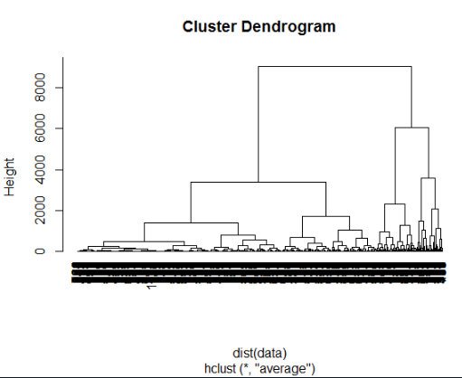
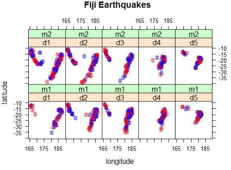

## 분류분석

1. 다수의 변수를 갖는데이터 셋을 대상으로 특정 변수의 갑승ㄹ 조건으로 지정하여 데이터를 분류
2. 종류
   - 의사결정트리(Decision Tree)
   - 랜덤 포레스트(Random Forest)
   - 인공신경망(Artificial Neural Network)
3. 기존 고객들의 데이터를 활용, 분류모델을 생성한 후 새로운 고개에 대해 예측

##### 6.1 특성

1. Y 변수 존재 : 설명변수(x 변수)와 반응변수(y 변수)가 존재한다.
2. 의사결정트리 : 분류 예측모델에 의해서 의사결정트리 형태로 데이터가 분류된다.
3. 비모수 검정 : 선형성, 정규성, 등분산성 가정이 필요 없다
4. 추론 기능 없다. : 유의수준 판단 기준이 없다 (추론 기능 없음)
5. 활용분야 : 이탈고객과 지속고객 분류, 신용상태의 좋고, 나쁨, 번호이동고객과 지속 고객 분류 등

##### 6.2 절차

1. 학습 데이터 생성
2. 분류 알고리즘을 통해 예측 모델 생성
3. 검정 데이터를 통해 분류규칙의 모델 평가(모형 평가)
4. 새로운 데이터에 적용하여 결과 예측

> **모형평가 ?**
>
> 어떤 모형이 random하게 예측하는 모형보다 예측력이 우수한지, 고려된 여러 모형 중 어느 모형이 가장 좋은 예측력을 보유하고 있는지를 비교/분석하는 과정.
>
> =어떤 모델이 좋은지 평가

##### 6.3 의사결정 트리

1. 나무(Tree) 구조 형태로 분류결과를 도출

2. 입력변수 중 가장 영향력 있는 변수를 기준으로 이진분류하여 분류 결과를 나무 구조 형태로 시각화

3. 비교적 모델 생성이 쉽고, 단순, 명료하여 현업에서 많이 사용되는 지도학습 모델

4. 의사결정규칙을 도표화 하여 분류와 예측을 수행하는 분석방법

   - party 패키지 ctree()

     >` 1)  Ozone <= 37; criterion= 1,
     >statistic=56.086`
     >
     >- 첫번째 번호는 반응변수(종속변수)에 대해서 설명변수(독립변수)가 영향을 미치는 중요 변수의 척도를 나타내는 수치로서 수치가 작을 수록 영향을 미치는 정도가 높고, 순서는 분기되는 순서를 의미한다.
     >- •두번째는 의사결정 트리의 노드명 (노드 번호 뒤에 * 기호가 오면 해당 노드가 마지막 노드를 의미)
     >   노드명 뒤에 해당 변수의 임계값이 조건식으로 온다. 마지막노드이면 조건식이 없다.
     >- 세번째는 노드의 분기 기준(criterion)이 되는 수치
     >- 네번째는 반응변수(종속변수)의 통계량(statistic)이 표시된다. 

     ######   의사결정트리(ctree()) 예시

   ```r
   #의사결정트리
   install.packages("party")
   library(party)
   library(datasets)
   #뉴욕 대기질 측정한 데이터셋
   > str(airquality) #관측치 153 변수 6개
   'data.frame':	153 obs. of  6 variables:
    $ Ozone  : int  41 36 12 18 NA 28 23 19 8 NA ...
    $ Solar.R: int  190 118 149 313 NA NA 299 99 19 194 ...
    $ Wind   : num  7.4 8 12.6 11.5 14.3 14.9 8.6 13.8 20.1 8.6 ...
    $ Temp   : int  67 72 74 62 56 66 65 59 61 69 ...
    $ Month  : int  5 5 5 5 5 5 5 5 5 5 ...
    $ Day    : int  1 2 3 4 5 6 7 8 9 10 ...
   
   
   ##온도에 영향을 미치는 변수를 알아보자.###########################
   > formula<-Temp ~ Solar.R+Wind+Ozone
   > #분류모델 생성
   > air_ctree<-ctree(formula, data=airquality)
   > air_ctree
   
   	 Conditional inference tree with 5 terminal nodes
   
   Response:  Temp 
   Inputs:  Solar.R, Wind, Ozone 
   Number of observations:  153 
   
   1) Ozone <= 37; criterion = 1, statistic = 56.086
     2) Wind <= 15.5; criterion = 0.993, statistic = 9.387
       3) Ozone <= 19; criterion = 0.964, statistic = 6.299
         4)*  weights = 29 
       3) Ozone > 19
         5)*  weights = 69 
     2) Wind > 15.5
       6)*  weights = 7 
   1) Ozone > 37
     7) Ozone <= 65; criterion = 0.971, statistic = 6.691
       8)*  weights = 22 
     7) Ozone > 65
       9)*  weights = 26 
   
   #시각화해보자
   plot(air_ctree)
   ```

   

    ```r
   #가장 큰 영향 변수는 Ozone
   #두번쨰는 Wind
   #오존량 37이하이면서 바람의 양이 15.5 이상이면 평균온도 63정도
   #바람의 양이  15.5이하인 경우 평균 온도 70 이상으로 나타난다.
   #태양광은 온도에 영향을 미치지 않는다.
    ```

   ###### ctree() 2번째 

   ```r
   #iris데이터 셋
   #학습데이터와 검정데이터로 나눌것이다.
   #Sample()
   set.seed(1234)#시드값적용 랜덤값이 동일하게 생성
   idx<-sample(1:nrow(iris),nrow(iris)*0.7)
   train<-iris[idx,]#학습데이터
   test<-iris[-idx,]#검정데이터
   #종속변수 (꽃종류임으로 Species, 나머지 4개를 독립변수로)
   str(iris)
   formula<-Species~Sepal.Length+Sepal.Width+Petal.Length+Petal.Width
   #분류모델 생성성
   iris_ctree<-ctree(formula,data=train)
   iris_ctree
   plot(iris_ctree,type="simple")
   plot(iris_ctree)
   
   ```

   

   ```r
   #첫번째 요인 Petal.Length
   #두번째 요인 Petal.Width
   #꽃종 분류에 가장 중요한 독립 변수는 Petal.Length와 Petal.Width다.
   #이 결과값은 Seed값이 다르면 조금씩 달라진다.
   ```

   ###### 의사결정트리 분류모델 평가

   ```r
   > pred<-predict(iris_ctree,test)
   > table(pred,test$Species)
               
   pred         setosa versicolor virginica
     setosa         16          0         0
     versicolor      0         15         1
     virginica       0          1        12
   ```

   ###### 분류정확도 계산

   ```r
   #분류정확도 계산
   # 세토사는 세토사로 버지니카는 버지니카로 분류됐는지 확인
   > (16+15+12)/nrow(test)
   [1] 0.9555556 #정확도는 96%정도 
   ```

   

   - rpart 패키지 rpart()

     > 1. 재귀분할(recursive partitioning)
     > 2. 2수준 요인으로 분산분석을 실행한 결과를 트리 형태로 제공하여 모형을 단순화
     > 3. 전체적인 분류기준을 쉽게 분석할 수 있는 장점이 있다

   ###### rpart 패키지 rpart() 이용한 분류

   ```r
   install.packages("rpart")
   library(rpart)
   data(iris)
   iris.df<-rpart(Species~.,data=iris)
   iris.df
   plot(iris.df)
   text(iris.df,use.n=T,cex=0.6)
   post(iris.df,file="")
   #줄기에 분기 조건
   #끝 노드에는 반으엽ㄴ수의 결과값이 나타남
   #꽃 종류 변수를 분류하는 가장 중요한 변수는 Petal.Length와 Petal.Width다.
   ```

   

##### 6.4 k겹 교차 검증

- 테스트를 더 정확하게 설정할수록 세상으로 나왔을 때 더 잘 작동한다고 할 수 있습니다. 
- 딥러닝 혹은 머신러닝 작업을 할 때 늘 어려운 문제 중 하나는 알고리즘을 충분히 테스트하였어도 데이터가 충분치 않으면 좋은 결과를 내기가 어렵습니다
- 데이터의 약 70%를 학습셋으로 써야 했으므로 테스트셋은 겨우 전체 데이터의 30%에 그쳤습니다. 이 정도 테스트만으로는 실제로 얼마나 잘 작동하는지 확신하기는 쉽지 않습니다.
- k겹 교차 검증(k-fold cross validation)  - 테스트 데이터 충분하지 않을 경우  단점을 보완하고자 만든 방법이 바로 입니다. 
- k겹 교차 검증이란 데이터셋을 여러 개로 나누어 하나씩 테스트셋으로 사용하고 나머지를 모두 합해서 학습셋으로 사용하는 방법입니다. 이렇게 하면 가지고 있는 데이터의 100%를 테스트셋으로 사용할 수 있습니다. 

```r
##k겹 교차 검증
# 3겹, 2회 반복을 위한 샘플링
install.packages("cvTools")
library(cvTools)
cross<-cvFolds(nrow(iris),K=3,R=2)
> str(cross)
List of 5
 $ n      : num 150
 $ K      : num 3
 $ R      : num 2
 $ subsets: int [1:150, 1:2] 21 102 134 9 19 22 40 29 109 38 ...
 $ which  : int [1:150] 1 2 3 1 2 3 1 2 3 1 ...
 - attr(*, "class")= chr "cvFolds"
cross # 교차검정 데이터 확인 
Repeated 3-fold CV with 2 replications:    
Fold      1   2
   1     21 133
   2    102 126
   3    134  87
   1      9 109
   2     19 122
   3     22  55
   1     40 105
   2     29  75
   3    109  24
   1     38 150
   2     88  52
   3    107  38
   1     70 101
   2    119 100
   3     79   2
   1     86 123
   2     71 135
   3    123  36
   1    133 114
   2     99  20
   3     26 106
   1    145  17
   2     87  68
   3     28  86
   1     98  10
   2    101  88
   3     48  83
   1    150  77
   2     41  46
   3     35  41
   1    144 134
   2     67  27
   3     72 148
   1    146  79
   2     61  30
   3     68  59
   1     84 124
   2     83  74
   3    148 120
   1     96  33
   2     17  70
   3     25  60
   1    121 127
   2      2  99
   3    125  97
   1     47  49
   2    105  47
   3     30 104
   1     10  85
   2    129   4
   3     57 147
   1     49  14
   2     89  91
   3     80 146
   1     73 129
   2     20  42
   3     12  48
   1     37 145
   2     81  98
   3    137 113
   1    104  96
   2    135 107
   3    141 108
   1     82  15
   2    117  39
   3     18  53
   1     23 119
   2     31 102
   3      6 139
   1      7  13
   2    118 143
   3      4  61
   1     43  54
   2    116 140
   3     15  72
   1    110  51
   2     78  16
   3     39 141
   1     42  81
   2    108  89
   3     58 121
   1     85  19
   2     11  64
   3     56 111
   1      8 138
   2    106 142
   3     97  71
   1     93  31
   2     52 149
   3     94  56
   1     64  76
   2     95 137
   3     33  84
   1     54  95
   2    128  80
   3      3  43
   1     36 118
   2    100 132
   3    115 103
   1    112  93
   2    138  73
   3    143  58
   1      1 128
   2    103  94
   3    127  18
   1     44  22
   2    126  40
   3    149 115
   1    132 131
   2     13  63
   3     77  11
   1    131   3
   2    113 110
   3     50  62
   1     74 130
   2     65  26
   3    122 125
   1     27  66
   2     66  82
   3     69  78
   1    114  21
   2    139  45
   3     24 136
   1     91  32
   2    142  65
   3     60  50
   1     14 144
   2     63 116
   3      5   6
   1     62   8
   2     46   9
   3    147  69
   1    124  23
   2    140  12
   3     16  34
   1     76  35
   2     90   1
   3     51  92
   1     53  67
   2    111  44
   3     45  90
   1    130   7
   2    136  37
   3     55   5
   1     92 112
   2     34 117
   3     75  29
   1    120  28
   2     59  25
   3     32  57
> length(cross$which)
[1] 150
> dim(cross$subsets)
[1] 150   2
> table(cross$which)

 1  2  3 
50 50 50 
> R=1:2 #2회 반복
> K=1:3 #3겹
> CNT=0  #카운트 변수
> ACC<-numeric() #정확도 저장
> for(r in R ){
+     cat('\n R=',r,'\n')
+   for(k in K){
+     datas_idx<-cross$subsets[cross$which==k,r]
+     test<-iris[datas_idx, ] #테스트 데이터 생성
+     cat('test:',nrow(test),'\n')
+     
+     formula<-Species ~.
+     train<-iris[-datas_idx, ] #훈련데이텃 생성
+     cat('train:',nrow(train),'\n')
+     
+     model<-ctree(formula,data=train)
+     pred<-predict(model,test)
+     t<-table(pred,test$Species)  #교차테이블 만들기
+     print(t)  # 혼돈 메트릭스 생성성
+     CNT<-CNT+1
+     #정확도
+     ACC[CNT]<- ((t[1,1]+t[2,2]+t[3.3])/sum(t))   }}

 R= 1 
test: 50 
train: 100 
            
pred         setosa versicolor virginica
  setosa         18          0         0
  versicolor      0         17         2
  virginica       0          0        13
test: 50 
train: 100 
            
pred         setosa versicolor virginica
  setosa         11          0         0
  versicolor      0         16         1
  virginica       0          2        20
test: 50 
train: 100 
            
pred         setosa versicolor virginica
  setosa         19          0         0
  versicolor      2         15         2
  virginica       0          0        12

 R= 2 
test: 50 
train: 100 
            
pred         setosa versicolor virginica
  setosa         18          0         0
  versicolor      0         12         2
  virginica       0          0        18
test: 50 
train: 100 
            
pred         setosa versicolor virginica
  setosa         16          0         0
  versicolor      2         18         2
  virginica       0          0        12
test: 50 
train: 100 
            
pred         setosa versicolor virginica
  setosa         14          0         0
  versicolor      0         15         1
  virginica       0          5        15


> CNT #데스트 데이터 3셋 생성 모델, 예측 비교를 2번 반복, 즉 6회 수행
[1] 11
> ACC # 6회 수행 정확도 확인
 [1] 0.04444444 0.04444444         NA         NA         NA 0.70000000 0.54000000
 [8] 0.68000000 0.60000000 0.68000000 0.58000000
> mean(ACC,na.rm=T) # 6회 정확도 평균!
[1] 0.4836111
```


##### 6.5 랜덤포레스

1. 의사결정트리에서 파생된 앙상블 학습기법을 적용한 모델
2. 앙상블 학습 기법 – 새로운 데이터에 대해서 여러 개의 트리(Forest)로 학습을 수행한 후 학습 결과들을 종합해서 예측하는 모델
3. 기존의 의사결정트리 방식에 비해서 많은 데이터를 이용하여 학습을 수행하기 때문에 비교적 예측력이 뛰어나고, 과적합(overfitting)문제를 해결할 수 있다
4. 과적합 문제 – 작은 데이터 셋은 높은 정확도가 나타나지만 큰 데이터셋에서는 정확도가 떨어지는 현상을 의미

`randomForest(formula, data, ntree, mtry, na.action, importance)`

- formula : y~x 형식으로 반응변수와 설명변수 식
- data : 모델 생성에 사용될 데이터 셋
- ntree :  복원추출하여 생성할 트리 수 지정
- mtry : 자식 노드를 분류할 변수 수 지정
- na.action :  결측치를 제거할 함수 지정
- importance : 분류모델 생성과정에서 중요 변수 정보 제공 여부

###### 6.5.1 실습

```r
#랜덤포레스트 분류 분석
install.packages("randomForest")
library(randomForest)

> data(iris)
> model<-randomForest(Species~.,data=iris)
> model

Call:
 randomForest(formula = Species ~ ., data = iris) 
               Type of random forest: classification
                     Number of trees: 500
No. of variables tried at each split: 2

        OOB estimate of  error rate: 4.67%
Confusion matrix:
           setosa versicolor virginica class.error
setosa         50          0         0        0.00
versicolor      0         47         3        0.06
virginica       0          4        46        0.08

#Number of trees는 학습데이터(Forest)로 복원 추출 방식으로  500개 생성했다는 의미
#No, of variables tried at each split는 두 개의 변수를 이용하여 트리의 자식노드가 분류되었다는 의미
#ntree:500, ntry:2 기본으로 설정
#error.rate: 모델의 분류정확도 오차 비율을 의미
#Confusion matrix(혼돈매트릭스) 
> (50+47+46)/nrow(iris)
[1] 0.9533333
> (50+47+46)/150
[1] 0.9533333
#ntree :300, mtry=4, 결측치 제거
> model2<-randomForest(Species~.,data=iris,ntree=300,mtry=4,na.action=na.omit)
> model2

Call:
 randomForest(formula = Species ~ ., data = iris, ntree = 300,      mtry = 4, na.action = na.omit) 
               Type of random forest: classification
                     Number of trees: 300
No. of variables tried at each split: 4

        OOB estimate of  error rate: 4%
Confusion matrix:
           setosa versicolor virginica class.error
setosa         50          0         0        0.00
versicolor      0         47         3        0.06
virginica       0          3        47        0.06
> (50+47+47)/nrow(iris)
[1] 0.96


```

###### 6.5. 2 중요변수 생성으로 랜덤포레스트 모델 생성

```r
##### 중요변수 생성으로 랜덤포레스트 모델 생성
> model3<-randomForest(Species~.,data=iris,importance=T,na.action = na.omit)
> model3

Call:
 randomForest(formula = Species ~ ., data = iris, importance = T,      na.action = na.omit) 
               Type of random forest: classification
                     Number of trees: 500
No. of variables tried at each split: 2

        OOB estimate of  error rate: 4.67%
Confusion matrix:
           setosa versicolor virginica class.error
setosa         50          0         0        0.00
versicolor      0         47         3        0.06
virginica       0          4        46        0.08
> (50+47+46)/nrow(iris)
[1] 0.9533333

```

###### 6.5.3.중요 변수 찾기(importance)

```r
#중요변수 보기 importance속성은 분류모델 생성하는 과정에서 입력변수 중 가장 중요한 변수가 어떤 변수인가 알려준다.
> importance(model3)
                setosa versicolor virginica MeanDecreaseAccuracy
Sepal.Length  6.442767   7.426228  9.324005            11.306699
Sepal.Width   4.743591   1.097165  5.131779             5.140809
Petal.Length 19.784523  32.441311 27.979269            32.365475
Petal.Width  24.275826  32.640274 32.723157            35.243491
             MeanDecreaseGini
Sepal.Length        10.130830
Sepal.Width          2.380762
Petal.Length        41.178722
Petal.Width         45.596859
#MeanDecreaseAccuracy 분류정확도를 개선하는데 기여한 변수를 수치로 제공
# 가장 크게 기여한 것은 Petal.Width 
```


###### 6.5.4 최적의 ntree, mtry찾기

```r

#최적의 ntree, mtry수치값 찾기
> for(i in param$n){
+   cat('ntree=',i,'\n')
+   for(j in param$m){
+     cat('mtry=',j,'\n')
+     model_iris<-randomForest(Species~.,data=iris,ntree=i,mtry=j,na.action=na.omit)
+     print(model_iris)
+     
+   }
+ }
ntree= 400 
mtry= 2 

Call:
 randomForest(formula = Species ~ ., data = iris, ntree = i, mtry = j,      na.action = na.omit) 
               Type of random forest: classification
                     Number of trees: 400
No. of variables tried at each split: 2

        OOB estimate of  error rate: 4.67%
Confusion matrix:
           setosa versicolor virginica class.error
setosa         50          0         0        0.00
versicolor      0         47         3        0.06
virginica       0          4        46        0.08
mtry= 3 

Call:
 randomForest(formula = Species ~ ., data = iris, ntree = i, mtry = j,      na.action = na.omit) 
               Type of random forest: classification
                     Number of trees: 400
No. of variables tried at each split: 3

        OOB estimate of  error rate: 4.67%
Confusion matrix:
           setosa versicolor virginica class.error
setosa         50          0         0        0.00
versicolor      0         47         3        0.06
virginica       0          4        46        0.08
mtry= 4 

Call:
 randomForest(formula = Species ~ ., data = iris, ntree = i, mtry = j,      na.action = na.omit) 
               Type of random forest: classification
                     Number of trees: 400
No. of variables tried at each split: 4

        OOB estimate of  error rate: 4.67%
Confusion matrix:
           setosa versicolor virginica class.error
setosa         50          0         0        0.00
versicolor      0         47         3        0.06
virginica       0          4        46        0.08
ntree= 500 
mtry= 2 

Call:
 randomForest(formula = Species ~ ., data = iris, ntree = i, mtry = j,      na.action = na.omit) 
               Type of random forest: classification
                     Number of trees: 500
No. of variables tried at each split: 2

        OOB estimate of  error rate: 4.67%
Confusion matrix:
           setosa versicolor virginica class.error
setosa         50          0         0        0.00
versicolor      0         47         3        0.06
virginica       0          4        46        0.08
mtry= 3 

Call:
 randomForest(formula = Species ~ ., data = iris, ntree = i, mtry = j,      na.action = na.omit) 
               Type of random forest: classification
                     Number of trees: 500
No. of variables tried at each split: 3

        OOB estimate of  error rate: 4%
Confusion matrix:
           setosa versicolor virginica class.error
setosa         50          0         0        0.00
versicolor      0         47         3        0.06
virginica       0          3        47        0.06
mtry= 4 

Call:
 randomForest(formula = Species ~ ., data = iris, ntree = i, mtry = j,      na.action = na.omit) 
               Type of random forest: classification
                     Number of trees: 500
No. of variables tried at each split: 4

        OOB estimate of  error rate: 4.67%
Confusion matrix:
           setosa versicolor virginica class.error
setosa         50          0         0        0.00
versicolor      0         47         3        0.06
virginica       0          4        46        0.08
ntree= 600 
mtry= 2 

Call:
 randomForest(formula = Species ~ ., data = iris, ntree = i, mtry = j,      na.action = na.omit) 
               Type of random forest: classification
                     Number of trees: 600
No. of variables tried at each split: 2

        OOB estimate of  error rate: 4%
Confusion matrix:
           setosa versicolor virginica class.error
setosa         50          0         0        0.00
versicolor      0         47         3        0.06
virginica       0          3        47        0.06
mtry= 3 

Call:
 randomForest(formula = Species ~ ., data = iris, ntree = i, mtry = j,      na.action = na.omit) 
               Type of random forest: classification
                     Number of trees: 600
No. of variables tried at each split: 3

        OOB estimate of  error rate: 4%
Confusion matrix:
           setosa versicolor virginica class.error
setosa         50          0         0        0.00
versicolor      0         47         3        0.06
virginica       0          3        47        0.06
mtry= 4 

Call:
 randomForest(formula = Species ~ ., data = iris, ntree = i, mtry = j,      na.action = na.omit) 
               Type of random forest: classification
                     Number of trees: 600
No. of variables tried at each split: 4

        OOB estimate of  error rate: 4.67%
Confusion matrix:
           setosa versicolor virginica class.error
setosa         50          0         0        0.00
versicolor      0         47         3        0.06
virginica       0          4        46        0.08
```

### 7. 인공신경망

- 인간의 두뇌 신경(뉴런)들이 상호작용하여 경험과 학습을 통해서 패턴을 발견하고,  발견된 패턴을 통해서 특정 사건을 일반화하거나 데이터를 분류하는데 이용되는 기계학습 방법
- 인간의 개입 없이 컴퓨터가 스스로 인지하고 추론, 판단하여 사물을 구분하거나 특정 상황의 미래를 예측하는데 이용될 수 있는 기계학습 방법
- 문자, 음성, 이미지 인식, 증권시장 예측, 날씨 예보 등 다양한 분야에서 활용
  예) 구글의 알파고(딥러닝)

##### 7.1 생물학적 신경망과 인공신경망 비교

| 생물학적 신경망 | 인공신경망 |
| --------------- | ---------- |
| 세포체          | 노드       |
| 수상돌기        | 입력       |
| 축삭            | 출력       |
| 시냅스          | 가중치     |

- 인간의 생물학적 신경세포가 하나가 아닌 다수가 연결되어 의미 있는 작업을 하듯, 인공신경망의 경우도 개별 뉴런들을 서로 시냅스를 통해 서로 연결시켜서 복수개의 계층(layer)이 서로 연결되어 각 층간의 연결 강도는 가중치로 수정(update) 가능. 이와 같이 다층 구조와 연결강도로 학습과 인지를 위한 분야에 활용된다.

##### 7.2 가중치 적용

- 시냅스에서는 외부 신호 입력에 따라서 세기를 적용한다.
- 입력값 (x1, x2, x3,…투)은 수상돌기에 해당하는 외부 신경 자극에 해당하고, 가중치 (w1, w2, w3, ….주) 는 시냅스에 의해서 신호의 세기가 결정되는 부분에 해당한다.
  입력 신호(X)와 일대일로 가중치(W)가 적용된다.
- 경계값(b:bias)은 활성 함수에 의해서 망의 총합을 다음 계층으로 넘길 때 영향을 주는 값이다.
- 입력 신호의 가중치는 중요 변수에 따라서 가중치가 달라지는데, 초기 가중치는 무작위(Random)로 생성되지만, 출력 값의 예측결과에 따라서 가중치는 수정(중요 변수의 가중치는 높게 설정)된다. 

##### 7.3 활성 함수

- 망의 총합과 경계값(bias)을 계산하여 출력 신호(y)를 결정한다.
- 활성 함수는 0과 1사이의 확률분포를 갖는 시그모이드 함수(Sigmoid function)를 이용한다
- 시그모이드 함수는 가중치나 경계값(bias)이 변경된 경우 출력 신호에 변화를 준다.
- 스텝 함수(Step function)는 0 또는 1의 이항값으로 출력 신호(y)가 결정하므로 가중치와 경계값의 변화에 대해서 출력 신호에 변화를 주지 못한다.
- 스텝 함수는 x 변량이 0보다 큰 경우 1, 0보다 적으면 0으로 극단적인 상황만 제공
- 시그모이드 함수는 0과 1 사이의 확률분포를 제공하여 가중치나 바이어스(bias) 변화 시 출력 신호(y)에 변화를 준다

##### 7.4 퍼셉트론(=인공신경망)

- 여러 개의 계층으로 다층화하여 만들어진 인공신경망
- 퍼셉트론 모형에서 입력변수와 출력변수는 분석자가 지정해준다.
- 인공신경망은 은닉층에서 연산과정이 공개되지 않기 때문에 **블랙박스 모형**으로 분류되기도 한다.
- 데이터 분류나 예측 결과는 제공하지만 어떠한 원인으로 결과가 도출되었는지에 대한**이유를 설명할 수 없는 모형**
- 여러 변수 간의 관계를 밝히는데 이 모형을 이용할 수 없다.

##### 7.5 구성 요소

- 여러 개의 계층으로 다층화하여 만들어진 인공신경망
- 퍼셉트론 모형에서 입력변수와 출력변수는 분석자가 지정해준다.
- 인공신경망은 은닉층에서 연산과정이 공개되지 않기 때문에 블랙박스 모형으로 분류되기도 한다.
- 데이터 분류나 예측 결과는 제공하지만 어떠한 원인으로 결과가 도출되었는지에 대한 이유를 설명할 수 없는 모형
- 여러 변수 간의 관계를 밝히는데 이 모형을 이용할 수 없다.

##### 7.6 역전파알고리즘

[쉽게 웹으로 읽어보자 책을](http://thebook.io)

- neuralnet 패키지는 역전파(Backpropagation) 알고리즘을 적용할 수 있고, 가중치 망을 시각화하는 기능도 제공
-  출력변수(y)는 ‘yes’, ‘no’ 형태의 문자열이 아닌 1과 0의 수치형 이여야 한다.

`nnet::neuralnet(formula, data, hidden=1,threshold=0.01, stepmax=1e+05, rep=1,
                   startweights = NULL, learnningrate=NULL, algorithm=“rprop+”)`

- formula : y ~ x 형식으로 반응변수(종속변수)와 설명변수(독립변수) 식
- data : 모델 생성에 사용될 데이터 셋
- hidden : 은닉층(hidden layer)의 수 지정
- threshold : 경계값 지정
- stepmax : 인공신경망 학습을 위한 최대 스텝 지정
- rep : 인공신경망의 학습을 위한 반복 수 지정
- startweights : 랜덤으로 초기화된 가중치를 직접 지정
- learningrate : backpropagation 알고리즘에서 사용될 학습비율을 지정
- algorithm : backpropagation과 같은 알고리즘 적용을 위한 속성

###### 7.6.1 실습

```r
install.packages("nnet")
library(nnet)
#x는 입력 변수
#y는 출력 변수
df=data.frame(x2=c(1:6),x1=c(6:1),y=factor(c('no','no','no','yes','yes','yes')))
str(df)
'data.frame':	6 obs. of  3 variables:
 $ x2: int  1 2 3 4 5 6
 $ x1: int  6 5 4 3 2 1
 $ y : Factor w/ 2 levels "no","yes": 1 1 1 2 2 2
> #인공신경망 모델생성
> model_net<-nnet(y~.,df,size=1)
# weights:  5
initial  value 4.746658 
iter  10 value 2.318645
final  value 0.000071 
converged
#5개의 가중치가 생겼다.
#오차율은 점진적으로 줄어들고 있다.
> model_net
a 2-1-1 network with 5 weights
inputs: x2 x1 
output(s): y 
options were - entropy fitting 

#5개의 가중치를 사용해고 입력값은 x2,x1 출력값은 y임을 확인.
#신경망(a 2-1-1)는 (경계값 -입력변수 -은닉층-출력변수) 형태로 다섯개의 가중치를 보여준다. 

#가중치 요약정보 확인
> summary(model_net)
a 2-1-1 network with 5 weights
options were - entropy fitting 
 b->h1 i1->h1 i2->h1 
  0.38  11.00 -10.96 
#입력층의 경계값(b) 1개 와 입력변수(i1,i2)2개가 은닉층(h1)으로 연결되는 가중치
  b->o  h1->o 
-11.43  22.69 
#은닉층의 경계값(b) 1개와 은닉층의 결과값이 출력층(o)으로 연결되는 가중치

> model_net$fitted.values #분류모델의 적합값 확인
          [,1]
1 1.088253e-05
2 1.088253e-05
3 1.088955e-05
4 9.999871e-01
5 9.999871e-01
6 9.999871e-01
> #분류모델의 예측치 생성, 정확도 확인
#type="class"는 예측 결과를 출력변수 y의 범주('no','yes')로 분류
> p<-predict(model_net,df,type="class")
> table(p,df$y)
     
p     no yes
  no   3   0
  yes  0   3


##########################################iris데이터로 인경신경망
> ###iris데이터 셋 인공신경망 모델 생성
> idx<-sample(1:nrow(iris),0.7*nrow(iris))
> training<-iris[idx,]
> testing<-iris[-idx,]
> model_net_iris<-nnet(Species~.,training,size=1)
# weights:  11
initial  value 116.969821 
iter  10 value 47.684448
iter  20 value 47.105289
final  value 47.104651 
converged
> model_net_iris3<-nnet(Species~.,training,size=3)
# weights:  27
initial  value 126.879341 
iter  10 value 42.405769
iter  20 value 2.480654
iter  30 value 0.546225
iter  40 value 0.002310
final  value 0.000067 
converged

> #입력변수의 값들이 일정하지 않으면 과적합(overfitting)을 피하기 위해 정규화 과정 필요
> #가중치 확인
> summary(model_net_iris)
a 4-1-3 network with 11 weights
options were - softmax modelling 
 b->h1 i1->h1 i2->h1 i3->h1 i4->h1 
  9.17   8.44  40.28 -75.94 -34.66 
 b->o1 h1->o1 
 -9.78  19.65 
 b->o2 h1->o2 
  4.79  -9.10 
 b->o3 h1->o3 
  4.85  -9.54 
> summary(model_net_iris3)
a 4-3-3 network with 27 weights
options were - softmax modelling 
  b->h1  i1->h1  i2->h1  i3->h1  i4->h1 
  16.30    9.54   57.99 -128.50  -69.28 
  b->h2  i1->h2  i2->h2  i3->h2  i4->h2 
 -12.74  -60.97  -41.12  -17.55   -2.32 
  b->h3  i1->h3  i2->h3  i3->h3  i4->h3 
-152.30   -6.89    2.30   22.50   45.39 
  b->o1  h1->o1  h2->o1  h3->o1 
 -33.10   61.45   -6.89  -12.05 
  b->o2  h1->o2  h2->o2  h3->o2 
  68.21 -111.28   16.10  -71.40 
  b->o3  h1->o3  h2->o3  h3->o3 
 -34.60   49.42   -9.30   83.08 


```

###### 7.6.2 정확도 평가

```r
> #분류모델의 정확도 평가
> table(predict(model_net_iris,testing,type="class"),testing$Species)
           
            setosa versicolor virginica
  setosa        13          0         0
  virginica      0         17        15
> table(predict(model_net_iris3,testing,type="class"),testing$Species)
            
             setosa versicolor virginica
  setosa         13          0         0
  versicolor      0         16         3
  virginica       0          1        12
```

###### 7.6.3 실습 2

- iris데이터 셋에 인공신경망 모델 생성: neuralnet 패키지

```r
#####iris 데이터 셋에 인공신경망 모델 생성: neuralnet 패키지 ########
install.packages("neuralnet")
library(neuralnet)
idx<-sample(1:nrow(iris), 0.7*nrow(iris))
training <- iris[idx, ]
testing <- iris[-idx, ]

※neuralnet()함수는 종속변수(출력변수y)가 수치형이어야 합니다.

training$Species2[training$Species=='setosa'] <- 1
training$Species2[training$Species=='versicolor'] <- 2
training$Species2[training$Species=='virginica'] <- 3
head(training)
    Sepal.Length Sepal.Width Petal.Length Petal.Width Species2
99           5.1         2.5          3.0         1.1        2
2            4.9         3.0          1.4         0.2        1
11           5.4         3.7          1.5         0.2        1
128          6.1         3.0          4.9         1.8        3
29           5.2         3.4          1.4         0.2        1
140          6.9         3.1          5.4         2.1        3

testing$Species2[testing$Species=='setosa'] <- 1
testing$Species2[testing$Species=='versicolor'] <- 2
testing$Species2[testing$Species=='virginica'] <- 3
head(testing)
   Sepal.Length Sepal.Width Petal.Length Petal.Width Species2
5           5.0         3.6          1.4         0.2        1
6           5.4         3.9          1.7         0.4        1
10          4.9         3.1          1.5         0.1        1
19          5.7         3.8          1.7         0.3        1
21          5.4         3.4          1.7         0.2        1
23          4.6         3.6          1.0         0.2        1

# 정규화 함수를 이용하여 학습데이터와 검정데이터를 정규화
# 0과 1사이의 범위로 컬럼값을 정규화 
normal <- function(x){
     return ((x-min(x))/(max(x)-min(x)))
}

training$Species <- NULL
testing$Species <-NULL

training_nor <- as.data.frame(lapply(training, normal))
>summary(training_nor)

  Sepal.Length     Sepal.Width      Petal.Length      Petal.Width     
 Min.   :0.0000   Min.   :0.0000   Min.   :0.00000   Min.   :0.00000  
 1st Qu.:0.2353   1st Qu.:0.3333   1st Qu.:0.06897   1st Qu.:0.08333  
 Median :0.4118   Median :0.4167   Median :0.51724   Median :0.50000  
 Mean   :0.4261   Mean   :0.4353   Mean   :0.43186   Mean   :0.42857  
 3rd Qu.:0.5882   3rd Qu.:0.5417   3rd Qu.:0.65517   3rd Qu.:0.66667  
 Max.   :1.0000   Max.   :1.0000   Max.   :1.00000   Max.   :1.00000  
    Species2     
 Min.   :0.0000  
 1st Qu.:0.0000  
 Median :0.5000  
 Mean   :0.4619  
 3rd Qu.:1.0000  
 Max.   :1.0000  

testing_nor <- as.data.frame(lapply(testing, normal))
> summary(testing_nor)

  Sepal.Length     Sepal.Width      Petal.Length     Petal.Width    
 Min.   :0.0000   Min.   :0.0000   Min.   :0.0000   Min.   :0.0000  
 1st Qu.:0.3143   1st Qu.:0.3529   1st Qu.:0.1228   1st Qu.:0.1250  
 Median :0.4571   Median :0.5294   Median :0.6842   Median :0.5833  
 Mean   :0.4756   Mean   :0.5216   Mean   :0.5466   Mean   :0.5269  
 3rd Qu.:0.6571   3rd Qu.:0.7059   3rd Qu.:0.7895   3rd Qu.:0.7917  
 Max.   :1.0000   Max.   :1.0000   Max.   :1.0000   Max.   :1.0000  
    Species2     
 Min.   :0.0000  
 1st Qu.:0.0000  
 Median :0.5000  
 Mean   :0.5889  
 3rd Qu.:1.0000  
 Max.   :1.0000  


#인공신경망 분류 모델 생성
model_net <- neuralnet(Species2 ~ Sepal.Length+ Sepal.Width+Petal.Length+Petal.Width, data=training_nor, hidden=1)
model_net
plot(model_net)


```


```r
#분류모델 정확도(성능) 평가
model_result <- compute(model_net, testing_nor[c(1:4)])
model_result$net.result
             [,1]
 [1,] -0.018958176
 [2,] -0.018692626
 [3,] -0.002037639
 [4,] -0.020735184
 [5,] -0.009701616
 [6,] -0.021807507
 [7,]  0.003149724
 [8,] -0.001888338
 [9,] -0.006976969
[10,] -0.019281390
[11,]  0.010225865
[12,] -0.022879081
[13,] -0.022000577
[14,]  0.573718570
[15,]  0.599948003
[16,]  0.563159308
[17,]  0.887054552
[18,]  0.720581624
[19,]  0.832972367
[20,]  0.493459578
[21,]  0.632243314
[22,]  0.564258669
[23,]  0.744402613
[24,]  0.470220837
[25,]  1.078712978
[26,]  0.975119795
[27,]  0.995049595
[28,]  1.031717877
[29,]  0.823619428
[30,]  0.972659780
[31,]  0.964095035
[32,]  1.098285069
[33,]  0.859984384
[34,]  0.955917370
[35,]  0.968422676
[36,]  1.067126677
[37,]  0.900784552
[38,]  0.822895738
[39,]  0.776941641
[40,]  0.713709080
[41,]  0.958526409
[42,]  1.019150753
[43,]  1.040300842
[44,]  0.933780256
[45,]  0.836360872

#상관관계분석 : 상관계수로 두 변수 간의 선형관계의 강도 측정
#예측된 꼭 종류와 실제 관측치 사이의 상관관계 측정
cor(model_result$net.result, testing_nor$Species2)
          [,1]
[1,] 0.9563346
#은닉층 2개
model_net2 <- neuralnet(Species2 ~ Sepal.Length+ Sepal.Width+Petal.Length+Petal.Width, 
               data=training_nor, hidden=2, algorithm="backprop", learningrate=0.01)
model_net2
plot(model_net2)

```


```r


#분류모델 정확도(성능) 평가
model_result2 <- compute(model_net, testing_nor[c(1:4)])
model_result2$net.result
              [,1]
 [1,] -0.018958176
 [2,] -0.018692626
 [3,] -0.002037639
 [4,] -0.020735184
 [5,] -0.009701616
 [6,] -0.021807507
 [7,]  0.003149724
 [8,] -0.001888338
 [9,] -0.006976969
[10,] -0.019281390
[11,]  0.010225865
[12,] -0.022879081
[13,] -0.022000577
[14,]  0.573718570
[15,]  0.599948003
[16,]  0.563159308
[17,]  0.887054552
[18,]  0.720581624
[19,]  0.832972367
[20,]  0.493459578
[21,]  0.632243314
[22,]  0.564258669
[23,]  0.744402613
[24,]  0.470220837
[25,]  1.078712978
[26,]  0.975119795
[27,]  0.995049595
[28,]  1.031717877
[29,]  0.823619428
[30,]  0.972659780
[31,]  0.964095035
[32,]  1.098285069
[33,]  0.859984384
[34,]  0.955917370
[35,]  0.968422676
[36,]  1.067126677
[37,]  0.900784552
[38,]  0.822895738
[39,]  0.776941641
[40,]  0.713709080
[41,]  0.958526409
[42,]  1.019150753
[43,]  1.040300842
[44,]  0.933780256
[45,]  0.836360872
> cor(model_result2$net.result, testing_nor$Species2)
          [,1]
[1,] 0.9563346
```


## 군집분석 비지도 학습


### 1. 군집분석

#### 1.1 비지도 학습

- 데이터에 의한 학습을 통해 최적의 판단이나 예측을 가능하게 해주는 기계학습 방법의 하나로 어떤 입력에 대해서 어떤 결과가 출력되는지 사전지식이 없는 상태에서 컴퓨터 스스로 공통점과 차이점 등의 패턴을 찾아서 규칙(rule)을 생성하고, 분석 결과를 도출해내는 방식
- Y변수(정답)가 없기 때문에 검정 데이터를 이용하여 모델을 평가할 수 없다.
- =종속변수가 없다.

#### 1.2 군집분석

- 데이터 간의 유사도를 정의하고 그 유사도에 가까운 것부터 순서대로 합쳐 가는 방법으로 그룹(군집)을 형성한 후 각 그룹의 성격을 파악하거나 그룹 간의 비교분석을 통해서 데이터 전체의 구조에 대한 이해를 돕고자 하는 **탐색적 분석 방법**
- 유사도 거리(distance)를 이용 – 유클리디안(Euclidean) 거리도 측정한 거리정보를 이용해서 분석 대상을 몇 개의 집단으로 분류한다. 
- 군집분석에 의해서 그룹화된 군집은 변수의 특성이 그룹 내적으로는 동일하고, 외적으로는 이질적인 특성을 갖는다.
- 용도 – 고객의 충성도에 따라서 몇 개의 그룹으로 분류하고, 그룹별로 맞춤형 마케팅 및 프로모션 전략을 수립하는데 활용된다.

##### 1.2.1 목적

- 데이터 셋 전체를 대상으로 서로 유사한 개체 들을 몇 개의 군집으로 세분화하여 대상 집단을 정확하게 이해하고, 효율적으로 활용하기 위함

##### 1.2.2 중요사항

- 군집화를 위해서 거리 측정에 사용되는 변인은 비율척도나 등간척도이어야 하며, 인구 통계적 변인, 구매패턴 변인, 생활 패턴 변인 등이 이용된다.
- 군집분석에 사용되는 입력 자료는 변수의 측정단위와 관계없이 그 차이에 따라 일정하게 거리를 측정하기 때문에 변수를 표준화하여 사용하는 것이 필요하다.
- 군집화 방법에 따라 계층적 군집분석과 비계층적 군집분석으로 분류된다. 

##### 1.2.3 군집분석 이용 요인

- 인구 통계적 변인 : 거주지, 성별, 나이, 교육수준, 직업, 소득수준 등
- 구매패턴 변인 : 구매상품, 1회 평균 거래액, 구매횟수, 구매주기 등
- 생활패턴 변인 : 생활습관, 가치관, 성격, 취미 등

##### 1.2.4 특징

- 전체적인 데이터 구조를 파악하는데 이용된다.
- 관측대상 간 유사성을 기초로 비슷한 것끼리 그룹화(Clustering)한다.
- 유사성은 유클리디안 거리를 이용한다
- 분석결과에 대한 가설 검정이 없다
- 반응변수(y 변수)가 존재하지 않는 데이터마이닝 기법이다.
- 규칙(Rule)을 기반으로 계층적인 트리 구조를 생성한다.
- 활용분야는 구매패턴에 따른 고객분류, 충성도에 따른 고객분류 등

> 데이터 마이닝?
>
>  대규모 데이터에 포함된 유용한 정보를 발견하는 과정으로 데이터에 숨겨진 규칙과 패턴을 이용하여 광맥을 찾아내듯이 기존에 알려지지 않은 유용한 정보를 발견해 내는 기법

##### 1.2.5 절차

1. 분석 대상의 데이터에서 군집분석에 사용할 변수 추출
2. 계층적 군집분석을 이용한 대략적인 군집의 수 결정
3. 계층적 군집분석에 대한 타당성 검증(ANOVA 분석)
4.  비계층적 군집분석을 이용한 군집분류
5.  분류된 군집의 특성 파악 및 업무 적용

#### 1.3 유클리디안 거리

1. 두 점 사이의 거리를 계산하는 방법
2. 관측대상 p와 q의 대응하는 변량 값의 차가 작으면, 두 관측대상은 유사하다고 정의하는 식
3. 유클리디안 거리 계산식은 관측대상 p와 q의 대응하는 변량 값의 차의 제곱의 합에 제곱근을 적용한 결과이다.


- matrix 객체를 대상으로 dist() 함수를 이용하여 유클리디안 거리를 생성한다.

  `dist( x, method=“euclidean”)`

- matrix 객체의 값이 서로 가까울수록 유클리디안 거리값이 작은 값으로 나타나고, 거리가 멀수록 큰 값으로 나타난다.

###### 1.3.1 실습

```r
> x<-matrix(1:9, nrow=3,by=T)
> x
     [,1] [,2] [,3]
[1,]    1    2    3
[2,]    4    5    6
[3,]    7    8    9
> dist<-dist(x,method="euclidean")
> dist
          1         2
2  5.196152          
3 10.392305  5.196152
# 1과 2, 2와 3은 유클리디안 거리가 1과 3보다 가깝다. 1과 3이 가장 멀다. 

#### 직접 계산해보자
#1행과 2행의 변량의 차의 제곱의 합
> s<-sum((x[1,]-x[2,])^2) # 또는 ** 하면 제곱이 된다.
> sqrt(s)
[1] 5.196152

> s<-sum((x[1,]-x[3,])^2) # 또는 ** 하면 제곱이 된다.
> sqrt(s)
[1] 10.3923

```

###### 1.3.2. 분석자가 군집수를 설정(자르기)

- stats :: cutree 로 군집수를 내 마음대로(?) 자를수 있다.

```r
install.packages("stats")
library(stats)
idist<-dist(iris[1:4])
hc<-hclust(idist)
plot(hc,hang=-1)
rect.hclust(hc,k=4,border="red")
```


```r
> #군집분석 결과를 대상으로 3개의 군집수를 지정
> ghc<-cutree(hc,k=3)
> ghc #군집을 의미하는 1~3의 숫자로 출력
  [1] 1 1 1 1 1 1 1 1 1 1 1 1 1 1 1 1 1 1 1 1 1 1 1 1 1 1 1 1 1 1 1 1 1 1 1 1
 [37] 1 1 1 1 1 1 1 1 1 1 1 1 1 1 2 2 2 3 2 3 2 3 2 3 3 3 3 2 3 2 3 3 2 3 2 3
 [73] 2 2 2 2 2 2 2 3 3 3 3 2 3 2 2 2 3 3 3 2 3 3 3 3 3 2 3 3 2 2 2 2 2 2 3 2
[109] 2 2 2 2 2 2 2 2 2 2 2 2 2 2 2 2 2 2 2 2 2 2 2 2 2 2 2 2 2 2 2 2 2 2 2 2
[145] 2 2 2 2 2 2
> iris$ghc <-ghc 
> table(iris$ghc)  #군집의 빈도수

 1  2  3 
50 72 28 
> g1<-subset(iris,ghc==1)
> summary(g1)
  Sepal.Length    Sepal.Width     Petal.Length    Petal.Width   
 Min.   :4.300   Min.   :2.300   Min.   :1.000   Min.   :0.100  
 1st Qu.:4.800   1st Qu.:3.200   1st Qu.:1.400   1st Qu.:0.200  
 Median :5.000   Median :3.400   Median :1.500   Median :0.200  
 Mean   :5.006   Mean   :3.428   Mean   :1.462   Mean   :0.246  
 3rd Qu.:5.200   3rd Qu.:3.675   3rd Qu.:1.575   3rd Qu.:0.300  
 Max.   :5.800   Max.   :4.400   Max.   :1.900   Max.   :0.600  
       Species        ghc   
 setosa    :50   Min.   :1  
 versicolor: 0   1st Qu.:1  
 virginica : 0   Median :1  
                 Mean   :1  
                 3rd Qu.:1  
                 Max.   :1  
 summary(g1[1:4])
  Sepal.Length    Sepal.Width     Petal.Length    Petal.Width   
 Min.   :4.300   Min.   :2.300   Min.   :1.000   Min.   :0.100  
 1st Qu.:4.800   1st Qu.:3.200   1st Qu.:1.400   1st Qu.:0.200  
 Median :5.000   Median :3.400   Median :1.500   Median :0.200  
 Mean   :5.006   Mean   :3.428   Mean   :1.462   Mean   :0.246  
 3rd Qu.:5.200   3rd Qu.:3.675   3rd Qu.:1.575   3rd Qu.:0.300  
 Max.   :5.800   Max.   :4.400   Max.   :1.900   Max.   :0.600  

> g2<-subset(iris,ghc==2)
> summary(g2[1:4])
  Sepal.Length    Sepal.Width     Petal.Length    Petal.Width  
 Min.   :5.600   Min.   :2.200   Min.   :4.300   Min.   :1.20  
 1st Qu.:6.200   1st Qu.:2.800   1st Qu.:4.800   1st Qu.:1.50  
 Median :6.400   Median :3.000   Median :5.100   Median :1.80  
 Mean   :6.546   Mean   :2.964   Mean   :5.274   Mean   :1.85  
 3rd Qu.:6.800   3rd Qu.:3.125   3rd Qu.:5.700   3rd Qu.:2.10  
 Max.   :7.900   Max.   :3.800   Max.   :6.900   Max.   :2.50  
> g3<-subset(iris,ghc==3)
> summary(g3[1:4])
  Sepal.Length    Sepal.Width     Petal.Length    Petal.Width   
 Min.   :4.900   Min.   :2.000   Min.   :3.000   Min.   :1.000  
 1st Qu.:5.475   1st Qu.:2.475   1st Qu.:3.775   1st Qu.:1.075  
 Median :5.600   Median :2.650   Median :4.000   Median :1.250  
 Mean   :5.532   Mean   :2.636   Mean   :3.961   Mean   :1.229  
 3rd Qu.:5.700   3rd Qu.:2.825   3rd Qu.:4.200   3rd Qu.:1.300  
 Max.   :6.100   Max.   :3.000   Max.   :4.500   Max.   :1.700  

# 각 군집 별로 내적 특성, 다른 군집과의 차이에 해당하는 외적 특성 확인


```


###  2 . 계층적 군집분석 절차

1. 개별대상 간의 거리에 의하여 가장 가까운 대상부터 결합하여 나무 모양의 계층구조를 상향식(Bottom-up)으로 만들어가면서 군집을 형성하는 방법
2. 계층적 군집 분석은 군집이 형성되는 과정을 파악할 수 있다는 장점과 자료의 크기가 큰 경우 분석이 어렵다는 단점이 있다.
3. 군집화된 결과를 **plot() **함수를 이용하여 시각화하면 덴드로그램(Dendrogram)에 의해서 클러스터 형태로 시각화해 준다
4. 덴드로그램에서 Height는 해당 군집에 대한 유클리디안 거리를 의미한다.
5. 계층적 군집분석결과에서 분석자가 원하는 군집수 만큼 인위적으로 군집을 만들 수 있다 (stats::cutree(계층적 군집분석결과, k=군집수))

##### 2.1 계층적 군집분석 분류

- 단일결합기준(최소거리 이용)
- 완전결합기준(최대거리 이용)
- 평균결합기준(평균거리 이용)
- 중심결합 기준(중심 값의 거리 이용)
- ward(유클리디안 제곱거리)  

###### 2.1.1 실습

```r
######## 유클리디안 거리 계산 계층적 군집 분석##################
x<-matrix(1:9,nrow=3,by=T)
x
dist<-dist(x, method="euclidean")
dist

###유클리드 거리 matrix를 이용한 군집화
hc<-hclust(dist)
plot(hc)


```

###### 2.1.2 실습 2

```r
> interview<-read.csv("./4/interview.csv")
> names(interview)
[1] "no"       "가치관"   "전문지식" "발표력"   "인성"     "창의력"  
[7] "자격증"   "종합점수" "합격여부"

> head(interview)
   no 가치관 전문지식 발표력 인성 창의력 자격증 종합점수 합격여부
1 101     20       15     15   15     12      1       77     합격
2 102     19       15     14   18     13      1       79     합격
3 103     12       16     20   11      7      1       66   불합격
4 104     18       15     15   14     13      1       75     합격
5 105      9       18     20    9      5      0       61   불합격
6 106     20       13     18   15     11      1       77     합격

> #유클리디안 거리 계산
> interview_df<-interview[c(2:7)]
> idist<-dist(interview_df)
> head(idist)
[1]  3.464102 11.445523  2.449490 15.524175  3.741657 14.142136
hc<-hclust(idist)
plot(hc,hang=-1) # hang=-1 은 덴드로그램에서 음수값을 제거
rect.hclust(hc,k=3,border="red")

```


```r
#세가지의 군집 분석이 된 것이다. 
#(8,10,7,12,15),(2,1,4,6,13),(5,14,9,3,11) 이렇게 3그룹
# 군집별 특성을 보기 위해 군집별 subset생성
> g1<-subset(interview,no==108|no==117|no==112|no==115|no==110)
> g2<-subset(interview,no==102|no==101|no==106|no==106|no==113)
> g3<-subset(interview,no==105|no==114|no==109|no==103|no==111)
> summary(g1)
       no            가치관         전문지식         발표력     
 Min.   :108.0   Min.   :13.00   Min.   :17.00   Min.   :10.00  
 1st Qu.:109.5   1st Qu.:13.75   1st Qu.:17.75   1st Qu.:10.75  
 Median :111.0   Median :14.50   Median :18.50   Median :11.50  
 Mean   :111.2   Mean   :14.50   Mean   :18.50   Mean   :11.50  
 3rd Qu.:112.8   3rd Qu.:15.25   3rd Qu.:19.25   3rd Qu.:12.25  
 Max.   :115.0   Max.   :16.00   Max.   :20.00   Max.   :13.00  
      인성           창의력          자격증     종합점수       합격여부
 Min.   : 8.00   Min.   :16.00   Min.   :0   Min.   :65.00   불합격:4  
 1st Qu.: 8.75   1st Qu.:16.75   1st Qu.:0   1st Qu.:68.75   합격  :0  
 Median : 9.50   Median :17.50   Median :0   Median :72.50             
 Mean   : 9.25   Mean   :17.75   Mean   :0   Mean   :71.50             
 3rd Qu.:10.00   3rd Qu.:18.50   3rd Qu.:0   3rd Qu.:75.25             
 Max.   :10.00   Max.   :20.00   Max.   :0   Max.   :76.00             
> summary(g2)
       no            가치관         전문지식         발표력     
 Min.   :101.0   Min.   :18.00   Min.   :13.00   Min.   :14.00  
 1st Qu.:101.8   1st Qu.:18.75   1st Qu.:13.75   1st Qu.:14.75  
 Median :104.0   Median :19.50   Median :14.50   Median :15.50  
 Mean   :105.5   Mean   :19.25   Mean   :14.25   Mean   :15.75  
 3rd Qu.:107.8   3rd Qu.:20.00   3rd Qu.:15.00   3rd Qu.:16.50  
 Max.   :113.0   Max.   :20.00   Max.   :15.00   Max.   :18.00  
      인성           창의력          자격증     종합점수       합격여부
 Min.   :12.00   Min.   :10.00   Min.   :1   Min.   :70.00   불합격:0  
 1st Qu.:14.25   1st Qu.:10.75   1st Qu.:1   1st Qu.:75.25   합격  :4  
 Median :15.00   Median :11.50   Median :1   Median :77.00             
 Mean   :15.00   Mean   :11.50   Mean   :1   Mean   :75.75             
 3rd Qu.:15.75   3rd Qu.:12.25   3rd Qu.:1   3rd Qu.:77.50             
 Max.   :18.00   Max.   :13.00   Max.   :1   Max.   :79.00             
> summary(g3)
       no            가치관      전문지식        발표력          인성   
 Min.   :103.0   Min.   : 9   Min.   :13.0   Min.   :18.0   Min.   : 9  
 1st Qu.:105.0   1st Qu.:10   1st Qu.:14.0   1st Qu.:19.0   1st Qu.:10  
 Median :109.0   Median :11   Median :15.0   Median :20.0   Median :11  
 Mean   :108.4   Mean   :11   Mean   :15.2   Mean   :19.4   Mean   :11  
 3rd Qu.:111.0   3rd Qu.:12   3rd Qu.:16.0   3rd Qu.:20.0   3rd Qu.:12  
 Max.   :114.0   Max.   :13   Max.   :18.0   Max.   :20.0   Max.   :13  
     창의력        자격증       종합점수      합격여부
 Min.   :5.0   Min.   :0.0   Min.   :57.0   불합격:5  
 1st Qu.:5.0   1st Qu.:0.0   1st Qu.:61.0   합격  :0  
 Median :6.0   Median :0.0   Median :64.0             
 Mean   :6.2   Mean   :0.4   Mean   :62.8             
 3rd Qu.:7.0   3rd Qu.:1.0   3rd Qu.:66.0             
 Max.   :8.0   Max.   :1.0   Max.   :66.0 


#summary(g1)  #종합점수 평균:71.6, 인성평균 :9.4 , 자격증 없음
#summary(g2)  #종합점수 평균:75.6, 인성평균 :15 , 자격증 있음
#summary(g3)  #종합점수 평균:62.8, 인성평균 :11 , 자격증 있음, 없음

```

##### 2.2. 군집분석: 최단연결법

- Single Linkage Method 라 한다.
- 군집에 속하는 두 개체(데이터) 사이의 최단 거리
- 가장  유사성이 큰 개체들을 군집으로 묶어 나가는 방법 
- 빠르고, 자료에 대한 단조변환에 대하여 Tree구조가 불변하기 때문에 순서적 의미를 갖는 자료에 대해서 좋은 결과를 제공함
- 최단연결법은 고립된 군집을 찾는데 유용

```r
> a<-c(1,5)
> b<-c(2,3)
> c<-c(5,7)
> d<-c(3,5)
> e<-c(5,2)
> data<-data.frame(a,b,c,d,e)
> data<-t(data)# 행열 위치 바꾼것
> data
  [,1] [,2]
a    1    5
b    2    3
c    5    7
d    3    5
e    5    2
> m1<-hclust(dist(data)**2,method="single")
> plot(m1)
```


```r
#4개의 군집 a와 d는 같은 군집이다.
```

##### 2.3.  군집분석: 최장연결법

- 군집들의 응집성을 찾는데 유용

```r
m2<-hclust(dist(data)**2,method="complete")
plot(m2)
```


##### 2.4. 군집분석: 와드연결법

- Ward's Method
- 새로운 군집으로 인하여 파생되는 ESS(오차 제곱의 합) 의 증가량을 두 군집사이의 거리로 정의하여 가장 유사성이 큰 개체들을 군집으로 묶어 가는 방법

```r
m3<-hclust(dist(data)^2,method="ward.D2")
plot(m3)
```


##### 2.5. 군집분석: 평균연결법

- Average Linkage
- 두 군집 사이의 거리를 각 군집에 속하는 모든 개체들의 평균거리로 정의하여
  가장 유사성이 큰 개체들을 군집으로 묶어 가는 방법

```r
m4<-hclust(dist(data)^2, method="average")
plot(m4)
```


### 3.  비계층적 군집분석

- 군집의 수가 정해진 상태에서 군집의 중심에서 가장 가까운 개체를 하나씩 포함해 나가는 방법
- 군집수를 미리 알고 있는 경우 군집 대상의 분포에 따라 군집의 초기값을 설정해 주면, 초기값에 가장 가까운 거리에 있는 대상을 하나씩 더해 가는 방식으로 군집화를 수행
- 계층적 군집분석을 통해 대략적인 군집의 수를 파악하고 이를 초기 군집 수로 설정하여 비계층적 군집분석을 수행하는 것이 효과적
  K-means clustering  (stats::kmeans())

#### 3.1 장단점

######  3.1.1 실습

```r
library(ggplot2)
data(diamonds)
t<-sample(1:nrow(diamonds),1000)
test<-diamonds[t,]#표본으로 검정데이터 생성
names(test)
[1] "carat"   "cut"     "color"   "clarity" "depth"   "table"   "price" 
 [8] "x"       "y"       "z"      

> data<-test[c("price","carat","depth","table")]
> head(data)
 A tibble: 6 x 4
  price carat depth table
  <int> <dbl> <dbl> <dbl>
1  9998  1.54  61.9  55.8
2  3746  0.91  62.4  57  
3  2715  0.74  62.7  58  
4  5040  1.2   62.4  61  
5   605  0.3   63.4  57  
6   849  0.35  62.6  53  

#계층적 군집분석
result<-hclust(dist(data),method="ave")
result
plot(result,hang=-1)
```



```r
result2<-kmeans(data,3) #3개의 군집수를 적용하여 비계층적 군집분석 수행
names(result2)
result2$cluster #각 개체가 속하는 군집수 확인, 각각 1~3으로 표시될 것
data$cluster<-result2$cluster
#Price에 가장 큰 영향을 주는 변수들 확인

###################################################상관관계 분석
> cor(data[,-5],method = "pearson") #method의 default는 pearson이다.
           price      carat       depth      table
price  1.0000000 0.90437203 -0.02148290  0.1361425
carat  0.9043720 1.00000000  0.03915463  0.1859896
depth -0.0214829 0.03915463  1.00000000 -0.3004185
table  0.1361425 0.18598964 -0.30041852  1.0000000
# 1에 가장 가까운 캐럭이 가장 영향이 크다.


library(corrgram)
#상관관계 색상으로 시각화
corrgram(data[,-5],upper.panel = panel.conf) #상관계수 수치 추가

```


```r
plot(data$carat,data$price,col=data$cluster)
#중심점 추가
  points(result2$centers[,c("carat","price")],col=c(3,1,2),pch=8,cex=5)
```


###### 3.1.2 실습2

```r
> data<-iris
> data$Species<-NULL  
> head(data)
  Sepal.Length Sepal.Width Petal.Length Petal.Width ghc
1          5.1         3.5          1.4         0.2   1
2          4.9         3.0          1.4         0.2   1
3          4.7         3.2          1.3         0.2   1
4          4.6         3.1          1.5         0.2   1
5          5.0         3.6          1.4         0.2   1
6          5.4         3.9          1.7         0.4   1
> m<-kmeans(data,3)
> table(iris$Species,m$cluster)
            
              1  2  3
  setosa     50  0  0
  versicolor  0 23 27
  virginica   0 49  1
plot(data[c("Sepal.Length","Sepal.Width")],main="kmeans",col=m$cluster)

```


```r
> m2<-kmeans(data, 4)
> m2
K-means clustering with 4 clusters of sizes 50, 28, 40, 32

Cluster means:
  Sepal.Length Sepal.Width Petal.Length Petal.Width ghc
1     5.006000    3.428000     1.462000    0.246000   1
2     5.532143    2.635714     3.960714    1.228571   3
3     6.252500    2.855000     4.815000    1.625000   2
4     6.912500    3.100000     5.846875    2.131250   2

Clustering vector:
  [1] 1 1 1 1 1 1 1 1 1 1 1 1 1 1 1 1 1 1 1 1 1 1 1 1 1 1 1 1 1 1 1 1 1 1 1 1
 [37] 1 1 1 1 1 1 1 1 1 1 1 1 1 1 3 3 3 2 3 2 3 2 3 2 2 2 2 3 2 3 2 2 3 2 3 2
 [73] 3 3 3 3 3 3 3 2 2 2 2 3 2 3 3 3 2 2 2 3 2 2 2 2 2 3 2 2 4 3 4 4 4 4 2 4
[109] 4 4 3 3 4 3 3 4 4 4 4 3 4 3 4 3 4 4 3 3 4 4 4 4 4 3 3 4 4 4 3 4 4 4 3 4
[145] 4 4 3 3 4 3

Within cluster sum of squares by cluster:
[1] 15.151000  9.749286 13.624750 18.703437
 (between_SS / total_SS =  92.4 %)

Available components:

[1] "cluster"      "centers"      "totss"        "withinss"    
[5] "tot.withinss" "betweenss"    "size"         "iter"        
[9] "ifault"      
> table(iris$Species, m2$cluster)
            
              1  2  3  4
  setosa     50  0  0  0
  versicolor  0 27 23  0
  virginica   0  1 17 32
```

### 4. 연관분석

##### 4.1 연관분석

- 하나의 거래나 사건에 포함된 항목 간의 관련성을 파악하여 둘 이상의 항목들로 구성된 연관성 규칙을 도출하는 탐색적인 분석방법
- 군집분석에 의해서 생성된 군집(cluster)의 특성을 분석하는 장바구니 분석
- 거래나 사건으로부터 연관성을 찾아내기 위해서는 각각 연관성을 비교할 수 있는 규칙(지지도support, 신뢰도confidence, 향상도lift)을 평가 척도로 사용

##### 4.2 연관분석 활용분야

- 마케팅에 활용
  - 예1) 고객 대상 상품추천 및 상품정보 발송 : A 고객에 대한 B 상품 쿠폰 발송
  - 예2) 텔레마케팅을 통해서 패키지 상품 판매 기획 및 홍보
  - 예3) 상점대 상품 진열 및 쇼윈도(show window) 상품 디스플레이

##### 4.3 특징

- 데이터베이스에서 사건의 연관규칙을 찾아는 데이터마이닝 기법이다.
- Y 변수가 없으면, 비지도 학습에 의한 패턴 분석 방법이다.
- 거래 사실이 기록된 트랜잭션(Transaction) 형식의 데이터 셋을 이용한다.
- 사건과 사건 간의 연관성을 찾는 방법(예: 기저귀와 맥주)이다
- 지지도(제품 동시 구매패턴), 신뢰도(A제품 구매시 B제품 구매패턴), 향상도(A 제품과 B 제품간의 상관성)를 연관규칙의 평가 도구로 사용한다.
- 활용분야 : 상품구매 규칙을 통한 구매패턴 예측(상품 연관성)

###### 4.4 연관분석 절차

- 단계 1] 거래 내역 데이터를 대상으로 트랜잭션 객체 생성
- 단계 2] 품목(item)과 트랜잭션 ID 관찰
- 단계 3] 평가 척도(지지도, 신뢰도, 향상도)를 이용한 연관 규칙(rule) 발견
- 단계 4] 연관분석결과에 대한 시각화
- 단계 5] 연관분석결과 해설 및 업무 적용

##### 4.5 평가 척도

- 연관규칙(Association Rule)  :  어떤 사건이 얼마나 자주 동시에 발생하는가를 표현하는 규칙(조건)으로 데이터 내에 포함된 특정 항목들의 연관성을 수치화시켜 나타내는 방법

###### 4.2.1 지지도

- 지지도(Support) - 전체에 대한 품목 A와 품목 B가 동시에 일어나는 확률 전체 품목에서 관련 품목의 거래 확률을 나타낸다


- A를 구매한 후 B를 구매하는 거래 비율을 제공
- 지지도가 낮다는 의미는 해당 규칙(A를 구매한 후 B를 구매하는 거래)이 자주 발생하지 않는 규칙을 의미
- 지지도가 낮은 규칙을 제거하는데 이용
- 지지도는 Support(A->B)와 Support(B->A)가 상호 대칭적으로 서로 같은 값을 가진다

###### 4.2.2 신뢰도

- 신뢰도(confidence) -  품목 A가 구매될 때 품목 B가 구매되는 경우의 조건부확률  


- 지지도가 상호 대칭적으로 Support(A->B)와 Support(B->A)가 서로 같은 값을 가지기 때문에 포함비중이 낮은 경우에는 연관성을 판단하는데 어려움이 있다.지지도의 단점을 보완하는 것이 신뢰도이며 품목 A가 포함된 거래 중에서 품목 B를 포함한 거래의 비율을 제공한다

###### 4.2.3 향상도

- 향상도 (Lift) – 하위 항목들이 독립에서 얼마나 벗어나는지의 정도를 측정한 값


- 지지도 또는 신뢰도가 높은 연관성 규칙 중에서는 우연히 연관성이 높게 보이는 것들이 나타날 수도 있는데, 이부분을 보완하기 위해 향상도가 사용된다.
- 두 상품의 독립성 여부를 수치로 제공- 독립성 여부에 따라서 상품 간의 상관관계를 예측할 수 있다.

- 향상도(Lift) = 1 인 경우에는 상품 A의 상품 B가 독립관계(상관성 없음)
- 향상도(Lift) ≠ 1 인 경우에는 상품 A의 상품 B가 독립이 아닌 관계(상관성 있음)

- 향상도 (Lift)가 1에 가까우면 두 상품은 서로 독립적이고, 1보다 작으면 두 상품은 음의 상관성을 1보다 크면 두 상품은 양의 상관성을 나타낸다
- 연관규칙에 의미가 있으려면 향상도가 1보다 큰 값이어야 한다. (향상도의 값이 클수록 상품 간의 연관성이 높다고 볼 수 있다) 

```r
상품거래 트랜잭션 예
T1 : 라면, 맥주, 우유
T2 : 라면, 고기, 우유
T3 : 라면, 과일, 고기
T4 : 고기, 맥주, 우유
T5 : 라면, 고기, 우유
T6 : 과일, 우유
```

| 상품A -> 상품B         | 지지도 | 신뢰도 | 향상도         |
| ---------------------- | ------ | ------ | -------------- |
| 맥주 -> 고기           | 1/6    | 1/2    | 0.5/(4/6)=0.75 |
| 라면, 맥주   ->   우유 | 1/6    | 1/1    | 1/(5*6)=1.2    |

###### 4.2.4 실습

```r
#############트랜잭션 객체를 대상으로 연관규칙 생성##############
library(arules)
> tran<-read.transactions("./4/tran.txt",format="basket",sep=',')
> #거래 데이터는 6개 
> tran
transactions in sparse format with
 6 transactions (rows) and
 5 items (columns)

 inspect(tran) #항목(품목) 확인
    items           
[1] {라면,맥주,우유}
[2] {고기,라면,우유}
[3] {고기,과일,라면}
[4] {고기,맥주,우유}
[5] {고기,라면,우유}
[6] {과일,우유}  

## 규칙을 확인
> rule<-apriori(tran,parameter=list(supp=0.3,conf=0.1))
#### 지지도 0.3 신뢰도 0.1
#밑에는 보면그 결과로 규칙이 16개가 나옴.
Apriori

Parameter specification:
 confidence minval smax arem  aval originalSupport maxtime support minlen
        0.1    0.1    1 none FALSE            TRUE       5     0.3      1
 maxlen target   ext
     10  rules FALSE

Algorithmic control:
 filter tree heap memopt load sort verbose
    0.1 TRUE TRUE  FALSE TRUE    2    TRUE

Absolute minimum support count: 1 

set item appearances ...[0 item(s)] done [0.00s].
set transactions ...[5 item(s), 6 transaction(s)] done [0.00s].
sorting and recoding items ... [5 item(s)] done [0.00s].
creating transaction tree ... done [0.00s].
checking subsets of size 1 2 3 done [0.00s].
writing ... [16 rule(s)] done [0.00s].
creating S4 object  ... done [0.00s].
# 맥주를 구매하는 사람은 대체로 고기를 사지 않는다.
#[라면, 맥주]=> {우유}는 향상도가 1,2이므로 두 상품간의 상관성이 높다.


#### 두번째 규칙 확인
> rule2<-apriori(tran,parameter=list(supp=0.1,conf=0.1))
### 지지도 0.1 신뢰도 0.1  
#밑에는 보면 결과로 규칙이 35개가 나옴.
Apriori

Parameter specification:
 confidence minval smax arem  aval originalSupport maxtime support minlen
        0.1    0.1    1 none FALSE            TRUE       5     0.1      1
 maxlen target   ext
     10  rules FALSE

Algorithmic control:
 filter tree heap memopt load sort verbose
    0.1 TRUE TRUE  FALSE TRUE    2    TRUE

Absolute minimum support count: 0 

set item appearances ...[0 item(s)] done [0.00s].
set transactions ...[5 item(s), 6 transaction(s)] done [0.00s].
sorting and recoding items ... [5 item(s)] done [0.00s].
creating transaction tree ... done [0.00s].
checking subsets of size 1 2 3 done [0.00s].
writing ... [35 rule(s)] done [0.00s].
creating S4 object  ... done [0.00s].


```

##### 4.6 트랜잭션 객체 대상 연관 규칙

- arules 패키지는 read.transactions(), apriori() 와 Adult와 AdultUCK 데이터 셋을 제공한다.
- arules 패키지에서 제공하는 inspect() 함수를 이용하여 트랜잭션 객체를 확인할 수 있다
- arules 패키지에서 제공하는 apriori()를 이용하여 트랜잭션 객체를 대상으로 규칙을 발견할 수 있다

`apriori(트랜잭션 data, parameter=list(supp, conf))`

- parameter 속성을 생략하면 기본값으로 supp=0.1, conf=0.8과 같은 수준으로 규칙이 생성된다.

`read.transaction(file, format=c(“basket”, “single”), sep=NULL, cols=NULL, rm.duplicates=FALSE, encoding=“unkown)`

- File : 트랜잭션 객체를 생성할 대상의 데이터 파일명
- Format : 트랜잭션 데이터 셋의 형식 지정(basket 또는 single)single : 트랜잭션 구분자(Transaction ID)에 의해서 상품(item)이 대응된 경우
- basket : 여러 개의 상품(item)으로 구성된 경우(tranaction ID없이 여러 상품으로만 구성된 경우)
- sep : 각 상품(item)을 구분하는 구분자 지정
- cols : single인 경우 읽을 컬럼 수 지정(basket 은 생략)
- rm.duplicates : 중복 트랜잭션 상품(item) 제거
- encoding : 데이터 셋의 인코딩 방식 지정

###### 4.6.1 실습

```r
> stran<-read.transactions("./4/demo_single",format="single",cols=c(1,2))
> inspect(stran)
    items         transactionID
[1] {item1}       trans1       
[2] {item1,item2} trans2   

> stran2<-read.transactions("./4/single_format.csv",format = "single",sep=",",cols=c(1,2),rm.duplicates = TRUE)
> stran2
transactions in sparse format with
 248 transactions (rows) and
 68 items (columns)

> summary(stran2)
transactions as itemMatrix in sparse format with
 248 rows (elements/itemsets/transactions) and
 68 columns (items) and a density of 0.06949715 

most frequent items:
10001519 10003364 10003373 10093119 10003332  (Other) 
     186      183       91       84       71      557 

element (itemset/transaction) length distribution:
sizes #아이템 하나 구매는 12번, 2개 구매는 25번,... 5개사는게 가장 많다.
  1   2   3   4   5   6   7   8 
 12  25  16  20 119  12  37   7 
#아이템 구매 갯수에 대한 평균 중간값 등등...
   Min. 1st Qu.  Median    Mean 3rd Qu.    Max. 
  1.000   4.000   5.000   4.726   5.000   8.000 

includes extended item information - examples:
    labels 
1 10000005
2 10000012
3 10000085

includes extended transaction information - examples:
    transactionID
1 2010-01-01-0823
2 2010-01-02-0822
3 2010-01-03-0822

> #규칙 생성(연관규칙 생성을 위한 평가척도 기본값 supp=0.1,conf=0.8)
> astran2<-apriori(stran2)
Apriori

Parameter specification:
 confidence minval smax arem  aval originalSupport maxtime support minlen
        0.8    0.1    1 none FALSE            TRUE       5     0.1      1
 maxlen target   ext
     10  rules FALSE

Algorithmic control:
 filter tree heap memopt load sort verbose
    0.1 TRUE TRUE  FALSE TRUE    2    TRUE

Absolute minimum support count: 24 

set item appearances ...[0 item(s)] done [0.00s].
set transactions ...[68 item(s), 248 transaction(s)] done [0.00s].
sorting and recoding items ... [12 item(s)] done [0.00s].
creating transaction tree ... done [0.00s].
checking subsets of size 1 2 3 4 5 done [0.00s].
writing ... [102 rule(s)] done [0.00s].
creating S4 object  ... done [0.00s].


> #규칙 확인 (상위 5개만)
> inspect(head(sort(astran2,by="lift"),5))
    lhs                                      rhs        support   confidence
[1] {10003332,10003373}                   => {10003374} 0.1330645 0.9705882 
[2] {10003332,10003364,10003373}          => {10003374} 0.1330645 0.9705882 
[3] {10001519,10003332,10003373}          => {10003374} 0.1330645 0.9705882 
[4] {10001519,10003332,10003364,10003373} => {10003374} 0.1330645 0.9705882 
[5] {10003332,10093119}                   => {10003375} 0.1048387 1.0000000 
    lift     count
[1] 4.912365 33   
[2] 4.912365 33   
[3] 4.912365 33   
[4] 4.912365 33   
[5] 4.509091 26  


```

###### 4.6.2 실습2

```r
> #연관규칙 생성, 네트워크 형태로 시각화
#성인 대상 인구 소득에 관한 설문 조사 데이터
#AdultUCL 데이터셋을 트랜잭션 객체로 변환한 데이터 셋
#transaction 48,842, item는 115개
#종속변수는(Class)에 의해서 연간 개입 수입이 $5만 이상인지를 예측하는 데이터 셋
#

> data(Adult)
> str(Adult)
Formal class 'transactions' [package "arules"] with 3 slots
  ..@ data       :Formal class 'ngCMatrix' [package "Matrix"] with 5 slots
  .. .. ..@ i       : int [1:612200] 1 10 25 32 35 50 59 61 63 65 ...
  .. .. ..@ p       : int [1:48843] 0 13 26 39 52 65 78 91 104 117 ...
  .. .. ..@ Dim     : int [1:2] 115 48842
  .. .. ..@ Dimnames:List of 2
  .. .. .. ..$ : NULL
  .. .. .. ..$ : NULL
  .. .. ..@ factors : list()
  ..@ itemInfo   :'data.frame':	115 obs. of  3 variables:
  .. ..$ labels   : chr [1:115] "age=Young" "age=Middle-aged" "age=Senior" "age=Old" ...
  .. ..$ variables: Factor w/ 13 levels "age","capital-gain",..: 1 1 1 1 13 13 13 13 13 13 ...
  .. ..$ levels   : Factor w/ 112 levels "10th","11th",..: 111 63 92 69 30 54 65 82 90 91 ...
  ..@ itemsetInfo:'data.frame':	48842 obs. of  1 variable:
  .. ..$ transactionID: chr [1:48842] "1" "2" "3" "4" ...


attributes(Adult) #transaction의 변수와 범주
...
998            998
999            999
1000          1000
 [ reached 'max' / getOption("max.print") -- omitted 47842 rows ]

$class
[1] "transactions"
attr(,"package")
[1] "arules"


> names(AdultUCI)
 [1] "age"           "workclass"     "fnlwgt"        "education"    
 [5] "educationnum"  "maritalstatus" "occupation"    "relationship" 
 [9] "race"          "sex"           "capitalgain"   "capitalloss"  
[13] "hoursperweek"  "nativecountry" "income"    

##### 데이터프레임 변환
> adult<-as(Adult,"data.frame")
> head(adult)
                                                                                                                                                                                                                                                                     items
1      {age=Middle-aged,workclass=State-gov,education=Bachelors,marital-status=Never-married,occupation=Adm-clerical,relationship=Not-in-family,race=White,sex=Male,capital-gain=Low,capital-loss=None,hours-per-week=Full-time,native-country=United-States,income=small}
2 {age=Senior,workclass=Self-emp-not-inc,education=Bachelors,marital-status=Married-civ-spouse,occupation=Exec-managerial,relationship=Husband,race=White,sex=Male,capital-gain=None,capital-loss=None,hours-per-week=Part-time,native-country=United-States,income=small}
3         {age=Middle-aged,workclass=Private,education=HS-grad,marital-status=Divorced,occupation=Handlers-cleaners,relationship=Not-in-family,race=White,sex=Male,capital-gain=None,capital-loss=None,hours-per-week=Full-time,native-country=United-States,income=small}
4             {age=Senior,workclass=Private,education=11th,marital-status=Married-civ-spouse,occupation=Handlers-cleaners,relationship=Husband,race=Black,sex=Male,capital-gain=None,capital-loss=None,hours-per-week=Full-time,native-country=United-States,income=small}
5                {age=Middle-aged,workclass=Private,education=Bachelors,marital-status=Married-civ-spouse,occupation=Prof-specialty,relationship=Wife,race=Black,sex=Female,capital-gain=None,capital-loss=None,hours-per-week=Full-time,native-country=Cuba,income=small}
6        {age=Middle-aged,workclass=Private,education=Masters,marital-status=Married-civ-spouse,occupation=Exec-managerial,relationship=Wife,race=White,sex=Female,capital-gain=None,capital-loss=None,hours-per-week=Full-time,native-country=United-States,income=small}
  transactionID
1             1
2             2
3             3
4             4
5             5
6             6

####요약통계량
> summary(adult)
                                                                                                                                                                                                                                                                  items      
 {age=Middle-aged,workclass=Private,education=HS-grad,marital-status=Married-civ-spouse,occupation=Craft-repair,relationship=Husband,race=White,sex=Male,capital-gain=None,capital-loss=None,hours-per-week=Full-time,native-country=United-States,income=small}     :  207  
 {age=Middle-aged,workclass=Private,education=HS-grad,marital-status=Married-civ-spouse,occupation=Craft-repair,relationship=Husband,race=White,sex=Male,capital-gain=None,capital-loss=None,hours-per-week=Full-time,native-country=United-States}                  :  137  
 {age=Middle-aged,workclass=Private,education=HS-grad,marital-status=Married-civ-spouse,occupation=Machine-op-inspct,relationship=Husband,race=White,sex=Male,capital-gain=None,capital-loss=None,hours-per-week=Full-time,native-country=United-States,income=small}:  110  
 {age=Senior,workclass=Private,education=HS-grad,marital-status=Married-civ-spouse,occupation=Craft-repair,relationship=Husband,race=White,sex=Male,capital-gain=None,capital-loss=None,hours-per-week=Full-time,native-country=United-States,income=small}          :  107  
 {age=Middle-aged,workclass=Private,education=HS-grad,marital-status=Married-civ-spouse,occupation=Craft-repair,relationship=Husband,race=White,sex=Male,capital-gain=None,capital-loss=None,hours-per-week=Over-time,native-country=United-States,income=small}     :  102  
 {age=Middle-aged,workclass=Private,education=Bachelors,marital-status=Married-civ-spouse,occupation=Exec-managerial,relationship=Husband,race=White,sex=Male,capital-gain=None,capital-loss=None,hours-per-week=Over-time,native-country=United-States,income=large}:   86  
 (Other)                                                                                                                                                                                                                                                             :48093  
 transactionID     
 Length:48842      
 Class :character  
 Mode  :character  


###연관성 규칙 찾기

> ar<-apriori(Adult,parameter=list(supp=0.1,conf=0.8))
Apriori

Parameter specification:
 confidence minval smax arem  aval originalSupport maxtime support minlen
        0.8    0.1    1 none FALSE            TRUE       5     0.1      1
 maxlen target   ext
     10  rules FALSE

Algorithmic control:
 filter tree heap memopt load sort verbose
    0.1 TRUE TRUE  FALSE TRUE    2    TRUE

Absolute minimum support count: 4884 

set item appearances ...[0 item(s)] done [0.00s].
set transactions ...[115 item(s), 48842 transaction(s)] done [0.05s].
sorting and recoding items ... [31 item(s)] done [0.01s].
creating transaction tree ... done [0.03s].
checking subsets of size 1 2 3 4 5 6 7 8 9 done [0.10s].
writing ... [6137 rule(s)] done [0.00s].
creating S4 object  ... done [0.01s].

### 규칙이 6137개

###규칙을 줄이기 위해 바꿔보까?
> ar2<-apriori(Adult,parameter=list(supp=0.3,conf=0.95))
Apriori

Parameter specification:
 confidence minval smax arem  aval originalSupport maxtime support minlen
       0.95    0.1    1 none FALSE            TRUE       5     0.3      1
 maxlen target   ext
     10  rules FALSE

Algorithmic control:
 filter tree heap memopt load sort verbose
    0.1 TRUE TRUE  FALSE TRUE    2    TRUE

Absolute minimum support count: 14652 

set item appearances ...[0 item(s)] done [0.00s].
set transactions ...[115 item(s), 48842 transaction(s)] done [0.05s].
sorting and recoding items ... [14 item(s)] done [0.00s].
creating transaction tree ... done [0.02s].
checking subsets of size 1 2 3 4 5 6 done [0.00s].
writing ... [124 rule(s)] done [0.00s].
creating S4 object  ... done [0.00s].
#규칙 124개~


# 지지도다시 업!
> ar3<-apriori(Adult,parameter=list(supp=0.35,conf=0.95))
Apriori

Parameter specification:
 confidence minval smax arem  aval originalSupport maxtime support minlen
       0.95    0.1    1 none FALSE            TRUE       5    0.35      1
 maxlen target   ext
     10  rules FALSE

Algorithmic control:
 filter tree heap memopt load sort verbose
    0.1 TRUE TRUE  FALSE TRUE    2    TRUE

Absolute minimum support count: 17094 

set item appearances ...[0 item(s)] done [0.00s].
set transactions ...[115 item(s), 48842 transaction(s)] done [0.05s].
sorting and recoding items ... [11 item(s)] done [0.00s].
creating transaction tree ... done [0.02s].
checking subsets of size 1 2 3 4 5 done [0.00s].
writing ... [67 rule(s)] done [0.00s].
creating S4 object  ... done [0.00s].

#지지도 다시 업!
> ar4<-apriori(Adult,parameter=list(supp=0.4,conf=0.95))
Apriori

Parameter specification:
 confidence minval smax arem  aval originalSupport maxtime support minlen
       0.95    0.1    1 none FALSE            TRUE       5     0.4      1
 maxlen target   ext
     10  rules FALSE

Algorithmic control:
 filter tree heap memopt load sort verbose
    0.1 TRUE TRUE  FALSE TRUE    2    TRUE

Absolute minimum support count: 19536 

set item appearances ...[0 item(s)] done [0.00s].
set transactions ...[115 item(s), 48842 transaction(s)] done [0.05s].
sorting and recoding items ... [11 item(s)] done [0.01s].
creating transaction tree ... done [0.02s].
checking subsets of size 1 2 3 4 5 done [0.00s].
writing ... [36 rule(s)] done [0.00s].
creating S4 object  ... done [0.00s].

#점점 규칙수가 줄어든다.


 #상위 6개 규칙만 확인
> inspect(head(ar4))
    lhs                       rhs                                   support confidence     lift count
[1] {}                     => {capital-loss=None}                 0.9532779  0.9532779 1.000000 46560
[2] {relationship=Husband} => {marital-status=Married-civ-spouse} 0.4034233  0.9993914 2.181164 19704
[3] {relationship=Husband} => {sex=Male}                          0.4036485  0.9999493 1.495851 19715
[4] {age=Middle-aged}      => {capital-loss=None}                 0.4800786  0.9504276 0.997010 23448
[5] {income=small}         => {capital-gain=None}                 0.4849310  0.9581311 1.044414 23685
[6] {income=small}         => {capital-loss=None}                 0.4908480  0.9698220 1.017355 23974


> #신뢰도 기준 내림차순 정렬 상위 6개
> inspect(head(sort(ar4,descreasing=T,by="confidence")))
    lhs                                    rhs                                   support confidence     lift count
[1] {relationship=Husband}              => {sex=Male}                          0.4036485  0.9999493 1.495851 19715
[2] {marital-status=Married-civ-spouse,                                                                           
     relationship=Husband}              => {sex=Male}                          0.4034028  0.9999492 1.495851 19703
[3] {relationship=Husband}              => {marital-status=Married-civ-spouse} 0.4034233  0.9993914 2.181164 19704
[4] {relationship=Husband,                                                                                        
     sex=Male}                          => {marital-status=Married-civ-spouse} 0.4034028  0.9993913 2.181164 19703
[5] {marital-status=Married-civ-spouse,                                                                           
     sex=Male}                          => {relationship=Husband}              0.4034028  0.9901503 2.452877 19703
[6] {income=small}                      => {capital-loss=None}                 0.4908480  0.9698220 1.017355 23974


> #향상도 기준 내림차순 정렬 상위 6개
> inspect(head(sort(ar4,descreasing=T,by="lift")))
    lhs                                    rhs                                   support confidence     lift count
[1] {marital-status=Married-civ-spouse,                                                                           
     sex=Male}                          => {relationship=Husband}              0.4034028  0.9901503 2.452877 19703
[2] {relationship=Husband}              => {marital-status=Married-civ-spouse} 0.4034233  0.9993914 2.181164 19704
[3] {relationship=Husband,                                                                                        
     sex=Male}                          => {marital-status=Married-civ-spouse} 0.4034028  0.9993913 2.181164 19703
[4] {relationship=Husband}              => {sex=Male}                          0.4036485  0.9999493 1.495851 19715
[5] {marital-status=Married-civ-spouse,                                                                           
     relationship=Husband}              => {sex=Male}                          0.4034028  0.9999492 1.495851 19703
[6] {income=small}                      => {capital-gain=None}                 0.4849310  0.9581311 1.044414 23685


install.packages("arulesViz")
library(arulesViz)
> plot(ar4,method="graph",control=list(type="items"))
Warning: Unknown control parameters: type
Available control parameters (with default values):
main	 =  Graph for 36 rules
nodeColors	 =  c("#66CC6680", "#9999CC80")
nodeCol	 =  c("#EE0000FF", "#EE0303FF", "#EE0606FF", "#EE0909FF", "#EE0C0CFF", "#EE0F0FFF", "#EE1212FF", "#EE1515FF", "#EE1818FF", "#EE1B1BFF", "#EE1E1EFF", "#EE2222FF", "#EE2525FF", "#EE2828FF", "#EE2B2BFF", "#EE2E2EFF", "#EE3131FF", "#EE3434FF", "#EE3737FF", "#EE3A3AFF", "#EE3D3DFF", "#EE4040FF", "#EE4444FF", "#EE4747FF", "#EE4A4AFF", "#EE4D4DFF", "#EE5050FF", "#EE5353FF", "#EE5656FF", "#EE5959FF", "#EE5C5CFF", "#EE5F5FFF", "#EE6262FF", "#EE6666FF", "#EE6969FF", "#EE6C6CFF", "#EE6F6FFF", "#EE7272FF", "#EE7575FF",  "#EE7878FF", "#EE7B7BFF", "#EE7E7EFF", "#EE8181FF", "#EE8484FF", "#EE8888FF", "#EE8B8BFF", "#EE8E8EFF", "#EE9191FF", "#EE9494FF", "#EE9797FF", "#EE9999FF", "#EE9B9BFF", "#EE9D9DFF", "#EE9F9FFF", "#EEA0A0FF", "#EEA2A2FF", "#EEA4A4FF", "#EEA5A5FF", "#EEA7A7FF", "#EEA9A9FF", "#EEABABFF", "#EEACACFF", "#EEAEAEFF", "#EEB0B0FF", "#EEB1B1FF", "#EEB3B3FF", "#EEB5B5FF", "#EEB7B7FF", "#EEB8B8FF", "#EEBABAFF", "#EEBCBCFF", "#EEBDBDFF", "#EEBFBFFF", "#EEC1C1FF", "#EEC3C3FF", "#EEC4C4FF", "#EEC6C6FF", "#EEC8C8FF",  "#EEC9C9FF", "#EECBCBFF", "#EECDCDFF", "#EECFCFFF", "#EED0D0FF", "#EED2D2FF", "#EED4D4FF", "#EED5D5FF", "#EED7D7FF", "#EED9D9FF", "#EEDBDBFF", "#EEDCDCFF", "#EEDEDEFF", "#EEE0E0FF", "#EEE1E1FF", "#EEE3E3FF", "#EEE5E5FF", "#EEE7E7FF", "#EEE8E8FF", "#EEEAEAFF", "#EEECECFF", "#EEEEEEFF")
edgeCol	 =  c("#474747FF", "#494949FF", "#4B4B4BFF", "#4D4D4DFF", "#4F4F4FFF", "#515151FF", "#535353FF", "#555555FF", "#575757FF", "#595959FF", "#5B5B5BFF", "#5E5E5EFF", "#606060FF", "#626262FF", "#646464FF", "#666666FF", "#686868FF", "#6A6A6AFF", "#6C6C6CFF", "#6E6E6EFF", "#707070FF", "#727272FF", "#747474FF", "#767676FF", "#787878FF", "#7A7A7AFF", "#7C7C7CFF", "#7E7E7EFF", "#808080FF", "#828282FF", "#848484FF", "#868686FF", "#888888FF", "#8A8A8AFF", "#8C8C8CFF", "#8D8D8DFF", "#8F8F8FFF", "#919191FF", "#939393FF",  "#959595FF", "#979797FF", "#999999FF", "#9A9A9AFF", "#9C9C9CFF", "#9E9E9EFF", "#A0A0A0FF", "#A2A2A2FF", "#A3A3A3FF", "#A5A5A5FF", "#A7A7A7FF", "#A9A9A9FF", "#AAAAAAFF", "#ACACACFF", "#AEAEAEFF", "#AFAFAFFF", "#B1B1B1FF", "#B3B3B3FF", "#B4B4B4FF", "#B6B6B6FF", "#B7B7B7FF", "#B9B9B9FF", "#BBBBBBFF", "#BCBCBCFF", "#BEBEBEFF", "#BFBFBFFF", "#C1C1C1FF", "#C2C2C2FF", "#C3C3C4FF", "#C5C5C5FF", "#C6C6C6FF", "#C8C8C8FF", "#C9C9C9FF", "#CACACAFF", "#CCCCCCFF", "#CDCDCDFF", "#CECECEFF", "#CFCFCFFF", "#D1D1D1FF",  "#D2D2D2FF", "#D3D3D3FF", "#D4D4D4FF", "#D5D5D5FF", "#D6D6D6FF", "#D7D7D7FF", "#D8D8D8FF", "#D9D9D9FF", "#DADADAFF", "#DBDBDBFF", "#DCDCDCFF", "#DDDDDDFF", "#DEDEDEFF", "#DEDEDEFF", "#DFDFDFFF", "#E0E0E0FF", "#E0E0E0FF", "#E1E1E1FF", "#E1E1E1FF", "#E2E2E2FF", "#E2E2E2FF", "#E2E2E2FF")
alpha	 =  0.5
cex	 =  1
itemLabels	 =  TRUE
labelCol	 =  #000000B3
measureLabels	 =  FALSE
precision	 =  3
layout	 =  NULL
layoutParams	 =  list()
arrowSize	 =  0.5
engine	 =  igraph
plot	 =  TRUE
plot_options	 =  list()
max	 =  100
verbose	 =  FALSE
```


```r
# 5만 달러 이상의 연봉 수령자와 관련된 연관어 :
주당근무시간 형태는 full-time
인종은 백인
국가는 미국
자본손실 무
직업은 자영업
나이는 중년
교육수준 ...
결혼여부 기혼
```

###### 4.6.3 실습 3

- Groceries 데이터 셋 연관분석

```r
> data("Groceries")
> str(Groceries)
Formal class 'transactions' [package "arules"] with 3 slots
  ..@ data       :Formal class 'ngCMatrix' [package "Matrix"] with 5 slots
  .. .. ..@ i       : int [1:43367] 13 60 69 78 14 29 98 24 15 29 ...
  .. .. ..@ p       : int [1:9836] 0 4 7 8 12 16 21 22 27 28 ...
  .. .. ..@ Dim     : int [1:2] 169 9835
  .. .. ..@ Dimnames:List of 2
  .. .. .. ..$ : NULL
  .. .. .. ..$ : NULL
  .. .. ..@ factors : list()
  ..@ itemInfo   :'data.frame':	169 obs. of  3 variables:
  .. ..$ labels: chr [1:169] "frankfurter" "sausage" "liver loaf" "ham" ...
  .. ..$ level2: Factor w/ 55 levels "baby food","bags",..: 44 44 44 44 44 44 44 42 42 41 ...
  .. ..$ level1: Factor w/ 10 levels "canned food",..: 6 6 6 6 6 6 6 6 6 6 ...
  ..@ itemsetInfo:'data.frame':	0 obs. of  0 variables

> Groceries
transactions in sparse format with
 9835 transactions (rows) and
 169 items (columns)


> #1개월동안 식제 로컬 식품점 매장에서 판매되는 트랜잭션 데이터
> #transaction은 9835, item은 169개
> Groceries_df<-as(Groceries,"data.frame")
> rules<-apriori(Groceries,parameter=list(supp=0.1,conf=0.8))
Apriori

Parameter specification:
 confidence minval smax arem  aval originalSupport maxtime support minlen
        0.8    0.1    1 none FALSE            TRUE       5     0.1      1
 maxlen target   ext
     10  rules FALSE

Algorithmic control:
 filter tree heap memopt load sort verbose
    0.1 TRUE TRUE  FALSE TRUE    2    TRUE

Absolute minimum support count: 983 

set item appearances ...[0 item(s)] done [0.00s].
set transactions ...[169 item(s), 9835 transaction(s)] done [0.01s].
sorting and recoding items ... [8 item(s)] done [0.00s].
creating transaction tree ... done [0.00s].
checking subsets of size 1 2 done [0.00s].
writing ... [0 rule(s)] done [0.00s].
creating S4 object  ... done [0.00s].

### 헉 규칙이 0이므로 낮춰보자

> rules<-apriori(Groceries,parameter=list(supp=0.002,conf=0.8))
Apriori

Parameter specification:
 confidence minval smax arem  aval originalSupport maxtime support minlen
        0.8    0.1    1 none FALSE            TRUE       5   0.002      1
 maxlen target   ext
     10  rules FALSE

Algorithmic control:
 filter tree heap memopt load sort verbose
    0.1 TRUE TRUE  FALSE TRUE    2    TRUE

Absolute minimum support count: 19 

set item appearances ...[0 item(s)] done [0.00s].
set transactions ...[169 item(s), 9835 transaction(s)] done [0.01s].
sorting and recoding items ... [147 item(s)] done [0.00s].
creating transaction tree ... done [0.00s].
checking subsets of size 1 2 3 4 5 done [0.01s].
writing ... [11 rule(s)] done [0.00s].
creating S4 object  ... done [0.00s].
> inspect(rules)
     lhs                        rhs                    support confidence     lift count
[1]  {tropical fruit,                                                                   
      herbs}                 => {whole milk}       0.002338587  0.8214286 3.214783    23
[2]  {herbs,                                                                            
      rolls/buns}            => {whole milk}       0.002440264  0.8000000 3.130919    24
[3]  {hamburger meat,                                                                   
      curd}                  => {whole milk}       0.002541942  0.8064516 3.156169    25
[4]  {tropical fruit,                                                                   
      grapes,                                                                           
      whole milk}            => {other vegetables} 0.002033554  0.8000000 4.134524    20
[5]  {other vegetables,                                                                 
      curd,                                                                             
      domestic eggs}         => {whole milk}       0.002846975  0.8235294 3.223005    28
[6]  {pork,                                                                             
      other vegetables,                                                                 
      butter}                => {whole milk}       0.002236909  0.8461538 3.311549    22
[7]  {root vegetables,                                                                  
      other vegetables,                                                                 
      yogurt,                                                                           
      fruit/vegetable juice} => {whole milk}       0.002033554  0.8333333 3.261374    20
[8]  {root vegetables,                                                                  
      whole milk,                                                                       
      yogurt,                                                                           
      fruit/vegetable juice} => {other vegetables} 0.002033554  0.8000000 4.134524    20
[9]  {citrus fruit,                                                                     
      tropical fruit,                                                                   
      root vegetables,                                                                  
      whole milk}            => {other vegetables} 0.003152008  0.8857143 4.577509    31
[10] {citrus fruit,                                                                     
      root vegetables,                                                                  
      other vegetables,                                                                 
      yogurt}                => {whole milk}       0.002338587  0.8214286 3.214783    23
[11] {tropical fruit,                                                                   
      root vegetables,                                                                  
      yogurt,                                                                           
      rolls/buns}            => {whole milk}       0.002236909  0.8148148 3.188899    22
> plot(rules,method="grouped")
```


```r
#빈도수가 가장 높은 상품
규칙이 A상품 -> B상품 형태로 표현 : 왼쪽에 있는 LHS표현, 오른쪽 RHS로 표현
#최대 길이 3 이하 규칙 생성
rules <- apriori(Groceries, parameter= list(supp=0.001 , conf=0.8, maxlen=3))  # rules  29
inspect(rules)

rules <- sort(rules, descreasing=T, by="confidence")
inspect(rules)
plot(rules, method="graph", control=list(type="items"))
```


```r
#연관어의 몰림을 확인할 수 있다.
whole milk가 많이 몰렸음을 확인
```

###### 4.6.4 실습 4

- 특정상품 서브셋 생성하여 시각화하기

```r
> wmilk<-subset(rules,rhs %in% 'whole milk')
> wmilk
set of 18 rules 
> inspect(wmilk)
     lhs                         rhs              support confidence     lift count
[1]  {rice,                                                                        
      sugar}                  => {whole milk} 0.001220132  1.0000000 3.913649    12
[2]  {canned fish,                                                                 
      hygiene articles}       => {whole milk} 0.001118454  1.0000000 3.913649    11
[3]  {whipped/sour cream,                                                          
      house keeping products} => {whole milk} 0.001220132  0.9230769 3.612599    12
[4]  {rice,                                                                        
      bottled water}          => {whole milk} 0.001220132  0.9230769 3.612599    12
[5]  {soups,                                                                       
      bottled beer}           => {whole milk} 0.001118454  0.9166667 3.587512    11
[6]  {curd,                                                                        
      cereals}                => {whole milk} 0.001016777  0.9090909 3.557863    10
[7]  {pastry,                                                                      
      sweet spreads}          => {whole milk} 0.001016777  0.9090909 3.557863    10
[8]  {oil,                                                                         
      mustard}                => {whole milk} 0.001220132  0.8571429 3.354556    12
[9]  {pickled vegetables,                                                          
      chocolate}              => {whole milk} 0.001220132  0.8571429 3.354556    12
[10] {domestic eggs,                                                               
      rice}                   => {whole milk} 0.001118454  0.8461538 3.311549    11
[11] {butter,                                                                      
      jam}                    => {whole milk} 0.001016777  0.8333333 3.261374    10
[12] {butter,                                                                      
      rice}                   => {whole milk} 0.001525165  0.8333333 3.261374    15
[13] {tropical fruit,                                                              
      herbs}                  => {whole milk} 0.002338587  0.8214286 3.214783    23
[14] {napkins,                                                                     
      house keeping products} => {whole milk} 0.001321810  0.8125000 3.179840    13
[15] {yogurt,                                                                      
      cereals}                => {whole milk} 0.001728521  0.8095238 3.168192    17
[16] {hamburger meat,                                                              
      bottled beer}           => {whole milk} 0.001728521  0.8095238 3.168192    17
[17] {hamburger meat,                                                              
      curd}                   => {whole milk} 0.002541942  0.8064516 3.156169    25
[18] {herbs,                                                                       
      rolls/buns}             => {whole milk} 0.002440264  0.8000000 3.130919    24
> plot(wmilk,method="graph")
> inspect(wmilk)
     lhs                         rhs              support confidence     lift count
[1]  {rice,                                                                        
      sugar}                  => {whole milk} 0.001220132  1.0000000 3.913649    12
[2]  {canned fish,                                                                 
      hygiene articles}       => {whole milk} 0.001118454  1.0000000 3.913649    11
[3]  {whipped/sour cream,                                                          
      house keeping products} => {whole milk} 0.001220132  0.9230769 3.612599    12
[4]  {rice,                                                                        
      bottled water}          => {whole milk} 0.001220132  0.9230769 3.612599    12
[5]  {soups,                                                                       
      bottled beer}           => {whole milk} 0.001118454  0.9166667 3.587512    11
[6]  {curd,                                                                        
      cereals}                => {whole milk} 0.001016777  0.9090909 3.557863    10
[7]  {pastry,                                                                      
      sweet spreads}          => {whole milk} 0.001016777  0.9090909 3.557863    10
[8]  {oil,                                                                         
      mustard}                => {whole milk} 0.001220132  0.8571429 3.354556    12
[9]  {pickled vegetables,                                                          
      chocolate}              => {whole milk} 0.001220132  0.8571429 3.354556    12
[10] {domestic eggs,                                                               
      rice}                   => {whole milk} 0.001118454  0.8461538 3.311549    11
[11] {butter,                                                                      
      jam}                    => {whole milk} 0.001016777  0.8333333 3.261374    10
[12] {butter,                                                                      
      rice}                   => {whole milk} 0.001525165  0.8333333 3.261374    15
[13] {tropical fruit,                                                              
      herbs}                  => {whole milk} 0.002338587  0.8214286 3.214783    23
[14] {napkins,                                                                     
      house keeping products} => {whole milk} 0.001321810  0.8125000 3.179840    13
[15] {yogurt,                                                                      
      cereals}                => {whole milk} 0.001728521  0.8095238 3.168192    17
[16] {hamburger meat,                                                              
      bottled beer}           => {whole milk} 0.001728521  0.8095238 3.168192    17
[17] {hamburger meat,                                                              
      curd}                   => {whole milk} 0.002541942  0.8064516 3.156169    25
[18] {herbs,                                                                       
      rolls/buns}             => {whole milk} 0.002440264  0.8000000 3.130919    24
> plot(wmilk,method="graph")
> aveg<-subset(rules,rhs %in% 'other vegetables')
> plot(aveg,method="graph")
```


##### 4.7 연관규칙 시각화

- 연관성 규칙에 대한 데이터 시각화 패키지 – arulesViz::plot()
- 연관 네트워크 그래프에서 타원의 크기는 지지도(조합), 색상은 향상도(관련성), 화살표는 상품(item)간의 관계를 나타낸다.   

###### 4.7.1 실습

- 장바구니 연관분석 연습문제1

```r
연관성 규칙은 상품 호은 서비스 간의 관계를 살펴보고 이로부터 유용한 규칙을 찾아내고자 할 때 이용될 수 있는 기법이다.
데이터들의 빈도수와 동시발생 확률을 이용하여 한 항목들의 그룹과 다른 항목들의 그룹 사이에 강한 연관성이 있음을 밝혀주는 기법이다.

예제 데이터 : B 마트에서 판매된 트랜잭션 데이터 파일
mybasket.csv

변수 : 의류, 냉동식품, 주류, 야채, 제과, 육류, 과자, 생활장식, 우유

분석문제 :
1. 전체 트랜잭션 개수와 상품아이템 유형은 몇개인가?
2. 가장  발생빈도가 높은 상품아이템은 무엇인가?
3. 지지도를 10%로 설정했을 때의 생성되는 규칙의 가짓수는?
4. 상품 아이템 중에서 가장 발생확률이 높은 아이템과 낮은 아이템은 무엇인가?
5. 가장 발생가능성이 높은 <2개 상품간>의 연관규칙은 무엇인가?
6. 가장 발생가능성이 높은 <2개 상품이상에서> <제 3의 상품으로>의 연관규칙은 무엇인가?


```

```r
Q1<-read.csv("./data2/mybasket.csv",header=F)
    Q1<-read.transactions("./data2/mybasket.csv",format = 'single',sep=",",cols=c(1,4),rm.duplicates = TRUE)
inspect(Q1)  
### 1번 전체 트랙잭션 개수와 상품의 유형은 몇개? 9개18개
> Q1
transactions in sparse format with
 9 transactions (rows) and
 18 items (columns)
### 가장 발생빈도가 높은 것은 ? (other!)
> summary(Q1)
transactions as itemMatrix in sparse format with
 9 rows (elements/itemsets/transactions) and
 18 columns (items) and a density of 0.5246914 

most frequent items:
   snack   bakery  alcohol  clothes  alcohol  (Other) 
       8        7        7        7        6       50 

element (itemset/transaction) length distribution:
sizes
 2  6  8  9 11 13 15 
 1  2  1  1  1  1  2 

   Min. 1st Qu.  Median    Mean 3rd Qu.    Max. 
  2.000   6.000   9.000   9.444  13.000  15.000 
#상품 아이템중 발생빈도가 가장 높은거 낮은거? alcohol, barery?
includes extended item information - examples:
    labels
1         
2  alcohol
3   bakery

includes extended transaction information - examples:
  transactionID
1       alcohol
2        bakery
3       clothes

##지지도를 10%했을때의 규칙 갯수는? 318090 개
> Q1_rules<-apriori(Q1,parameter = list(supp=0.1,conf=0.8))
Apriori

Parameter specification:
 confidence minval smax arem  aval originalSupport maxtime support minlen maxlen
        0.8    0.1    1 none FALSE            TRUE       5     0.1      1     10
 target   ext
  rules FALSE

Algorithmic control:
 filter tree heap memopt load sort verbose
    0.1 TRUE TRUE  FALSE TRUE    2    TRUE

Absolute minimum support count: 0 

set item appearances ...[0 item(s)] done [0.00s].
set transactions ...[18 item(s), 9 transaction(s)] done [0.00s].
sorting and recoding items ... [18 item(s)] done [0.00s].
creating transaction tree ... done [0.00s].
checking subsets of size 1 2 3 4 5 6 7 8 9 10 done [0.02s].
writing ... [318090 rule(s)] done [0.11s].
creating S4 object  ... done [0.16s].

#상위 연관규칙?
>   inspect(head(sort(Q1_rules,by="lift"),5))
    lhs             rhs         support   confidence lift count
[1] {}           => { toiletry} 0.1111111 1          3    1    
[2] {}           => { veg}      0.1111111 1          3    1    
[3] {, toiletry} => { veg}      0.1111111 1          3    1    
[4] {, veg}      => { toiletry} 0.1111111 1          3    1    
[5] {,bakery}    => { toiletry} 0.1111111 1          3    1  

#끝의 연관규칙?
>   inspect(tail(sort(Q1_rules,by="lift")))
    lhs                                             rhs       support   confidence
[1] { alcohol,clothes,deco,frozen,snack}         => {alcohol} 0.4444444 0.8000000 
[2] { alcohol, bakery,deco,frozen,snack}         => {alcohol} 0.4444444 0.8000000 
[3] { bakery,clothes,deco,frozen,snack}          => {alcohol} 0.4444444 0.8000000 
[4] { alcohol, bakery,clothes,frozen,snack}      => {alcohol} 0.4444444 0.8000000 
[5] { alcohol, bakery,clothes,deco,frozen,snack} => {alcohol} 0.4444444 0.8000000 
[6] {}                                           => {snack}   0.8888889 0.8888889 
    lift     count
[1] 1.028571 4    
[2] 1.028571 4    
[3] 1.028571 4    
[4] 1.028571 4    
[5] 1.028571 4    
[6] 1.000000 8

```

###### 4.7.2 실습 답

```r
result <- read.transactions("./data/mybasket.csv", format="basket", sep=",")
result
summary(result)
image(result)
data <- as(result, "data.frame")
rules <- apriori(data, parameter=list(supp=0.1, conf=0.1))
Apriori

Parameter specification:
 confidence minval smax arem  aval originalSupport maxtime support minlen maxlen
        0.1    0.1    1 none FALSE            TRUE       5     0.1      1     10
 target   ext
  rules FALSE

Algorithmic control:
 filter tree heap memopt load sort verbose
    0.1 TRUE TRUE  FALSE TRUE    2    TRUE

Absolute minimum support count: 78 

set item appearances ...[0 item(s)] done [0.00s].
set transactions ...[10 item(s), 786 transaction(s)] done [0.00s].
sorting and recoding items ... [7 item(s)] done [0.00s].
creating transaction tree ... done [0.00s].
checking subsets of size 1 2 3 4 done [0.00s].
writing ... [127 rule(s)] done [0.00s].
creating S4 object  ... done [0.00s].
inspect(rules)
      lhs                         rhs       support   confidence lift      count
[1]   {}                       => {milk}    0.1882952 0.1882952  1.0000000 148  
[2]   {}                       => {alcohol} 0.3956743 0.3956743  1.0000000 311  
[3]   {}                       => {frozen}  0.4045802 0.4045802  1.0000000 318  
[4]   {}                       => {deco}    0.4554707 0.4554707  1.0000000 358  
[5]   {}                       => {bakery}  0.4287532 0.4287532  1.0000000 337  
[6]   {}                       => {snack}   0.4745547 0.4745547  1.0000000 373  
[7]   {}                       => {clothes} 0.4910941 0.4910941  1.0000000 386  
[8]   {milk}                   => {alcohol} 0.1145038 0.6081081  1.5368906  90  
[9]   {alcohol}                => {milk}    0.1145038 0.2893891  1.5368906  90  
[10]  {milk}                   => {frozen}  0.1081425 0.5743243  1.4195563  85  
[11]  {frozen}                 => {milk}    0.1081425 0.2672956  1.4195563  85  
[12]  {milk}                   => {deco}    0.1272265 0.6756757  1.4834667 100  
[13]  {deco}                   => {milk}    0.1272265 0.2793296  1.4834667 100  
[14]  {milk}                   => {bakery}  0.1399491 0.7432432  1.7334991 110  
[15]  {bakery}                 => {milk}    0.1399491 0.3264095  1.7334991 110  
[16]  {milk}                   => {snack}   0.1246819 0.6621622  1.3953337  98  
[17]  {snack}                  => {milk}    0.1246819 0.2627346  1.3953337  98  
[18]  {milk}                   => {clothes} 0.1335878 0.7094595  1.4446506 105  
[19]  {clothes}                => {milk}    0.1335878 0.2720207  1.4446506 105  
[20]  {alcohol}                => {frozen}  0.2302799 0.5819936  1.4385124 181  
[21]  {frozen}                 => {alcohol} 0.2302799 0.5691824  1.4385124 181  
[22]  {alcohol}                => {deco}    0.1730280 0.4372990  0.9601035 136  
[23]  {deco}                   => {alcohol} 0.1730280 0.3798883  0.9601035 136  
[24]  {alcohol}                => {bakery}  0.2150127 0.5434084  1.2674153 169  
[25]  {bakery}                 => {alcohol} 0.2150127 0.5014837  1.2674153 169  
[26]  {alcohol}                => {snack}   0.2201018 0.5562701  1.1721938 173  
[27]  {snack}                  => {alcohol} 0.2201018 0.4638070  1.1721938 173  
[28]  {alcohol}                => {clothes} 0.2137405 0.5401929  1.0999783 168  
[29]  {clothes}                => {alcohol} 0.2137405 0.4352332  1.0999783 168  
[30]  {frozen}                 => {deco}    0.2073791 0.5125786  1.1253821 163  
[31]  {deco}                   => {frozen}  0.2073791 0.4553073  1.1253821 163  
[32]  {frozen}                 => {bakery}  0.2213740 0.5471698  1.2761883 174  
[33]  {bakery}                 => {frozen}  0.2213740 0.5163205  1.2761883 174  
[34]  {frozen}                 => {snack}   0.2150127 0.5314465  1.1198847 169  
[35]  {snack}                  => {frozen}  0.2150127 0.4530831  1.1198847 169  
[36]  {frozen}                 => {clothes} 0.2124682 0.5251572  1.0693616 167  
[37]  {clothes}                => {frozen}  0.2124682 0.4326425  1.0693616 167  
[38]  {deco}                   => {bakery}  0.2277354 0.5000000  1.1661721 179  
[39]  {bakery}                 => {deco}    0.2277354 0.5311573  1.1661721 179  
[40]  {deco}                   => {snack}   0.2239186 0.4916201  1.0359609 176  
[41]  {snack}                  => {deco}    0.2239186 0.4718499  1.0359609 176  
[42]  {deco}                   => {clothes} 0.2162850 0.4748603  0.9669436 170  
[43]  {clothes}                => {deco}    0.2162850 0.4404145  0.9669436 170  
[44]  {bakery}                 => {snack}   0.2328244 0.5430267  1.1442868 183  
[45]  {snack}                  => {bakery}  0.2328244 0.4906166  1.1442868 183  
[46]  {bakery}                 => {clothes} 0.2557252 0.5964392  1.2145108 201  
[47]  {clothes}                => {bakery}  0.2557252 0.5207254  1.2145108 201  
[48]  {snack}                  => {clothes} 0.2442748 0.5147453  1.0481601 192  
[49]  {clothes}                => {snack}   0.2442748 0.4974093  1.0481601 192  
[50]  {deco,milk}              => {bakery}  0.1005089 0.7900000  1.8425519  79  
[51]  {bakery,milk}            => {deco}    0.1005089 0.7181818  1.5767902  79  
[52]  {bakery,deco}            => {milk}    0.1005089 0.4413408  2.3438774  79  
[53]  {bakery,milk}            => {clothes} 0.1055980 0.7545455  1.5364578  83  
[54]  {clothes,milk}           => {bakery}  0.1055980 0.7904762  1.8436626  83  
[55]  {bakery,clothes}         => {milk}    0.1055980 0.4129353  2.1930214  83  
[56]  {alcohol,frozen}         => {deco}    0.1208651 0.5248619  1.1523504  95  
[57]  {alcohol,deco}           => {frozen}  0.1208651 0.6985294  1.7265538  95  
[58]  {deco,frozen}            => {alcohol} 0.1208651 0.5828221  1.4729844  95  
[59]  {alcohol,frozen}         => {bakery}  0.1424936 0.6187845  1.4432185 112  
[60]  {alcohol,bakery}         => {frozen}  0.1424936 0.6627219  1.6380485 112  
[61]  {bakery,frozen}          => {alcohol} 0.1424936 0.6436782  1.6267879 112  
[62]  {alcohol,frozen}         => {snack}   0.1424936 0.6187845  1.3039267 112  
[63]  {alcohol,snack}          => {frozen}  0.1424936 0.6473988  1.6001745 112  
[64]  {frozen,snack}           => {alcohol} 0.1424936 0.6627219  1.6749177 112  
[65]  {alcohol,frozen}         => {clothes} 0.1437659 0.6243094  1.2712621 113  
[66]  {alcohol,clothes}        => {frozen}  0.1437659 0.6726190  1.6625112 113  
[67]  {clothes,frozen}         => {alcohol} 0.1437659 0.6766467  1.7101103 113  
[68]  {alcohol,deco}           => {bakery}  0.1234097 0.7132353  1.6635102  97  
[69]  {alcohol,bakery}         => {deco}    0.1234097 0.5739645  1.2601567  97  
[70]  {bakery,deco}            => {alcohol} 0.1234097 0.5418994  1.3695594  97  
[71]  {alcohol,deco}           => {snack}   0.1157761 0.6691176  1.4099905  91  
[72]  {alcohol,snack}          => {deco}    0.1157761 0.5260116  1.1548745  91  
[73]  {deco,snack}             => {alcohol} 0.1157761 0.5170455  1.3067451  91  
[74]  {alcohol,deco}           => {clothes} 0.1208651 0.6985294  1.4223941  95  
[75]  {alcohol,clothes}        => {deco}    0.1208651 0.5654762  1.2415204  95  
[76]  {clothes,deco}           => {alcohol} 0.1208651 0.5588235  1.4123321  95  
[77]  {alcohol,bakery}         => {snack}   0.1374046 0.6390533  1.3466377 108  
[78]  {alcohol,snack}          => {bakery}  0.1374046 0.6242775  1.4560299 108  
[79]  {bakery,snack}           => {alcohol} 0.1374046 0.5901639  1.4915397 108  
[80]  {alcohol,bakery}         => {clothes} 0.1463104 0.6804734  1.3856271 115  
[81]  {alcohol,clothes}        => {bakery}  0.1463104 0.6845238  1.5965451 115  
[82]  {bakery,clothes}         => {alcohol} 0.1463104 0.5721393  1.4459855 115  
[83]  {alcohol,snack}          => {clothes} 0.1361323 0.6184971  1.2594268 107  
[84]  {alcohol,clothes}        => {snack}   0.1361323 0.6369048  1.3421103 107  
[85]  {clothes,snack}          => {alcohol} 0.1361323 0.5572917  1.4084606 107  
[86]  {deco,frozen}            => {bakery}  0.1488550 0.7177914  1.6741366 117  
[87]  {bakery,frozen}          => {deco}    0.1488550 0.6724138  1.4763051 117  
[88]  {bakery,deco}            => {frozen}  0.1488550 0.6536313  1.6155792 117  
[89]  {deco,frozen}            => {snack}   0.1145038 0.5521472  1.1635060  90  
[90]  {frozen,snack}           => {deco}    0.1145038 0.5325444  1.1692175  90  
[91]  {deco,snack}             => {frozen}  0.1145038 0.5113636  1.2639365  90  
[92]  {deco,frozen}            => {clothes} 0.1259542 0.6073620  1.2367526  99  
[93]  {clothes,frozen}         => {deco}    0.1259542 0.5928144  1.3015422  99  
[94]  {clothes,deco}           => {frozen}  0.1259542 0.5823529  1.4394007  99  
[95]  {bakery,frozen}          => {snack}   0.1361323 0.6149425  1.2958306 107  
[96]  {frozen,snack}           => {bakery}  0.1361323 0.6331361  1.4766913 107  
[97]  {bakery,snack}           => {frozen}  0.1361323 0.5846995  1.4452005 107  
[98]  {bakery,frozen}          => {clothes} 0.1386768 0.6264368  1.2755941 109  
[99]  {clothes,frozen}         => {bakery}  0.1386768 0.6526946  1.5223085 109  
[100] {bakery,clothes}         => {frozen}  0.1386768 0.5422886  1.3403736 109  
[101] {frozen,snack}           => {clothes} 0.1284987 0.5976331  1.2169421 101  
[102] {clothes,frozen}         => {snack}   0.1284987 0.6047904  1.2744377 101  
[103] {clothes,snack}          => {frozen}  0.1284987 0.5260417  1.3002162 101  
[104] {bakery,deco}            => {snack}   0.1374046 0.6033520  1.2714065 108  
[105] {deco,snack}             => {bakery}  0.1374046 0.6136364  1.4312112 108  
[106] {bakery,snack}           => {deco}    0.1374046 0.5901639  1.2957231 108  
[107] {bakery,deco}            => {clothes} 0.1463104 0.6424581  1.3082178 115  
[108] {clothes,deco}           => {bakery}  0.1463104 0.6764706  1.5777623 115  
[109] {bakery,clothes}         => {deco}    0.1463104 0.5721393  1.2561494 115  
[110] {deco,snack}             => {clothes} 0.1386768 0.6193182  1.2610987 109  
[111] {clothes,deco}           => {snack}   0.1386768 0.6411765  1.3511118 109  
[112] {clothes,snack}          => {deco}    0.1386768 0.5677083  1.2464211 109  
[113] {bakery,snack}           => {clothes} 0.1475827 0.6338798  1.2907500 116  
[114] {bakery,clothes}         => {snack}   0.1475827 0.5771144  1.2161178 116  
[115] {clothes,snack}          => {bakery}  0.1475827 0.6041667  1.4091246 116  
[116] {alcohol,bakery,frozen}  => {clothes} 0.1043257 0.7321429  1.4908401  82  
[117] {alcohol,clothes,frozen} => {bakery}  0.1043257 0.7256637  1.6924976  82  
[118] {alcohol,bakery,clothes} => {frozen}  0.1043257 0.7130435  1.7624282  82  
[119] {bakery,clothes,frozen}  => {alcohol} 0.1043257 0.7522936  1.9012950  82  
[120] {alcohol,bakery,deco}    => {clothes} 0.1005089 0.8144330  1.6584050  79  
[121] {alcohol,clothes,deco}   => {bakery}  0.1005089 0.8315789  1.9395283  79  
[122] {alcohol,bakery,clothes} => {deco}    0.1005089 0.6869565  1.5082342  79  
[123] {bakery,clothes,deco}    => {alcohol} 0.1005089 0.6869565  1.7361666  79  
[124] {alcohol,bakery,snack}   => {clothes} 0.1017812 0.7407407  1.5083477  80  
[125] {alcohol,bakery,clothes} => {snack}   0.1017812 0.6956522  1.4659051  80  
[126] {alcohol,clothes,snack}  => {bakery}  0.1017812 0.7476636  1.7438088  80  
[127] {bakery,clothes,snack}   => {alcohol} 0.1017812 0.6896552  1.7429870  80  

library(arulesViz)
plot(rules)
plot(rules, method="grouped")  #lhs가로축 조건과 rhs세로축-결과로 구성한 메트릭스 그래프
plot(rules, method="graph", control=list(type="items"))
plot(rules, method="graph", interactive=TRUE , control=list(type="items"))

#####################################################################
1. 전체 트랜잭션 개수와 상품아이템 유형은 몇개인가?   #transaction:786, item:10

2. 가장  발생빈도가 높은 상품아이템은 무엇인가?  #의류
3. 지지도를 10%로 설정했을 때의 생성되는 규칙의 가짓수는?  #rules: 127
4. 상품 아이템 중에서 가장 발생확률이 높은 아이템과 낮은 아이템은 무엇인가?  #의류, 밀크
5. 가장 발생가능성이 높은 <2개 상품간>의 연관규칙은 무엇인가?  #의류, 제과
6. 가장 발생가능성이 높은 <2개 상품이상에서> <제 3의 상품으로>의 연관규칙은 무엇인가?   #장식, 냉동, 제과
#####################################################################
         
```


##### 4.8 SNS연관분석

- [사이트주소](https://twitter.com/)
- [Twitter 앱만들기](https://developer.twitter.com/en/apps)
- 앱 이름, 앱에 대한 설명문 10자 이상 입력,웹사이트는 운영중인 사이트나 블로그 등 주소입력후 페이지 아래 라이센스 동의
- 중요한 두개를 메모해야한다.
- 앱 설정 하고 앱키와 토큰 생성
- Access Token과 Access Token Secert 생성


```r
############## Twitter SNS 연관어 분석 단계 #######################
단계 1] Twitter 로그인  -  https://twitter.com
단계 2] Twitter 앱 만들기  - https://apps.twitter.com/ko
앱 이름, 앱에 대한 설명문 10자 이상 입력, 웹사이트는 운영중인 사이트나 블러그 등 주소 입력
페이지 아래 라이센스 동의
※ Request token URL, Authorize URL, Access token URL  (앱 인증 요청시 필요함)
 
단계 3] Twitter 앱 설정
단계 4] Twitter 앱 키와 접근 토큰 생성

단계 5] Twitter 앱에 관한 사용자의 권한 설정
단계 6] Twitter 앱 토큰 생성
※ Access Token과 Access Token Secret 생성


#######Twitter 앱 인증 
#twitteR 패키지 로딩 ? twitter 인증 관련 함수 제공
#ROAuth  패키지 로딩 ? OAuthFactory 객체 제공
#Base64enc 패키지 로딩 ? enc2utf8()  함수 제공
install.packages("twitteR")
install.packages("ROAuth")
install.packages("base64enc")
library(twitteR)
library(ROAuth)
library(base64enc)


#  Twitter 앱 요청 URL과 API 설정
# [Details] - 3개 url 변수 생성
reqURL <- "https://api.twitter.com/oauth/request_token"
authURL <- "https://api.twitter.com/oauth/authorize"
accessURL <- "https://api.twitter.com/oauth/access_token"

# [Keys and Access Tokens] - 4개 변수 : ##Site에서 받아온다.
apiKey <-  
apiSecret <- 
accessToken=
accessTokenSecret=

# Twitter 앱 인증 요청
twitCred <- OAuthFactory$new(
  consumerKey = apiKey, 
  consumerSecret = apiSecret,
  requestURL = reqURL,
  accessURL = accessURL, 
  authURL = authURL
)


# Twitter 앱 인증 수행
options(RCurlOptions = list(cainfo = system.file("CurlSSL", "cacert.pem", package =  "RCurl")))
twitCred$handshake()

# Twitter 앱 인증을 위한 PIN 받기 => 연결된 웹 화면에서 PIN번호 받아오기
setup_twitter_oauth(apiKey, 
                    apiSecret,
                    accessToken,
                    accessTokenSecret)


# 함수 실행 -> 선택: 1(1: Yes)


##Twitter 앱에 접근하여 데이터 가져오기

# 단계 1 : 검색어 입력과 검색 결과 받기 
keyword <- enc2utf8("빅데이터") # UTF-8 인코딩 방식 지정 - base 패키지 
test <- searchTwitter(keyword, n=300) # twitteR 패키지 제공 
test
class(test) # [1] "list"

# 단계 2 :  list 자료구조를 vector 자료구조로 변경
test_vec <- vector() # vector 객체 생성 
n <- 1: length(test)

for(i in n){
  test_vec[i] <- test[[i]]$getText()
}
test_vec

# data type과 구조보기 
class(test_vec); str(test_vec)

#파일 저장 및 가져오기
write.csv(test_vec, "c:/Rwork/output/test.txt", quote = FALSE, row.names = FALSE)
test_txt <- file("C:/Rwork/output/test.txt")
twitter <- readLines(test_txt)
str(twitter)


## Twitter 검색 데이터 대상 연관어 분석

# 단계 1 : 한글 처리를 위한 패키지 설치
library(rJava) # 아래와 같은 Error 발생 시 Sys.setenv()함수로 java 경로 지정
library(KoNLP) # rJava 라이브러리가 필요함

# 단계 2 :  줄 단위 단어 추출
lword <- Map(extractNoun, twitter) 
length(lword) 
lword <- unique(lword) # 중복제거1(전체 대상)
length(lword) 
lword <- sapply(lword, unique) # 중복제거2(줄 단위 대상) 
length(lword) 
lword # 추출 단어 확인

# 단계 3 :  데이터 전처리
# (1) 길이가 2~4 사이의 단어 필터링 함수 정의
filter1 <- function(x){
  nchar(x) <= 4 && nchar(x) >= 2 && is.hangul(x)
}
# (2) Filter(f,x) -> filter1() 함수를 적용하여 x 벡터 단위 필터링 
filter2 <- function(x){
  Filter(filter1, x)
}

# (3) 줄 단어 대상 필터링
lword <- sapply(lword, filter2)
lword # 추출 단어 확인(길이 1개 단어 삭제됨)

#  트랜잭션 생성 : 연관분석을 위해서 단어를 트랜잭션으로 변환
library(arules) 
wordtran <- as(lword, "transactions") # lword에 중복데이터가 있으면 error발생
wordtran 
inspect(wordtran)  # 트랜잭션 내용 보기

# 단어 간 연관규칙 산출
tranrules <- apriori(wordtran, parameter=list(supp=0.09, conf=0.8))  # 54 rule(s)
inspect(tranrules) # 연관규칙 생성 결과(23개) 보기

# 연관어 시각화 
# (1) 데이터 구조 변경 : 연관규칙 결과 -> 행렬구조 변경(matrix 또는 data.frame) 
rules <- labels(tranrules, ruleSep=" ") # 연관규칙 레이블을 " "으로 구분하여 변경   
rules # 예) 59 {경영,마케팅}   => {자금} -> 59 "{경영,마케팅} {자금}"
class(rules)

rules <- sapply(rules, strsplit, " ",  USE.NAMES=F) 
rules
class(rules) 

# 행 단위로 묶어서 matrix로 반환
rulemat <- do.call("rbind", rules)
rulemat
class(rulemat)

# (2) 연관어 시각화를 위한 igraph 패키지 설치
library(igraph)   

# (3) edgelist보기 - 연관단어를 정점 형태의 목록 제공 
ruleg <- graph.edgelist(rulemat[c(1:54),], directed=F) 

# (4) edgelist 시각화
X11()
plot.igraph(ruleg, vertex.label=V(ruleg)$name,
            vertex.label.cex=1.0, vertex.label.color='black', 
```


### 5. 시계열 분석

##### 5.1 시계열 분석

- 시계열 자료 – 시간의 변화에 따라 관측치 또는 통계량의 변화를 기록해 놓은 자료
  시계열 자료는 이전에 기록된 자료에 의존적이다.
- 시계열 자료를 대상으로 분석을 수행하기 위해서는 기존에 관측된 자료들을 분석하여 시계열 모형을 추정하고, 추정된 모델을 통해서 미래의 관측치 또는 통계량을 예측하게 된다.
- 시계열 분석은 어떤 현상에 대해서 시간의 변화량을 기록한 시계열 자료를 대상으로 미래의 변화에 대한 추세를 분석하는 방법
- ‘시간의 경과에 따른 관측값의 변화’를 패턴으로 인식하여 시계열 모형을 추정, 이 모형을 통해서 미래의 변화를 추정하는 분석 방법

##### 5.2 특징

- 회귀분석과 동일하게 설명변수와 반응변수를 토대로 유의수준에 의해서 판단하는 추론통계방식
- y 변수 존재 : 시간 t를 설명변수(x)로 시계열Yt를 반응변수(y)로 사용한다.
- 미래 예측 : 시간 축을 기준으로 계절성이 있는 데이터가 기록된 시계열 자료를 데이터 셋으로 이용한다.
- 모수검정 : 선형성, 정규성, 등분산성 가정이 만족해야 한다.
- 추론 기능 : 유의수준 판단 기준이 존재하는 추론통계 방식이다
- 활용분야 : 경기계측, 판매예측, 주식시장분석, 예산 및 투자 분석 등에서 활용된다.

##### 5.3 적용범위

- 시계열 분석은  어떤 시간의 변화에 따라 현재 시점(t)의 자료와 이전 시점(t-1)의 자료 간의 상관성을 토대로 분석한다.
- 시간을 축으로 변화하는 통계량의 현상을 파악하여 가까운 미래를 추정하는 도구로 적합하다
- 먼 미래를 예측하는 도구로 사용될 경우 실패할 확률이 높다 – 시간의 경과에 따라 오차가 중첩되기 때문에 분산이 증가하여 예측력이 떨어진다.

##### 5.4 적용 사례

- 기존 사실에 대한 결과 규명 : 주별, 월별, 분기별, 년도별 분석을 통해서 고객의 구매패턴을 분석한다.
- 시계열 자료 특성 규명 : 시계열에 영향을 주는 일반적인 요소(추세, 계절, 순환, 불규칙)를 분해해서 분석한다(시계열 요소 분해법)
- 가까운 미래에 대한 시나리오 규명 : 탄소배출 억제에 성공했을 때와 실패했을 때 지구 온난화는 얼마나 심각해질 것인가를 분석한다
- 변수와 변수의 관계 규명 : 경기선행지수와 종합주가지수의 관계를 분석한다. 일반적으로 국가 경제가 좋으면 주가가 오르고, 경제가 나빠지면 주가가 내려가는 현상을 볼 수 있다.
- 변수 제어 결과 규명 : 입력변수의 제어(조작)을 통해서 미래의 예측결과를 통제할 수 있다.  - 예) 상품에 대한 판매예측 시스템에서 판매 촉진에 영향을 주는 변수의 값을 조작할 경우 판매에 어떠한 영향을 미치는지를 알아볼 수 있다.

##### 5.5 시계열 자료 구분

###### 5.5.1 정상적 시계열 

- 어떤 시계열 자료의 변화 패턴이 일정한 평균값을 중심으로 일정한 변동 폭을 갖는 시계열일 때 (시간의 추이와 관계없이 평균과 분산이 일정)
- 평균이 0이며 일정한 분산을 갖는 정규분포에서 추출된 임의의 값으로 불규칙성(독립적)을 갖는 데이터불규칙성을 갖는 패턴을 백색잡음(white noise)이라고 부른다.

###### 5.5.2 비정상적 시계열

- 시간의 추이에 따라서 점진적으로 증가하는 추세와 분산이 일정하지 않은 경우
- 규칙성(비독립적)을 갖는 패턴으로 시간의 추이에 따라서 점진적으로 증가하거나 하강하는 추세(Trend)의 규칙, 일정한 주기(cycle) 단위로 동일한 규칙이 반복되는 계절성(Seasonality)의 규칙을 보인다
- 비정상 시계열(non-stationary)은 시계열 자료의 추세선, 시계열요소분해, 자기 상관함수의 시각화 등을 통해서 확인할 수 있다.
- 시계열 자료가 비정상적 시계열이면 정상적 시계열로 변화시켜야 시계열 모형을 생성할 수 있다. – 정상적 시계열로 변경하는 대표적인 방법은 차분과 로그변환 
- **차분(Differencing)** – 현재 시점에서 이전 시점의 자료를 빼는 연산으로 평균을 정상화하는데 이용
  - 차분을 수행한 결과가 대체로 일정한 값을 얻으면 선형의 추세를 갖는다는 판단을 할 수 있다
  - 차분된 것을 다시 차분했을 때 일정한 값들을 보인다면 그 시계열 자료는 2차식의 추세를 갖는다고 판단한다
- **로그 변환 **- log() 함수를 이용하여 분산을 정상화하는 데 이용
  - 시계열 자료를 대상으로 대수를 취한 값들(log Yt)의 1차 차분이 일정한 값을 갖는 경우 분산이 정상화되었다고 할 수 있다. 
- 시계열 추세를 찾아낸 후에는 원 시계열에서 추세를 제거함으로 추세가 없는 시계열의 형태로 나타나면 정상적 시계열(Stationary Time-series)로 볼 수 있다.

###### 5.5.3 실습 (비정상=> 정상화)

```r
data("AirPassengers")# 12년간 항공기 탑승 승객 수
head(AirPassengers)
str(AAirPassengers)

#차분을 이용한 평균에 대한 정상화
par(mfrow=c(1,2))
ts.plot(AirPassengers) #시계열 시각화 
diff<-diff(AirPassengers) #차분 수행
plot(diff)

```


```r
#로그를 이용한 분산에 대한 정상화
par(mfrow=c(1,2))
plot(AirPassengers)
log <-diff(log(AirPassengers))  #로그 + 차분 
plot(log)


```


##### 5.6 시계열 추세선 시각화

- 추세 – 어떤 현상이 일정한 방향으로 나아가는 경향
  - 예) 주식시장분석이나 판매예측 등에서 어느 기간 동안 같은 방향으로 움직이는 경향
- 추세선 – 추세를 직선이나 곡선 형태로 차트에서 나타내는 선
- 추세선을 통해서 어느 정도 평균이나 분산을 확인 할 수 있다.
- 추세선의 시각화는 추세나 순환 등의 요인을 어느 정도 확인할 수 있기 때문에 시계열 자료의 특징을 파악하는데 도움이 된다.

###### 5.6.1 실습 (추세선시각화)

```r

#############시계열 자료로부터 추세선 시각화 ##################
data(WWWusage)   #인터넷 사용시간을 분 단위로 측정 
str(WWWusage)    #측정치 : 100  , 자료구조 형태: 벡터

ts.plot(WWWusage, type="l", col="red")  #가로축 :t , 세로축:시계열 데이터 값


```


```r

#다중 시계열 자료의 추세선 시각화
data(EuStockMarkets)  #유럽 주요 주식의 주가지수 일일 마감 가격  
str(EuStockMarkets)  #DAX:독일, SMI:스위스, CAC: 프랑스 , FISE:영국)
EuStock<-data.frame(EuStockMarkets);
x11()
plot(EuStock$DAX[1:1000],type="l",col="red")
plot(EuStock$DAX[1:1000],EuStock$SMI[1:1000],main="주가지수 추세선")
```


##### 5.7 시계열 요소 분해

###### 5.7.1 실습 (시계열요소 분해 시각화)

```r
##########시계열요소 분해 시각화 ########################
data <- c(45, 56, 45, 43, 69, 75, 58, 59, 66, 64, 62, 65, 
          55, 49, 67, 55, 71, 78, 71, 65, 69, 43, 70, 75, 
          56, 56, 65, 55, 82, 85, 75, 77, 77, 69, 79, 89)
length(data)# 36


#시계열자료 생성; 시계열자료 형식으로 객체 생성
tsdata<-ts(data,start=c(2016,1),frequency=12)
tsdata

#추세선 확인인
par(mfrow=c(1,1))
ts.plot(tsdata)
#시계열 분해 =시계열변동 요인 분석 =>시계열 모델 선정위해서
plot(stl(tsdata,"periodic"))

```


```
remainder 잔차 (나머지?) 회귀식에 의해 추정된 값과 실제 값의 차이=계절과 추세 적합 결과에 의해서 나타남
trend 
seasonal
data
```

- 시계열 분해, 변동요인 제거

```r
> library(stats)
> m<-decompose(tsdata)
> attributes(m)
$names
[1] "x"        "seasonal" "trend"    "random"   "figure"   "type"    

$class
[1] "decomposed.ts"
> plot(m)
```


```r
random #불규칙
seasonal
trend
observed #시계열
```

- 계절 요인 제거 시각화

```r
plot(tsdata-m$seasonal)
```


- 불규칙 요인만 시각화

```r
> plot(tsdata-m$seasonal-m$trend) #불규칙 요인만 시각화
```


##### 5.8 자기 상관 함수/부분 자기 상관 함수

- 자기 상관성은 자기 상관계수가 유의미한가를 나타내는 특성이다.
- 자기 상관계수 - 시계열 자료(Yt)에서 시차(lag)를 일정하게 주는 경우 얻어지는 상관계수이다.
- 예) 시차 1의 자기 상관계수는 Yt와 Yt-1 간의 상관계수를 의미한다.
  자기 상관계수는 서로 이웃한 시점 간의 상관계수를 찾는 데 이용된다.
- 부분 자기 상관계수 -  다른 시차들의 시계열 자료가 미치는 영향을 제거한 후에 주어진 시차에 대한 시계열 간의 상관계수이다.
- 자기 상관 함수와 부분 자기 상관 함수는 시계열의 모형을 식별하는 수단으로 이용된다.

###### 5.8.1 실습(자기상관함수)

```r
#################자기 상관 함수 ###########################
input <- c(3180,3000,3200,3100,3300,3200,3400,3550,3200,3400,3300,3700) 
length(input)
#시계열객체 생성 (12개월: 2015년 2월~ 2016년 1월?)
Q1<-ts(data,start=c(2015,2),frequency = 12)
plot(Q1,type="l",col='red')
#자기상관함수 기각화
acf(na.omit(Q1),main="자기상관함수",col="red")

#파란점선은 유의미한 자기 상관관계에 대한 임계값을 의미
#모든 시차(Lag)가 파란 점선안에 있기 때문에 서로 이웃한 시점 간의 자기 상관성은
#없는 것으로 해석
```


```r
#부분 자기 상관 함수 시각화
pacf(na.omit(Q1),main="부분자기상관함수",col="red")
#주기 생성에 어떤 종류의 시간 간격이 영향을 미치는지 보여준다.
#간격 0.5에서 가장 작은 값(-0.5)를 나타냄
#모든 시차가 파란 점선 안쪽에 있기 때문에 주어진 시점 간의 자기 상관성은 없는 것으로 해석
```


###### 5.8.2 실습( 추세패턴찾기 시각화)

```r
#############추세 패턴 찾기 시각화  ###################
input <- c(3180,3000,3200,3100,3300,3200,3400,3550,3200,3400,3300,3700) 

#시계열객체 생성(12개월 : 2015년 2월 ~ 2016년 1개)
tsdata <- ts(input, start=c(2015, 2), frequency=12) 
tsdata

# 추세선 시각화
plot(tsdata, type="l", col='red')

#자기 상관 함수 시각화
acf(na.omit(tsdata), main="자기상관함수", col="red")


#차분 시각화
plot(diff(tsdata, differences=1))

```


##### 5.9 시계열분석 기법

- 평활법, 시계열요소분해법 – 시각적인 측면에서 직관성을 제공
- 회귀분석법, ARIMA 모형법 – 수학적 이론을 배경으로 1개 이상의 다변량 시계열 데이터를 대상으로 분석하는 방법
- 일반 회귀모형 – 시계열 자료에서 시간 t를 설명변수로 시계열 자료를 반응변수로 지정한 회귀모형
- 계량경제모형 – Yt와 Yt-1 사이의 시계열 자료를 대상으로 회귀분석을 수행하는 모형으로 경제변수 간의 경제적 관계에 대한 정량적, 수치적 분석과 측정을 위한 모형인 계량경제모형은 인플레이션이 환율에 미치는 요인, 엔/달러 환율이 물가에 미치는 영향 등을 분석하는데 이용된다.

| 분석기법            | 직관적 방법 | 수학/통계적   방법 | 시계열 기간 | 변수의 길이      |
| ------------------- | ----------- | ------------------ | ----------- | ---------------- |
| 시계열요소분해법    | O           | X                  | 단기 예측   | 1개(일변량)      |
| 평활법              | O           | X                  | 단기 예측   | 1개(일변랑)      |
| ARIMA   모형        | X           | O                  | 단기 예측   | 1개 이상(다변량) |
| 회귀 모형(계량정제) | X           | O                  | 단기 예측   | 1개(일변량)      |
|                     | X           | O                  | 장기 예측   | 1개 이상(다변량) |

###### 5.9.1 시계열요소분해법

- 시계열 요소 분해법은 시계열 자료의 4가지 변동요인을 찾아서 시각적으로 분석하는 기법
- ‘추세’와 ‘계절’ 변동 요인은 추세선에서 뚜렷하게 나타난다 .
- 추세 변동에 대한 분석은 시계열 자료가 증가하거나 감소하는 경향이 있는지를 파악하고, 증가나 감소의 경향이 선형(Linear)인지, 비선형(non-Linear)인지 또는 S 곡선과 같은 성장곡선인지를 찾는 과정이 필요하다

###### 5.9.2 추세 패턴 찾는 법

- 차분 후 일정한 값을 나타내며 선형의 패턴(대각선)
- 로그변환 후 일정한 값을 나타내며 비션형의 패턴(U자, 역U자)
- 로그변환 후 1차 차분 결과가 일정한 값으로 나타나며 성장곡선의 패턴(S자)

###### 5.9.3 평활법

- 시계열 자료의 체계적인 자료의 흐름을 파악하기 위해서 과거 자료의 불규칙적인 변동을 제거하는 방법

- 시계열 자료의 뾰족한 작은 변동들을 제거하여 부드러운 곡서으로 시계열 자료를 조정하는 기법

- 이동평균 & 지수평활법

  > #### 이동평균법
  >
  > 시계열 자료를 대상으로 일정한 기간의 자료를 평균으로 계산하고, 이동시킨 추세를 파악하여 다음 기간의 추세를 예측하는 방법
  >
  > 시계열 자료에서 계절 변동과 불규치변동을 제거하여 추세 변동과 순환 변동만 갖는 시계열로 변환한다(시계열에서 추세와 순환예측)
  >
  > 자료의 수가 많고 비교적 안정적 패턴을 보이는 경우 효과적이다
  >
  > **TTR::SMA()** – 이동평균번으로 평활하는 함수
  >
  > 가장 평탄한 형태로 분포된 결과를 선정하여 추세를 예측하는데 사용된다

```r
#########이동평균(Moving Average) 평활법 ###################  
data <- c(45, 56, 45, 43, 69, 75, 58, 59, 66, 64, 62, 65, 
          55, 49, 67, 55, 71, 78, 71, 65, 69, 43, 70, 75, 
          56, 56, 65, 55, 82, 85, 75, 77, 77, 69, 79, 89)

# 시계열자료 생성 : 시계열자료 형식으로 객체 생성
tsdata <- ts(data, start=c(2016, 1), frequency=12) 
tsdata    # 2016~2018

#이동평균법으로 평활 및 시각화
par(mfrow=c(2,2))
plot(tsdata,main="원 시계열 자료")#시계열자료 시각화
plot(SMA(tsdata,n=1),main="1년 단위 이동평균법으로 평활")
plot(SMA(tsdata,n=2),main="2년 단위 이동평균법으로 평활")
plot(SMA(tsdata,n=3),main="3년 단위 이동평균법으로 평활")

```


```r
#가장 평타한 형태로 분포된 결과를 설정하여 추세를 에측하는데 사용
#평균으로 평활한 결과가 가장 평탄한 값으로 나타나는 값은 3년 단위 이동평균법 평활한 것

```

###### 5.9.4 회귀분석법

- 시계열 자료는 시간이라는 설명변수(독립변수)에 의해서 어떤 반응변수(종속변수)를 나타내는 것을 말한다.

  예) 매분 매시간 단위로 주식 시세의 데이터가 기록되는 경우, 매분, 매시간은 반응변수이고, 주식 시세의 값은 설명변수에 해당한다.

- 선형회귀 분석을 이용하여 시계열 자료의 선형성이나 정규성, 등분산성 등의 모수검정을 위한 타당성을 검정해야 한다

###### 5.9.5 ARIMA 모형 시계열  모형

1. 정상성 가진 시계열
   - 뚜렷한 추세가 없는 시계열
   - 시계열의 평균이 시간 축에 평행하게 나타난다
   - 자기회귀모형(AR), 이동평균모형(MA), 자기회귀이동평균모형(ARMA)

2. 비정상성 가진 시계열

   - 대부분의 시계열 자료는 비정상성 시계열의 형태를 갖는다.
   - 자기회귀 누적이동평균모형(ARIMA) – 3개의 인수(p는 자기회귀모형 차수, d는 차분 차수, q는 이동평균모형의 차수)를 갖는다
   - 시계열 자료 Yt를 d번 차분한 결과가 정상성 시계열의 ARIMA(p, q) 모형이라면 시계열 Yt는 차수 d를 갖는 ARIMA(p, d, q)모형이 된다.

3. 시계열자료 분석절차

   - **식별(Identification)** – ARIMA의 3개의 차수  (p, d, q)를 결정하는 단계, 현재 시계열 자료가 어떤 모형(AR, MA, ARMA)에 해당하는가를 판단하는 단계, 식별의 수단으로 자기 상관 함수(acf)와 부분 자기 상관 함수(pacf)를 이용
   - **추정(Estimation) **– 식별된 모형의 파라미터를 추정하는 단계, 최소제곱법을 이용
   - **진단(Diagnosis)**– 모형식별과 파라미터 추정에 의해서 생성된 모형이 적합한지를 검증하는 단계, 적합성 검증의 수단으로 잔차가 백색 잡음(white noise)인지를 살펴보고, 백색 잡음과 차이가 없으면 적합하다고 할 수 있다

   > #### 백색잡음?
   >
   > 모형의 잔차가 불규칙적이고, 독립적으로 분포된 경우를 의미(특정 시차 간의 데이터가 서로 관련이 없다.)

4. ARIMA 모형 시계열 예측

   1. 시계열 자료 특성분석(정상성/비정상성)
   2. 정상성 시계열 반환
   3. 모형 식별과 추정  - forecast::auto.arima() 
   4. 모형 생성
   5.  모형 진단(모형 타당성 검정) -  자기 상관 함수의 결과가 유의미한 시차가 없는 경우, 오차 간에 상관관계가 존재하는지를 검정하는 방법인 Box-Ljung 검정에서 p 값이 0.05 이상인 경우
   6. 미래 예측(업무 적용)

```r
tsdiag(model) #자기 상관 함수에 의한 모형 진단
Box.test() # 잔차항 모형 진단, 모형의 잔차를 이용하여 카이제곱검정 방법으로 시계열 모형이 통계적으로 적절한지를 검정하는 방법으로 p-value가 0.05이상이면 모형이 통계적으로 적절하다고 볼 수 있다 
forecast:: forecast() # 시계열의 예측치를 제공하는 함수

```

- 정상성 시계열의 ARIMA 모델 분석

```r
############정상성 시계열의 ARIMA  모델 분석 ##################

input <- c(3180,3000,3200,3100,3300,3200,3400,3550,3200,3400,3300,3700) 

#시계열객체 생성(12개월 : 2015년 2월 ~ 2016년 1개)
tsdata <- ts(input, start=c(2015, 2), frequency=12) 
tsdata

#추세선 시각화
plot(tsdata,type="l",col="red")

#정상성시계열 변환
par(mfrow=c(1,2))
ts.plot(tsdata)
diff<-diff(tsdata)
plot(diff)#차분: 현시점에서 이전시점의 자료를 뺴는 연산
# auto.arima() : 시계열 모형을 식별하는 알고리즘에 의해서 최적의 모형과 파라미터를 추정하여 제공
install.packages("tibble")
install.packages('forecast')
library(forecast)
library(tibble)

> arima <- auto.arima(tsdata) # 시계열 데이터 이용 
> arima
Series: tsdata 
ARIMA(1,1,0) 

Coefficients:
          ar1
      -0.6891
s.e.   0.2451

sigma^2 estimated as 31644:  log likelihood=-72.4
AIC=148.8   AICc=150.3   BIC=149.59
#ARIMA(1,1,0) 의 의미는 자기 회귀 모형 차수 1, 차분의 차수도 1
#1번 차분한 결과가 정상성 시계열 ARMA(1,0) 모형으로 나타난다.
#AlC=148.8 는 이론적 예측력(모형의 적합도와 지수로 값이 적은 모형을 채택)
#d=0이면 ,ARMA(p,q) 모형이며, 정상성을 만족
#p=0이면, IMA(d,q) 모형이며, d번 차분하면 MA(q)모형을 따른다.
#q=0이면, IAR(p,d)모형이며, d번 차분하면 AR(p)모형을 따른다.


> #  모형 생성 
> model <- arima(tsdata, order=c(1, 1, 0))
> model 

Call:
arima(x = tsdata, order = c(1, 1, 0))

Coefficients:
          ar1
      -0.6891
s.e.   0.2451

sigma^2 estimated as 28767:  log likelihood = -72.4,  aic = 148.8

 #모형의 계수값과 표준 오차를 확인

> ###표형 진단(모형타당성 검정)
> # (1) 자기상관함수에 의한 모형 진단
> tsdiag(model)
> # (2) Box-Ljung에 의한 잔차항 모형 진단
> Box.test(model$residuals, lag=1, type = "Ljung")

	Box-Ljung test

data:  model$residuals
X-squared = 0.12353, df = 1, p-value = 0.7252
```


```r
#잔차의 ACF에서 자기 상관이 발견되지 않고, p-value값 0 이상으로 분포 
#ARIMA 모형은 매우 양호한 시계열 모형이라고 진단 할 수 있다.

###### p-value값이 0.05이상이면 모형이 통계적으로 적절하다! 


#미래예측(업무적용)
fore<-forecast(model) #향후 2년예측
fore
par(mfrow=c(1,2))
plot(fore) #향후 24개월 예측치 시각화
model2<-forecast(model,h=6) # 향후 6개월 예측치 시각화
plot(model2)
```


- 계절성 있는 데이터의 정상성시계열의 ARIMA모델 분석 (좀 오류가 발견된다.)

```r
> ######계절성 있는 데이터의 정상성시계열의 ARIMA 모델 분석########
> data <- c(45, 56, 45, 43, 69, 75, 58, 59, 66, 64, 62, 65, 
+           55, 49, 67, 55, 71, 78, 71, 65, 69, 43, 70, 75, 
+           56, 56, 65, 55, 82, 85, 75, 77, 77, 69, 79, 89)
> length(data)# 36
[1] 36
> 
> # 시계열자료 생성 
> tsdata <- ts(data, start=c(2016, 1), end = c(2018, 10),frequency=12)
> tsdata 
     Jan Feb Mar Apr May Jun Jul Aug Sep Oct Nov Dec
2016  45  56  45  43  69  75  58  59  66  64  62  65
2017  55  49  67  55  71  78  71  65  69  43  70  75
2018  56  56  65  55  82  85  75  77  77  69        
> head(tsdata)
     Jan Feb Mar Apr May Jun
2016  45  56  45  43  69  75
> tail(tsdata)
     May Jun Jul Aug Sep Oct
2018  82  85  75  77  77  69
> 
> 
> #시계열요소분해 시각화
> ts_feature <- stl(tsdata, s.window="periodic")
> plot(ts_feature)
> #계절성이 뚜렷하게 나타남
> #허나 시간에 따른 그래프를 보면 상승하는 비정상성임을 확인가능! 
> 
> # 단계2 : 정상성시계열 변환
> par(mfrow=c(1,2))
> ts.plot(tsdata)
> diff <- diff(tsdata)  
> plot(diff) # 차분 시각화
> 
> 
> # 단계3 : 모형 식별과 추정
> library(forecast)
> ts_model2 <- auto.arima(diff)
Warning message:
The chosen seasonal unit root test encountered an error when testing for the second difference.
From stl(): series is not periodic or has less than two periods
1 seasonal differences will be used. Consider using a different unit root test. 
> ts_model2
Series: diff 
ARIMA(2,0,0)(0,1,0)[12] 

Coefficients:
          ar1      ar2
      -0.6497  -0.4390
s.e.   0.2052   0.2239

sigma^2 estimated as 125.4:  log likelihood=-79.81
AIC=165.61   AICc=167.03   BIC=168.75
> 
> # ARIMA(2,0,0) - 자기 회귀 모형 차수 2, 차분 차수 0
> # 1번 차분한 결과가 정상성 시계열 ARMA(2, 0) 모형으로 나타남 (p,q)
> # ARIMA 두번째 파라미터 (1, 0, 0)는 계절성을 갖는 자기회귀(AR) 모형 차수가 1로 나타남 =>계절성을 갖는 시계열이라는 의미
> # [12]는 계절의 차수가 12개월임을 의미함
> # 계수(Coefficients)는 자기회귀 모형의 차수 2(ar1, ar2)와 계절성 자기회귀 차수(sar1)에 대한 계수값임을 나타냄
> 
> 
> # 단계4 : 모형 생성 
> model <- arima(tsdata, c(2, 1, 0), 
+                seasonal = list(order = c(1, 0, 0)))
> model

Call:
arima(x = tsdata, order = c(2, 1, 0), seasonal = list(order = c(1, 0, 0)))

Coefficients:
          ar1      ar2   sar1
      -0.5188  -0.4664  0.492
s.e.   0.1562   0.1574  0.162

sigma^2 estimated as 82.72:  log likelihood = -121.66,  aic = 251.31
> #모형의 계수값과 표준 오차를 확인
> 
> 
> # 단계5 : 모형 진단(모형 타당성 검정)
> # (1) 자기상관함수에 의한 모형 진단
> tsdiag(model)
> #잔차의 ACF에서 자기 상관이 발견되지 않고, p value값이 0 이상으로 분포되어 있으므로
> ARIMA 모형은 매우 양호한 시계열 모형이라고 진단할 수 있다
Error: unexpected symbol in "ARIMA 모형은"
> 
> 
> # (2)Box-Ljung에 의한 잔차항 모형 진단
> Box.test(model$residuals, lag=1, type = "Ljung")  #0.593

	Box-Ljung test

data:  model$residuals
X-squared = 0.22956, df = 1, p-value = 0.6318

> #  p-value가 0.05이상이면 모형이 통계적으로 적절하다고 볼 수 있다 
> 
> 
> 
> # 단계6 : 미래 예측
> par(mfrow=c(1,2))
> fore <- forecast(model, h=24) # 2년 예측 
> plot(fore)
> fore2 <- forecast(model, h=6) # 6개월 예측 
> plot(fore2)
```


##### 5.10 shiny

[shiny 수업](http://shiny.rstudio.com/tutorial/) 사이트다. 참고하자.

1. R.studio 에서 New project 선택 -> New Directory 선택 -> shiny web application 선택

```r
#
# This is a Shiny web application. You can run the application by clicking
# the 'Run App' button above.
#
# Find out more about building applications with Shiny here:
#
#    http://shiny.rstudio.com/
#

library(shiny) # shiny패키지 메모리로 로딩

# Define UI for application that draws a histogram
ui <- fluidPage(

    # Application title=제목지정
    titlePanel("Old Faithful Geyser Data"),

    # Sidebar with a slider input for number of bins =왼쪽에 있던 슬라이더 바 설정
    sidebarLayout(
        sidebarPanel(
            sliderInput("bins",
                        "Number of bins:",
                        min = 1,
                        max = 50,
                        value = 30)
        ),

        # Show a plot of the generated distribution = 오른쪽 패널은 메인패널이라고 한다.
        mainPanel(
           plotOutput("distPlot")
        )
    )
)

# Define server logic required to draw a histogram = input에 따른  output이 변경됨으로 이를 연결해주는 함수이다.
server <- function(input, output) {

    output$distPlot <- renderPlot({
        # generate bins based on input$bins from ui.R
        x    <- faithful[, 2]
        bins <- seq(min(x), max(x), length.out = input$bins + 1)

        # draw the histogram with the specified number of bins #히스토그램 다시 그리기
        hist(x, breaks = bins, col = 'darkgray', border = 'white')
    })
}

# Run the application 
shinyApp(ui = ui, server = server)

```

- 위의 코드가 기본으로 생성된다.
- 실행시키면 창이 생성되며 그래프가 보인다. 

###### 5.10.1 shiny

- 쉽고, 빠르게 상호작용이 가능한 반응형 웹 애플리케이션을 개발할 수 있도록 프레임워크 형태로 지원
- R의 분석 결과를 반응형 웹으로 개발할 수 있도록 Rstudio에서 지원

###### 5.10.2 애플리케이션 구성

- 사용자 인터페이스 역할을 하는 ui.R – 사용자에게 보여주는 화면을 만들어주는 역할을 한다.
  - headerPanel() : 사용자 인터페이스의 제목을 표시하는 함수
  - sidebarPanel() : 사용자 인터페이스의 컨트롤러를 지정하는 함수
  - mainPanel() : server.R의 처리결과를 출력하는 함수
- 파라미터를 처리하는 server.R – 사용자인터페이스에서 파라미터로 값이 넘어오면 파라미터를 받아서 적절하게 처리하고, 처리결과를 차트나 테이블 또는 텍스트 형식 등으로 ui.R에 반환하는 역할을 한다.
  - renderPlot() : 그래프 작성 결과를 반환하는 함수
  - renderText() : 텍스트 작성 결과를 반환하는 함수
  - renderTable() : 테이블 작성 결과를 반환하는 함수

###### 5.10.3 실습

```r
# This is a Shiny web application. You can run the application by clicking
# the 'Run App' button above.
#
# Find out more about building applications with Shiny here:
#
#    http://shiny.rstudio.com/
#

library(shiny) #shiny패키지 메모리 로딩

# Define UI for application that draws a histogram
ui <- fluidPage(
    
    # Sidebar with a slider input for number of bins 
    sidebarLayout(
        sidebarPanel(
            selectInput(inputId="xAxis","Choose X axis:",choices = c("mpg","disp","hp","drat","wt")
            ),
            selectInput(inputId="yAxis","Choose Y axis:",choices = c("wt","drat","hp","disp","mpg")
            ),
            selectInput(inputId="pch","Choose shape",
                        choices = c("circle"=1,"circle2"=16 ,"square"=22 )
            ),
            sliderInput(inputId="cex","point size",
                        min=0.1,max=3,value=1
            )
        ),
        
        # Show a plot of the generated distribution
        mainPanel(
            plotOutput(outputId="mtcarsPlot")
        )
    )
)

# Run the application 


server <- function(input, output) {
    output$mtcarsPlot <- renderPlot({
        title<-paste(input$xAxis,"VS",input$yAxis)
        plot(mtcars[, c(input$xAxis,input$yAxis)],
             main=title,
             pch=as.numeric(input$pch),
             cex=input$cex)
    })
}
shinyApp(ui = ui, server = server)
```


##### 5.10.4 shiny앱 베포

- 5개까지 무료, 한번 등록시 25시간까지 유효
- [앱주소](https://www.shinyapps.io/)
- step1, 2를 따라한다.(물론 시크릿 값을 얻은 상태에서!) R-stuido의 console창에 입력한 후 눈 모양을 클릭한다(창 오른쪽 위에 위치)
- publish를 입력하면 방출!
- 주소는 `설정이름:shinyapps.io/설정타이틀이름/ `으로 브라우저에서 접속가능!


### 6. 고급 시각화

- 시각화 주요 패키지 : `graphics,lattice,ggplot2,ggmap`
- 이산변수 시각화 : `barplot(),dotchart(),pie()`
- 연속변수 시각화: `boxplot(),hist(),plot()`

##### 6.1 lattice 패키지

- 서로 상관있는 확률적 종속변수의 시각화에 사용
- 특정 변수가 갖는 범주별로 독립된 패널을 격차(lattice)처럼 배치하여 여러 개의 변수에 대한 범주를 세부적으로 시각화해주는 도구를 제공

```r
histogram() 
densityplot() #속형변수 밀도 그래프
barchart()
dotplot() #점그래프
xyplot() #교차 그래프
equal.count() #데이터셋에 지정된 범주만큼 범주화
coplot() #조건 변수와 관련 조건 그래프 
cloud()  #3차원 산점도
```

###### 6.1.1 실습1

```r
install.packages("lattice")
library(lattice)

install.packages("mlmRev")
library(mlmRev)
> data(Chem97)
#학생 대상 화확 점수를 기록한 데이터 셋
> str(Chem97)  # data.frame':  31022 obs. of  8 variables:
'data.frame':	31022 obs. of  8 variables:
 $ lea      : Factor w/ 131 levels "1","2","3","4",..: 1 1 1 1 1 1 1 1 1 1 ...
 $ school   : Factor w/ 2410 levels "1","2","3","4",..: 1 1 1 1 1 1 1 1 1 1 ...
 $ student  : Factor w/ 31022 levels "1","2","3","4",..: 1 2 3 4 5 6 7 8 9 10 ...
 $ score    : num  4 10 10 10 8 10 6 8 4 10 ...
 $ gender   : Factor w/ 2 levels "M","F": 2 2 2 2 2 2 2 2 2 2 ...
 $ age      : num  3 -3 -4 -2 -1 4 1 4 3 0 ...
 $ gcsescore: num  6.62 7.62 7.25 7.5 6.44 ...
 $ gcsecnt  : num  0.339 1.339 0.964 1.214 0.158 ...
> #gcsescore : gcse개인평균성적
> #lea : 지방교육청
> table(Chem97$score)

   0    2    4    6    8   10 
3688 3627 4619 5739 6668 6681 
> head(Chem97,30) # 앞쪽 30개 레코드 
   lea school student score gender age gcsescore     gcsecnt
1    1      1       1     4      F   3     6.625  0.33931571
2    1      1       2    10      F  -3     7.625  1.33931571
3    1      1       3    10      F  -4     7.250  0.96431571
4    1      1       4    10      F  -2     7.500  1.21431571
5    1      1       5     8      F  -1     6.444  0.15831571
6    1      1       6    10      F   4     7.750  1.46431571
7    1      1       7     6      F   1     6.750  0.46431571
8    1      1       8     8      F   4     6.909  0.62331571
9    1      1       9     4      F   3     6.375  0.08931571
10   1      1      10    10      F   0     7.750  1.46431571
11   1      1      11    10      F  -1     7.857  1.57131571
12   1      1      12     8      F   1     7.333  1.04731571
13   1      1      13    10      F   1     7.750  1.46431571
14   1      2      14    10      M   0     7.700  1.41431571
15   1      2      15    10      M  -4     6.300  0.01431571
16   1      2      16    10      M   5     7.300  1.01431571
17   1      2      17     8      M  -3     6.636  0.35031571
18   1      2      18    10      M   4     7.272  0.98631571
19   1      2      19    10      M   0     7.200  0.91431571
20   1      2      20     4      M  -3     6.454  0.16831571
21   1      2      21     6      M   4     6.818  0.53231571
22   1      2      22    10      M  -5     7.300  1.01431571
23   1      2      23     2      M  -1     6.200 -0.08568429
24   1      2      24    10      M  -2     7.111  0.82531571
25   1      2      25    10      M   2     6.800  0.51431571
26   1      2      26     8      M  -4     6.500  0.21431571
27   1      2      27    10      M  -5     6.727  0.44131571
28   1      2      28     6      M  -6     7.000  0.71431571
29   1      2      29    10      M  -2     7.700  1.41431571
30   1      2      30    10      M   3     7.300  1.01431571
> #  히스토그램 
> histogram( ~ gcsescore, data=Chem97) 
> histogram # histogram(~x축 | 조건, dataframe)
function (x, data, ...) 
UseMethod("histogram")
<bytecode: 0x000000000f652af0>
<environment: namespace:lattice>
> table(Chem97$score) #  0  2  4   6  8  10 <- 빈도수

   0    2    4    6    8   10 
3688 3627 4619 5739 6668 6681 
> # score 변수를 조건으로 지정 
> histogram(~gcsescore | score, data=Chem97) # score 단위 
> histogram(~gcsescore | factor(score), data=Chem97) # score 요인 단위
> #  밀도 그래프 
> densityplot(~gcsescore | factor(score), data=Chem97, 
+             groups = gender, plot.points=T, auto.key = T) 
> 
> # 밀도 점 : plot.points=F
# 범례: auto.key=T
# 성별 단위(그룹화)로 GCSE점수를 밀도로 플로팅   
```


###### 6.1.2 실습 2(막대그래프)

```r
> # 1) 데이터셋 가져오기
> data(VADeaths)  #사망연령대, 도시출신, 남녀
> VADeaths
      Rural Male Rural Female Urban Male Urban Female
50-54       11.7          8.7       15.4          8.4
55-59       18.1         11.7       24.3         13.6
60-64       26.9         20.3       37.0         19.3
65-69       41.0         30.9       54.6         35.1
70-74       66.0         54.3       71.1         50.0
> str(VADeaths)
 num [1:5, 1:4] 11.7 18.1 26.9 41 66 8.7 11.7 20.3 30.9 54.3 ...
 - attr(*, "dimnames")=List of 2
  ..$ : chr [1:5] "50-54" "55-59" "60-64" "65-69" ...
  ..$ : chr [1:4] "Rural Male" "Rural Female" "Urban Male" "Urban Female"
> # 2) 데이터셋 구조보기
> mode(VADeaths) # numeric
[1] "numeric"
> class(VADeaths) # matrix
[1] "matrix"
> # 3) 데이터 리모델링
> # (1) matrix -> data.frame 변환
> df <- as.data.frame(VADeaths)
> str(df) # 'data.frame':	5 obs. of  4 variables:
'data.frame':	5 obs. of  4 variables:
 $ Rural Male  : num  11.7 18.1 26.9 41 66
 $ Rural Female: num  8.7 11.7 20.3 30.9 54.3
 $ Urban Male  : num  15.4 24.3 37 54.6 71.1
 $ Urban Female: num  8.4 13.6 19.3 35.1 50
> class(df) # "data.frame"
[1] "data.frame"
> df 
      Rural Male Rural Female Urban Male Urban Female
50-54       11.7          8.7       15.4          8.4
55-59       18.1         11.7       24.3         13.6
60-64       26.9         20.3       37.0         19.3
65-69       41.0         30.9       54.6         35.1
70-74       66.0         54.3       71.1         50.0
> # (2) matrix -> data.table 변환
> dft <- as.data.frame.table(VADeaths)
> str(dft) # 'data.frame':  20 obs. of  3 variables:
'data.frame':	20 obs. of  3 variables:
 $ Var1: Factor w/ 5 levels "50-54","55-59",..: 1 2 3 4 5 1 2 3 4 5 ...
 $ Var2: Factor w/ 4 levels "Rural Male","Rural Female",..: 1 1 1 1 1 2 2 2 2 2 ...
 $ Freq: num  11.7 18.1 26.9 41 66 8.7 11.7 20.3 30.9 54.3 ...
> class(dft) # "data.frame"
[1] "data.frame"
> dft # Var1  Var2 Freq -> 1열 기준으로 data.table 생성
    Var1         Var2 Freq
1  50-54   Rural Male 11.7
2  55-59   Rural Male 18.1
3  60-64   Rural Male 26.9
4  65-69   Rural Male 41.0
5  70-74   Rural Male 66.0
6  50-54 Rural Female  8.7
7  55-59 Rural Female 11.7
8  60-64 Rural Female 20.3
9  65-69 Rural Female 30.9
10 70-74 Rural Female 54.3
11 50-54   Urban Male 15.4
12 55-59   Urban Male 24.3
13 60-64   Urban Male 37.0
14 65-69   Urban Male 54.6
15 70-74   Urban Male 71.1
16 50-54 Urban Female  8.4
17 55-59 Urban Female 13.6
18 60-64 Urban Female 19.3
19 65-69 Urban Female 35.1
20 70-74 Urban Female 50.0
> # 막대 그래프 그리기  (x축은 사망비율, y축은 사망 연령대, 시골출신 , 도시출신)
> barchart(Var1 ~ Freq | Var2, data=dft, layout=c(4,1))
> # 막대 그래프 그리기(origin 속성 사용)
> barchart(Var1 ~ Freq | Var2, data=dft, layout=c(4,1), origin=0)
> 
```


###### 6.1.3 실습3(산점도)

```r
######################### 산점도 그래프 ####################
library(datasets)
str(airquality) # datasets의 airqulity 테이터셋 로드

airquality # Ozone Solar.R Wind Temp Month(5~9) Day

# airquality의 Ozone(y),Wind(x) 산점도 플로팅
xyplot(Ozone ~ Wind, data=airquality) 
range(airquality$Ozone,na.rm=T)
xyplot(Ozone ~ Wind | Month, data=airquality) # 2행3컬럼 
xyplot(Ozone ~ Wind | factor(Month), data=airquality, layout=c(5,1))

# airquality 데이터셋의 Month 타입변경(factor)
convert <- transform(airquality, Month=factor(Month))
str(convert) # Month 변수의 Factor값 확인
# $ Month  : Factor w/ 5 levels "5","6","7","8"

convert # Ozone Solar.R Wind Temp Month Day
xyplot(Ozone ~ Wind | Month, data=convert, layout=c(5,1))
# 컬럼 제목 : Month 값으로 출력


#  quakes 데이터 셋으로 산점도 그래프 그리기 
head(quakes)
str(quakes) # 'data.frame':  1000 obs. of  5 variables:
range(quakes$stations)
#lat(위도), long(경도), depth(수심), mag(리히터 규모), stations(관측소)

# 지진발생 위치(위도와 경로) 
xyplot(lat~long, data=quakes, pch=".") 
# 그래프를 변수에 저장
tplot <- xyplot(lat~long, data=quakes, pch=".")
# 그래프에 제목 추가
tplot2<-update(tplot,
               main="1964년 이후 태평양에서 발생한 지진위치")
print(tplot2)


################# 산점도 그래프 그리기 ####################
# 1. depth 이산형 변수 범위 확인 
range(quakes$depth)# depth 범위

# 2. depth 변수 리코딩 : 6개의 범주(100단위)로 코딩 변경
quakes$depth2[quakes$depth >=40 & quakes$depth <=150] <- 1
quakes$depth2[quakes$depth >=151 & quakes$depth <=250] <- 2
quakes$depth2[quakes$depth >=251 & quakes$depth <=350] <- 3
quakes$depth2[quakes$depth >=351 & quakes$depth <=450] <- 4
quakes$depth2[quakes$depth >=451 & quakes$depth <=550] <- 5
quakes$depth2[quakes$depth >=551 & quakes$depth <=680] <- 6

# 3. 리코딩 변수(depth2)를 조건으로 산점도 그래프 그리기
convert <- transform(quakes, depth2=factor(depth2))
xyplot(lat~long | depth2, data=convert)


# 동일한 패널에 2개의 y축에 값을 표현
xyplot(Ozone + Solar.R ~ Wind | factor(Month), data=airquality,
       col=c("blue","red"),layout=c(5,1))


```

###### 6.1.4 실습(점그래프)

```r

####################점 그래프 ############################
dotplot(Var1 ~ Freq | Var2 , dft) 

dotplot(Var1 ~ Freq | Var2 , dft, layout=c(4,1)) 

#Var2변수 단위로 그룹화하여 점을 연결하여 플로팅  
dotplot(Var1 ~ Freq, data=dft, groups=Var2, type="o", 
        auto.key=list(space="right", points=T, lines=T)) 

```


###### 6.1.5 실습(equal.count())

- 겹치지 않게 4개의 범주로 표현

```r
################# equal.count() 함수 이용 이산형 변수 범주화 
#################

# (1) 1~150을 대상으로 겹치지 않게 4개 영역으로 범주화
numgroup<- equal.count(1:150, number=4, overlap=0)
numgroup

# (2) 지진의 깊이를 5개 영역으로 범주화
depthgroup<-equal.count(quakes$depth, number=5, overlap=0)
depthgroup

#범주화된 변수(depthgroup)를 조건으로 산점도 그래프 그리기 
xyplot(lat ~ long | depthgroup, data=quakes,
       main="Fiji Earthquakes(depthgruop)",
       ylab="latitude", xlab="longitude", pch="@",col='red' )

#수심과 리히터규모 변수를 동시에 적용하여 산점도 그래프 그리기 
magnitudegroup<-equal.count(quakes$mag, number=2, overlap=0)
magnitudegroup

# magnitudegroup변수 기준으로 플로팅
xyplot(lat ~ long | magnitudegroup, data=quakes,
       main="Fiji Earthquakes(magjitude)",
       ylab="latitude", xlab="longitude", pch="@", col='blue')


# 수심과 리히터 규모를 동시에 표현(2행 5열 패널 구조)
xyplot(lat ~ long | depthgroup*magnitudegroup, data=quakes,
       main="Fiji Earthquakes",
       ylab="latitude", xlab="longitude",
       pch="@",col=c("red","blue"))


# 이산형 변수로 리코딩한 뒤에 factor 형으로 변환하여 산점도 그래프 그리기 
quakes$depth3[quakes$depth >= 39.5 & quakes$depth <= 80.5] <- 'd1' 
quakes$depth3[quakes$depth >= 79.5 & quakes$depth <= 186.5] <- 'd2' 
quakes$depth3[quakes$depth >= 185.5 & quakes$depth <= 397.5] <- 'd3' 
quakes$depth3[quakes$depth >= 396.5 & quakes$depth <= 562.5] <- 'd4' 
quakes$depth3[quakes$depth >= 562.5 & quakes$depth <= 680.5] <- 'd5'

quakes$mag3[quakes$mag >= 3.95 & quakes$mag <= 4.65] <- 'm1' 
quakes$mag3[quakes$mag >= 4.55 & quakes$mag <= 6.45] <- 'm2'

convert <- transform(quakes, depth3=factor(depth3), mag3=factor(mag3))

xyplot(lat ~ long | depth3*mag3, data=convert, 
                    main="Fiji Earthquakes", ylab="latitude", 
                    xlab="longitude", pch="@", col=c("red", "blue"))
```



###### 6.1.6 실습(조건그래프)

```r

################# 조건 그래프 #################
coplot(lat~long | depth, data=quakes) # 2행3열, 0.5, 사이간격 6
coplot(lat~long | depth, data=quakes, overlap=0.1) # 겹치는 구간 : 0.1
coplot(lat~long | depth, data=quakes, number=5, row=1) # 사이간격 5, 1행 5열

#  패널과 조건 막대에 색 적용 후 조건 그래프 그리기 
coplot(lat~long | depth, data=quakes, number=5, row=1, panel=panel.smooth)
coplot(lat~long | depth, data=quakes, number=5, row=1, 
       col='blue',bar.bg=c(num='green')) # 패널과 조건 막대 색 


#   3차원 산점도 그래프 

#   위도, 경도, 깊이를 이용하여 3차원 산점도 그래프 그리기 
cloud(depth ~ lat * long , data=quakes,
      zlim=rev(range(quakes$depth)), 
      xlab="경도", ylab="위도", zlab="깊이")

#   테두리와 회전 속성을 추가하여 3차원 산점도 그래프 그리기 
cloud(depth ~ lat * long , data=quakes,
      zlim=rev(range(quakes$depth)), 
      panel.aspect=0.9,
      screen=list(z=45,x=-25),
      xlab="경도", ylab="위도", zlab="깊이")
```


ggplot2 패키지

- 기하학적 객체들(점,선,막대 등)에 미적특성(색상, 모양, 크기 )를 적용하여 시각화하는 방법을 제공

##### 6.3 ggmap 패키지

- 지도를 기반으로 위치, 영역, 시각과 공간에 따른 차이 및 변화를 다루는 공간시각화에  도움

```r
########### 4.1 Google Static Maps API 이용 
remove.packages("ggmap")
remove.packages("tibble")
#install.packages('devtools')
library('devtools')
install_github('dkahle/ggmap', ref="tidyup")
library('ggmap')

#구글에 로그인하여 https://cloud.google.com/maps-platform/#get-started 에 접속 

register_google(key='발급받은키') # 부여받은 키 등록
names <- c("용두암","성산일출봉","정방폭포",
            "중문관광단지","한라산1100고지","차귀도")
addr <- c("제주시 용두암길 15",
           "서귀포시 성산읍 성산리",
           "서귀포시 동홍동 299-3",
           "서귀포시 중문동 2624-1",
           "서귀포시 색달동 산1-2",
           "제주시 한경면 고산리 125")
gc <- geocode(enc2utf8(addr))
 
# 지도위치정보 가져오기
gc <- geocode("seoul")
center <- as.numeric(gc)
center # 위도,경도

# 지도 정보 생성하기
map <- get_googlemap(center = center, language="ko-KR", color = "bw", scale = 2 )

# 지도 이미지 그리기
ggmap(map, extent = 'device')

# 지도 위에 marker 삽입하기 
df <- round(data.frame(x=jitter(rep(-95.36, 25), amount=.3), 
              y=jitter(rep(29.76, 25), amount=.3) ), digits=2)

map <- get_googlemap('houston', markers=df, path=df, scale=2)

ggmap(map, extent = 'device')


###############종합지도 서비스 관련 API 이용  

# roadmap 타입으로 지도 그리기
map <- get_map(location ="london", zoom=14, maptype='roadmap', scale=2)
# get_map("중심지역", 확대비율, 지도유형) : ggmap에서 제공하는 함수 
ggmap(map, size=c(600,600), extent='device')

# watercolor 타입으로 지도 그리기
map <- get_map(location ="seoul", zoom=8, maptype='watercolor', scale=2)
ggmap(map, size=c(600,600), extent='device')


######## 지도 이미지에 레이어 적용  

# 서울지역 4년제 대학교 위치 표시 
university <- read.csv("./data/university.csv",header=T)
university # # 학교명","LAT","LON"

# 레이어1 : 정적 지도 생성 
kor <- get_map('seoul', zoom = 11, maptype = 'watercolor')
ggmap(kor)

# 레이어2 : 지도위에 포인트 추가 
ggmap(kor)+geom_point(data=university, aes(x=LON, y=LAT,color=factor(학교명)),size=3)
kor.map <- ggmap(kor)+geom_point(data=university, aes(x=LON, y=LAT,color=factor(학교명)),size=3)

# 레이어3 : 지도위에 텍스트 추가
kor.map + geom_text(data=university, aes(x=LON+0.01, y=LAT+0.01,label=학교명),size=5)


# 지도 저장하기
ggsave("./otuput/university1.png",width=10.24,height=7.68)
# 밀도 적용 파일 저장
ggsave("./otuput/university2.png",dpi=1000) # 9.21 x 7.68 in image
```


```r

```


### 연습문제

###### 분류분석 연습문제1

```r
  # ggplot2::mpg 데이터 셋
  # model(모델), displ(엔진 크기) , cyl(실린더 수), drv(구동 방식)
  # 종속변수 : 고속도로 주행거리(hwy)

  library(ggplot2)
  str(mpg)
  data.frame:	234 obs. of  11 variables:
 $ manufacturer: chr  "audi" "audi" "audi" "audi" ...
 $ model       : chr  "a4" "a4" "a4" "a4" ...
 $ displ       : num  1.8 1.8 2 2 2.8 2.8 3.1 1.8 1.8 2 ...
 $ year        : int  1999 1999 2008 2008 1999 1999 2008 1999 1999 2008 ...
 $ cyl         : int  4 4 4 4 6 6 6 4 4 4 ...
 $ trans       : chr  "auto(l5)" "manual(m5)" "manual(m6)" "auto(av)" ...
 $ drv         : chr  "f" "f" "f" "f" ...
 $ cty         : int  18 21 20 21 16 18 18 18 16 20 ...
 $ hwy         : int  29 29 31 30 26 26 27 26 25 28 ...
 $ fl          : chr  "p" "p" "p" "p" ...
 $ class       : chr  "compact" "compact" "compact" "compact" ...
  
t<-sample(1:nrow(mpg),120) # x 범위에서 y만큼 sample 데이터를 생성하는 함수
train<-mpg[t,] #학습데이터
test<-mpg[-t,]# 검정데이터
test$drv<-factor(test$drv)# 구동방식식범주형 변환
# 이걸해야만 chr 형태의 글자또한 범주형으로 인식하여 결과에 넣을수 있다. 안하면 character라서 안된다는 오류가 뜬다.
  
formula<-hwy ~ displ+cyl+drv
hwy_ctree<-ctree(formula,data=test) 
plot(hwy_ctree)

```


###### 분류분석 연습문제2

```r
#####################분류분석 연습문제 2  ####################
install.packages("arules")
library(arules)
data("AdultUCI")
#성인 대상 인구 소득에 관한 설문 조사 데이터
#48,842 관측치와 15개변수
age, workclass(직업 :4개), education(교육수준: 16개), marital-status(결혼상태: 6개), occupation(직업:12개), relationship(관계: 6개), race(인종:아시아계, 백인), sex(성별), capital-gain(자본이득), capital-loss(자본손실), fnlwgt(미지의 변수), hours-per-week(주당 근무시간), native-country(국가), income(소득)

#10,000개 관측치를 샘플링해서
자본이득에 영향을 미치는 변수를 분석하기 위해 
capital-gain, hours-per-week, education-num, race, age, income 변수로만 구성된 데이터프레임을 생성한후 분류모델 생성하고 예측하시오


install.packages("arules")
  library(arules)
  data("AdultUCI")
  AdultUCI
  str(AdultUCI)

  sam<-sample(1:nrow(AdultUCI),10000)  

  train<-AdultUCI[sam,]  
  test<-AdultUCI[-sam,]  
  names(AdultUCI)
 
  names(test)<-c('age','workclass','fnlwgt','education','educationnum','maritalstatus', 'occupation',
                    'relationship','race','sex','capitalgain','capitalloss','hoursperweek','nativecountry','income')
  
  formula<-capitalgain ~ hoursperweek+educationnum+race+age+income
  capital_ctree<-ctree(formula,data=test)  
plot(capital_ctree)


분석결과 :가장 영향력 있는 것은 수입! 두번째는 education=num이다.
```


###### 분류분석 연습문제 3 

```r
weather<-read.csv("./4/weather.csv")
#RainTomorrow 컬럼을 종속변수로
#날씨 요인과 관련없는 Date와 RainToday컬럼을 제외한 나머지 변수를 x변수로
#지정하여 분류 모델 생성성
str(weather)

fomula<-RainTomorrow~ .

test_c<-ctree(fomula,data=weather)
plot(test_c)


```


###### 분석분류 연습문제 4

```r
########################분류분석 연습문제 4#######################
# mpg 데이터 셋을 대상으로 7:3 비율로 학습데이터와 검정데이터로 각각 샘플링한 후
각 단계별로 분류분석을 수행하시오.
조건) 변수모델링 : x변수(displ + cyl + year), y변수(cty)

단계1 : 학습데이터와 검증데이터 샘플링
단계2 : formula 생성
단계3 : 학습데이터에 분류모델 적용
단계4 : 검정데이터에 분류모델 적용 
단계5 : 분류분석 결과 시각화 
단계6 : 분류분석 결과 해설 


```

###### 분석분류 연습문제 5

```r
########################분류분석 연습문제 5##################
04. weather 데이터를 이용하여 다음과 같은 단계별로 분류분석을 수행하시오.
조건1) rpart() 함수 이용 분류모델 생성
조건2) 변수 모델링 :
y변수(RainTomorrow), x변수(Date와 RainToday 변수 제외한 나머지 변수)
조건3) 비가 올 확률이 50% 이상이면 ‘Yes Rain’, 50% 미만이면 ‘No Rain’으로 범주화

단계1 : 데이터 가져오기
library(rpart)
weather = read.csv("./data/weather.csv", header=TRUE)
단계2 : 데이터 샘플링 
단계3 : 분류모델 생성 
단계4 : 예측치 생성 : 검정데이터 이용 
단계5 : 예측 확률 범주화('Yes Rain', 'No Rain')
단계6 : 혼돈 행렬(confusion matrix) 생성 및 분류정확도 구하기 
```


###### 분류분석 연습문제 답

```r
#####################분류분석 연습문제 1  ####################
# ggplot2::mpg 데이터 셋
# model(모델), displ(엔진 크기) , cyl(실린더 수), drv(구동 방식)
# 종속변수 : 고속도로 주행거리(hwy)
library(ggplot2)
data(mpg)
t <-sample(1:nrow(mpg), 120)
train <- mpg[t, ]
test <- mpg[-t, ]
test$drv <- factor(test$drv)  #구동방식 범주형 변환
formula <- hwy ~ disp+cyl+drv
hwy_ctree <- ctree(formula, data=test)
plot(hwy_ctree)

분석 결과 : 엔진 크기가 작으면서 전륜구동(f)이나 후륜(r) 구동 방식인 경우 고속도로 주행거리가 가장 좋고, 
엔진 크기가 크고, 사륜구동 방식이면 실린더 수가 많은 경우 고속도로 주행거리가 적은 것으로 분석된다.

#####################분류분석 연습문제 2  ####################
install.packages("arules")
library(arules)
data("AdultUCI")
#성인 대상 인구 소득에 관한 설문 조사 데이터
#48,842 관측치와 15개변수
age, workclass(직업 :4개), education(교육수준: 16개), marital-status(결혼상태: 6개), occupation(직업:12개), relationship(관계: 6개), race(인종:아시아계, 백인), sex(성별), capital-gain(자본이득), capital-loss(자본손실), fnlwgt(미지의 변수), hours-per-week(주당 근무시간), native-country(국가), income(소득)

#10,000개 관측치를 샘플링해서
자본이득에 영향을 미치는 변수를 분석하기 위해 
capital-gain, hours-per-week, education-num, race, age, income 변수로만 구성된 데이터프레임을 생성한후 분류모델 생성하고 예측하시오
names(AdultUCI)
set.seed(1234)
choice <- sample(1:nrow(AdultUCI), 10000)
choice

adult.df <- AdultUCI[choice, ]
str(adult.df)

capital <- adult.df$'capital-gain'
hours <- adult.df$'hours-per-week'
education <- adult.df$'education-num'
race <- adult.df$race
age <- adult.df$age
income <- adult.df$income

adult_df <- data.frame(capital=capital, age=age , hours=hours,
    education=education, income=income)
str(adult_df)

formula <- capital ~ income+education+hours+age

adult_ctree <- ctree(formula, data=adult_df)

plot(adult_ctree)

#분석결과 : 자본이득(capital)에 가장 큰 영향을 미치는 변수는 income이고, 두번째는 education 변수이다.
수입이 많고 교육수준이 높을수록 자본이득이 많은 것으로 분석된다.

#분류 모델의 조건에 맞는 subset 생성
adultResult <- subset(adult_df, adult_df$income=='large' &  adult_df$education > 14)
length(adultResult$education)
summary(adultResult$capital) 
boxplot(adultResult$capital)

#income이 large이고 education이 14를 초과한 경우, 
자본이득 평균은 7,170
############분류분석 연습문제 3 ########################
weather <- read.csv("./data/weather.csv", header=TRUE)

#RainTomorrow 컬럼을 종속변수로 
# 날씨 요인과 관련없는 Date와 RainToday컬럼을 제외한 나머지 변수를 x변수로 지정하여 분류 모델 생성하고 모델을 평가하시오

str(weather)
names(weather)
weather.df <- rpart(RainTomorrow ~ ., data=weather[, c(-1, -14)], cp=0.01) 
X11()
plot(weather.df)
text(weather.df, use.n=T, cex=0.7)

#분석 결과 : 분기조건이 True이면 왼쪽으로 분류되고, False
이면 오른쪽으로 분류된다.
#rpart()함수의 cp속성값을 높이면 가지 수가 적어지고, 낮추면 가지 수가 많아진다. cp 기본값은 0.01

weather_pred <- predict(weather.df , weather)
weather_pred

#y의 범주로 코딩 변환 : Yes(0.5이상), No(0.5미만)
#rpart의 분류모델 예측치는 비 유무를 0~1사이의 확률값으로 예측하다 
# 혼돈매트릭스를 이용하여 분류정확도를 구하기 위해 범주화 코딩 변경
weather_pred2 <- ifelse(weather_pred[,2] >= 0.5, 'Yes', 'No')
table(weather_pred2, weather$RainTomorrow)
weather_pred2  No Yes
          No  278  13
          Yes  22  53
> (53+278)/nrow(weather) #(Yes,Yes+No,No /nrow())
[1] 0.9043716

########################분류분석 연습문제 4#######################
# mpg 데이터 셋을 대상으로 7:3 비율로 학습데이터와 검정데이터로 각각 샘플링한 후
각 단계별로 분류분석을 수행하시오.
조건) 변수모델링 : x변수(displ + cyl + year), y변수(cty)

단계1 : 학습데이터와 검정 데이터 생성
idx <- sample(1: nrow(mpg), nrow(mpg) * 0.7)
train <- mpg[idx, ] # 학습데이터
dim(train)
test <- mpg[-idx, ] # 검정데이터
dim(test)

단계2 : formula 생성
# 도시 주행마일수 <- 실린더, 엔진크기, 제조년도 
formula <- cty ~ displ + cyl + year

단계3 : 학습데이터에 분류모델 적용
mpg_train <- ctree(formula, data=train)

단계4 : 검정데이터에 분류모델 적용
mpg_test <- ctree(formula, data=test)

단계5 : 분류분석 결과 시각화
plot(mpg_test)

단계6 : 분류분석 결과 해설
실린더가 5이하이면 엔진크기에 의해서 23개가 분류되고, 실린더가 5이상이고,
6이하이면 27개가 분류되고, 6을 초과한 경우 21개가 분류된다.

########################분류분석 연습문제 5##################
weather 데이터를 이용하여 다음과 같은 단계별로 분류분석을 수행하시오.
조건1) rpart() 함수 이용 분류모델 생성
조건2) 변수 모델링 :
y변수(RainTomorrow), x변수(Date와 RainToday 변수 제외한 나머지 변수)
조건3) 비가 올 확률이 50% 이상이면 ‘Yes Rain’, 50% 미만이면 ‘No Rain’으로 범주화

단계1 : 데이터 가져오기
library(rpart)
weather = read.csv("./data/weather.csv", header=TRUE)
 
단계2 : 데이터 샘플링
weather.df <- weather[, c(-1,-14)]
nrow(weather.df)
idx <- sample(1:nrow(weather.df), nrow(weather.df)*0.7)
weather_train <- weather.df[idx, ]
weather_test <- weather.df[-idx, ]

단계3 : 분류모델 생성
weather_model <- rpart(RainTomorrow ~ ., data = weather.df)
weather_model # Humidity 중요변수

단계4 : 예측치 생성 : 검정데이터 이용
weater_pred <- predict(weather_model, weather_test)
weater_pred

단계5 : 예측 확률 범주화('Yes Rain', 'No Rain')
weater_class <- ifelse(weater_pred[,1] >=0.5, 'No Rain', 'Rain')

단계6 : 혼돈 행렬(confusion matrix) 생성 및 분류정확도 구하기
table(weater_class, weather_test$RainTomorrow)
# weater_class No Yes
# No Rain 83 6
# Rain 2 19
# (83 + 19) / nrow(weather_test)
# [1] 0.9272727
 
```

###### 시계열 분석 연습문제 1

```r

##########시계열 분석 연습문제 1 #####################
시계열 자료를 대상으로 다음 단계별로 시계열 모형을 생성하고, 미래를 예측하시오.
<데이터 셋 준비>
data(EuStockMarkets)
head(EuStockMarkets)
EuStock<- data.frame(EuStockMarkets)
head(EuStock)
Second <- c(1:500) # 초단 단위로 벡터 생성
DAX <- EuStock$DAX[1001:1500] # DAX 칼럼으로 백터 생성
EuStock.df <- data.frame(Second, DAX) # 데이터프레임 생성

단계1 : 시계열자료 생성 : EuStock.df$DAX 칼럼을 대상으로 2001년1월 단위

단계2 : 시계열 자료 분해
(1) stl() 함수 이용 분해 시각화
(2) decompose() 함수 이용 분해 시각화, 불규칙요인만 시각화
(3) 계절요인추세요인 제거 그래프-불규칙요인만 출력

단계3 : ARIMA 시계열 모형 생성

단계4 : 향후 3년의 미래를 90%와 95% 신뢰수준으로 각각 예측 및 시각화


##########시계열 분석 연습문제 1 #####################
시계열 자료를 대상으로 다음 단계별로 시계열 모형을 생성하고, 미래를 예측하시오.
<데이터 셋 준비>
  data(EuStockMarkets)
head(EuStockMarkets)
EuStock<- data.frame(EuStockMarkets)
head(EuStock)
Second <- c(1:500) # 초단 단위로 벡터 생성
DAX <- EuStock$DAX[1001:1500] # DAX 칼럼으로 백터 생성
EuStock.df <- data.frame(Second, DAX) # 데이터프레임 생성

#단계1 : 시계열자료 생성 : EuStock.df$DAX 칼럼을 대상으로 2001년1월 단위
Q1<-ts(data,start=c(2001,1),frequency = 12)
Q1
#단계2 : 시계열 자료 분해
#(1) stl() 함수 이용 분해 시각화
Q1_feature<-stl(Q1,s.window = "periodic")
plot(Q1_feature)
ts.plot(Q1)
diff<-diff(Q1)
#(2) decompose() 함수 이용 분해 시각화, 불규칙요인만 시각화
Q_decom<-decompose(Q1)
attributes(Q_decom)
plot(Q_decom)
#(3) 계절요인추세요인 제거 그래프-불규칙요인만 출력
plot(Q1-Q_decom$seasonal-Q_decom$trend)

#단계3 : ARIMA 시계열 모형 생성
arima<-auto.arima(diff)
arima
Q1_model<-arima(Q1,order=c(0,0,1))
Q1_model

#단계4 : 향후 3년의 미래를 90%와 95% 신뢰수준으로 각각 예측 및 시각화
tsdiag(Q1_model)
Box.test(Q1_model$residuals,lag=1,type="Ljung")
#통계적으로 적절치 않다.
par(mfrow=c(1,2))
fore<-forecast(Q1_model,h=7)
plot(fore)
```


###### 시계열 분석 연습문제 1 답

```r
##########시계열 분석 연습문제 1 #####################
시계열 자료를 대상으로 다음 단계별로 시계열 모형을 생성하고, 미래를 예측하시오.
<데이터 셋 준비>
data(EuStockMarkets)
head(EuStockMarkets)
EuStock<- data.frame(EuStockMarkets)
head(EuStock)
Second <- c(1:500) # 초단 단위로 벡터 생성
DAX <- EuStock$DAX[1001:1500] # DAX 칼럼으로 백터 생성
EuStock.df <- data.frame(Second, DAX) # 데이터프레임 생성

단계1 : 시계열자료 생성 : EuStock.df$DAX 칼럼을 대상으로 2001년1월 단위
tsdata <- ts(EuStock.df$DAX, start=c(2001, 1), frequency=12)

단계2 : 시계열 자료 분해
(1) stl() 함수 이용 분해 시각화
(2) decompose() 함수 이용 분해 시각화, 불규칙요인만 시각화
plot(stl(tsdata, "periodic")) # 주기적인
m <- decompose(tsdata)
# 추세요인, 계절요인, 불규칙요인이 포함된 그래프
plot(m)
(3) 계절요인추세요인 제거 그래프-불규칙요인만 출력
plot(tsdata - m$seasonal - m$trend)

단계3 : ARIMA 시계열 모형 생성
library(forecast)
auto.arima(tsdata) # 자동으로 최적의 ARIMA모형 제공
model<- auto.arima(tsdata)

단계4 : 향후 3년의 미래를 90%와 95% 신뢰수준으로 각각 예측 및 시각화
fore <- forecast(model, level=c(90, 95), h=36) # 향후 36개월(3년) 예측
plot(fore) # 시각화
```


###### 시계열 분석 연습문제2

```r
##########시계열 분석 연습문제 2 #####################
Sales.csv 파일을 대상으로 시계열 자료를 생성하고, 각 단계별로 시계열 모형을 생성하여
예측하시오.
 
goods <- read.csv("./data/Sales.csv", header = TRUE)


단계1 : 시계열 자료 생성 : goods$Goods 칼럼으로 2015년 1월 기준 12개월 단위
 
단계2 : 시계열모형 추정과 모형 생성
 
단계3 : 시계열모형 진단 : Box-Ljung 검정 이용
 
단계4 : 향후 7개월 예측
 
# 80% 신뢰구간(Lo 80~Hi80), 95% 신뢰구간(Lo 95 ~ Hi 95)
단계5 : 향후 7개월 예측결과 시각화
 

```

###### 시계열 분석 연습문제2 답

```r
##########시계열 분석 연습문제 2 #####################
Sales.csv 파일을 대상으로 시계열 자료를 생성하고, 각 단계별로 시계열 모형을 생성하여
예측하시오.
 
goods <- read.csv("./data/Sales.csv", header = TRUE)


tsGoods <- ts(goods$Goods, start=c(2015, 1), frequency=12)
tsGoods # 2015.01 ~ 2018.05

단계2 : 시계열모형 추정과 모형 생성
model <- auto.arima(tsGoods) # 시계열 예측모형 추정
model

단계3 : 시계열모형 진단 : Box-Ljung 검정 이용
Box.test(model$residuals, lag=1, type = "Ljung")

단계4 : 향후 7개월 예측
fore <- forecast(model, level=c(80, 95), h=7)

# 80% 신뢰구간(Lo 80~Hi80), 95% 신뢰구간(Lo 95 ~ Hi 95)
단계5 : 향후 7개월 예측결과 시각화
plot(fore)
```

