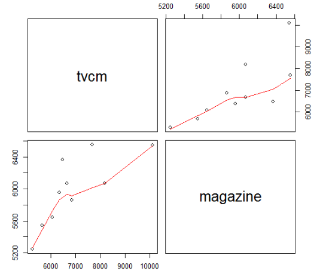

## 소셜게임의 이용자 탈퇴 이유 분석

```r
퍼즐컬렉션 서비스를 시작한지 1년 3개월이 지났습니다. 서비스 직후에는 사전 등록자를
중심으로 유저수가 크게 증가하였고, 몇 주 후에는 심각한 버그 때문에 유저가 탈퇴하다
가, 1년 후에는 광고 효과로 다시 유저수가 증가하였고, 그 후에는 그 광고를 보고 가입
했던 유저드리 조금씩 떠나는 등 유저수가 단기적으로는 오르락 내리락하면서 월 단위로
반년 정도 계속해서 상승하였습니다. 그 후 8개월동안 유저수가 정점을 찍은 상태로 유지되었습니다. 이달 들어 퍼즐컬렉션 유저수가 크게 줄어들었고, 회사를 대표하는 히트 게임이었던 만큼
경영진을 중심으로 유저수의 감소를 큰 문제로 인식하고 있습니다. 원인을 밝혀서 대책을 세우기 위해 분석 담당자에게 의뢰했습니다.
```

- 소설 게임의 이용자 탈퇴 이유 분석

```r
가설 :
1. 광고에 문제가 있어서 신규 유저수보다 탈퇴 유저수가 더 많았다
2. 매월 테마를 바꿔서 개최하던 게임 이벤트가 식상해져서 그만둔 유저가 많았다
3. 성별 혹은 연령 등 특정 유저 층에서 탈퇴한 유저가 많았다
마케팅 부서와 게임 개발 부서에 질의 응답을 한 결과 :
1. 광고는 지난달과 비교해서 거의 같은 수준이었으며 신규 유저수도 거의 같은 수준이
었다. 2. 이벤트 내용도 지난달과 거의 
```

- 확인결과

```r
문제
• 지난달과 비교해서 유저수가 줄어들었다 (사실)
• 어떤 특정한 유저층에서 문제가 생겼을 것이다. (가설)
분석 스토리
• 퍼즐컬렉션의 유저수가 지난달보다 줄어들었다. (사실)
• 어딘가 숫자가 줄어든 세그먼트가 있을 것이다. (가설)
• 그 세그먼트에 적합한 대책을 세워서 유저수를 지난달과 같은 수준으로 회복한다. (해결책)

```

## 1. 원인 분석

### 1.1 검증형데이터 분석

- 가설 타당한지 데이터 분석을 통해 분석

### 1.2. 탐색형 데이터 분석

- 사전에 원인을 짐작하기 어려운 상황에서 출발하여 그 원인을 데이
  터 분석을 통해 탐색해나가는 방법
- 데이터 수집 : •DAU(Daily Active User) 데이터 – 하루에 한번 이상 게임을 이용한 유저
-  user_info 데이터 - 유저의 속성정보


### 1.3 데이터 수집

### 1.4 데이터 가공

- 크로스 집계 : 2개의 변수의 인과관계를 교차해서 분석하는 분석기법

### 1.5.데이터

```r
# 단계1 : 실행환경으로 데이터 로딩
dau <- read.csv("./data/ws3-dau.csv", header = T, stringsAsFactors = F)
head(dau)
user.info <- read.csv("./data/ws3-user_info.csv", header = T, stringsAsFactors = F)
head(user.info)

# 단계2 : DAU데이터에 user.info 데이터 결합하기
dau.user.info <- merge(dau, user.info, by = c("user_id", "app_name"))
head(dau.user.info)

# 단계3 : 세그먼트 분석 (성별로 집계, 연령대별 집계, 성별+연령대별 집계, device별 집계)
# 월 항목을 추가
dau.user.info$log_month <- substr(dau.user.info$log_date, 1, 7)
# 세그먼트 분석（성별로 집계）
table(dau.user.info[, c("log_month", "gender")])

# 세그먼트 분석(연령대별로 집계）
table(dau.user.info[, c("log_month", "generation")])

# 세그먼트 분석（성별과 연령대를 조합해 집계）
library(reshape2)
dcast(dau.user.info, log_month ~ gender + generation, value.var = "user_id",
length)

# 세그먼트 분석（단말기별로 집계）
table(dau.user.info[,c("log_month","device_type")])


# 단계4 : 가장 빈도수 차이가 큰 세그먼트 분석 결과를 시각화

# 날짜별로 단말기별 유저수를 산출하기
dau.user.info.device.summary <- ddply(dau.user.info, .(log_date, device_type), summarize, dau = length(user_id))
# 날짜별 데이터 형식으로 변환하기
dau.user.info.device.summary$log_date <- as.Date(dau.user.info.device.summary$log_date)
# 시계열의 트렌드 그래프 그리기
library(ggplot2)
library(scales)
limits <- c(0, max(dau.user.info.device.summary$dau))
ggplot(dau.user.info.device.summary, aes(x=log_date, y=dau, col=device_type, lty=device_type, shape=device_type)) +
geom_line(lwd=1) +
geom_point(size=4) +
scale_y_continuous(label=comma, limits=limits)

table(unique(dau.user.info[, c("log_month", "gender", "user_id")]))

```

- 연습용 나의 답!

```r
#단계 1:실행환경으로 데이터 로딩
getwd()
setwd("C:/workspaceR")
getwd()
game_1<-read.csv("./ws/ws3-dau.csv")
game_2<-read.csv("./ws/ws3-user_info.csv")
head(game_1)
head(game_2)
#단계 2: DAU데이터에 user.info 데이터결합하기
game_info<-merge(game_1,game_2)
head(game_info)
game_info$month<-substr(game_info$log_date,1,7)

#단계 3: 세그먼트 분석(성별로 집계, 연령대별 집계,성별+연령대별 집계,deivce별 집계)
game_sex<-table(game_info[,c("month","gender")])
game_sex
names(game_sex)<-c(month,gender)
game_age<-table(game_info[,c("month","generation")])
game_age
library(reshape2)
game_sex_age<-dcast(game_info,game_info$month~game_info$gender+game_info$generation,value.var = "user_id",length)
game_sex_age

game_dev<-table(game_info[,c("month","device_type")])
game_dev
#단계 4: 가장 빈도수 차이가 큰 세그먼트 분석 결과를 시각화
install.packages(dplyr)
library(ggplot2)
library(scales)
game_summary<-ddply(game_info,.(log_date,device_type),summarise,dau=length(user_id))
game_summary

library(ggplot2)


```


## 2. 배너광고 반응 비교 검증

```r
퍼즐컬렉션에서는 매월 게임에서 이용하는 아이템을 세일하고 있습니다.
이 세일은 매상 비율이 높은 중요한 이벤트인데, 어느 날 회사 경영진으로부터 ‘매상자체
는 높지만 구매율은 그리 높지 않은 것 아닌가?’ 라는 지적을 받게 되었습니다.
실제로 다른 앱의 세일과 비교한 결과, 퍼즐컬렉션의 구매율이 상대적으로 낮음을 알게 되
었습니다.
구매율을 개선하기 위해 구매율이 낮은 원인을 데이터 분석으로 찾아내도록 분석 담당
자에게 의뢰가 왔습니다.
```

###  2.1 문제 발견

```r
가설 :
1. 아이템 세일 내용에 문제 있음
=> 지금 별로 필요하지 않은 아이템을 내놓고 있다
=> 세일폭이 별로 크지 않아서 유저에게 크게 어필하지 못하고 있다.
2. 배너광고의 표시내용에 문제가 있음
기획부로부터 아이템에 대한 응답 결과 :
• 아이템 세일에 쓸 만한 것을 내놓았다고 생각하지만 얼마나 사용하고 있는지 크게
자신은 없음
• 세일폭은 50%로 다른 앱과 같고 유저 입장에서도 충분히 싸게 느낄 것임
마케팅부로부터 배너광고에 대한 응답 결과 :
• 아이템 세일의 배너광고는 해당 앱의 디자이너가 만들어 앱에 따라 품질이 제각각임
• 퍼즐컬렉션의 배너광고는 항상 클릭률이 낮음
```


### 2.2 비교검증

```r
문제
• 퍼즐컬렉션의 배너 광고 클릭률이 다른 앱보다 낮다(사실)
• 퍼즐컬렉션의 배너 광고 품질에 문제가 있다. (가설)
• 클릭률이 높은 배너광고를 조사해서 퍼즐컬렉션의 배너광고를 개선한다.
(해결책)
• 어떤 배너 광고가 자주 클릭되는지 알 필요가 있습니다.
• 퍼즐컬렉션에서는 지금껏 매월 실시해온 아이템 세일의 배너광고를 한번
도 바꾸지 않아 분석을 하려 해도 데이터가 없습니다.
• 2개의 배너광고를 새로 작성해서 어느 쪽이 더 나은지 데이터를 수집하기
로 합니다
```

### 2.3 A/B 테스트 실행

```r
A/B 테스트
– 여러 선택지 중에서 어느 것이 가장 좋은 결과를 가져다줄지 알아
보기 위한 검증방법
– 초기 도입 시 개발비용이 많이 들지만 비교적 낮은 비용으로 실시
할 수 있으며, 수집한 데이터를 통계적으로 취급하기 쉬워서 Web
업계에서 많이 이용
– 일부 광고업이나 제조업 쪽에서도 실시
– 예) A와 B라는 2개의 제품을 만들고 동시에 판매해서 데이터를 수
집하고, 타킷 고객층에 크게 어필한 것이 어느 쪽인지 검증
– 같은 시기에 같은 타킷 고객층에 대한 분명한 인과관계를 알 수 있
기 때문에 많이 사용
– A와 B의 구분은 임의적이어야 함
• 성별, 연령대, 게임이용시작일등의 조건이 모든 그룹에 균등하게 배분될 것
#############################
A/B데이트를 동시에 여러개 실시할 경우
- 다른 테스트를 실시 중인 유저가 포함되지 않도록 나눈다.
테스트의 시기를 다르게 하거나 KPI(중요업적 평가지표)추이를 비교해서 차이가 없음을 확인 후 실시
- 소셜게임에서는 KPI는 PV(Page View=액세스 회수) DAU(1일 이용 유저수) , ARPU(유저 1명의 월간 평균 지출 금액), 지속율, 과금율 등

```

### 2.4 통계적 가설검정 커트라인

- 어떤 두개의 그룹의 차이가 있는지 없는지
- 가설검증은 사람수가 많아질수록 '통계적'으로 유의한 차이가 있다''는 결론을 내리기 쉽다.
- 통계적으로 유의한 차이가 있어도 비즈니스에서 의미가 있는 차이라고 단정할수 없다.
- '커트라인' 으로 실시 (p=value)
- 가설검정에서 차이가 났기 때문에 이것을 비즈니스 상에서 의미가 있는지 검토해야 한다.

```r
배너광고의 표시횟수 정보데이터와 클릭횟수정보 데이터를 결합
(merge함수)
2. 클릭했는지 하지 않았는지 나타내는 플래그 작성 (ifesle 함수)
배너광고 클릭회수 정보의 userid값이 NA인 경우 0, 이외의 경우
1로 기입
3. 클릭률 집계(plyr 패키지의 ddply 함수)
test_case 항목별로 집계
클릭한 사람의 합계 / 배너광고가 표시된 유저수
4.  검정 실행하기 (ℎ .  )
2개의 배너광고와 ‘클릭했음/하지 않았음’에 대한 관계를 가설 검
정P
값이 0에 가까우면 가까울수록 차이가 있다는 것을 나타내고,
일반적으로 0.05보다 작은 값이면 ‘통계적으로 차이가 있다’고 할
수 있다
5. 날짜별, 테스트 케이스별로 클릭률 산출
6. 테스트 케이스별로 클릭률 산출
7. 테스트 케이스별 클릭률의 시계열 추이 그래프로 시각화
```

### 2.5 실습 (나)

```r
ban_1<-read.csv("./ws4/ab_test_goal.csv",stringsAsFactors = F,header=T)
ban_2<-read.csv("./ws4/ab_test_imp.csv",stringsAsFactors = F,header=T)
head(ban_1)
head(ban_2)
#데이터 가공 1.merge
ban_info<-merge(ban_2,ban_1,by="transaction_id",all.x=T, suffixes=c("",".g"))
tail(ban_info)
#클릭했는지 안했는지 ifelse함수 이용해서 배너광고 클릭회수 정보 유저가 NA면 0 이외는 1로

ban_info$user_id<-ifelse(is.na(ban_info$user_id.g),0,1)

ban_click_only<-table(ban_info$user_id.g) #user_id와 user_id.g둘다 확인 없음!
ban_click_only
#클릭을 집계(plyr패키지의 ddply함수 ) 
#test_case별로 집계 클릭한 사람의 합계/배너광고가 표시된 유저수
#전체 유저수? 광고 본 

library(plyr)
ban_click<-ddply(ban_info,.(test_case),summarise,click=ban_click_only)
ban_click

```

### 2.6 실습(답)

```r
############################################
배너광고 반응 비교 검증
############################################
# ab.test.imp 데이터에 ab.test.goal 데이터를 결합시키기
# 데이터를 읽어들이기
ab.test.imp <- read.csv("./data/ab_test_imp.csv",header=T, stringsAsFactors=F)
ab.test.goal <- read.csv("./data/ab_test_goal.csv",header=T, stringsAsFactors=F)
# ab.test.imp에 ab.test.goal를 결합시키기
ab.test.imp <- merge(ab.test.imp, ab.test.goal, by="transaction_id", all.x=T, suffixes=c("",".g"))
head(ab.test.imp)


# 클릭 플래그를 추가
ab.test.imp$is.goal <- ifelse(is.na(ab.test.imp$user_id.g),0,1)
head(ab.test.imp)

 
# 클릭율을 계산하기
library(plyr)
ddply(ab.test.imp, .(test_case), summarize,
cvr=sum(is.goal)/length(user_id))

# χ2 검정을 실행하기
chisq.test(ab.test.imp$test_case, ab.test.imp$is.goal)

 
# 날짜별, 테스트 케이스별로 클릭율을 산출하기
ab.test.imp.summary <-
ddply(ab.test.imp, .(log_date, test_case), summarise,
imp=length(user_id),
cv=sum(is.goal),
cvr=sum(is.goal)/length(user_id))

# 테스트 케이스별로 클릭율을 산출하기
ab.test.imp.summary <-
ddply(ab.test.imp.summary, .(test_case), transform,
cvr.avg=sum(cv)/sum(imp))
head(ab.test.imp.summary)

# 테스트 케이스별 클릭율의 시계열추이 그래프
library(ggplot2)
library(scales)

ab.test.imp.summary$log_date <- as.Date(ab.test.imp.summary$log_date)
limits <- c(0, max(ab.test.imp.summary$cvr))
ggplot(ab.test.imp.summary,aes(x=log_date,y=cvr, col=test_case,lty=test_case, shape=test_case)) +
geom_line(lwd=1) +
geom_point(size=4) +
geom_line(aes(y=cvr.avg,col=test_case)) +
scale_y_continuous(label=percent, limits=limits)
```

## 3. 매스미디어 광고 실시의 최적화 문제

### 3.1 문제 발견

```r
퍼즐컬렉션은 지금까지 인터넷에서만 광고를 했으나, 유저수를 더욱 늘리기 위해 매스미디어(TV, 잡지) 광고를 하기로 했습니다.
과거에 다른 게임에서 실시했던 데이터를 이용해서 가장 효과적으로 광고를 하고자 합니다.

```

### 3.2 목표

```r
가장 적은 지출로 보다 많은 유저를 획득할 수 있는 광고를 하는 것이 이상적인 모습
지금까지의 데이터를 가지고 광고와 신규 유저수의 인과관계를 짚어내어 광고 효과가 최고가 되도록 배분


인터넷 광고를 통해 획득한 유저수를 뺀 신규 유저수와 TV, 잡지 광고비 데이터를 이용해서 TV, 잡지 광고의 효과를 분석


```

### 3.3  실습 (나)

```r
mm<-read.csv("./workshop5-data/ad_result.csv")
mm
library(datasets)
pairs(mm[,2:3],panel=panel.smooth)


```



```r
> install<-mm$install
> tvcm<-mm$tvcm
> magazine<-mm$magazine
> df<-data.frame(x1,x2,y)
> install<-mm$install
> tvcm<-mm$tvcm
> magazine<-mm$magazine
> df<-data.frame(tvcm,magazine,install)
> result.lm<-lm(formula=install~tvcm+magazine,data=df)
> result.lm

Call:
lm(formula = install ~ tvcm + magazine, data = df)

Coefficients:
(Intercept)         tvcm     magazine  
    188.174        1.361        7.250  

> summary(result.lm)

Call:
lm(formula = install ~ tvcm + magazine, data = df)

Residuals:
     Min       1Q   Median       3Q      Max 
-1406.87  -984.49   -12.11   432.82  1985.84 

Coefficients:
             Estimate Std. Error t value Pr(>|t|)   
(Intercept)  188.1743  7719.1308   0.024  0.98123   
tvcm           1.3609     0.5174   2.630  0.03390 * 
magazine       7.2498     1.6926   4.283  0.00364 **
---
Signif. codes:  0 ‘***’ 0.001 ‘**’ 0.01 ‘*’ 0.05 ‘.’ 0.1 ‘ ’ 1

Residual standard error: 1387 on 7 degrees of freedom
Multiple R-squared:  0.9379,	Adjusted R-squared:  0.9202 
F-statistic: 52.86 on 2 and 7 DF,  p-value: 5.967e-05

#둘중 광고 효과가 좋은 것은 tvcm이다. 이며 광고 효과는 있따. p=value가 0.05보다 작기 때문에 (대립가설 채택)

```


### 3.4 실습 (답)

```r
단계 1: CSV 파일 읽기
ad.data <- read.csv("./workshop5-data/ad_result.csv", header = T, stringsAsFactors = F)
ad.data
단계 2: TV 광고의 광고비용과 신규 유저수의 산점도 그리기
library(ggplot2)
library(scales)

ggplot(ad.data, aes(x = tvcm, y = install)) + geom_point() + 
  xlab("TV 광고비") + ylab("신규 유저수") + 
  scale_x_continuous(label = comma) +
  scale_y_continuous(label = comma)


단계 3: 잡지 광고의 광고비용과 신규 유저수의 산점도 그리기
ggplot(ad.data, aes(x = magazine, y = install)) + geom_point() + 
  xlab("잡지 광고비") + ylab("신규 유저수") + 
  scale_x_continuous(label = comma) + 
  scale_y_continuous(label = comma)

단계 4: 회귀분석 실행
fit <- lm(install ~ ., data = ad.data[, c("install", "tvcm", "magazine")])
fit


단계 5: 회귀분석 해석
# 회귀분석 결과를 해석하기
summary(fit) 

#TV광고보다 잡지 광고가 광고 효과가 높다는 것을 알 수 있습니다.
신규 유저수 = 0.136 * TV광고비 + 0.725*잡지 광고비 + 188.174

#3개월에 한번 광고 발주를 할때 
TV광고 : 42000(만원) , 잡지 광고 : 75000(만원)
이면 대략 신규 유저수 55000명 획득 예측
```

## 4. 게임단말기 전화 사례분석(피처폰에서 스마트폰으로)

### 4.1 목적

```r
낚시랜드 소셜게임은 피처폰에 특화된 시스템으로 운영되었습니다.
스마트 폰이 나오고 빠른 속도로 보급되자 스마트폰을 위한 기능과, 기존 유저가 피처폰에서 스마트폰으로 갈아 탈 수 있도록 아이디 이전 등의 기능을 추가로 제공
스마트폰 유저가 서서히 늘어나며 게임 전체의 유저수가 증가하기 시작
최근 낚시랜드 소셜게임의  피처폰의 유저수가 조금씩 감소하는 문제가 발생하여 조사해 본 결과 , 피처폰의 유저수가 크게 감소하고 있다는 것을 밝혀냈습니다.

```

### 4.2 피처폰 유저의 탈퇴를 구조적으로 분석

```r
피처폰 유저의 감소량에 비해 스마트폰 유저의 증가량이 적은 이유 (가설)
피처폰 유저의 탈퇴 패턴
피처폰에서 그냥 탈퇴
피처폰에서 스마트폰으로 갈아타기 위해 탈퇴

스마트폰으로 갈아타기 위해 탈퇴하는 유저의 패턴
ID를 이전해서 피처폰에서 쓰던 계정을 그대로 사용하는 유저
ID를 새로 만들어서 사용하는 유저
자연히 탈퇴하는 유저


스마트 폰으로 이전할 때 새로 ID를 만들어서 게임을 이용하는 유저들 중 피처폰 유저와 실제 같더라도 계저잉 다르기 때문에 피처폰에서 갈아탄 기존 유저인지 알아낼 방법이 없습니다.
정기적인 설문조사를 통해 이런 유저수는 극히 일부임이 밝혀졌습니다.
스마트폰으로 갈아탈 때 자연히 게임을 관두는 유저의 경우 피처폰을 쓰다가 그냥 탈퇴한 것인지 스마트 폰으로 갈아타다보니 탈퇴한 것인지 알아낼 방법이 없습니다.


```

### 4.3  실습(나)

```r

```

### 4.4 실습(답)

```
######################################################
게임 단말기  피처폰에서 스마트폰으로  이용 분석
######################################################
단계 1: CSV 파일 읽기
dau <- read.csv("./data/ws6-dau.csv", header = T, stringsAsFactors = F)
head(dau)


단계 2: 유저별로 ID 이전을 한 유저인지 아닌지 나타내는 데이터 정리
mau <- unique (dau[, c("region_month", "device", "user_id")])
fp.mau <- unique (dau[dau$device=="FP", c("region_month", "device",
"user_id")])
sp.mau <- unique (dau[dau$device=="SP", c("region_month", "device",
"user_id")])

# 1월과 2월 데이터를 나누기
fp.mau1 <- fp.mau[fp.mau$region_month == "2013-01", ]
fp.mau2 <- fp.mau[fp.mau$region_month == "2013-02", ]
sp.mau1 <- sp.mau[sp.mau$region_month == "2013-01", ]
sp.mau2 <- sp.mau[sp.mau$region_month == "2013-02", ]
# 1월에 피쳐폰으로 이용했던 유저가 2월에도 이용했는가
mau$is_access <- 1
fp.mau1 <- merge(fp.mau1, mau[mau$region_month == "2013-02",
c("user_id", "is_access")], by = "user_id", all.x = T)
fp.mau1$is_access[is.na(fp.mau1$is_access)] <- 0
head(fp.mau1)


# 1월에 피쳐폰으로 이용했고 2월에도 피쳐폰으로 이용했는가
fp.mau2$is_fp <- 1
fp.mau1 <- merge(fp.mau1, fp.mau2[, c("user_id", "is_fp")],
by = "user_id",
all.x = T)
fp.mau1$is_fp[is.na(fp.mau1$is_fp)] <- 0
head(fp.mau1)


# 1월에는 피쳐폰으로 이용하다가 2월에는 스마트폰으로 이용했는가
sp.mau2$is_sp <- 1
fp.mau1 <- merge(fp.mau1, sp.mau2[, c("user_id", "is_sp")],
by = "user_id", all.x = T)
fp.mau1$is_sp[is.na(fp.mau1$is_sp)] <- 0
head(fp.mau1)


# 1월에는 피쳐폰으로 이용했는데 2월에는 이용하지 않았거나 혹은 스마트폰으로 이용한 유저
fp.mau1 <- fp.mau1[fp.mau1$is_access == 0 | fp.mau1$is_sp == 1, ]
head(fp.mau1)


단계 3: 날짜별 게임 이용 상황 데이터 정리
library(reshape2)
fp.dau1 <- dau[dau$device == "FP" & dau$region_month == "2013-01", ]
fp.dau1$is_access <- 1
fp.dau1.cast <- dcast(fp.dau1, user_id ~ region_day, value.var =
"is_access", function(x) as.character(length(x)))
names(fp.dau1.cast)[-1] <- paste0("X", 1:31, "day")
head(fp.dau1.cast)

# 2월에 스마트폰으로 이용한 유저 데이터를 결합하기
fp.dau1.cast <- merge(fp.dau1.cast, fp.mau1[, c("user_id", "is_sp")],
by = "user_id")
head(fp.dau1.cast)
table(fp.dau1.cast$is_sp)


단계 4: 로지스틱 회귀분석을 통한 모델 작성
fit.logit <- step(glm(is_sp ~ ., data = fp.dau1.cast[, -1],
family = binomial))
summary(fit.logit)


단계 5: 작성된 모델을 이용해서 예측하기
# SP(스마트폰) 이전 확률
fp.dau1.cast$prob <- round(fitted(fit.logit), 2)
# SP(스마트폰)으로 이전할 지 예측
fp.dau1.cast$pred <- ifelse(fp.dau1.cast$prob > 0.5, 1, 0)
head(fp.dau1.cast)


단계 6: 예측결과로부터 유저 군 추측하기
# 예측과 실제
table(fp.dau1.cast[, c("is_sp", "pred")])

# 예측결과로부터 유저군을 추측하기
fp.dau1.cast1 <- fp.dau1.cast[fp.dau1.cast$is_sp == 1 & fp.dau1.cast$pred
== 1, ]
head(fp.dau1.cast1[order(fp.dau1.cast1$prob, decreasing = T), ])

fp.dau1.cast2 <- fp.dau1.cast[fp.dau1.cast$is_sp == 0 & fp.dau1.cast$pred
== 1, ]
head(fp.dau1.cast2[order(fp.dau1.cast2$prob, decreasing = T), ])

fp.dau1.cast3 <- fp.dau1.cast[fp.dau1.cast$is_sp == 0 & fp.dau1.cast$pred
== 0, ]
head(fp.dau1.cast3[order(fp.dau1.cast3$prob), ])
```


